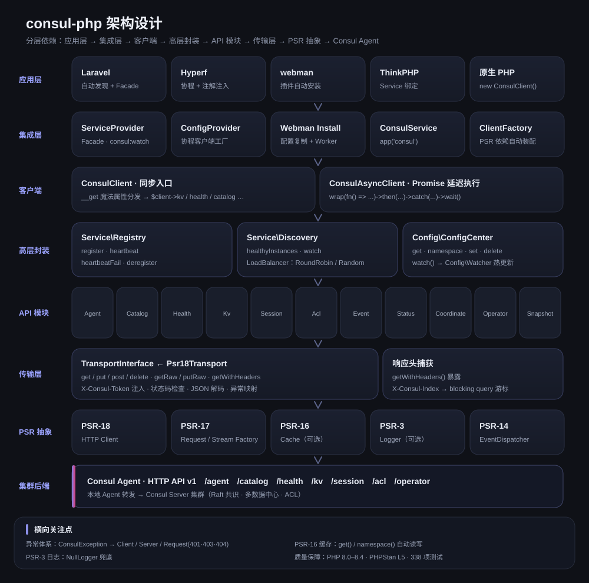
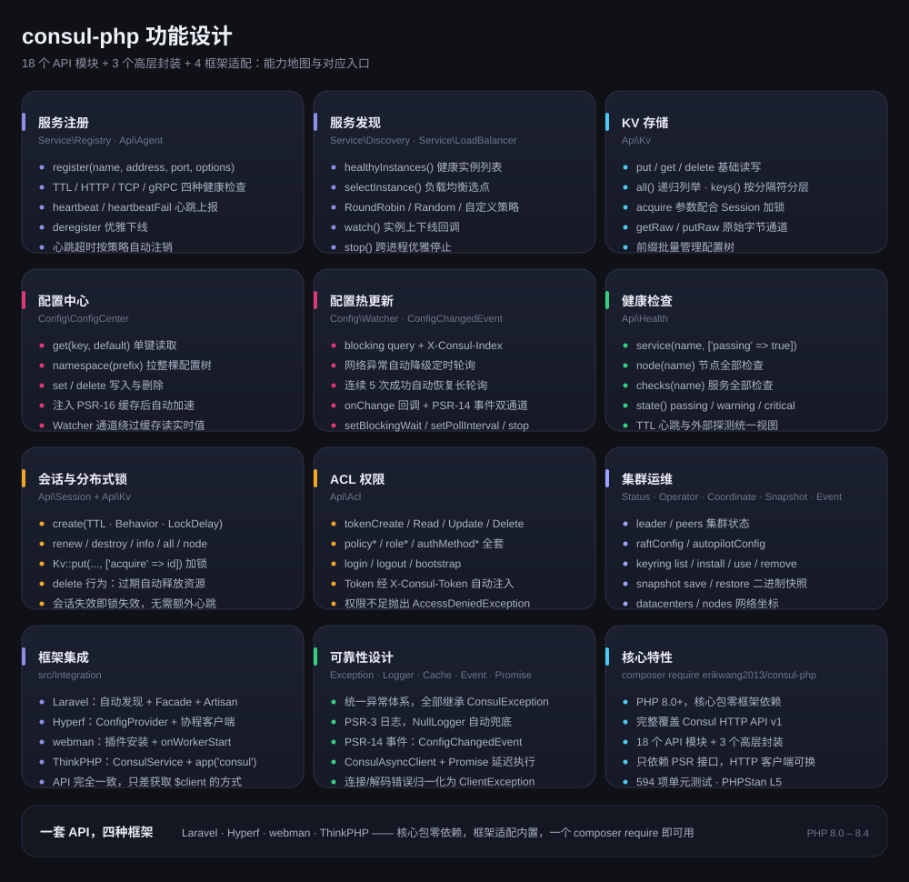
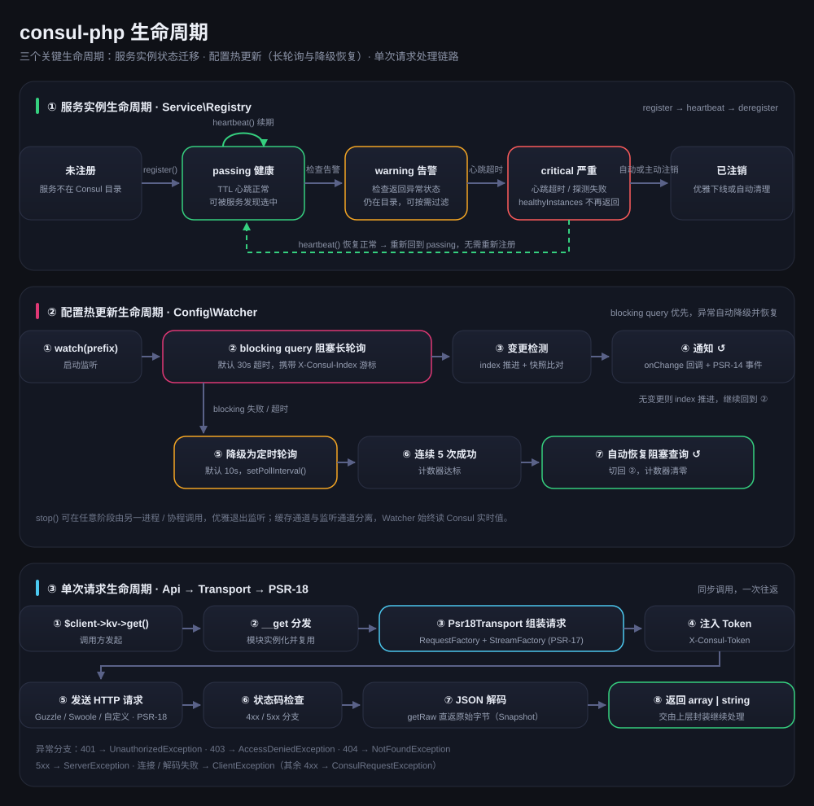

# erikwang2013/consul-php

**中文** · [English](docs/i18n/en/README.md) · [日本語](docs/i18n/ja/README.md) · [한국어](docs/i18n/ko/README.md) · [Deutsch](docs/i18n/de/README.md) · [Français](docs/i18n/fr/README.md) · [Español](docs/i18n/es/README.md) · [Português](docs/i18n/pt/README.md) · [Русский](docs/i18n/ru/README.md) · [العربية](docs/i18n/ar/README.md) · [हिन्दी](docs/i18n/hi/README.md) · [বাংলা](docs/i18n/bn/README.md) · [Bahasa Indonesia](docs/i18n/id/README.md)



PHP Consul 客户端，完整覆盖 Consul HTTP API v1，重点支持服务注册发现与配置中心。核心包零框架依赖，内置 Laravel / Hyperf / webman / ThinkPHP 适配，一个 composer require 即可在任何框架下使用。

PHP 8.0+ · PSR-18/PSR-3/PSR-14/PSR-16 · 零框架依赖

> **项目宠物 Consu** —— 一只只吃心跳、从不掉线的注册中心小助手：天线是健康检查心跳，胸前的脉线是服务状态，腰间挂着 ACL Token。终端里 `composer pet` 可召唤，详见 [项目宠物](#项目宠物-consu)。

---

## 项目简介

| | |
|---|---|
| **是什么** | 纯 PHP 实现的 Consul HTTP API v1 客户端：同步 + Promise 双入口，11 个 API 模块，3 个高层封装 |
| **解决什么** | 让 PHP 应用接入 Consul 做服务注册发现与配置热更新，无需为每个框架重写一套客户端 |
| **怎么用** | `composer require erikwang2013/consul-php`，核心包零框架依赖，框架适配内置并自动发现 |
| **支持框架** | Laravel · Hyperf · webman · ThinkPHP —— API 完全一致，只差获取 `$client` 的方式 |
| **依赖约定** | 只依赖 PSR 接口（PSR-18/17/16/14/3），HTTP 客户端、缓存、日志、事件分发器均可替换 |
| **质量保障** | PHP 8.0 – 8.4 · 309 项单元测试 · PHPStan level 5 · PHP CS Fixer (PSR-12) |

### 核心能力

- **服务注册发现** —— TTL / HTTP / TCP / gRPC 四种健康检查；healthyInstances / selectInstance；RoundRobin、Random、自定义负载均衡；实例上下线监听
- **配置中心** —— KV 读写、命名空间树、PSR-16 缓存加速；热更新优先 blocking query 长轮询，网络异常自动降级轮询，连续 5 次成功后自动恢复
- **集群运维** —— Session 分布式锁、ACL 全套（Token / Policy / Role / AuthMethod）、Status / Operator / Coordinate / Snapshot / Event
- **可靠性** —— 统一异常体系、PSR-3 日志（NullLogger 兜底）、PSR-14 事件双通道通知、传输层错误归一化

---

## 文档导航

| 文档 | 链接 |
|------|------|
| **项目结构** | [项目结构](#项目结构) |
| **架构设计** | [架构设计](#架构设计) · [architecture.svg](docs/images/architecture.svg) |
| **功能设计** | [功能设计](#功能设计) · [features.svg](docs/images/features.svg) |
| **生命周期** | [生命周期](#生命周期) · [lifecycle.svg](docs/images/lifecycle.svg) |
| **项目宠物** | [Consu](docs/images/pet.svg) |
| **多语言 README** | [docs/i18n/](docs/i18n/) · [English](docs/i18n/en/README.md) · [日本語](docs/i18n/ja/README.md) · [한국어](docs/i18n/ko/README.md) · [Deutsch](docs/i18n/de/README.md) · [Français](docs/i18n/fr/README.md) · [Español](docs/i18n/es/README.md) · [Português](docs/i18n/pt/README.md) · [Русский](docs/i18n/ru/README.md) · [العربية](docs/i18n/ar/README.md) · [हिन्दी](docs/i18n/hi/README.md) · [বাংলা](docs/i18n/bn/README.md) · [Bahasa Indonesia](docs/i18n/id/README.md) |
| **文档总目录** | [docs/README.md](docs/README.md) |
| **Laravel 集成** | 见下方 [Laravel](#laravel) |
| **Hyperf 集成** | 见下方 [Hyperf](#hyperf) |
| **webman 集成** | 见下方 [webman](#webman) |
| **ThinkPHP 集成** | 见下方 [ThinkPHP](#thinkphp) |
| **设计文档** | [docs/superpowers/specs/2026-05-14-consul-php-design.md](docs/superpowers/specs/2026-05-14-consul-php-design.md) |

---

## 项目结构

```
consul-php/
├── src/
│   ├── Client/                      # 客户端入口
│   │   ├── ConsulClient.php         # 同步入口：__get 分发 API 模块与高层封装
│   │   ├── ConsulAsyncClient.php    # Promise 延迟执行客户端
│   │   └── Promise.php              # 轻量 Promise 实现
│   ├── Api/                         # Consul HTTP API v1 模块（11 个）
│   │   ├── Agent.php                # 成员、自身信息、维护模式、join / leave
│   │   ├── Catalog.php              # 服务与节点目录：注册、注销、查询
│   │   ├── Health.php               # 健康检查：服务 / 节点 / 按状态过滤
│   │   ├── Kv.php                   # KV 读写、层级列举、原始字节、会话加锁
│   │   ├── Session.php              # 会话（分布式锁基础）：创建、续约、销毁
│   │   ├── Acl.php                  # Token / Policy / Role / AuthMethod
│   │   ├── Event.php                # 用户事件：fire / list
│   │   ├── Status.php               # 集群状态：leader / peers
│   │   ├── Coordinate.php           # 网络坐标：datacenters / nodes
│   │   ├── Operator.php             # Raft / Autopilot / Keyring 运维
│   │   └── Snapshot.php             # 快照备份与恢复（二进制流）
│   ├── Service/                     # 服务注册与发现
│   │   ├── Registry.php             # register / heartbeat / heartbeatFail / deregister
│   │   ├── Discovery.php            # healthyInstances / selectInstance / watch / stop
│   │   └── LoadBalancer/            # RoundRobin、Random、LoadBalancerInterface
│   ├── Config/                      # 配置中心
│   │   ├── ConfigCenter.php         # get / namespace / set / delete / watch
│   │   ├── Watcher.php              # 热更新：长轮询 + 降级轮询 + 自动恢复
│   │   └── ConfigChangedEvent.php   # PSR-14 配置变更事件
│   ├── Transport/                   # 传输层
│   │   ├── TransportInterface.php   # 传输契约（含 getRaw / putRaw / getWithHeaders）
│   │   └── Psr18Transport.php       # PSR-18 实现：Token 注入、解码、异常映射
│   ├── Support/                     # 项目宠物 Consu 的终端版（Pet::art / Pet::say）
│   ├── Exception/                   # 异常体系（ConsulException 及其子类，7 个）
│   └── Integration/                 # 框架适配（内置，自动发现）
│       ├── ClientFactory.php        # PSR 依赖自动装配
│       ├── Laravel/                 # ServiceProvider + Facade + config/consul.php
│       ├── Hyperf/                  # ConfigProvider + 协程客户端工厂 + config
│       ├── Webman/                  # 插件安装（Install）+ config/app.php
│       └── Thinkphp/                # ConsulService + config/consul.php
├── tests/                           # PHPUnit 用例（Api / Client / Config / Exception /
│                                    #   Integration / Service / Support / Transport）
├── docs/
│   ├── images/                      # 项目宠物与设计图（SVG）
│   │   ├── pet.svg                  # 项目宠物 Consu
│   │   ├── architecture.svg         # 架构设计
│   │   ├── features.svg             # 功能设计
│   │   └── lifecycle.svg            # 生命周期
│   ├── i18n/                        # 12 种语言 README 与本地化图（en · ja · ko · de · fr · es · pt · ru · ar · hi · bn · id）
│   ├── superpowers/specs/           # 设计文档
│   ├── superpowers/plans/           # 实现计划
│   └── reports/                     # 覆盖率报告与测试报告
├── scripts/i18n-svg.php             # 多语言资源生成器（extract / build / verify）
├── scripts/pet.php                  # composer pet 入口：终端里召唤项目宠物
├── composer.json                    # 依赖与框架自动发现声明
├── phpunit.xml.dist                 # 测试配置
└── phpstan.neon                     # 静态分析配置（level 5）
```

---

## 框架集成一览

| | Laravel | Hyperf | webman | ThinkPHP |
|---|---|---|---|---|
| **扩展包** | 内置 | 内置 | 内置 | 内置 |
| **注入方式** | 自动发现 + `ServiceProvider` | 自动发现 + `ConfigProvider` | 手动 `new` / 插件 | 手动 `bind` 到容器 |
| **便捷访问** | `Consul` Facade | `#[Inject]` 注解 | — | `app('consul')` 助手 |
| **配置位置** | `config/consul.php` | `config/autoload/consul.php` | `config/plugin/erikwang2013/consul-php/app.php` | `config/consul.php` |
| **HTTP 客户端** | Guzzle (PSR-18) | Swoole 协程客户端 | Guzzle (PSR-18) | Guzzle (PSR-18) |
| **缓存** | Laravel Cache (PSR-16) | Hyperf Cache (PSR-16) | 自行注入 | 自行注入 |
| **热更新运行** | Artisan 命令 | `AbstractProcess` 协程 | `Worker` 进程 | Timer / Swoole 进程 |
| **事件监听** | `EventServiceProvider` | Hyperf Event | — | ThinkPHP Listener |
| **文档** | [源码](src/Integration/Laravel/) | [源码](src/Integration/Hyperf/) | [源码](src/Integration/Webman/) | [源码](src/Integration/Thinkphp/) |

### 同一操作，不同写法

**获取客户端：**

| 框架 | 写法 |
|------|------|
| 通用 | `$client = new ConsulClient(['base_uri' => '...']);` |
| Laravel | `$client = app(ConsulClient::class);` 或 `Consul::kv->get(...)` |
| Hyperf | `#[Inject] private ConsulClient $consul;` |
| webman | `$client = new ConsulClient(['base_uri' => '...']);` |
| ThinkPHP | `$client = app('consul');` |

**服务注册：**

```php
// 所有框架都使用相同 API，区别仅在于获取 $client 的方式
$client->serviceRegistry()->register('my-app', '10.0.0.1', 8080, [
    'id'    => 'my-app-1',
    'tags'  => ['v1'],
    'check' => ['ttl' => '30s'],
]);
```

**配置读取：**

```php
// 相同的 API，Laravel/Hyperf 自动走缓存
$dbHost = $client->configCenter()->get('app/db_host', 'default');
```

**热更新运行方式：**

| 框架 | 启动命令 / 方式 | 运行环境 |
|------|----------------|---------|
| Laravel | `php artisan consul:watch` | 独立 Artisan 进程 |
| Hyperf | `ConsulWatchProcess` (自动启动) | Swoole 协程 |
| webman | 在 `onWorkerStart` 中 fork | Worker 进程 |
| ThinkPHP | Timer::setInterval / Swoole Process | 独立进程 |

---

## 安装

```bash
# 核心包
composer require erikwang2013/consul-php

# PSR-18 实现（选其一）
composer require guzzlehttp/guzzle php-http/guzzle7-adapter php-http/discovery
```

### 框架集成

框架适配已内置在核心包中，无需额外安装。安装核心包后，对应框架会自动发现并注册 Consul 服务：

- **Laravel** — 自动发现 `ConsulServiceProvider`，提供 `Consul` Facade 和依赖注入
- **Hyperf** — 自动发现 `ConfigProvider`，提供协程客户端工厂和 `#[Inject]` 注入
- **webman** — 自动发现插件，`composer install` 时自动复制配置文件
- **ThinkPHP** — 在 `app/service` 目录下创建 `ConsulService` 并注册到应用

---

## 快速开始（通用）

```php
use Erikwang2013\Consul\Client\ConsulClient;

// 基础用法
$client = new ConsulClient(['base_uri' => 'http://127.0.0.1:8500']);

// 带 ACL Token
$client = new ConsulClient([
    'base_uri' => 'http://127.0.0.1:8500',
    'token'    => 'your-consul-acl-token',
]);
```

Token 会自动通过 `X-Consul-Token` 请求头附加到所有请求中。

### 服务注册

支持 TTL、HTTP、TCP、gRPC 四种健康检查模式。

```php
$registry = $client->serviceRegistry();

// TTL 模式 — 应用主动发心跳
$registry->register('user-service', '192.168.1.10', 8080, [
    'id'    => 'user-service-1',
    'tags'  => ['v1', 'primary'],
    'meta'  => ['region' => 'cn-east'],
    'check' => [
        'ttl' => '30s',
        'deregister_critical_service_after' => '120s', // 心跳超时自动注销
    ],
]);

// HTTP 模式 — Consul 定期探测
$registry->register('web', '192.168.1.10', 80, [
    'id'    => 'web-1',
    'check' => [
        'http'     => 'http://192.168.1.10:80/health',
        'interval' => '10s',
        'timeout'  => '3s',
    ],
]);

// TCP 模式
$registry->register('mysql', '192.168.1.10', 3306, [
    'check' => ['tcp' => '192.168.1.10:3306', 'interval' => '10s'],
]);

// gRPC 模式
$registry->register('grpc-svc', '192.168.1.10', 50051, [
    'check' => ['grpc' => '192.168.1.10:50051', 'interval' => '10s'],
]);

// 心跳（TTL 模式）
$registry->heartbeat('user-service-1');

// 下线
$registry->deregister('user-service-1');
```

### 服务发现

内置 RoundRobin（默认）和 Random 两种负载均衡策略。

```php
$discovery = $client->serviceDiscovery();

// 全部健康实例
$instances = $discovery->healthyInstances('user-service');
// [
//   ['address' => '10.0.0.1', 'port' => 8080, 'service' => 'user-service', 'id' => 'user-1', 'tags' => ['v1']],
//   ['address' => '10.0.0.2', 'port' => 8080, 'service' => 'user-service', 'id' => 'user-2', 'tags' => ['v1']],
// ]

// 负载均衡选一个
$instance = $discovery->selectInstance('user-service');

// 自定义负载均衡策略
use Erikwang2013\Consul\Service\LoadBalancer\Random;
$discovery = new Discovery($health, loadBalancer: new Random());

// 监听服务实例变更
$discovery->watch('user-service', function (array $instances) {
    // 实例上下线时回调
});

// 停止监听（在另一进程/协程中调用）
$discovery->stop();
```

### 配置中心

```php
$config = $client->configCenter();

// 单个键
$dbHost = $config->get('app/db_host', 'localhost');

// 整个命名空间
$all = $config->namespace('app/');
// ['app/db_host' => 'mysql.local', 'app/redis_host' => 'redis.local', ...]

// 写入 / 删除
$config->set('app/cache_ttl', '3600');
$config->delete('app/old_key');

// 热更新
$watcher = $config->watch('app/');
$watcher
    ->setBlockingWait(30)   // 长轮询超时（秒）
    ->setPollInterval(10)   // 降级为轮询的间隔（秒）
    ->onChange(function (array $updated) {
        // 配置变更回调
    });
$watcher->start(); // 阻塞，放入独立进程/协程
// $watcher->stop();  // 在另一进程/协程中调用以停止监听
```

**热更新原理：** 优先 Consul blocking query（`index` 长轮询），网络异常时自动降级为定时轮询，连接恢复后自动切回长轮询。回调 + PSR-14 EventDispatcher 双通道通知。

**缓存策略：** 注入 PSR-16 缓存后，`get()` 和 `namespace()` 自动读写缓存。Watcher 始终读 Consul 实时数据，不走缓存。

### KV 存储

```php
$kv = $client->kv;

$kv->put('key', 'value');
$entry = $kv->get('key');              // null 表示不存在
$all = $kv->all('prefix/');            // 递归列出
$keys = $kv->keys('prefix/');          // 仅键名
$keys = $kv->keys('prefix/', '/');     // 按分隔符层级列出
$kv->delete('key');
```

### 健康检查 API

```php
$health = $client->health;

$health->service('user-service', ['passing' => true]);  // 仅健康实例
$health->node('node-1');                                 // 节点所有检查
$health->checks('user-service');                          // 服务所有检查
$health->state('critical');                               // 按状态：passing/warning/critical
```

### Session / 分布式锁

```php
$session = $client->session;

$sess = $session->create([
    'Name'     => 'lock-session',
    'TTL'      => '30s',
    'Behavior' => 'delete',    // 过期自动删除关联 KV
]);
$sessionId = $sess['ID'];

// 锁住资源
$locked = $client->kv->put('lock/resource', '1', ['acquire' => $sessionId]);

// 续约 / 释放
$session->renew($sessionId);
$session->destroy($sessionId);
```

### ACL

```php
$acl = $client->acl;

// Token
$token = $acl->tokenCreate(['Description' => 'read-only', 'Policies' => [['Name' => 'read-policy']]]);
$acl->tokenRead($token['AccessorID']);
$acl->tokenDelete($token['AccessorID']);

// Policy
$policy = $acl->policyCreate(['Name' => 'my-policy', 'Rules' => 'node "" { policy = "read" }']);

// Role
$role = $acl->roleCreate(['Name' => 'reader', 'Policies' => [['Name' => 'my-policy']]]);

// Login/Logout
$result = $acl->login(['AuthMethod' => 'my-auth', 'BearerToken' => '...']);
$acl->logout();
```

### 异步客户端

```php
use Erikwang2013\Consul\Client\ConsulAsyncClient;

$client = new ConsulAsyncClient(['base_uri' => 'http://127.0.0.1:8500']);

$promise = $client->wrap(fn() => $client->kv->get('key'));

$promise
    ->then(fn($result) => print_r($result))
    ->catch(fn(\Throwable $e) => log_error($e));

$value = $promise->wait(); // 阻塞获取结果
```

**注意：** 异步客户端基于 Promise 模式，适用于需要并发请求的场景。Hyperf 协程环境中默认的 HTTP 客户端即可实现协程级并发。

---

## 各框架集成指南

### Laravel

Laravel 自动发现 `ConsulServiceProvider`，无需手动注册。

```bash
php artisan vendor:publish --tag=consul-config
```

`.env` 中设置 `CONSUL_BASE_URI`，之后即可通过依赖注入或 Facade 使用。Laravel 扩展自动注入 PSR-18 客户端、PSR-16 缓存、PSR-3 日志和 PSR-14 事件分发器。

```php
// 依赖注入
use Erikwang2013\Consul\Client\ConsulClient;
public function show(ConsulClient $consul) { ... }

// Facade
use Consul;
$services = Consul::catalog->services();

// 配置热更新 — Artisan 命令
// php artisan consul:watch
```

### Hyperf

Hyperf 自动发现 `ConfigProvider`，无需手动注册。

```bash
php bin/hyperf.php vendor:publish consul
```

Hyperf 扩展自动注册 `ConsulClient` 到 DI 容器，HTTP 请求默认使用 Swoole 协程客户端。服务注册建议放在 `MainServerStart` 事件监听中，热更新使用 `AbstractProcess` 在协程中运行。

```php
// 注解注入
#[Inject]
private ConsulClient $consul;

// 服务注册 — MainServerStart 事件
$consul->serviceRegistry()->register(...);

// 热更新 — ConsulWatchProcess 自动启动
```

### webman

webman 自动发现插件，`composer install` 时自动复制配置文件到 `config/plugin/erikwang2013/consul-php/`。由于 webman 是常驻内存架构，服务注册放在 `onWorkerStart` 回调中，全局只需注册一次。

```php
// process/ConsulRegister.php
class ConsulRegister {
    public function onWorkerStart(Worker $worker): void {
        $consul = new ConsulClient(['base_uri' => getenv('CONSUL_BASE_URI')]);
        $consul->serviceRegistry()->register('webman-app', ...);
    }
}
```

### ThinkPHP

ThinkPHP 无自动发现机制，需手动注册 Service。将配置文件复制到 `config/consul.php`，然后在 `app/service` 目录下注册 `ConsulService`：

```php
// app/service/ConsulService.php
namespace app\service;

use Erikwang2013\Consul\Integration\Thinkphp\ConsulService as BaseConsulService;

class ConsulService extends BaseConsulService
{
}
```

或在 `app/AppService.php` 中直接绑定：

```php
$this->app->bind('consul', fn() => new ConsulClient(config('consul')));

// 使用
$services = app('consul')->catalog->services();

// 助手函数 — app/common.php
function consul() { return app('consul'); }
```

---

## 自定义 HTTP 客户端

```php
$client = new ConsulClient(
    config:          ['base_uri' => 'http://consul:8500', 'token' => 'acl-token'],
    httpClient:      $myPsr18Client,        // 必填或自动发现
    requestFactory:  $myRequestFactory,      // 同上
    streamFactory:   $myStreamFactory,       // 同上
    logger:          $myLogger,              // PSR-3，可选
    cache:           $myCache,               // PSR-16，可选
    eventDispatcher: $myEventDispatcher,     // PSR-14，可选
);
```

---

## API 模块速查

| 属性 | 类 | 主要方法 |
|------|-----|---------|
| `$client->kv` | `Api\Kv` | `get` `put` `delete` `all` `keys` |
| `$client->agent` | `Api\Agent` | `members` `self` `registerService` `deregisterService` `checks` `services` |
| `$client->catalog` | `Api\Catalog` | `register` `deregister` `nodes` `services` `service` `node` |
| `$client->health` | `Api\Health` | `service` `node` `checks` `state` |
| `$client->session` | `Api\Session` | `create` `destroy` `renew` `info` `all` `node` |
| `$client->acl` | `Api\Acl` | `token*` `policy*` `role*` `authMethod*` `login` `logout` `bootstrap` |
| `$client->event` | `Api\Event` | `fire` `list` |
| `$client->status` | `Api\Status` | `leader` `peers` |
| `$client->coordinate` | `Api\Coordinate` | `datacenters` `nodes` `node` |
| `$client->operator` | `Api\Operator` | `raftConfig` `autopilotConfig` `keyring`（常量：`KEYRING_LIST` `KEYRING_INSTALL` `KEYRING_USE` `KEYRING_REMOVE`） |
| `$client->snapshot` | `Api\Snapshot` | `save`（返回原始快照字节，通过 `getRaw()`） `restore`（发送原始字节，通过 `putRaw()`） |

高层封装：

| 方法 | 返回 | 说明 |
|------|------|------|
| `$client->serviceRegistry()` | `Service\Registry` | 服务注册/心跳/下线 |
| `$client->serviceDiscovery()` | `Service\Discovery` | 实例列表/负载均衡/变更监听 |
| `$client->configCenter()` | `Config\ConfigCenter` | 配置读写/缓存/热更新 |

---

## 异常体系

所有异常继承 `ConsulException`（继承 `RuntimeException`）：

```
ConsulException
├── ClientException           HTTP 传输错误（连接失败、DNS、超时等）
├── ServerException           Consul 返回 5xx
└── ConsulRequestException    Consul 返回 4xx
    ├── NotFoundException     404
    └── AccessDeniedException 403
```

```php
try {
    $client->kv->get('key');
} catch (ClientException $e) {
    // 网络问题
} catch (NotFoundException $e) {
    // 资源不存在
} catch (ConsulException $e) {
    // 其他 Consul 错误
}
```

---

## 架构设计



依赖方向自上而下，每一层只依赖下一层的抽象：

- **应用层 / 集成层** —— 4 个框架适配内置在核心包 `src/Integration/`，由 composer 自动发现注册；应用层始终只面对 `ConsulClient` 一个入口。
- **客户端** —— `ConsulClient` 通过 `__get` 统一暴露 11 个 API 模块（`$client->kv`、`$client->health` …）与 3 个高层封装（`serviceRegistry()` / `serviceDiscovery()` / `configCenter()`）；`ConsulAsyncClient` 提供 Promise 延迟执行。
- **高层封装** —— `Registry` / `Discovery` / `ConfigCenter` 组合 API 模块；`Watcher` 依赖 `getWithHeaders()` 返回的 `X-Consul-Index` 实现长轮询。
- **API 模块** —— 一个模块对应一组 Consul v1 端点，全部经同一个 `TransportInterface` 出入。
- **传输层** —— `Psr18Transport` 负责 Token 注入、状态码检查、JSON 解码与异常映射，是全包唯一的出网点。
- **PSR 抽象** —— 只依赖 PSR 接口（18/17/16/14/3），HTTP 客户端、缓存、日志、事件分发器均可替换，未注入时自动降级。

---

## 功能设计



能力地图：服务注册发现、配置中心与热更新、KV / 健康检查 / 会话锁 / ACL / 集群运维、4 框架适配与可靠性设计。每个能力卡片标注了对应的入口类，具体调用方式见上方 [快速开始](#快速开始通用) 与 [API 模块速查](#api-模块速查)。

---

## 生命周期



- **服务实例生命周期** —— `register()` → passing（`heartbeat()` 周期续期）→ warning → critical → 自动或主动注销；心跳恢复可从 critical 回到 passing，无需重新注册。
- **配置热更新生命周期** —— `watch()` 启动 blocking query（默认 30s，携带 `X-Consul-Index`）→ 变更检测 → `onChange` 回调 + `ConfigChangedEvent`；阻塞失败时自动降级为定时轮询（默认 10s），连续 5 次成功后切回长轮询；`stop()` 可从另一进程 / 协程优雅退出。
- **单次请求生命周期** —— API 模块 → `Psr18Transport` 组装 PSR-17 请求 → 注入 `X-Consul-Token` → PSR-18 发送 → 状态码检查 → JSON 解码（`getRaw()` 直返原始字节）→ 返回数组；401/403/404/5xx 与传输失败分别映射为对应异常。

---

## 项目宠物 Consu

宠物不只是一张插画，终端和代码里都能叫出来：

```bash
composer pet
```

```text
╭───────────────────────────────────────────────────────────────────────────╮
│ consul-php · PHP Consul 客户端 —— 一次 composer require，四种框架都有心跳 │
╰──────┬────────────────────────────────────────────────────────────────────╯
       │
       ●
       │
   ╭───┴───╮
   │ ◕   ◕ │
   │  ╰─╯  │
   ├───────┤
   │╱╲╱╲╱╲ │
   ╰┬─────┬╯
    ╰─┬─┬─╯
```

代码中直接调用 `Erikwang2013\Consul\Support\Pet`：

```php
use Erikwang2013\Consul\Support\Pet;

echo Pet::art();                      // 只有宠物
echo Pet::say('consul 配置已就绪');    // 头顶气泡 + 宠物
echo Pet::art(false);                 // 强制纯文本
```

颜色按终端能力自动判断：非 TTY 或设置了 `NO_COLOR` 时输出纯文本，不污染日志和 CI 输出。

设定与 [pet.svg](docs/images/pet.svg) 一致：天线 = 健康检查心跳（passing 绿），护目镜 = 服务发现，胸前脉线 = 服务状态（Consul 品红），腰牌 = ACL Token。

---

## 最低要求

- PHP 8.0+
- Composer
- PSR-18 HTTP Client 实现
- [可选] PSR-16 缓存 — `Discovery::healthyInstances()` / `ConfigCenter::get()` 自动缓存
- [可选] PSR-3 Logger — 请求日志
- [可选] PSR-14 EventDispatcher — `ConfigChangedEvent` 事件

## 开源不易，欢迎支持

| 微信 | 支付宝 |
|:---:|:---:|
|  |  |

---

## License

MIT
