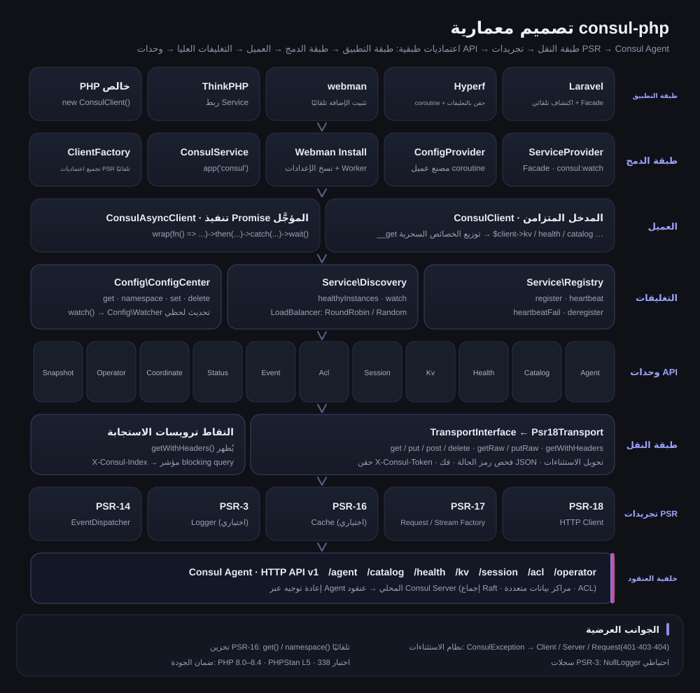
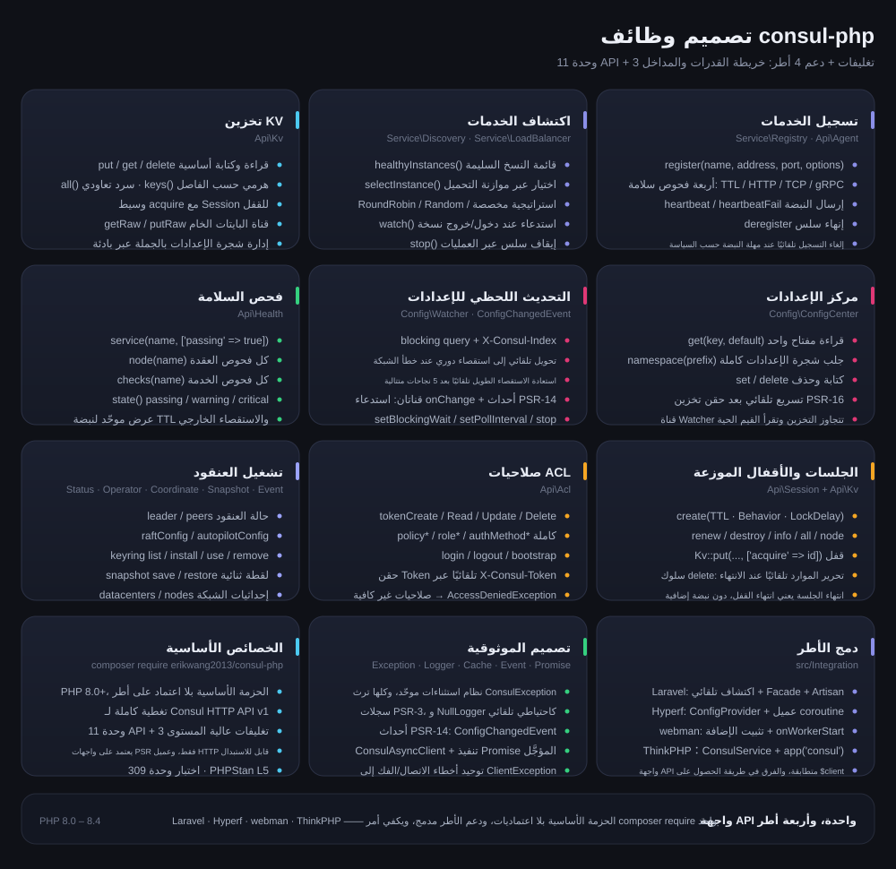
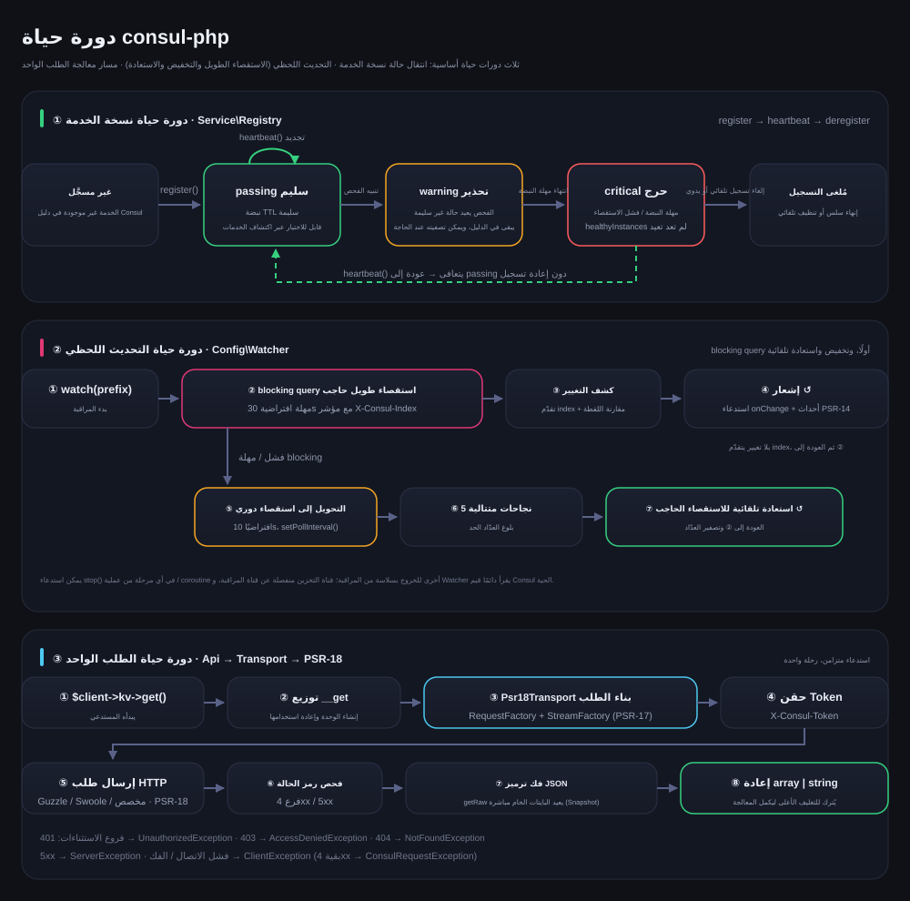

# erikwang2013/consul-php

[中文](../../../README.md) · [English](../en/README.md) · [日本語](../ja/README.md) · [한국어](../ko/README.md) · [Deutsch](../de/README.md) · [Français](../fr/README.md) · [Español](../es/README.md) · [Português](../pt/README.md) · [Русский](../ru/README.md) · **العربية** · [हिन्दी](../hi/README.md) · [বাংলা](../bn/README.md) · [Bahasa Indonesia](../id/README.md)



عميل Consul بلغة PHP، يغطي واجهة Consul HTTP API v1 بالكامل، مع تركيز على تسجيل الخدمات واكتشافها ومركز الإعدادات. الحزمة الأساسية بلا أي اعتماد على أطر العمل، وتتضمن دعمًا مدمجًا لـ Laravel / Hyperf / webman / ThinkPHP، فيكفي أمر composer require واحد للاستخدام مع أي إطار.

PHP 8.0+ · PSR-18/PSR-3/PSR-14/PSR-16 · بلا اعتماد على أطر العمل

> **حيوان المشروع الأليف Consu** —— مساعد صغير لمركز التسجيل لا يتغذى إلا على النبضات ولا ينقطع اتصاله أبدًا: الهوائي هو نبضة فحص السلامة، وخط النبض على صدره هو حالة الخدمة، وعلى خصره بطاقة ACL Token. يمكن استدعاؤه من الطرفية بالأمر `composer pet`، راجع قسم حيوان المشروع الأليف.

---

## نظرة عامة على المشروع

| | |
|---|---|
| **ما هو** | عميل Consul HTTP API v1 مكتوب بلغة PHP خالصة: مدخلان متزامن و Promise، و18 وحدة API، و3 تغليفات عالية المستوى |
| **ما الذي يحلّه** | يُمكّن تطبيقات PHP من الاتصال بـ Consul لتسجيل الخدمات واكتشافها وتحديث الإعدادات لحظيًا، دون إعادة كتابة عميل لكل إطار عمل |
| **كيف يُستخدم** | `composer require erikwang2013/consul-php`، الحزمة الأساسية بلا اعتماد على أطر العمل، ودعم الأطر مدمج ويُكتشف تلقائيًا |
| **الأطر المدعومة** | Laravel · Hyperf · webman · ThinkPHP —— واجهة API متطابقة تمامًا، والفرق فقط في طريقة الحصول على `$client` |
| **اصطلاح الاعتماديات** | يعتمد على واجهات PSR فقط (PSR-18/17/16/14/3)، ويمكن استبدال عميل HTTP والتخزين المؤقت والسجلات وموزّع الأحداث |
| **ضمان الجودة** | PHP 8.0 – 8.4 · 594 اختبار وحدة · PHPStan level 5 · PHP CS Fixer (PSR-12) |

### القدرات الأساسية

- **تسجيل الخدمات واكتشافها** —— أربعة أنواع من فحص السلامة: TTL / HTTP / TCP / gRPC؛ healthyInstances / selectInstance؛ RoundRobin و Random وموازنة تحميل مخصصة؛ مراقبة دخول وخروج النسخ
- **مركز الإعدادات** —— قراءة وكتابة KV، وشجرة مساحات الأسماء، وتسريع عبر تخزين PSR-16 المؤقت؛ التحديث اللحظي يفضّل blocking query بالاستقصاء الطويل، وعند خطأ الشبكة يُخفَّض تلقائيًا إلى الاستقصاء الدوري، وبعد 5 نجاحات متتالية تُستعاد الحالة تلقائيًا
- **تشغيل العنقود** —— Session للأقفال الموزعة، و ACL بكامل مكوّناته (Token / Policy / Role / AuthMethod)، و Status / Operator / Coordinate / Snapshot / Event
- **الموثوقية** —— نظام استثناءات موحّد، وسجلات PSR-3 (مع NullLogger كاحتياطي)، وإشعار عبر قناتين بأحداث PSR-14، وتوحيد أخطاء طبقة النقل

---

## فهرس التوثيق

| الوثيقة | الرابط |
|------|------|
| **بنية المشروع** | بنية المشروع |
| **تصميم المعمارية** | تصميم المعمارية · [architecture.svg](./images/architecture.svg) |
| **تصميم الوظائف** | تصميم الوظائف · [features.svg](./images/features.svg) |
| **دورة الحياة** | دورة الحياة · [lifecycle.svg](./images/lifecycle.svg) |
| **حيوان المشروع الأليف** | [Consu](./images/pet.svg) |
| **README بلغات متعددة** | [docs/i18n/](../) · [English](../en/README.md) · [日本語](../ja/README.md) · [한국어](../ko/README.md) · [Deutsch](../de/README.md) · [Français](../fr/README.md) · [Español](../es/README.md) · [Português](../pt/README.md) · [Русский](../ru/README.md) · [العربية](README.md) · [हिन्दी](../hi/README.md) · [বাংলা](../bn/README.md) · [Bahasa Indonesia](../id/README.md) |
| **فهرس التوثيق الكامل** | [docs/README.md](../../README.md) |
| **دمج Laravel** | انظر قسم Laravel أدناه |
| **دمج Hyperf** | انظر قسم Hyperf أدناه |
| **دمج webman** | انظر قسم webman أدناه |
| **دمج ThinkPHP** | انظر قسم ThinkPHP أدناه |
| **وثائق التصميم** | [docs/superpowers/specs/2026-05-14-consul-php-design.md](../../superpowers/specs/2026-05-14-consul-php-design.md) |

---

## بنية المشروع

```
consul-php/
├── src/
│   ├── Client/                      # مدخل العميل
│   │   ├── ConsulClient.php         # المدخل المتزامن: __get يوزّع وحدات API والتغليفات العالية
│   │   ├── ConsulAsyncClient.php    # عميل Promise للتنفيذ المؤجَّل
│   │   └── Promise.php              # تنفيذ Promise خفيف
│   ├── Api/                         # وحدات Consul HTTP API v1 (18 وحدة)
│   │   ├── Agent.php                # الأعضاء، معلومات العقدة، وضع الصيانة، join / leave
│   │   ├── Catalog.php              # دليل الخدمات والعقد: التسجيل، إلغاء التسجيل، الاستعلام
│   │   ├── Health.php               # فحص السلامة: خدمة / عقدة / تصفية حسب الحالة
│   │   ├── Kv.php                   # قراءة وكتابة KV، السرد الهرمي، البايتات الخام، القفل بالجلسة
│   │   ├── Session.php              # الجلسات (أساس الأقفال الموزعة): إنشاء، تجديد، إتلاف
│   │   ├── Acl.php                  # Token / Policy / Role / AuthMethod
│   │   ├── Event.php                # أحداث المستخدم: fire / list
│   │   ├── Status.php               # حالة العنقود: leader / peers
│   │   ├── Coordinate.php           # الإحداثيات الشبكية: datacenters / nodes
│   │   ├── Operator.php             # عمليات Raft / Autopilot / Keyring
│   │   ├── Snapshot.php             # نسخ احتياطي واستعادة اللقطات (تدفق ثنائي)
│   │   ├── Txn.php                  # المعاملات: مفاتيح متعددة ذرّية / CAS دفعي
│   │   ├── ConfigEntry.php          # مدخلات الإعدادات: mesh / gateway / service-intentions
│   │   ├── Connect.php              # سلسلة تفويض service mesh (intentions)
│   │   ├── Query.php                # استعلامات مُعدّة مسبقًا: التحويل عند الفشل / الاكتشاف الأقرب
│   │   ├── Peering.php              # peering العنقود
│   │   ├── DiscoveryChain.php       # سلسلة اكتشاف mesh: تحليل التوجيه / التقسيم / التحويل عند الفشل
│   │   └── ExportedService.php      # تصدير واستيراد الخدمات عبر الأقسام / peering
│   ├── Service/                     # تسجيل الخدمات واكتشافها
│   │   ├── Registry.php             # register / heartbeat / heartbeatFail / deregister
│   │   ├── Discovery.php            # healthyInstances / selectInstance / watch / stop
│   │   └── LoadBalancer/            # RoundRobin و Random و LoadBalancerInterface
│   ├── Config/                      # مركز الإعدادات
│   │   ├── ConfigCenter.php         # get / namespace / set / delete / watch
│   │   ├── Watcher.php              # التحديث اللحظي: استقصاء طويل + استقصاء مخفَّض + استعادة تلقائية
│   │   └── ConfigChangedEvent.php   # حدث تغيير الإعدادات عبر PSR-14
│   ├── Transport/                   # طبقة النقل
│   │   ├── TransportInterface.php   # عقد النقل (يشمل getRaw / putRaw / getWithHeaders)
│   │   └── Psr18Transport.php       # تنفيذ PSR-18: حقن Token، فك الترميز، تحويل الاستثناءات
│   ├── Http/                        # PSR-7/17/18 مدمج (عميل cURL، بديل عند غياب Guzzle)
│   ├── Support/                     # النسخة الطرفية من Consu حيوان المشروع (Pet::art / Pet::say)
│   ├── Exception/                   # نظام الاستثناءات (ConsulException وفئاته الفرعية، 7 فئات)
│   └── Integration/                 # دعم أطر العمل (مدمج، يُكتشف تلقائيًا)
│       ├── ClientFactory.php        # تجميع اعتماديات PSR تلقائيًا
│       ├── Laravel/                 # ServiceProvider + Facade + config/consul.php
│       ├── Hyperf/                  # ConfigProvider + مصنع عميل coroutine + config
│       ├── Webman/                  # تثبيت الإضافة (Install) + config/app.php
│       ├── Thinkphp/                # ConsulService + config/consul.php
│       └── Native/                  # PHP الأصلي: التسجيل / نبضة / إلغاء تلقائي بسطر واحد
├── tests/                           # حالات PHPUnit (Api / Client / Config / Exception /
│                                    #   Integration / Service / Support / Transport)
├── docs/
│   ├── images/                      # حيوان المشروع والمخططات التصميمية (SVG)
│   │   ├── pet.svg                  # حيوان المشروع الأليف Consu
│   │   ├── architecture.svg         # تصميم المعمارية
│   │   ├── features.svg             # تصميم الوظائف
│   │   └── lifecycle.svg            # دورة الحياة
│   ├── i18n/                        # en · ja · ko · de · fr · es · pt · ru · ar · hi · bn · id
│   ├── superpowers/specs/           # وثائق التصميم
│   ├── superpowers/plans/           # خطط التنفيذ
│   └── reports/                     # تقارير التغطية وتقارير الاختبار
├── scripts/i18n-svg.php             # i18n build / verify
├── scripts/pet.php                  # مدخل composer pet: استدعاء حيوان المشروع من الطرفية
├── composer.json                    # الاعتماديات وإعلان الاكتشاف التلقائي للأطر
├── phpunit.xml.dist                 # إعدادات الاختبار
└── phpstan.neon                     # إعدادات التحليل الساكن (level 5)
```

---

## نظرة على دمج الأطر

| | Laravel | Hyperf | webman | ThinkPHP |
|---|---|---|---|---|
| **حزمة الإضافة** | مدمجة | مدمجة | مدمجة | مدمجة |
| **طريقة الحقن** | اكتشاف تلقائي + `ServiceProvider` | اكتشاف تلقائي + `ConfigProvider` | `new` يدوي / إضافة | `bind` يدوي إلى الحاوية |
| **وصول سريع** | واجهة `Consul` Facade | تعليق `#[Inject]` | — | مساعد `app('consul')` |
| **موضع الإعدادات** | `config/consul.php` | `config/autoload/consul.php` | `config/plugin/erikwang2013/consul-php/app.php` | `config/consul.php` |
| **عميل HTTP** | Guzzle (PSR-18) | عميل Swoole coroutine | Guzzle (PSR-18) | Guzzle (PSR-18) |
| **التخزين المؤقت** | Laravel Cache (PSR-16) | Hyperf Cache (PSR-16) | حقن يدوي | حقن يدوي |
| **تشغيل التحديث اللحظي** | أمر Artisan | `AbstractProcess` coroutine | عملية `Worker` | Timer / عملية Swoole |
| **مراقبة الأحداث** | `EventServiceProvider` | Hyperf Event | — | ThinkPHP Listener |
| **التوثيق** | [كود المصدر](../../../src/Integration/Laravel/) | [كود المصدر](../../../src/Integration/Hyperf/) | [كود المصدر](../../../src/Integration/Webman/) | [كود المصدر](../../../src/Integration/Thinkphp/) |

### العملية نفسها، بصيغ مختلفة

**الحصول على العميل:**

| الإطار | الصيغة |
|------|------|
| عام | `$client = new ConsulClient(['base_uri' => '...']);` |
| Laravel | `$client = app(ConsulClient::class);` أو `Consul::kv->get(...)` |
| Hyperf | `#[Inject] private ConsulClient $consul;` |
| webman | `$client = new ConsulClient(['base_uri' => '...']);` |
| ThinkPHP | `$client = app('consul');` |

**تسجيل الخدمة:**

```php
// جميع الأطر تستخدم واجهة API نفسها، والفرق فقط في طريقة الحصول على $client
$client->serviceRegistry()->register('my-app', '10.0.0.1', 8080, [
    'id'    => 'my-app-1',
    'tags'  => ['v1'],
    'check' => ['ttl' => '30s'],
]);
```

**قراءة الإعدادات:**

```php
// واجهة API نفسها، و Laravel/Hyperf يستخدمان التخزين المؤقت تلقائيًا
$dbHost = $client->configCenter()->get('app/db_host', 'default');
```

**طريقة تشغيل التحديث اللحظي:**

| الإطار | أمر / طريقة التشغيل | بيئة التشغيل |
|------|----------------|---------|
| Laravel | `php artisan consul:watch` | عملية Artisan مستقلة |
| Hyperf | `ConsulWatchProcess` (يبدأ تلقائيًا) | Swoole coroutine |
| webman | `fork` داخل `onWorkerStart` | عملية Worker |
| ThinkPHP | Timer::setInterval / Swoole Process | عملية مستقلة |

---

## التثبيت

```bash
# الحزمة الأساسية
composer require erikwang2013/consul-php

# تنفيذ PSR-18 (اختياري: يُستخدم عميل cURL المدمج إذا لم تثبّته)
composer require guzzlehttp/guzzle php-http/guzzle7-adapter php-http/discovery
```

### دمج الأطر

دعم الأطر مدمج أصلًا في الحزمة الأساسية ولا يحتاج تثبيتًا إضافيًا. بعد تثبيت الحزمة الأساسية، يكتشف الإطار المقابل خدمة Consul ويسجّلها تلقائيًا:

- **Laravel** — يكتشف `ConsulServiceProvider` تلقائيًا، ويوفّر واجهة `Consul` Facade وحقن الاعتماديات
- **Hyperf** — يكتشف `ConfigProvider` تلقائيًا، ويوفّر مصنع عميل coroutine وحقن `#[Inject]`
- **webman** — يكتشف الإضافة تلقائيًا، وينسخ ملف الإعدادات تلقائيًا عند `composer install`
- **ThinkPHP** — ينشئ `ConsulService` في مجلد `app/service` ويسجّله في التطبيق

---

## البدء السريع (عام)

```php
use Erikwang2013\Consul\Client\ConsulClient;

// الاستخدام الأساسي
$client = new ConsulClient(['base_uri' => 'http://127.0.0.1:8500']);

// مع ACL Token
$client = new ConsulClient([
    'base_uri' => 'http://127.0.0.1:8500',
    'token'    => 'your-consul-acl-token',
]);
```

يُضاف Token تلقائيًا إلى جميع الطلبات عبر ترويسة `X-Consul-Token`.

### تسجيل الخدمات

يدعم أربعة أنماط لفحص السلامة: TTL و HTTP و TCP و gRPC.

```php
$registry = $client->serviceRegistry();

// نمط TTL — التطبيق يرسل النبضة بنفسه
$registry->register('user-service', '192.168.1.10', 8080, [
    'id'    => 'user-service-1',
    'tags'  => ['v1', 'primary'],
    'meta'  => ['region' => 'cn-east'],
    'check' => [
        'ttl' => '30s',
        'deregister_critical_service_after' => '120s', // إلغاء التسجيل تلقائيًا عند انتهاء مهلة النبضة
    ],
]);

// نمط HTTP — Consul يستقصي دوريًا
$registry->register('web', '192.168.1.10', 80, [
    'id'    => 'web-1',
    'check' => [
        'http'     => 'http://192.168.1.10:80/health',
        'interval' => '10s',
        'timeout'  => '3s',
    ],
]);

// نمط TCP
$registry->register('mysql', '192.168.1.10', 3306, [
    'check' => ['tcp' => '192.168.1.10:3306', 'interval' => '10s'],
]);

// نمط gRPC
$registry->register('grpc-svc', '192.168.1.10', 50051, [
    'check' => ['grpc' => '192.168.1.10:50051', 'interval' => '10s'],
]);

// النبضة (نمط TTL)
$registry->heartbeat('user-service-1');

// إلغاء التسجيل
$registry->deregister('user-service-1');
```

### اكتشاف الخدمات

يتضمن استراتيجيتي موازنة تحميل: RoundRobin (الافتراضية) و Random.

```php
$discovery = $client->serviceDiscovery();

// جميع النسخ السليمة
$instances = $discovery->healthyInstances('user-service');
// [
//   ['address' => '10.0.0.1', 'port' => 8080, 'service' => 'user-service', 'id' => 'user-1', 'tags' => ['v1']],
//   ['address' => '10.0.0.2', 'port' => 8080, 'service' => 'user-service', 'id' => 'user-2', 'tags' => ['v1']],
// ]

// اختيار نسخة عبر موازنة التحميل
$instance = $discovery->selectInstance('user-service');

// استراتيجية موازنة تحميل مخصصة
use Erikwang2013\Consul\Service\LoadBalancer\Random;
$discovery = new Discovery($health, loadBalancer: new Random());

// مراقبة تغيّر نسخ الخدمة
$discovery->watch('user-service', function (array $instances) {
    // يُستدعى عند دخول أو خروج نسخة
});

// إيقاف المراقبة: يقلب راية هذا الكائن فقط، فيلزم أن يكون في العملية نفسها التي يعمل فيها watch() (ذاكرة Swoole coroutine مشتركة، وهذا ممكن)
// وعبر العمليات استخدم الإشارات (pcntl_signal + posix_kill) أو مدير العمليات؛ والطلب الجاري ينتظر دورة wait واحدة كحد أقصى قبل الخروج
$discovery->stop();
```

### مركز الإعدادات

```php
$config = $client->configCenter();

// مفتاح واحد
$dbHost = $config->get('app/db_host', 'localhost');

// مساحة الأسماء كاملة
$all = $config->namespace('app/');
// ['app/db_host' => 'mysql.local', 'app/redis_host' => 'redis.local', ...]

// الكتابة / الحذف
$config->set('app/cache_ttl', '3600');
$config->delete('app/old_key');

// التحديث اللحظي
$watcher = $config->watch('app/');
$watcher
    ->setBlockingWait(30)   // مهلة الاستقصاء الطويل (بالثواني)
    ->setPollInterval(10)   // فترة التحويل إلى الاستقصاء الدوري (بالثواني)
    ->onChange(function (array $updated) {
        // استدعاء عند تغيّر الإعدادات
    });
$watcher->start(); // حاجب، ضعه في عملية / coroutine مستقلة
// $watcher->stop();  // لا يسري إلا داخل العملية نفسها (بما فيها الـ coroutine)؛ وعبر العمليات استخدم الإشارات، راجع قسم دورة الحياة أدناه
```

**مبدأ التحديث اللحظي:** يفضّل Consul blocking query (الاستقصاء الطويل عبر `index`)، وعند خطأ الشبكة يُخفَّض تلقائيًا إلى استقصاء دوري، وبعد استعادة الاتصال يرجع تلقائيًا إلى الاستقصاء الطويل. الإشعار يمر عبر قناتين: الاستدعاء (callback) و PSR-14 EventDispatcher.

**استراتيجية التخزين المؤقت:** بعد حقن تخزين PSR-16 المؤقت، تقرأ وتكتب `get()` و `namespace()` من التخزين تلقائيًا. أما Watcher فيقرأ دائمًا بيانات Consul الحية، ولا يمر عبر التخزين المؤقت.

### تخزين KV

```php
$kv = $client->kv;

$kv->put('key', 'value');
$entry = $kv->get('key');              // يُطلق NotFoundException عند غياب المفتاح (Consul يعيد 404)؛ ولا يكون null إلا عندما يكون الرد مصفوفة فارغة
$all = $kv->all('prefix/');            // سرد تعاودي
$keys = $kv->keys('prefix/');          // أسماء المفاتيح فقط
$keys = $kv->keys('prefix/', '/');     // سرد هرمي حسب الفاصل
$kv->delete('key');
```

### واجهة فحص السلامة API

```php
$health = $client->health;

$health->service('user-service', ['passing' => true]);  // النسخ السليمة فقط
$health->node('node-1');                                 // جميع فحوص العقدة
$health->checks('user-service');                          // جميع فحوص الخدمة
$health->state('critical');                               // حسب الحالة: passing/warning/critical
```

### Session / الأقفال الموزعة

```php
$session = $client->session;

$sess = $session->create([
    'Name'     => 'lock-session',
    'TTL'      => '30s',
    'Behavior' => 'delete',    // حذف KV المرتبط تلقائيًا عند الانتهاء
]);
$sessionId = $sess['ID'];

// قفل المورد
$locked = $client->kv->put('lock/resource', '1', ['acquire' => $sessionId]);

// التجديد / التحرير
$session->renew($sessionId);
$session->destroy($sessionId);
```

### ACL

```php
$acl = $client->acl;

// Token
$token = $acl->tokenCreate(['Description' => 'read-only', 'Policies' => [['Name' => 'read-policy']]]);
$acl->tokenRead($token['AccessorID']);
$acl->tokenDelete($token['AccessorID']);

// Policy
$policy = $acl->policyCreate(['Name' => 'my-policy', 'Rules' => 'node "" { policy = "read" }']);

// Role
$role = $acl->roleCreate(['Name' => 'reader', 'Policies' => [['Name' => 'my-policy']]]);

// Login/Logout
$result = $acl->login(['AuthMethod' => 'my-auth', 'BearerToken' => '...']);
$acl->logout();
```

### العميل اللامتزامن

```php
use Erikwang2013\Consul\Client\ConsulAsyncClient;

$client = new ConsulAsyncClient(['base_uri' => 'http://127.0.0.1:8500']);

$promise = $client->wrap(fn() => $client->kv->get('key'));

$promise
    ->then(fn($result) => print_r($result))
    ->catch(fn(\Throwable $e) => log_error($e));

$value = $promise->wait(); // الحصول على النتيجة بشكل حاجب
```

**ملاحظة:** العميل اللامتزامن مبني على نمط Promise، ويصلح للمواقف التي تحتاج طلبات متزامنة (concurrent). وفي بيئة Hyperf coroutine يكفي عميل HTTP الافتراضي لتحقيق التزامن على مستوى coroutine.

---

## PHP الأصلي (بدون إطار عمل، وبلا اعتمادات إضافية)

عند عدم استخدام إطار عمل وعدم الرغبة في تثبيت مكتبة HTTP إضافية، يتولى عميل cURL المدمج المهمة تلقائيًا ويعمل جاهزًا دون أي إعداد:

```php
use Erikwang2013\Consul\Client\ConsulClient;
use Erikwang2013\Consul\Integration\Native\NativeService;

$client = new ConsulClient(['base_uri' => 'http://127.0.0.1:8500']);

// سكربت دائم التشغيل: سطر واحد يكفي لـ «التسجيل → نبضة TTL → إلغاء التسجيل تلقائيًا عند الخروج»
$service = NativeService::start($client->serviceRegistry(), 'my-app', '10.0.0.1', 8080, [
    'check' => ['ttl' => '30s', 'deregister_critical_service_after' => '120s'],
], heartbeatInterval: 10);

$service->serve();                       // يحجب أثناء إرسال النبضات؛ وعند تثبيت pcntl يُلغي Ctrl+C التسجيل أولًا
// أو تحكّم في الحلقة بنفسك: $service->heartbeat();  …  $service->stop();
```

ترتيب اختيار عميل HTTP: **حقن يدوي** > التنفيذ الذي يعثر عليه `php-http/discovery` (Guzzle، محوّل Swoole coroutine، وما شابه) > **cURL المدمج**.
التنفيذ المدمج يضبط مهلة الاتصال والمهلة الكلية بنفسه (افتراضيًا 3s / 30s)، ويمكن حقن بديل عنه:

```php
use Erikwang2013\Consul\Http\CurlClient;

$client = new ConsulClient([...], new CurlClient(connectTimeout: 1.0, timeout: 5.0));
```

---

## دليل الدمج مع كل إطار

### Laravel

يكتشف Laravel `ConsulServiceProvider` تلقائيًا، دون تسجيل يدوي.

```bash
php artisan vendor:publish --tag=consul-config
```

اضبط `CONSUL_BASE_URI` في ملف `.env`، ثم استخدمه عبر حقن الاعتماديات أو Facade. تحقن إضافة Laravel تلقائيًا عميل PSR-18 وتخزين PSR-16 المؤقت وسجلات PSR-3 وموزّع أحداث PSR-14.

```php
// حقن الاعتماديات
use Erikwang2013\Consul\Client\ConsulClient;
public function show(ConsulClient $consul) { ... }

// Facade
use Consul;
$services = Consul::catalog->services();

// التحديث اللحظي للإعدادات — أمر Artisan
// php artisan consul:watch
```

### Hyperf

يكتشف Hyperf `ConfigProvider` تلقائيًا، دون تسجيل يدوي.

```bash
php bin/hyperf.php vendor:publish consul
```

تسجّل إضافة Hyperf `ConsulClient` في حاوية DI تلقائيًا، وتستخدم لطلبات HTTP عميل Swoole coroutine افتراضيًا. يُفضّل وضع تسجيل الخدمة في مستمع حدث `MainServerStart`، ويعمل التحديث اللحظي عبر `AbstractProcess` داخل coroutine.

```php
// الحقن بالتعليقات
#[Inject]
private ConsulClient $consul;

// تسجيل الخدمة — حدث MainServerStart
$consul->serviceRegistry()->register(...);

// التحديث اللحظي — ConsulWatchProcess يبدأ تلقائيًا
```

### webman

يكتشف webman الإضافة تلقائيًا، وينسخ ملف الإعدادات إلى `config/plugin/erikwang2013/consul-php/` عند `composer install`. ولأن webman يعمل بمعمارية الذاكرة المقيمة، يوضع تسجيل الخدمة في استدعاء `onWorkerStart`، ويكفي التسجيل مرة واحدة على مستوى التطبيق.

```php
// process/ConsulRegister.php
class ConsulRegister {
    public function onWorkerStart(Worker $worker): void {
        $consul = new ConsulClient(['base_uri' => getenv('CONSUL_BASE_URI')]);
        $consul->serviceRegistry()->register('webman-app', ...);
    }
}
```

### ThinkPHP

لا يملك ThinkPHP آلية اكتشاف تلقائي، لذا يجب تسجيل Service يدويًا. انسخ ملف الإعدادات إلى `config/consul.php`، ثم سجّل `ConsulService` في مجلد `app/service`:

```php
// app/service/ConsulService.php
namespace app\service;

use Erikwang2013\Consul\Integration\Thinkphp\ConsulService as BaseConsulService;

class ConsulService extends BaseConsulService
{
}
```

أو اربطه مباشرة في `app/AppService.php`:

```php
$this->app->bind('consul', fn() => new ConsulClient(config('consul')));

// الاستخدام
$services = app('consul')->catalog->services();

// دالة مساعدة — app/common.php
function consul() { return app('consul'); }
```

---

## تخصيص عميل HTTP

```php
$client = new ConsulClient(
    config:          ['base_uri' => 'http://consul:8500', 'token' => 'acl-token'],
    httpClient:      $myPsr18Client,        // مطلوب أو يُكتشف تلقائيًا
    requestFactory:  $myRequestFactory,      // كما سبق
    streamFactory:   $myStreamFactory,       // كما سبق
    logger:          $myLogger,              // PSR-3، اختياري
    cache:           $myCache,               // PSR-16، اختياري
    eventDispatcher: $myEventDispatcher,     // PSR-14، اختياري
);
```

المفاتيح التي يدعمها `config`:

| المفتاح | الافتراضي | الوصف |
|---|---|---|
| `base_uri` | `http://127.0.0.1:8500` | تُضاف `http://` تلقائيًا عند غياب `scheme` (فالكتابة المنسوخة من متغير بيئة مثل `127.0.0.1:8500` تعمل مباشرةً)|
| `token` | — | ACL Token، يُحقن في `X-Consul-Token` |
| `cache.enable` / `cache.ttl` | `false` / بلا | بالتعاون مع تخزين PSR-16 المؤقت المحقون، ويعملان على `Discovery::healthyInstances()` و `ConfigCenter::get()` (`cache.enable` تقرأه محوّلات الأطر فقط؛ عند الإنشاء اليدوي يكفي حقن ذاكرة تخزين مؤقت) |
| `timeout.connect` / `timeout.total` | `3.0` / `0` (بلا حد) | يستخدمهما عميل cURL المدمج وحده. **لا تجعل `total` أصغر من `blockingWait`**، وإلا عُدّ الاستقصاء الطويل متجاوزًا للمهلة حتمًا وتم تخفيضه |
| `retry.times` / `retry.delay_ms` | `0` / `50` | عدد محاولات الإعادة وتأخير التباعد الأول عند فشل النقل (بنمو أُسّي)؛ ويعملان مع الطرق المتكافئة (idempotent) فقط (GET/PUT/DELETE) |

---

## مرجع سريع لوحدات API

| الخاصية | الفئة | أهم الطرق |
|------|-----|---------|
| `$client->kv` | `Api\Kv` | `get` `put` `delete` `all` `keys` (`put`/`delete` تدعمان `cas` `flags` `acquire` `release`) |
| `$client->agent` | `Api\Agent` | `members` `self` `registerService` `deregisterService` `checks` `services` `service` `healthServiceByName` `healthServiceById` `checkRegister` `checkUpdate` `checkDeregister` `checkPass/Fail/Warn` `maintenance` `join` `forceLeave` `leave` `reload` `host` `version` `metrics` `connectAuthorize` `connectCaRoots` `connectCaLeaf` `updateToken` |
| `$client->catalog` | `Api\Catalog` | `register` `deregister` `nodes` `services` `service` `node` `nodeServices` `connect` `datacenters` `gatewayServices` |
| `$client->health` | `Api\Health` | `service` `node` `checks` `state` `connect` `ingress` (تدعمان `node_meta` متعددة القيم، و `stale`/`consistent`/`max_stale`) |
| `$client->session` | `Api\Session` | `create` `destroy` `renew` `info` `all` `node` |
| `$client->acl` | `Api\Acl` | `token*` `policy*` `role*` `authMethod*` `bindingRule*` `login` `logout` `bootstrap` `replication` |
| `$client->event` | `Api\Event` | `fire` `list` (تدعمان الاستعلام الحاجب `index`/`wait`) |
| `$client->status` | `Api\Status` | `leader` `peers` |
| `$client->coordinate` | `Api\Coordinate` | `datacenters` `nodes` `node` `update` |
| `$client->operator` | `Api\Operator` | `raftConfig` `raftPeer` `raftTransferLeader` `autopilotConfig` `autopilotHealth` `autopilotState` `features` `feature` `keyring` (الثوابت: `KEYRING_LIST` `KEYRING_INSTALL` `KEYRING_USE` `KEYRING_REMOVE`) |
| `$client->snapshot` | `Api\Snapshot` | `save` (يعيد بايتات اللقطة الخام عبر `getRaw()`) `restore` (يرسل بايتات خام عبر `putRaw()`) |
| `$client->txn` | `Api\Txn` | `apply` + `set` `cas` `lock` `unlock` `get` `getTree` `delete` `deleteTree` `deleteCas` `checkIndex` `checkSession` `checkNotExists` `raw` (معاملة ذرّية متعددة المفاتيح) |
| `$client->configEntry` | `Api\ConfigEntry` | `set` `get` `list` `delete` (`service-defaults` / `proxy-defaults` / `mesh` / gateway / `service-intentions` / `exported-services`) |
| `$client->connect` | `Api\Connect` | `intentions` `intentionCreate` `intentionRead` `intentionUpdate` `intentionDelete` `intentionMatch` `intentionCheck` (سلسلة تفويض service mesh) |
| `$client->query` | `Api\Query` | `list` `create` `read` `update` `delete` `execute` `explain` (استعلامات مُعدّة مسبقًا: التحويل عند الفشل / الاكتشاف الأقرب) |
| `$client->peering` | `Api\Peering` | `generateToken` `establish` `list` `read` `delete` (peering العنقود) |
| `$client->discoveryChain` | `Api\DiscoveryChain` | `read` (سلسلة اكتشاف mesh: نتيجة تحليل التوجيه / التقسيم / التحويل عند الفشل، وتدعم `compile-dc` والاستعلام الحاجب) |
| `$client->exportedService` | `Api\ExportedService` | `exported` `imported` (الخدمات المُصدَّرة والمستوردة عبر الأقسام / peering) |

**نقطتا نهاية غير مدعومتين**: إن `/v1/agent/metrics/stream` و `/v1/agent/monitor` واجهتان متدفقتان باتصال طويل (الأولى تدفع المقاييس، والثانية تدفع السجلات اللحظية)، وطبقة النقل في هذه الحزمة مبنية على نموذج الطلب-الرد، فاستدعاؤهما لا يعطي إلا حجبًا دائمًا، ولذلك **لا نوفّرهما عمدًا** —— وإذا احتجت إلى قدرات التدفق فوجّه الطلبات إلى Agent مباشرة. وتُعيد `Agent::metrics(['format' => 'prometheus'])` القيمة `['format' => 'prometheus', 'body' => <النص الخام>]`، لأن صيغة Prometheus ليست JSON.

التغليفات عالية المستوى:

| الطريقة | القيمة المُعادة | الوصف |
|------|------|------|
| `$client->serviceRegistry()` | `Service\Registry` | تسجيل الخدمة / النبضة / إلغاء التسجيل |
| `$client->serviceDiscovery()` | `Service\Discovery` | قائمة النسخ / موازنة التحميل / مراقبة التغييرات |
| `$client->configCenter()` | `Config\ConfigCenter` | قراءة وكتابة الإعدادات / التخزين المؤقت / التحديث اللحظي |

---

## نظام الاستثناءات

جميع الاستثناءات ترث `ConsulException` (التي ترث `RuntimeException`):

```
ConsulException
├── ClientException           خطأ في نقل HTTP (فشل الاتصال، DNS، المهلة...)
├── ServerException           Consul يعيد 5xx
└── ConsulRequestException    Consul يعيد 4xx
    ├── NotFoundException     404
    └── AccessDeniedException 403
```

```php
try {
    $client->kv->get('key');
} catch (ClientException $e) {
    // مشكلة في الشبكة
} catch (NotFoundException $e) {
    // المورد غير موجود
} catch (ConsulException $e) {
    // أخطاء Consul أخرى
}
```

---

## تصميم المعمارية



اتجاه الاعتماديات من الأعلى إلى الأسفل، وكل طبقة تعتمد فقط على تجريدات الطبقة الأدنى منها:

- **طبقة التطبيق / طبقة الدمج** —— دعم الأطر الأربعة مدمج في الحزمة الأساسية `src/Integration/` ويُكتشف ويُسجَّل تلقائيًا عبر composer؛ وطبقة التطبيق تتعامل دائمًا مع مدخل واحد فقط هو `ConsulClient`.
- **العميل** —— `ConsulClient` يكشف عبر `__get` ثماني عشرة وحدة API (`$client->kv`، `$client->health` …) و3 تغليفات عالية المستوى (`serviceRegistry()` / `serviceDiscovery()` / `configCenter()`)؛ و`ConsulAsyncClient` يوفّر التنفيذ المؤجَّل عبر Promise.
- **التغليفات عالية المستوى** —— `Registry` / `Discovery` / `ConfigCenter` تجمع وحدات API؛ و`Watcher` يعتمد على `X-Consul-Index` الذي يعيده `getWithHeaders()` لتنفيذ الاستقصاء الطويل.
- **وحدات API** —— كل وحدة تقابل مجموعة من نقاط نهاية Consul v1، وكلها تمر عبر `TransportInterface` نفسه.
- **طبقة النقل** —— `Psr18Transport` مسؤولة عن حقن Token وفحص رمز الحالة وفك ترميز JSON وتحويل الاستثناءات، وهي نقطة الخروج الشبكية الوحيدة في الحزمة كلها.
- **تجريدات PSR** —— تعتمد على واجهات PSR فقط (18/17/16/14/3)، ويمكن استبدال عميل HTTP والتخزين المؤقت والسجلات وموزّع الأحداث، وعند عدم حقنها يُخفَّض المستوى تلقائيًا.

---

## تصميم الوظائف



خريطة القدرات: تسجيل الخدمات واكتشافها، ومركز الإعدادات والتحديث اللحظي، و KV / فحص السلامة / أقفال الجلسات / ACL / تشغيل العنقود، ودعم الأطر الأربعة وتصميم الموثوقية. كل بطاقة قدرة تحمل فئة المدخل المقابلة لها، وللاطلاع على طريقة الاستدعاء راجع قسمي البدء السريع ومرجع وحدات API أعلاه.

---

## دورة الحياة



- **دورة حياة نسخة الخدمة** —— `register()` → passing (تجديد دوري عبر `heartbeat()`) → warning → critical → إلغاء تسجيل تلقائي أو يدوي؛ وعند تعافي النبضة يمكن العودة من critical إلى passing دون إعادة التسجيل.
- **دورة حياة التحديث اللحظي للإعدادات** —— `watch()` يبدأ blocking query (افتراضيًا 30s، مع `X-Consul-Index`) → كشف التغيير → استدعاء `onChange` + `ConfigChangedEvent`؛ وعند فشل الحجب يُخفَّض تلقائيًا إلى استقصاء دوري (افتراضيًا 10s)، ويعود إلى الاستقصاء الطويل **بعد 5 نجاحات متتالية** (وأي فشل في دورة استقصاء واحدة يصفّر العدّاد).
  ولكلا الضابطين حدّ أدنى قدره ثانية واحدة (`setBlockingWait` / `setPollInterval`، والقيمة غير الصالحة تُطلق `InvalidArgumentException`) —— فالفاصل 0 يعني انتظارًا حارًّا (busy wait) بلا تهدئة، وقيمة `wait` غير موجبة تجعل Consul يتراجع إلى المدة الافتراضية 5 دقائق.
  و`stop()` يقلب راية **هذا الكائن**: يسري داخل العملية نفسها (بما فيها Swoole coroutine)، وعبر العمليات يلزم استخدام الإشارات (`pcntl_signal` + `posix_kill`) أو مدير العمليات؛ والطلب الجاري ينتظر دورة wait واحدة كحد أقصى قبل الخروج.
- **دورة حياة الطلب الواحد** —— وحدة API → `Psr18Transport` يبني طلب PSR-17 → حقن `X-Consul-Token` → الإرسال عبر PSR-18 → فحص رمز الحالة → فك ترميز JSON (`getRaw()` يعيد البايتات الخام مباشرة) → إعادة مصفوفة؛ وتُحوَّل حالات 401/403/404/5xx وفشل النقل إلى الاستثناءات المقابلة.

---

## حيوان المشروع الأليف Consu

الحيوان الأليف ليس مجرد رسمة، بل يمكن استدعاؤه من الطرفية ومن الكود:

```bash
composer pet
```

```text
╭───────────────────────────────────────────────────────────────────────────╮
│ consul-php · عميل Consul بلغة PHP —— أمر composer require واحد، وأربعة أطر تنبض جميعًا │
╰──────┬────────────────────────────────────────────────────────────────────╯
       │
       ●
       │
   ╭───┴───╮
   │ ◕   ◕ │
   │  ╰─╯  │
   ├───────┤
   │╱╲╱╲╱╲ │
   ╰┬─────┬╯
    ╰─┬─┬─╯
```

للاستدعاء مباشرة من الكود `Erikwang2013\Consul\Support\Pet`:

```php
use Erikwang2013\Consul\Support\Pet;

echo Pet::art();                      // الحيوان فقط
echo Pet::say('إعدادات consul جاهزة');    // فقاعة فوق الرأس + الحيوان
echo Pet::art(false);                 // إجبار النص العادي
```

تُحدَّد الألوان تلقائيًا حسب قدرات الطرفية: عند عدم كونها TTY أو عند ضبط `NO_COLOR` يُخرَج نص عادي، فلا تتلوث السجلات ومخرجات CI.

التصميم مطابق لـ [pet.svg](./images/pet.svg): الهوائي = نبضة فحص السلامة (أخضر في passing)، والنظارة = اكتشاف الخدمات، وخط النبض على الصدر = حالة الخدمة (بلون Consul الأرجواني)، والبطاقة على الخصر = ACL Token.

---

## المتطلبات الدنيا

- PHP 8.0+
- Composer
- تنفيذ عميل PSR-18 HTTP — عند عدم حقنه وعدم تثبيته يُرجَع تلقائيًا إلى عميل cURL المدمج (يتطلب إضافة curl)
- [اختياري] تخزين PSR-16 المؤقت — `Discovery::healthyInstances()` / `ConfigCenter::get()` يخزّنان تلقائيًا
- [اختياري] PSR-3 Logger — سجلات الطلبات
- [اختياري] PSR-14 EventDispatcher — حدث `ConfigChangedEvent`

## المصادر المفتوحة ليست سهلة، ودعمكم مرحّب به

| WeChat | Alipay |
|:---:|:---:|
|  |  |

---

## License

MIT

---

*هذه الترجمة العربية أُنشئت بواسطة الذكاء الاصطناعي؛ إن وجدت أي خطأ أو عدم دقة، يسعدنا استقبال Issue أو PR.*
