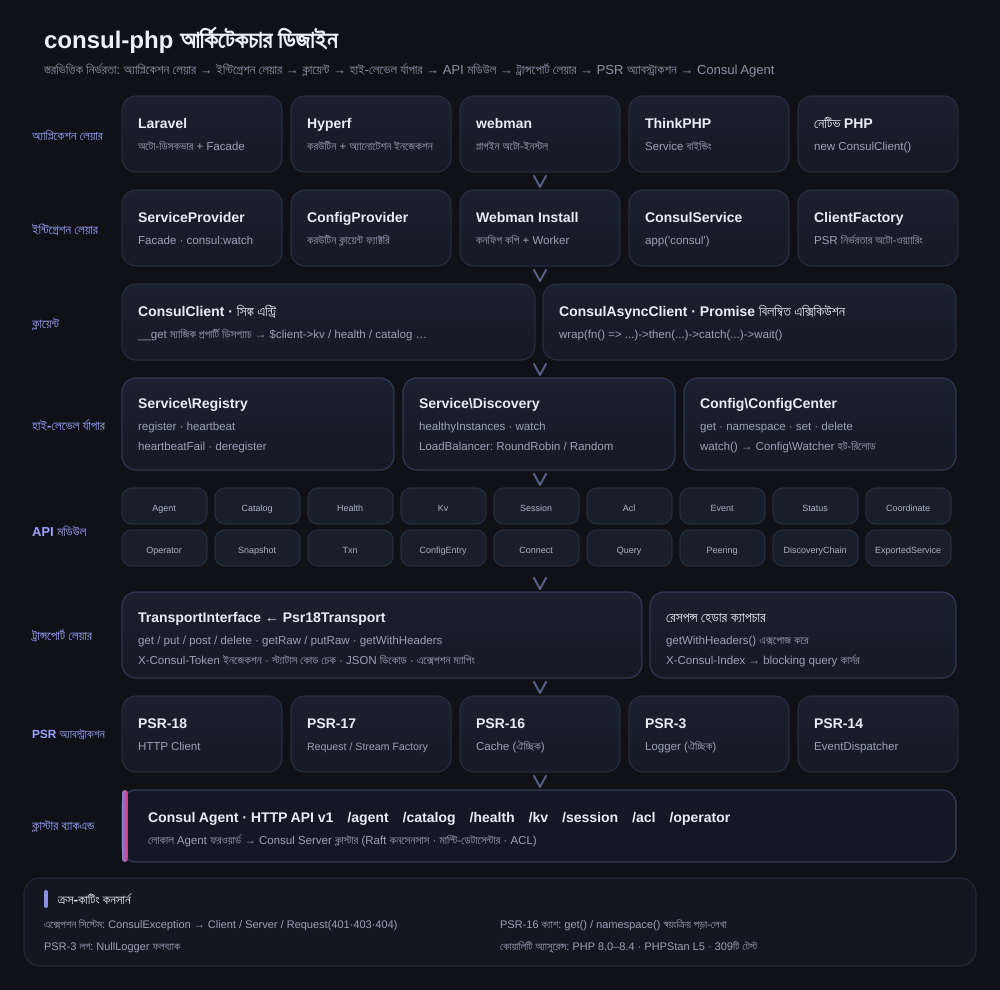
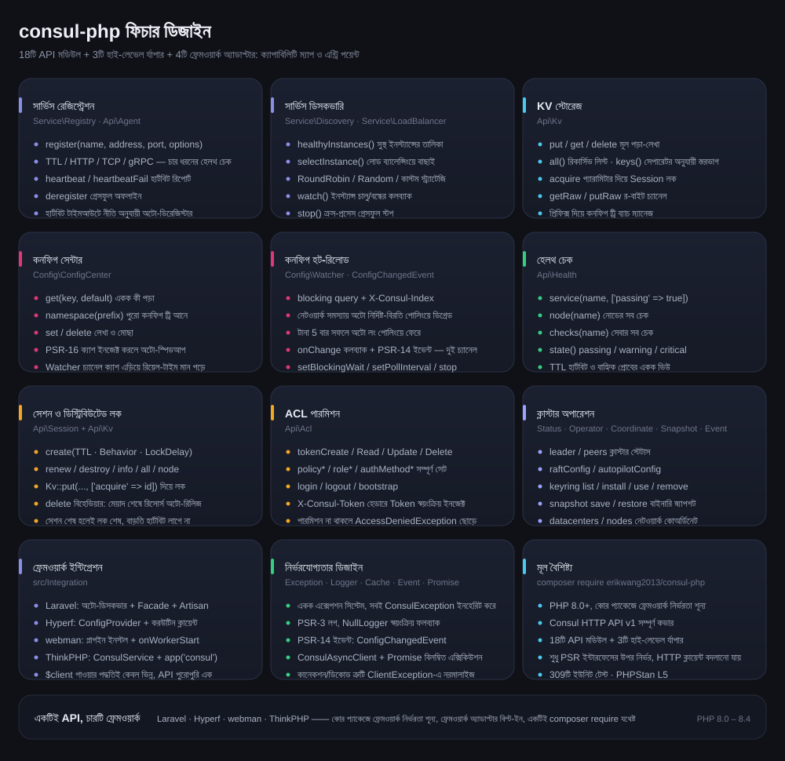
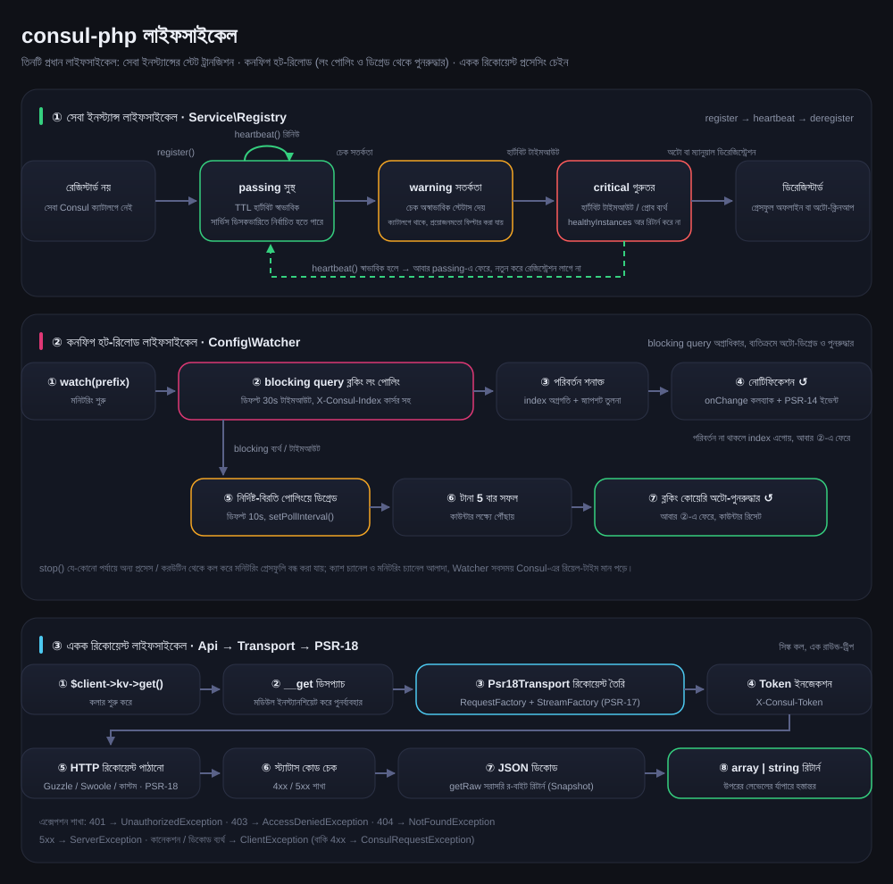

# erikwang2013/consul-php

[中文](../../../README.md) · [English](../en/README.md) · [日本語](../ja/README.md) · [한국어](../ko/README.md) · [Deutsch](../de/README.md) · [Français](../fr/README.md) · [Español](../es/README.md) · [Português](../pt/README.md) · [Русский](../ru/README.md) · [العربية](../ar/README.md) · [हिन्दी](../hi/README.md) · **বাংলা** · [Bahasa Indonesia](../id/README.md)



PHP Consul ক্লায়েন্ট, Consul HTTP API v1 সম্পূর্ণ কভার করে, বিশেষ মনোযোগ সার্ভিস রেজিস্ট্রেশন-ডিসকভারি ও কনফিগ সেন্টারে। কোর প্যাকেজে কোনো ফ্রেমওয়ার্ক নির্ভরতা নেই, Laravel / Hyperf / webman / ThinkPHP অ্যাডাপ্টার বিল্ট-ইন — একটিই composer require, যেকোনো ফ্রেমওয়ার্কেই ব্যবহার করা যায়।

PHP 8.0+ · PSR-18/PSR-3/PSR-14/PSR-16 · ফ্রেমওয়ার্ক নির্ভরতা শূন্য

> **প্রজেক্টের পেট Consu** —— শুধু হার্টবিট খায়, কখনো অফলাইন হয় না — এমন এক রেজিস্ট্রি সেন্টার সহকারী: অ্যান্টেনা হলো হেলথ চেক হার্টবিট, বুকের পালস লাইন হলো সেবার স্টেটাস, কোমরে ঝোলানো ACL Token। টার্মিনালে `composer pet` দিয়ে ডেকে আনা যায়, বিস্তারিত দেখুন প্রজেক্টের পেট Consu অংশে।

---

## প্রজেক্ট পরিচিতি

| | |
|---|---|
| **কী** | খাঁটি PHP-তে লেখা Consul HTTP API v1 ক্লায়েন্ট: সিঙ্ক + Promise দুই এন্ট্রি, 18টি API মডিউল, 3টি হাই-লেভেল র্যাপার |
| **কী সমাধান করে** | PHP অ্যাপ্লিকেশনকে Consul-এ যুক্ত করে সার্ভিস রেজিস্ট্রেশন-ডিসকভারি ও কনফিগ হট-রিলোড দেওয়া, প্রতিটি ফ্রেমওয়ার্কের জন্য নতুন করে ক্লায়েন্ট লেখার দরকার নেই |
| **কীভাবে ব্যবহার** | `composer require erikwang2013/consul-php`, কোর প্যাকেজে ফ্রেমওয়ার্ক নির্ভরতা শূন্য, ফ্রেমওয়ার্ক অ্যাডাপ্টার বিল্ট-ইন ও অটো-ডিসকভার |
| **সমর্থিত ফ্রেমওয়ার্ক** | Laravel · Hyperf · webman · ThinkPHP —— API পুরোপুরি একই, কেবল `$client` পাওয়ার পদ্ধতিই আলাদা |
| **নির্ভরতার নিয়ম** | কেবল PSR ইন্টারফেসের উপর নির্ভরতা (PSR-18/17/16/14/3), HTTP ক্লায়েন্ট, ক্যাশ, লগ, ইভেন্ট ডিসপ্যাচার — সবই বদলানো যায় |
| **কোয়ালিটি অ্যাসুরেন্স** | PHP 8.0 – 8.4 · 594টি ইউনিট টেস্ট · PHPStan level 5 · PHP CS Fixer (PSR-12) |

### মূল সক্ষমতা

- **সার্ভিস রেজিস্ট্রেশন ও ডিসকভারি** —— TTL / HTTP / TCP / gRPC চার ধরনের হেলথ চেক; healthyInstances / selectInstance; RoundRobin, Random ও কাস্টম লোড ব্যালেন্সিং; ইনস্ট্যান্স চালু/বন্ধ মনিটরিং
- **কনফিগ সেন্টার** —— KV পড়া-লেখা, নেমস্পেস ট্রি, PSR-16 ক্যাশ অ্যাক্সিলারেশন; হট-রিলোডে অগ্রাধিকার blocking query লং পোলিং, নেটওয়ার্ক সমস্যায় অটো পোলিংয়ে ডিগ্রেড, টানা 5 বার সফলে অটো-পুনরুদ্ধার
- **ক্লাস্টার অপারেশন** —— Session ডিস্ট্রিবিউটেড লক, সম্পূর্ণ ACL (Token / Policy / Role / AuthMethod), Status / Operator / Coordinate / Snapshot / Event
- **নির্ভরযোগ্যতা** —— একক এক্সেপশন সিস্টেম, PSR-3 লগ (NullLogger ফলব্যাক), PSR-14 ইভেন্ট দুই-চ্যানেল নোটিফিকেশন, ট্রান্সপোর্ট লেয়ারে ত্রুটি নরমালাইজেশন

---

## ডকুমেন্টেশন নেভিগেশন

| ডকুমেন্ট | লিংক |
|------|------|
| **প্রজেক্ট স্ট্রাকচার** | প্রজেক্ট স্ট্রাকচার |
| **আর্কিটেকচার ডিজাইন** | আর্কিটেকচার ডিজাইন · [architecture.svg](./images/architecture.svg) |
| **ফিচার ডিজাইন** | ফিচার ডিজাইন · [features.svg](./images/features.svg) |
| **লাইফসাইকেল** | লাইফসাইকেল · [lifecycle.svg](./images/lifecycle.svg) |
| **প্রজেক্টের পেট** | [Consu](./images/pet.svg) |
| **বহুভাষিক README** | [docs/i18n/](../../i18n/) · [中文](../../../README.md) · [English](../en/README.md) · [日本語](../ja/README.md) · [한국어](../ko/README.md) · [Deutsch](../de/README.md) · [Français](../fr/README.md) · [Español](../es/README.md) · [Português](../pt/README.md) · [Русский](../ru/README.md) · [العربية](../ar/README.md) · [हिन्दी](../hi/README.md) · **বাংলা** · [Bahasa Indonesia](../id/README.md) |
| **ডকুমেন্ট সূচি** | [docs/README.md](../../README.md) |
| **Laravel ইন্টিগ্রেশন** | নিচে দেখুন Laravel |
| **Hyperf ইন্টিগ্রেশন** | নিচে দেখুন Hyperf |
| **webman ইন্টিগ্রেশন** | নিচে দেখুন webman |
| **ThinkPHP ইন্টিগ্রেশন** | নিচে দেখুন ThinkPHP |
| **ডিজাইন ডকুমেন্ট** | [docs/superpowers/specs/2026-05-14-consul-php-design.md](../../superpowers/specs/2026-05-14-consul-php-design.md) |

---

## প্রজেক্ট স্ট্রাকচার

```
consul-php/
├── src/
│   ├── Client/                      # ক্লায়েন্ট এন্ট্রি
│   │   ├── ConsulClient.php         # সিঙ্ক এন্ট্রি: __get দিয়ে API মডিউল ও হাই-লেভেল র্যাপার ডিসপ্যাচ
│   │   ├── ConsulAsyncClient.php    # Promise বিলম্বিত এক্সিকিউশন ক্লায়েন্ট
│   │   └── Promise.php              # হালকা Promise ইমপ্লিমেন্টেশন
│   ├── Api/                         # Consul HTTP API v1 মডিউল (18টি)
│   │   ├── Agent.php                # মেম্বার, নিজের তথ্য, মেইনটেন্যান্স মোড, join / leave
│   │   ├── Catalog.php              # সেবা ও নোড ক্যাটালগ: রেজিস্টার, ডিরেজিস্টার, কোয়েরি
│   │   ├── Health.php               # হেলথ চেক: সেবা / নোড / স্টেটাস অনুযায়ী ফিল্টার
│   │   ├── Kv.php                   # KV পড়া-লেখা, স্তরভিত্তিক লিস্ট, র-বাইট, সেশন লক
│   │   ├── Session.php              # সেশন (ডিস্ট্রিবিউটেড লকের ভিত্তি): তৈরি, রিনিউ, ডেস্ট্রয়
│   │   ├── Acl.php                  # Token / Policy / Role / AuthMethod
│   │   ├── Event.php                # ইউজার ইভেন্ট: fire / list
│   │   ├── Status.php               # ক্লাস্টার স্টেটাস: leader / peers
│   │   ├── Coordinate.php           # নেটওয়ার্ক কোঅর্ডিনেট: datacenters / nodes
│   │   ├── Operator.php             # Raft / Autopilot / Keyring অপারেশন
│   │   ├── Snapshot.php             # স্ন্যাপশট ব্যাকআপ ও রিস্টোর (বাইনারি স্ট্রিম)
│   │   ├── Txn.php                  # ট্রানজ্যাকশন: অ্যাটমিক মাল্টি-কী / ব্যাচ CAS
│   │   ├── ConfigEntry.php          # কনফিগ এন্ট্রি: mesh / gateway / service-intentions
│   │   ├── Connect.php              # service mesh অথরাইজেশন চেইন (intentions)
│   │   ├── Query.php                # প্রিপেয়ার্ড কোয়েরি: ফেইলওভার / নিয়ারেস্ট ডিসকভারি
│   │   ├── Peering.php              # ক্লাস্টার পিয়ারিং
│   │   ├── DiscoveryChain.php       # mesh discovery chain: রাউটিং / স্প্লিট / ফেইলওভার রেজোলিউশন
│   │   ├── ExportedService.php      # পার্টিশন / peering জুড়ে সেবা এক্সপোর্ট-ইমপোর্ট
│   ├── Service/                     # সার্ভিস রেজিস্ট্রেশন ও ডিসকভারি
│   │   ├── Registry.php             # register / heartbeat / heartbeatFail / deregister
│   │   ├── Discovery.php            # healthyInstances / selectInstance / watch / stop
│   │   └── LoadBalancer/            # RoundRobin, Random, LoadBalancerInterface
│   ├── Config/                      # কনফিগ সেন্টার
│   │   ├── ConfigCenter.php         # get / namespace / set / delete / watch
│   │   ├── Watcher.php              # হট-রিলোড: লং পোলিং + ডিগ্রেডেড পোলিং + অটো-পুনরুদ্ধার
│   │   └── ConfigChangedEvent.php   # PSR-14 কনফিগ পরিবর্তন ইভেন্ট
│   ├── Transport/                   # ট্রান্সপোর্ট লেয়ার
│   │   ├── TransportInterface.php   # ট্রান্সপোর্ট কনট্র্যাক্ট (getRaw / putRaw / getWithHeaders সহ)
│   │   └── Psr18Transport.php       # PSR-18 ইমপ্লিমেন্টেশন: Token ইনজেকশন, ডিকোড, এক্সেপশন ম্যাপিং
│   ├── Http/                        # বিল্ট-ইন PSR-7/17/18 (cURL ক্লায়েন্ট, Guzzle ছাড়া ফলব্যাক)
│   ├── Support/                     # প্রজেক্টের পেট Consu-র টার্মিনাল ভার্সন (Pet::art / Pet::say)
│   ├── Exception/                   # এক্সেপশন সিস্টেম (ConsulException ও তার সাবক্লাস, 7টি)
│   └── Integration/                 # ফ্রেমওয়ার্ক অ্যাডাপ্টার (বিল্ট-ইন, অটো-ডিসকভার)
│       ├── ClientFactory.php        # PSR নির্ভরতার অটো-ওয়্যারিং
│       ├── Laravel/                 # ServiceProvider + Facade + config/consul.php
│       ├── Hyperf/                  # ConfigProvider + করউটিন ক্লায়েন্ট ফ্যাক্টরি + config
│       ├── Webman/                  # প্লাগইন ইনস্টলেশন (Install) + config/app.php
│       ├── Thinkphp/                # ConsulService + config/consul.php
│       └── Native/                  # নেটিভ PHP: নিবন্ধন / heartbeat / স্বয়ংক্রিয় ডিরেজিস্টার এক লাইনে
├── tests/                           # PHPUnit টেস্ট কেস (Api / Client / Config / Exception /
│                                    #   Integration / Service / Support / Transport)
├── docs/
│   ├── images/                      # প্রজেক্টের পেট ও ডিজাইন চিত্র (SVG)
│   │   ├── pet.svg                  # প্রজেক্টের পেট Consu
│   │   ├── architecture.svg         # আর্কিটেকচার ডিজাইন
│   │   ├── features.svg             # ফিচার ডিজাইন
│   │   └── lifecycle.svg            # লাইফসাইকেল
│   ├── i18n/                        # en · ja · ko · de · fr · es · pt · ru · ar · hi · bn · id
│   ├── superpowers/specs/           # ডিজাইন ডকুমেন্ট
│   ├── superpowers/plans/           # ইমপ্লিমেন্টেশন প্ল্যান
│   └── reports/                     # কভারেজ রিপোর্ট ও টেস্ট রিপোর্ট
├── scripts/i18n-svg.php             # i18n build / verify
├── scripts/pet.php                  # composer pet এন্ট্রি: টার্মিনালে প্রজেক্টের পেট ডেকে আনা
├── composer.json                    # নির্ভরতা ও ফ্রেমওয়ার্ক অটো-ডিসকভার ডিক্লারেশন
├── phpunit.xml.dist                 # টেস্ট কনফিগ
└── phpstan.neon                     # স্ট্যাটিক অ্যানালাইসিস কনফিগ (level 5)
```

---

## ফ্রেমওয়ার্ক ইন্টিগ্রেশন এক নজরে

| | Laravel | Hyperf | webman | ThinkPHP |
|---|---|---|---|---|
| **এক্সটেনশন প্যাকেজ** | বিল্ট-ইন | বিল্ট-ইন | বিল্ট-ইন | বিল্ট-ইন |
| **ইনজেকশনের পদ্ধতি** | অটো-ডিসকভার + `ServiceProvider` | অটো-ডিসকভার + `ConfigProvider` | ম্যানুয়াল `new` / প্লাগইন | ম্যানুয়াল `bind` কন্টেইনারে |
| **সহজ অ্যাক্সেস** | `Consul` Facade | `#[Inject]` অ্যানোটেশন | — | `app('consul')` হেল্পার |
| **কনফিগের অবস্থান** | `config/consul.php` | `config/autoload/consul.php` | `config/plugin/erikwang2013/consul-php/app.php` | `config/consul.php` |
| **HTTP ক্লায়েন্ট** | Guzzle (PSR-18) | Swoole করউটিন ক্লায়েন্ট | Guzzle (PSR-18) | Guzzle (PSR-18) |
| **ক্যাশ** | Laravel Cache (PSR-16) | Hyperf Cache (PSR-16) | নিজে ইনজেক্ট করুন | নিজে ইনজেক্ট করুন |
| **হট-রিলোড রানটাইম** | Artisan কমান্ড | `AbstractProcess` করউটিন | `Worker` প্রসেস | Timer / Swoole প্রসেস |
| **ইভেন্ট মনিটরিং** | `EventServiceProvider` | Hyperf Event | — | ThinkPHP Listener |
| **ডকুমেন্ট** | [সোর্স](../../../src/Integration/Laravel/) | [সোর্স](../../../src/Integration/Hyperf/) | [সোর্স](../../../src/Integration/Webman/) | [সোর্স](../../../src/Integration/Thinkphp/) |

### একই কাজ, ভিন্ন লেখা

**ক্লায়েন্ট পাওয়া:**

| ফ্রেমওয়ার্ক | লেখার ধরন |
|------|------|
| সাধারণ | `$client = new ConsulClient(['base_uri' => '...']);` |
| Laravel | `$client = app(ConsulClient::class);` বা `Consul::kv->get(...)` |
| Hyperf | `#[Inject] private ConsulClient $consul;` |
| webman | `$client = new ConsulClient(['base_uri' => '...']);` |
| ThinkPHP | `$client = app('consul');` |

**সার্ভিস রেজিস্ট্রেশন:**

```php
// সব ফ্রেমওয়ার্কেই একই API, পার্থক্য কেবল $client পাওয়ার পদ্ধতিতে
$client->serviceRegistry()->register('my-app', '10.0.0.1', 8080, [
    'id'    => 'my-app-1',
    'tags'  => ['v1'],
    'check' => ['ttl' => '30s'],
]);
```

**কনফিগ পড়া:**

```php
// একই API, Laravel/Hyperf স্বয়ংক্রিয়ভাবে ক্যাশ ব্যবহার করে
$dbHost = $client->configCenter()->get('app/db_host', 'default');
```

**হট-রিলোড চালানোর পদ্ধতি:**

| ফ্রেমওয়ার্ক | স্টার্ট কমান্ড / পদ্ধতি | রানটাইম পরিবেশ |
|------|----------------|---------|
| Laravel | `php artisan consul:watch` | আলাদা Artisan প্রসেস |
| Hyperf | `ConsulWatchProcess` (অটো-স্টার্ট) | Swoole করউটিন |
| webman | `onWorkerStart`-এ fork | Worker প্রসেস |
| ThinkPHP | Timer::setInterval / Swoole Process | আলাদা প্রসেস |

---

## ইনস্টলেশন

```bash
# কোর প্যাকেজ
composer require erikwang2013/consul-php

# PSR-18 ইমপ্লিমেন্টেশন (ঐচ্ছিক: না ইনস্টল করলে বিল্ট-ইন cURL ক্লায়েন্ট ব্যবহার হবে)
composer require guzzlehttp/guzzle php-http/guzzle7-adapter php-http/discovery
```

### ফ্রেমওয়ার্ক ইন্টিগ্রেশন

ফ্রেমওয়ার্ক অ্যাডাপ্টার কোর প্যাকেজেই বিল্ট-ইন, আলাদা ইনস্টল লাগে না। কোর প্যাকেজ ইনস্টল করার পর সংশ্লিষ্ট ফ্রেমওয়ার্ক স্বয়ংক্রিয়ভাবে Consul সার্ভিস খুঁজে নিয়ে রেজিস্টার করে:

- **Laravel** — `ConsulServiceProvider` অটো-ডিসকভার করে, `Consul` Facade ও ডিপেন্ডেন্সি ইনজেকশন দেয়
- **Hyperf** — `ConfigProvider` অটো-ডিসকভার করে, করউটিন ক্লায়েন্ট ফ্যাক্টরি ও `#[Inject]` ইনজেকশন দেয়
- **webman** — প্লাগইন অটো-ডিসকভার করে, `composer install`-এর সময় কনফিগ ফাইল কপি করে
- **ThinkPHP** — `app/service` ডিরেক্টরিতে `ConsulService` তৈরি করে অ্যাপে রেজিস্টার করুন

---

## দ্রুত শুরু (সাধারণ)

```php
use Erikwang2013\Consul\Client\ConsulClient;

// মৌলিক ব্যবহার
$client = new ConsulClient(['base_uri' => 'http://127.0.0.1:8500']);

// ACL Token সহ
$client = new ConsulClient([
    'base_uri' => 'http://127.0.0.1:8500',
    'token'    => 'your-consul-acl-token',
]);
```

Token স্বয়ংক্রিয়ভাবে `X-Consul-Token` রিকোয়েস্ট হেডার হিসেবে সব রিকোয়েস্টে যুক্ত হয়।

### সার্ভিস রেজিস্ট্রেশন

TTL, HTTP, TCP, gRPC — চার ধরনের হেলথ চেক মোড সমর্থিত।

```php
$registry = $client->serviceRegistry();

// TTL মোড — অ্যাপ্লিকেশন নিজে হার্টবিট পাঠায়
$registry->register('user-service', '192.168.1.10', 8080, [
    'id'    => 'user-service-1',
    'tags'  => ['v1', 'primary'],
    'meta'  => ['region' => 'cn-east'],
    'check' => [
        'ttl' => '30s',
        'deregister_critical_service_after' => '120s', // হার্টবিট টাইমআউটে অটো-ডিরেজিস্টার
    ],
]);

// HTTP মোড — Consul নিয়মিত প্রোব করে
$registry->register('web', '192.168.1.10', 80, [
    'id'    => 'web-1',
    'check' => [
        'http'     => 'http://192.168.1.10:80/health',
        'interval' => '10s',
        'timeout'  => '3s',
    ],
]);

// TCP মোড
$registry->register('mysql', '192.168.1.10', 3306, [
    'check' => ['tcp' => '192.168.1.10:3306', 'interval' => '10s'],
]);

// gRPC মোড
$registry->register('grpc-svc', '192.168.1.10', 50051, [
    'check' => ['grpc' => '192.168.1.10:50051', 'interval' => '10s'],
]);

// হার্টবিট (TTL মোড)
$registry->heartbeat('user-service-1');

// অফলাইন
$registry->deregister('user-service-1');
```

### সার্ভিস ডিসকভারি

বিল্ট-ইন RoundRobin (ডিফল্ট) এবং Random — দুই ধরনের লোড ব্যালেন্সিং স্ট্র্যাটেজি।

```php
$discovery = $client->serviceDiscovery();

// সব সুস্থ ইনস্ট্যান্স
$instances = $discovery->healthyInstances('user-service');
// [
//   ['address' => '10.0.0.1', 'port' => 8080, 'service' => 'user-service', 'id' => 'user-1', 'tags' => ['v1']],
//   ['address' => '10.0.0.2', 'port' => 8080, 'service' => 'user-service', 'id' => 'user-2', 'tags' => ['v1']],
// ]

// লোড ব্যালেন্সিংয়ে একটি বেছে নেওয়া
$instance = $discovery->selectInstance('user-service');

// কাস্টম লোড ব্যালেন্সিং স্ট্র্যাটেজি
use Erikwang2013\Consul\Service\LoadBalancer\Random;
$discovery = new Discovery($health, loadBalancer: new Random());

// সার্ভিস ইনস্ট্যান্সের পরিবর্তন মনিটর করা
$discovery->watch('user-service', function (array $instances) {
    // ইনস্ট্যান্স চালু/বন্ধ হলে কলব্যাক
});

// মনিটরিং বন্ধ: কেবল এই ইনস্ট্যান্সের ফ্ল্যাগ উল্টে দেয়, তাই watch() একই প্রসেসে থাকতে হয় (Swoole করউটিন শেয়ারড মেমোরি, সম্ভব)
// ক্রস-প্রসেস হলে সিগন্যাল (pcntl_signal + posix_kill) বা প্রসেস ম্যানেজার ব্যবহার করুন; ইন-ফ্লাইট রিকোয়েস্ট বন্ধ হতে সর্বোচ্চ একটি wait পিরিয়ড লাগতে পারে
$discovery->stop();
```

### কনফিগ সেন্টার

```php
$config = $client->configCenter();

// একক কী
$dbHost = $config->get('app/db_host', 'localhost');

// পুরো নেমস্পেস
$all = $config->namespace('app/');
// ['app/db_host' => 'mysql.local', 'app/redis_host' => 'redis.local', ...]

// লেখা / মোছা
$config->set('app/cache_ttl', '3600');
$config->delete('app/old_key');

// হট-রিলোড
$watcher = $config->watch('app/');
$watcher
    ->setBlockingWait(30)   // লং পোলিং টাইমআউট (সেকেন্ড)
    ->setPollInterval(10)   // পোলিংয়ে ডিগ্রেড করার বিরতি (সেকেন্ড)
    ->onChange(function (array $updated) {
        // কনফিগ পরিবর্তনের কলব্যাক
    });
$watcher->start(); // ব্লকিং, আলাদা প্রসেস/করউটিনে রাখুন
// $watcher->stop();  // কেবল একই প্রসেসে (করউটিনসহ) কল করলে কাজ করে; ক্রস-প্রসেসে সিগন্যাল, বিস্তারিত নিচে লাইফসাইকেল অংশে
```

**হট-রিলোডের নীতি:** অগ্রাধিকার Consul blocking query (`index` লং পোলিং), নেটওয়ার্ক সমস্যায় অটো নির্দিষ্ট-বিরতি পোলিংয়ে ডিগ্রেড, কানেকশন ফিরে এলে অটো আবার লং পোলিংয়ে ফেরে। কলব্যাক + PSR-14 EventDispatcher — দুই-চ্যানেল নোটিফিকেশন।

**ক্যাশ স্ট্র্যাটেজি:** PSR-16 ক্যাশ ইনজেক্ট করলে `get()` ও `namespace()` স্বয়ংক্রিয়ভাবে ক্যাশ পড়ে ও লেখে। Watcher সবসময় Consul-এর রিয়েল-টাইম ডেটা পড়ে, ক্যাশ ব্যবহার করে না।

### KV স্টোরেজ

```php
$kv = $client->kv;

$kv->put('key', 'value');
$entry = $kv->get('key');              // কী না থাকলে NotFoundException ছোড়ে (Consul 404 রিটার্ন করে); null কেবল রেসপন্স খালি অ্যারে হলে
$all = $kv->all('prefix/');            // রিকার্সিভ লিস্ট
$keys = $kv->keys('prefix/');          // শুধু কী-এর নাম
$keys = $kv->keys('prefix/', '/');     // সেপারেটর অনুযায়ী স্তরভিত্তিক লিস্ট
$kv->delete('key');
```

### হেলথ চেক API

```php
$health = $client->health;

$health->service('user-service', ['passing' => true]);  // শুধু সুস্থ ইনস্ট্যান্স
$health->node('node-1');                                 // নোডের সব চেক
$health->checks('user-service');                          // সেবার সব চেক
$health->state('critical');                               // স্টেটাস অনুযায়ী: passing/warning/critical
```

### Session / ডিস্ট্রিবিউটেড লক

```php
$session = $client->session;

$sess = $session->create([
    'Name'     => 'lock-session',
    'TTL'      => '30s',
    'Behavior' => 'delete',    // মেয়াদ শেষে সংশ্লিষ্ট KV অটো-ডিলিট
]);
$sessionId = $sess['ID'];

// রিসোর্স লক করা
$locked = $client->kv->put('lock/resource', '1', ['acquire' => $sessionId]);

// রিনিউ / রিলিজ
$session->renew($sessionId);
$session->destroy($sessionId);
```

### ACL

```php
$acl = $client->acl;

// Token
$token = $acl->tokenCreate(['Description' => 'read-only', 'Policies' => [['Name' => 'read-policy']]]);
$acl->tokenRead($token['AccessorID']);
$acl->tokenDelete($token['AccessorID']);

// Policy
$policy = $acl->policyCreate(['Name' => 'my-policy', 'Rules' => 'node "" { policy = "read" }']);

// Role
$role = $acl->roleCreate(['Name' => 'reader', 'Policies' => [['Name' => 'my-policy']]]);

// Login/Logout
$result = $acl->login(['AuthMethod' => 'my-auth', 'BearerToken' => '...']);
$acl->logout();
```

### অ্যাসিনক্রোনাস ক্লায়েন্ট

```php
use Erikwang2013\Consul\Client\ConsulAsyncClient;

$client = new ConsulAsyncClient(['base_uri' => 'http://127.0.0.1:8500']);

$promise = $client->wrap(fn() => $client->kv->get('key'));

$promise
    ->then(fn($result) => print_r($result))
    ->catch(fn(\Throwable $e) => log_error($e));

$value = $promise->wait(); // ব্লক করে ফলাফল নেওয়া
```

**দ্রষ্টব্য:** অ্যাসিনক্রোনাস ক্লায়েন্ট Promise প্যাটার্নভিত্তিক, একসাথে একাধিক রিকোয়েস্ট পাঠানোর প্রয়োজন হলে উপযুক্ত। Hyperf করউটিন পরিবেশে ডিফল্ট HTTP ক্লায়েন্ট দিয়েই করউটিন-লেভেল কনকারেন্সি পাওয়া যায়।

---

## নেটিভ PHP (ফ্রেমওয়ার্ক ছাড়া, শূন্য অতিরিক্ত নির্ভরতা)

কোনো ফ্রেমওয়ার্ক ছাড়া, আবার বাড়তি HTTP লাইব্রেরি ইনস্টল করার ইচ্ছেও না থাকলে, বিল্ট-ইন cURL ক্লায়েন্টই স্বয়ংক্রিয়ভাবে ফলব্যাক হিসেবে কাজ করে, আউট-অব-দ্য-বক্স ব্যবহারযোগ্য:

```php
use Erikwang2013\Consul\Client\ConsulClient;
use Erikwang2013\Consul\Integration\Native\NativeService;

$client = new ConsulClient(['base_uri' => 'http://127.0.0.1:8500']);

// দীর্ঘসময় চালু থাকা স্ক্রিপ্ট: এক লাইনেই "রেজিস্ট্রেশন → TTL হার্টবিট → প্রস্থানে অটো-ডিরেজিস্টার"
$service = NativeService::start($client->serviceRegistry(), 'my-app', '10.0.0.1', 8080, [
    'check' => ['ttl' => '30s', 'deregister_critical_service_after' => '120s'],
], heartbeatInterval: 10);

$service->serve();                       // হার্টবিট পাঠাতে পাঠাতে ব্লক করে থাকে; pcntl থাকলে Ctrl+C আগে ডিরেজিস্টার করে
// নিজে লুপ চালাতে চাইলে: $service->heartbeat();  …  $service->stop();
```

HTTP ক্লায়েন্ট বেছে নেওয়ার ক্রম: **ম্যানুয়ালি ইনজেক্ট করা** > `php-http/discovery`-তে পাওয়া ইমপ্লিমেন্টেশন (Guzzle, Swoole করউটিন অ্যাডাপ্টার ইত্যাদি) > **বিল্ট-ইন cURL**।
বিল্ট-ইন ইমপ্লিমেন্টেশন নিজেই কানেকশন টাইমআউট ও মোট টাইমআউট ধরে রাখে (ডিফল্ট 3s / 30s), চাইলে ইনজেক্ট করে বদলে দেওয়া যায়:

```php
use Erikwang2013\Consul\Http\CurlClient;

$client = new ConsulClient([...], new CurlClient(connectTimeout: 1.0, timeout: 5.0));
```

---

## প্রতিটি ফ্রেমওয়ার্কের ইন্টিগ্রেশন গাইড

### Laravel

Laravel স্বয়ংক্রিয়ভাবে `ConsulServiceProvider` খুঁজে নেয়, ম্যানুয়াল রেজিস্ট্রেশন লাগে না।

```bash
php artisan vendor:publish --tag=consul-config
```

`.env`-এ `CONSUL_BASE_URI` সেট করুন, এরপর ডিপেন্ডেন্সি ইনজেকশন বা Facade দিয়ে ব্যবহার করা যাবে। Laravel এক্সটেনশন স্বয়ংক্রিয়ভাবে PSR-18 ক্লায়েন্ট, PSR-16 ক্যাশ, PSR-3 লগ ও PSR-14 ইভেন্ট ডিসপ্যাচার ইনজেক্ট করে।

```php
// ডিপেন্ডেন্সি ইনজেকশন
use Erikwang2013\Consul\Client\ConsulClient;
public function show(ConsulClient $consul) { ... }

// Facade
use Consul;
$services = Consul::catalog->services();

// কনফিগ হট-রিলোড — Artisan কমান্ড
// php artisan consul:watch
```

### Hyperf

Hyperf স্বয়ংক্রিয়ভাবে `ConfigProvider` খুঁজে নেয়, ম্যানুয়াল রেজিস্ট্রেশন লাগে না।

```bash
php bin/hyperf.php vendor:publish consul
```

Hyperf এক্সটেনশন স্বয়ংক্রিয়ভাবে `ConsulClient`-কে DI কন্টেইনারে রেজিস্টার করে, HTTP রিকোয়েস্টে ডিফল্টভাবে Swoole করউটিন ক্লায়েন্ট ব্যবহার করে। সার্ভিস রেজিস্ট্রেশন `MainServerStart` ইভেন্ট লিসেনারে রাখার পরামর্শ দেওয়া হয়, হট-রিলোডের জন্য `AbstractProcess` করউটিনে চালান।

```php
// অ্যানোটেশন ইনজেকশন
#[Inject]
private ConsulClient $consul;

// সার্ভিস রেজিস্ট্রেশন — MainServerStart ইভেন্ট
$consul->serviceRegistry()->register(...);

// হট-রিলোড — ConsulWatchProcess অটো-স্টার্ট
```

### webman

webman প্লাগইন অটো-ডিসকভার করে, `composer install`-এর সময় কনফিগ ফাইল `config/plugin/erikwang2013/consul-php/`-এ কপি হয়। webman যেহেতু মেমোরিতে স্থায়ীভাবে চালু থাকা (resident memory) আর্কিটেকচার, সার্ভিস রেজিস্ট্রেশন `onWorkerStart` কলব্যাকમાં রাখুন, পুরো অ্যাপে একবারই রেজিস্ট্রেশন লাগে।

```php
// process/ConsulRegister.php
class ConsulRegister {
    public function onWorkerStart(Worker $worker): void {
        $consul = new ConsulClient(['base_uri' => getenv('CONSUL_BASE_URI')]);
        $consul->serviceRegistry()->register('webman-app', ...);
    }
}
```

### ThinkPHP

ThinkPHP-তে অটো-ডিসকভার মেকানিজম নেই, Service ম্যানুয়ালি রেজিস্টার করতে হয়। কনফিগ ফাইল `config/consul.php`-এ কপি করুন, তারপর `app/service` ডিরেক্টরিতে `ConsulService` রেজিস্টার করুন:

```php
// app/service/ConsulService.php
namespace app\service;

use Erikwang2013\Consul\Integration\Thinkphp\ConsulService as BaseConsulService;

class ConsulService extends BaseConsulService
{
}
```

অথবা `app/AppService.php`-এ সরাসরি বাইন্ড করুন:

```php
$this->app->bind('consul', fn() => new ConsulClient(config('consul')));

// ব্যবহার
$services = app('consul')->catalog->services();

// হেল্পার ফাংশন — app/common.php
function consul() { return app('consul'); }
```

---

## কাস্টম HTTP ক্লায়েন্ট

```php
$client = new ConsulClient(
    config:          ['base_uri' => 'http://consul:8500', 'token' => 'acl-token'],
    httpClient:      $myPsr18Client,        // আবশ্যিক অথবা অটো-ডিসকভার
    requestFactory:  $myRequestFactory,      // উপরের মতোই
    streamFactory:   $myStreamFactory,       // উপরের মতোই
    logger:          $myLogger,              // PSR-3, ঐচ্ছিক
    cache:           $myCache,               // PSR-16, ঐচ্ছিক
    eventDispatcher: $myEventDispatcher,     // PSR-14, ঐচ্ছিক
);
```

`config`-এ সাপোর্টেড কী:

| কী | ডিফল্ট | বিবরণ |
|---|---|---|
| `base_uri` | `http://127.0.0.1:8500` | স্কিম না থাকলে অটো `http://` যোগ হয় (এনভায়রনমেন্ট ভেরিয়েবল থেকে কপি করা `127.0.0.1:8500` ধরনের লেখা সরাসরি ব্যবহার করা যায়)|
| `token` | — | ACL Token, `X-Consul-Token` হিসেবে ইনজেক্ট হয় |
| `cache.enable` / `cache.ttl` | `false` / নেই | ইনজেক্ট করা PSR-16 ক্যাশের সাথে মিলে `Discovery::healthyInstances()` ও `ConfigCenter::get()`-এ কাজ করে |
| `timeout.connect` / `timeout.total` | `3.0` / `0` (সীমা নেই)| কেবল বিল্ট-ইন cURL ক্লায়েন্টে ব্যবহৃত। **`total`-কে `blockingWait`-এর চেয়ে ছোট সেট করবেন না**, নইলে লং পোলিং অবশ্যই টাইমআউট হয়ে ডিগ্রেড হবে |
| `retry.times` / `retry.delay_ms` | `0` / `50` | ট্রান্সপোর্ট ব্যর্থ হলে রিট্রাইয়ের সংখ্যা ও প্রথম ব্যাকঅফ (এক্সপোনেনশিয়াল বৃদ্ধি); কেবল ইডেম্পোটেন্ট মেথডে (GET/PUT/DELETE) কাজ করে |

---

## API মডিউল কুইক রেফারেন্স

| প্রপার্টি | ক্লাস | প্রধান মেথড |
|------|-----|---------|
| `$client->kv` | `Api\Kv` | `get` `put` `delete` `all` `keys` (`put`/`delete`-এ `cas` `flags` `acquire` `release` সাপোর্ট) |
| `$client->agent` | `Api\Agent` | `members` `self` `registerService` `deregisterService` `checks` `services` `service` `healthServiceByName` `healthServiceById` `checkRegister` `checkUpdate` `checkDeregister` `checkPass/Fail/Warn` `maintenance` `join` `forceLeave` `leave` `reload` `host` `version` `metrics` `connectAuthorize` `connectCaRoots` `connectCaLeaf` `updateToken` |
| `$client->catalog` | `Api\Catalog` | `register` `deregister` `nodes` `services` `service` `node` `nodeServices` `connect` `datacenters` `gatewayServices` |
| `$client->health` | `Api\Health` | `service` `node` `checks` `state` `connect` `ingress` (`node_meta` একাধিক মান, `stale`/`consistent`/`max_stale` সাপোর্ট) |
| `$client->session` | `Api\Session` | `create` `destroy` `renew` `info` `all` `node` |
| `$client->acl` | `Api\Acl` | `token*` `policy*` `role*` `authMethod*` `bindingRule*` `login` `logout` `bootstrap` `replication` `translate` |
| `$client->event` | `Api\Event` | `fire` `list` (`index`/`wait` ব্লকিং কোয়েরি সাপোর্ট) |
| `$client->status` | `Api\Status` | `leader` `peers` |
| `$client->coordinate` | `Api\Coordinate` | `datacenters` `nodes` `node` `update` |
| `$client->operator` | `Api\Operator` | `raftConfig` `raftPeer` `raftTransferLeader` `autopilotConfig` `autopilotHealth` `autopilotState` `features` `feature` `keyring` (কনস্ট্যান্ট: `KEYRING_LIST` `KEYRING_INSTALL` `KEYRING_USE` `KEYRING_REMOVE`) |
| `$client->snapshot` | `Api\Snapshot` | `save` (র-স্ন্যাপশট বাইট রিটার্ন, `getRaw()` দিয়ে) `restore` (র-বাইট পাঠায়, `putRaw()` দিয়ে) |
| `$client->txn` | `Api\Txn` | `apply` + `set` `cas` `lock` `unlock` `get` `getTree` `delete` `deleteTree` `deleteCas` `checkIndex` `checkSession` `checkNotExists` `raw` (অ্যাটমিক মাল্টি-কী ট্রানজ্যাকশন) |
| `$client->configEntry` | `Api\ConfigEntry` | `set` `get` `list` `delete` (`service-defaults` / `proxy-defaults` / `mesh` / gateway / `service-intentions` / `exported-services`) |
| `$client->connect` | `Api\Connect` | `intentions` `intentionCreate` `intentionRead` `intentionUpdate` `intentionDelete` `intentionMatch` `intentionCheck` (service mesh অথরাইজেশন চেইন) |
| `$client->query` | `Api\Query` | `list` `create` `read` `update` `delete` `execute` `explain` (প্রিপেয়ার্ড কোয়েরি: ফেইলওভার / নিয়ারেস্ট ডিসকভারি) |
| `$client->peering` | `Api\Peering` | `generateToken` `establish` `list` `read` `delete` (ক্লাস্টার পিয়ারিং) |
| `$client->discoveryChain` | `Api\DiscoveryChain` | `read` (mesh discovery chain: রাউটিং / স্প্লিট / ফেইলওভারের রেজলভ ফল, `compile-dc` ও ব্লকিং কোয়েরি সাপোর্ট) |
| `$client->exportedService` | `Api\ExportedService` | `exported` `imported` (ক্রস-পার্টিশন / পিয়ারিংয়ে এক্সপোর্ট ও ইমপোর্ট হওয়া সেবা) |

**যে দুটি এন্ডপয়েন্ট সাপোর্ট করা হয় না**: `/v1/agent/metrics/stream` ও `/v1/agent/monitor` হলো লং-কানেকশনের স্ট্রিমিং ইন্টারফেস (প্রথমটি মেট্রিক পুশ করে, দ্বিতীয়টি রিয়েল-টাইম লগ), কিন্তু এই লাইব্রেরির ট্রান্সপোর্ট লেয়ার রিকোয়েস্ট-রেসপন্স মডেলে চলে, যুক্ত করা হলে কেবল চিরকাল ব্লক হয়ে থাকা কল পাওয়া যেত — তাই **সচেতনভাবেই দেওয়া হয়নি**। স্ট্রিমিং দরকার হলে সরাসরি Agent-এ রিকোয়েস্ট পাঠান। `Agent::metrics(['format' => 'prometheus'])` রিটার্ন করে `['format' => 'prometheus', 'body' => <র-টেক্সট>]`, কারণ Prometheus ফরম্যাট JSON নয়।

হাই-লেভেল র্যাপার:

| মেথড | রিটার্ন | বিবরণ |
|------|------|------|
| `$client->serviceRegistry()` | `Service\Registry` | সার্ভিস রেজিস্ট্রেশন/হার্টবিট/অফলাইন |
| `$client->serviceDiscovery()` | `Service\Discovery` | ইনস্ট্যান্স তালিকা/লোড ব্যালেন্সিং/পরিবর্তন মনিটরিং |
| `$client->configCenter()` | `Config\ConfigCenter` | কনফিগ পড়া-লেখা/ক্যাশ/হট-রিলোড |

---

## এক্সেপশন সিস্টেম

সব এক্সেপশন `ConsulException` ইনহেরিট করে (`RuntimeException` ইনহেরিট করে):

```
ConsulException
├── ClientException           HTTP ট্রান্সপোর্ট ত্রুটি (কানেকশন ব্যর্থ, DNS, টাইমআউট ইত্যাদি)
├── ServerException           Consul 5xx রিটার্ন করে
└── ConsulRequestException    Consul 4xx রিটার্ন করে
    ├── NotFoundException     404
    └── AccessDeniedException 403
```

```php
try {
    $client->kv->get('key');
} catch (ClientException $e) {
    // নেটওয়ার্ক সমস্যা
} catch (NotFoundException $e) {
    // রিসোর্স নেই
} catch (ConsulException $e) {
    // অন্য Consul ত্রুটি
}
```

---

## আর্কিটেকচার ডিজাইন



নির্ভরতার দিক উপরে থেকে নিচে, প্রতিটি স্তর কেবল পরের স্তরের অ্যাবস্ট্রাকশনের উপর নির্ভর করে:

- **অ্যাপ্লিকেশন লেয়ার / ইন্টিগ্রেশন লেয়ার** —— 4টি ফ্রেমওয়ার্ক অ্যাডাপ্টার কোর প্যাকেজের `src/Integration/`-এ বিল্ট-ইন, composer অটো-ডিসকভারে রেজিস্টার হয়; অ্যাপ্লিকেশন লেয়ার সবসময় কেবল `ConsulClient` এন্ট্রিটির মুখোমুখি হয়।
- **ক্লায়েন্ট** —— `ConsulClient` `__get`-এর মাধ্যমে একসাথে 18টি API মডিউল (`$client->kv`, `$client->health` …) ও 3টি হাই-লেভেল র্যাপার (`serviceRegistry()` / `serviceDiscovery()` / `configCenter()`) এক্সপোজ করে; `ConsulAsyncClient` Promise বিলম্বিত এক্সিকিউশন দেয়।
- **হাই-লেভেল র্যাপার** —— `Registry` / `Discovery` / `ConfigCenter` API মডিউল কম্বাইন করে; `Watcher` `getWithHeaders()`-এর রিটার্ন করা `X-Consul-Index`-এর উপর নির্ভর করে লং পোলিং করে।
- **API মডিউল** —— একটি মডিউল মানে Consul v1 এন্ডপয়েন্টের একটি গ্রুপ, সবই একই `TransportInterface` দিয়ে যাওয়া-আসা করে।
- **ট্রান্সপোর্ট লেয়ার** —— `Psr18Transport` Token ইনজেকশন, স্ট্যাটাস কোড চেক, JSON ডিকোড ও এক্সেপশন ম্যাপিং সামলায়, পুরো প্যাকেজের একমাত্র আউটবাউন্ড পয়েন্ট।
- **PSR অ্যাবস্ট্রাকশন** —— কেবল PSR ইন্টারফেসের (18/17/16/14/3) উপর নির্ভরতা, HTTP ক্লায়েন্ট, ক্যাশ, লগ, ইভেন্ট ডিসপ্যাচার সবই বদলানো যায়, ইনজেক্ট না করলে অটো-ডিগ্রেড।

---

## ফিচার ডিজাইন



ক্যাপাবিলিটি ম্যাপ: সার্ভিস রেজিস্ট্রেশন-ডিসকভারি, কনফিগ সেন্টার ও হট-রিলোড, KV / হেলথ চেক / সেশন লক / ACL / ক্লাস্টার অপারেশন, 4টি ফ্রেমওয়ার্ক অ্যাডাপ্টার ও নির্ভরযোগ্যতার ডিজাইন। প্রতিটি ক্যাপাবিলিটি কার্ডে সংশ্লিষ্ট এন্ট্রি ক্লাস লেখা আছে, নির্দিষ্ট কল পদ্ধতি উপরের দ্রুত শুরু (সাধারণ) ও API মডিউল কুইক রেফারেন্সে দেখুন।

---

## লাইফসাইকেল



- **সেবা ইনস্ট্যান্স লাইফসাইকেল** —— `register()` → passing (`heartbeat()` নিয়মিত রিনিউ) → warning → critical → অটো বা ম্যানুয়াল ডিরেজিস্ট্রেশন; হার্টবিট স্বাভাবিক হলে critical থেকে passing-এ ফেরা যায়, নতুন করে রেজিস্ট্রেশন লাগে না।
- **কনফিগ হট-রিলোড লাইফসাইকেল** —— `watch()` blocking query শুরু করে (ডিফল্ট 30s, `X-Consul-Index` সহ) → পরিবর্তন শনাক্ত → `onChange` কলব্যাক + `ConfigChangedEvent`; ব্লকিং ব্যর্থ হলে অটো নির্দিষ্ট-বিরতি পোলিংয়ে ডিগ্রেড (ডিফল্ট 10s), **টানা 5 বার সফলের পর** আবার লং পোলিংয়ে ফেরে (যেকোনো একবার পোলিং ব্যর্থ হলে কাউন্টার শূন্য হয়)।
  দুটি সেটারেরই 1 সেকেন্ডের নিম্নসীমা আছে (`setBlockingWait` / `setPollInterval`, অবৈধ মানে `InvalidArgumentException` ছোড়ে) —— বিরতি 0 হলে ব্যাকঅফ ছাড়া ব্যস্ত-ওয়েট হয়, আর `wait` ধনাত্মক না হলে Consul ডিফল্ট 5 মিনিট ধরে রাখায় ফিরে যায়।
  `stop()` উল্টে দেয় **এই ইনস্ট্যান্সের** ফ্ল্যাগ: একই প্রসেসে (Swoole করউটিনসহ) কাজ করে, ক্রস-প্রসেসে সিগন্যাল (`pcntl_signal` + `posix_kill`) বা প্রসেস ম্যানেজার লাগে; ইন-ফ্লাইট রিকোয়েস্ট বন্ধ হতে সর্বোচ্চ একটি wait পিরিয়ড লাগে।
- **একক রিকোয়েস্ট লাইফসাইকেল** —— API মডিউল → `Psr18Transport` PSR-17 রিকোয়েস্ট তৈরি → `X-Consul-Token` ইনজেকশন → PSR-18 পাঠানো → স্ট্যাটাস কোড চেক → JSON ডিকোড (`getRaw()` সরাসরি র-বাইট দেয়) → অ্যারে রিটার্ন; 401/403/404/5xx ও ট্রান্সপোর্ট ব্যর্থতা আলাদা আলাদা এক্সেপশনে ম্যাপ হয়।

---

## প্রজেক্টের পেট Consu

পেট শুধু একটি ইলাস্ট্রেশন নয়, টার্মিনাল ও কোড থেকেও ডেকে আনা যায়:

```bash
composer pet
```

```text
╭────────────────────────────────────────────────────────────────────────────────────────╮
│ consul-php · PHP Consul ক্লায়েন্ট — একটিই composer require, সব ফ্রেমওয়ার্কে হার্টবিট │
╰──────┬─────────────────────────────────────────────────────────────────────────────────╯
       │
       ●
       │
   ╭───┴───╮
   │ ◕   ◕ │
   │  ╰─╯  │
   ├───────┤
   │╱╲╱╲╱╲ │
   ╰┬─────┬╯
    ╰─┬─┬─╯
```

কোডে সরাসরি `Erikwang2013\Consul\Support\Pet` কল করা যায়:

```php
use Erikwang2013\Consul\Support\Pet;

echo Pet::art();                      // শুধু পেট
echo Pet::say('consul কনফিগ প্রস্তুত');    // মাথার উপরে স্পিচ বাবল + পেট
echo Pet::art(false);                 // জোর করে প্লেইন টেক্সট
```

রঙ টার্মিনালের সামর্থ্য অনুযায়ী স্বয়ংক্রিয়ভাবে নির্ধারিত হয়: non-TTY বা `NO_COLOR` সেট থাকলে প্লেইন টেক্সট আউটপুট দেয়, লগ ও CI আউটপুট নষ্ট করে না।

সেটিং [pet.svg](./images/pet.svg)-এর সাথে এক: অ্যান্টেনা = হেলথ চেক হার্টবিট (passing সবুজ), গগলস = সার্ভিস ডিসকভারি, বুকের পালস লাইন = সেবার স্টেটাস (Consul ম্যাজেন্টা), কোমরের ট্যাগ = ACL Token।

---

## সর্বনিম্ন প্রয়োজনীয়তা

- PHP 8.0+
- Composer
- PSR-18 HTTP Client ইমপ্লিমেন্টেশন —— কিছুই ইনজেক্ট বা ইনস্টল করা না থাকলে স্বয়ংক্রিয়ভাবে বিল্ট-ইন cURL ক্লায়েন্টে ফিরে যায় (curl এক্সটেনশন প্রয়োজন)
- [ঐচ্ছিক] PSR-16 ক্যাশ — `Discovery::healthyInstances()` / `ConfigCenter::get()` অটো-ক্যাশ
- [ঐচ্ছিক] PSR-3 Logger — রিকোয়েস্ট লগ
- [ঐচ্ছিক] PSR-14 EventDispatcher — `ConfigChangedEvent` ইভেন্ট

## ওপেন সোর্স সহজ নয়, সমর্থন স্বাগত

| WeChat | Alipay |
|:---:|:---:|
|  |  |

---

## License

MIT

---

এই অনুবাদটি AI দিয়ে তৈরি; কোথাও ভুল থাকলে Issue/PR জানানোর জন্য অনুরোধ রইল।
