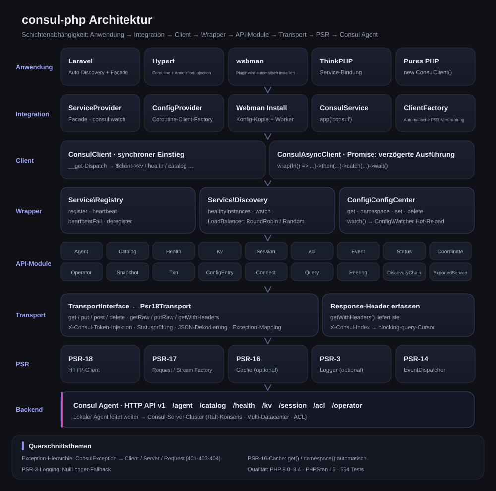
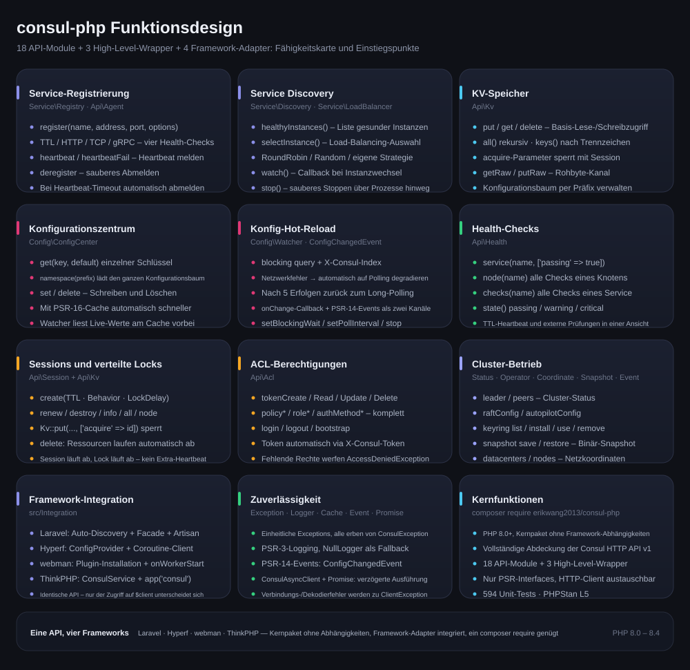
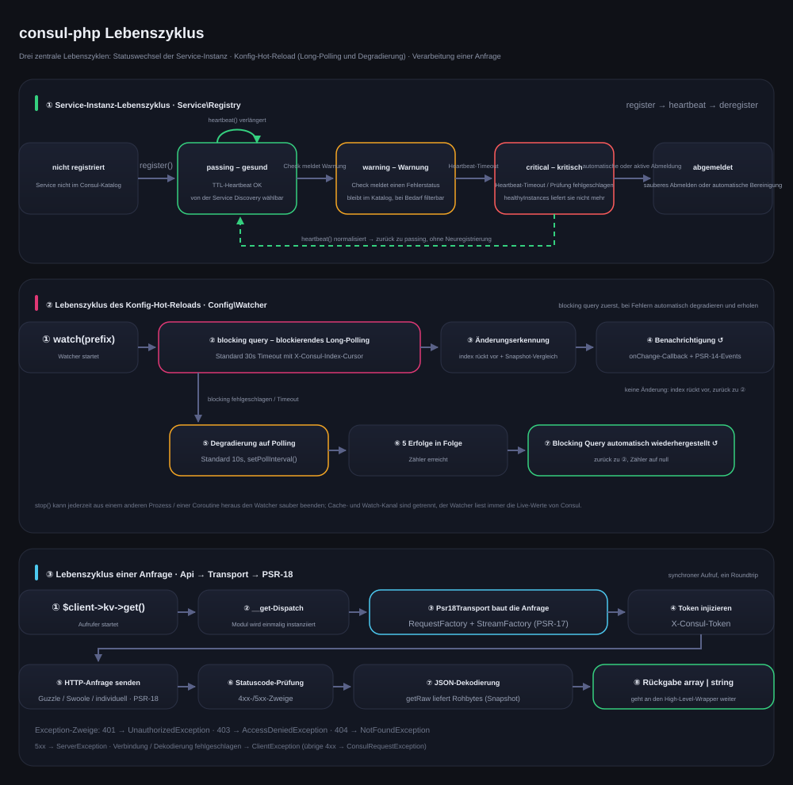

# erikwang2013/consul-php

[中文](../../../README.md) · [English](../en/README.md) · [日本語](../ja/README.md) · [한국어](../ko/README.md) · **Deutsch** · [Français](../fr/README.md) · [Español](../es/README.md) · [Português](../pt/README.md) · [Русский](../ru/README.md) · [العربية](../ar/README.md) · [हिन्दी](../hi/README.md) · [বাংলা](../bn/README.md) · [Bahasa Indonesia](../id/README.md)



PHP-Consul-Client mit vollständiger Abdeckung der Consul HTTP API v1, mit Schwerpunkt auf Service-Registrierung/-Discovery und Konfigurationszentrum. Das Kernpaket hat keine Framework-Abhängigkeiten und bringt Adapter für Laravel / Hyperf / webman / ThinkPHP mit – ein einziges composer require genügt in jedem Framework.

PHP 8.0+ · PSR-18/PSR-3/PSR-14/PSR-16 · keine Framework-Abhängigkeiten

> **Projektmaskottchen Consu** — ein kleiner Registry-Helfer, der nur Heartbeats frisst und nie ausfällt: Die Antenne ist der Health-Check-Heartbeat, die Pulslinie auf der Brust ist der Service-Status, am Gürtel hängt ein ACL-Token. Im Terminal ruft man es mit `composer pet` auf, siehe [Projektmaskottchen Consu](../../../README.md).

---

## Projektüberblick

| | |
|---|---|
| **Was ist das** | Ein in reinem PHP implementierter Client für die Consul HTTP API v1: synchroner Einstieg + Promise, 18 API-Module, 3 High-Level-Wrapper |
| **Wofür** | Damit PHP-Anwendungen Consul für Service-Registrierung/-Discovery und Hot-Reload der Konfiguration nutzen können, ohne pro Framework einen eigenen Client zu schreiben |
| **Wie** | `composer require erikwang2013/consul-php` – Kernpaket ohne Framework-Abhängigkeiten, Framework-Adapter integriert und automatisch erkannt |
| **Unterstützte Frameworks** | Laravel · Hyperf · webman · ThinkPHP — identische API, nur der Zugriff auf `$client` unterscheidet sich |
| **Abhängigkeiten** | Nur PSR-Interfaces (PSR-18/17/16/14/3); HTTP-Client, Cache, Logging und EventDispatcher sind austauschbar |
| **Qualitätssicherung** | PHP 8.0 – 8.4 · 594 Unit-Tests · PHPStan Level 5 · PHP CS Fixer (PSR-12) |

### Kernfunktionen

- **Service-Registrierung und -Discovery** — vier Health-Check-Modi (TTL / HTTP / TCP / gRPC); healthyInstances / selectInstance; RoundRobin, Random und eigene Load-Balancer; Watcher für Instanzwechsel
- **Konfigurationszentrum** — KV lesen und schreiben, Namespace-Baum, Beschleunigung per PSR-16-Cache; für den Hot-Reload zuerst blocking query (Long-Polling), bei Netzwerkfehlern automatische Degradierung auf Polling, nach 5 Erfolgen in Folge automatische Rückkehr
- **Cluster-Betrieb** — verteilte Locks über Sessions, komplettes ACL (Token / Policy / Role / AuthMethod), Status / Operator / Coordinate / Snapshot / Event
- **Zuverlässigkeit** — einheitliche Exception-Hierarchie, PSR-3-Logging (NullLogger als Fallback), PSR-14-Events als zweiter Benachrichtigungskanal, normalisierte Fehler in der Transportschicht

---

## Dokumentation

| Dokument | Link |
|------|------|
| **Projektstruktur** | [Projektstruktur](../../../README.md) |
| **Architektur** | [Architektur](../../../README.md) · [architecture.svg](./images/architecture.svg) |
| **Funktionsdesign** | [Funktionsdesign](../../../README.md) · [features.svg](./images/features.svg) |
| **Lebenszyklus** | [Lebenszyklus](../../../README.md) · [lifecycle.svg](./images/lifecycle.svg) |
| **Projektmaskottchen** | [Consu](./images/pet.svg) |
| **Mehrsprachige README** | [docs/i18n/](../../i18n/) · [中文](../../../README.md) · [English](../en/README.md) · [日本語](../ja/README.md) · [한국어](../ko/README.md) · **Deutsch** · [Français](../fr/README.md) · [Español](../es/README.md) · [Português](../pt/README.md) · [Русский](../ru/README.md) · [العربية](../ar/README.md) · [हिन्दी](../hi/README.md) · [বাংলা](../bn/README.md) · [Bahasa Indonesia](../id/README.md) |
| **Dokumentationsübersicht** | [docs/README.md](../../README.md) |
| **Laravel-Integration** | siehe unten [Laravel](../../../README.md) |
| **Hyperf-Integration** | siehe unten [Hyperf](../../../README.md) |
| **webman-Integration** | siehe unten [webman](../../../README.md) |
| **ThinkPHP-Integration** | siehe unten [ThinkPHP](../../../README.md) |
| **Design-Dokument** | [superpowers/specs/2026-05-14-consul-php-design.md](../../superpowers/specs/2026-05-14-consul-php-design.md) |

---

## Projektstruktur

```
consul-php/
├── src/
│   ├── Client/                      # Einstiegspunkt des Clients
│   │   ├── ConsulClient.php         # Synchroner Einstieg: __get verteilt API-Module und High-Level-Wrapper
│   │   ├── ConsulAsyncClient.php    # Client mit verzögerter Promise-Ausführung
│   │   └── Promise.php              # Leichtgewichtige Promise-Implementierung
│   ├── Api/                         # Module der Consul HTTP API v1 (18 Stück)
│   │   ├── Agent.php                # Mitglieder, eigene Info, Wartungsmodus, join / leave
│   │   ├── Catalog.php              # Service- und Knoten-Katalog: registrieren, abmelden, abfragen
│   │   ├── Health.php               # Health-Checks: Service / Knoten / Filter nach Status
│   │   ├── Kv.php                   # KV lesen/schreiben, hierarchisch auflisten, Rohbytes, Session-Sperre
│   │   ├── Session.php              # Session (Basis verteilter Locks): anlegen, verlängern, zerstören
│   │   ├── Acl.php                  # Token / Policy / Role / AuthMethod
│   │   ├── Event.php                # Benutzerdefinierte Events: fire / list
│   │   ├── Status.php               # Cluster-Status: leader / peers
│   │   ├── Coordinate.php           # Netzkoordinaten: datacenters / nodes
│   │   ├── Operator.php             # Raft / Autopilot / Keyring-Betrieb
│   │   ├── Snapshot.php             # Snapshot sichern und wiederherstellen (Binärstrom)
│   │   ├── Txn.php                  # Transaktionen: atomar über mehrere Schlüssel / Batch-CAS
│   │   ├── ConfigEntry.php          # Konfigurationseinträge: mesh / gateway / service-intentions
│   │   ├── Connect.php              # Autorisierungskette im Service Mesh (intentions)
│   │   ├── Query.php                # Prepared Queries: Failover / Near-Discovery
│   │   ├── Peering.php              # Cluster-Peering
│   │   ├── DiscoveryChain.php       # Mesh-Discovery-Chain: Routing / Split / Failover-Auflösung
│   │   ├── ExportedService.php      # Service-Export & -Import über Partitionen / Peerings
│   ├── Service/                     # Service-Registrierung und -Discovery
│   │   ├── Registry.php             # register / heartbeat / heartbeatFail / deregister
│   │   ├── Discovery.php            # healthyInstances / selectInstance / watch / stop
│   │   └── LoadBalancer/            # RoundRobin, Random, LoadBalancerInterface
│   ├── Config/                      # Konfigurationszentrum
│   │   ├── ConfigCenter.php         # get / namespace / set / delete / watch
│   │   ├── Watcher.php              # Hot-Reload: Long-Polling + Polling-Fallback + automatische Rückkehr
│   │   └── ConfigChangedEvent.php   # PSR-14-Event für Konfigurationsänderungen
│   ├── Transport/                   # Transportschicht
│   │   ├── TransportInterface.php   # Transport-Contract (mit getRaw / putRaw / getWithHeaders)
│   │   └── Psr18Transport.php       # PSR-18-Implementierung: Token-Injektion, Dekodierung, Exception-Mapping
│   ├── Http/                        # Eingebautes PSR-7/17/18 (cURL-Client, Fallback ohne Guzzle)
│   ├── Support/                     # Terminal-Version des Projektmaskottchens Consu (Pet::art / Pet::say)
│   ├── Exception/                   # Exception-Hierarchie (ConsulException und 7 Unterklassen)
│   └── Integration/                 # Framework-Adapter (integriert, automatisch erkannt)
│       ├── ClientFactory.php        # Automatische Verdrahtung der PSR-Abhängigkeiten
│       ├── Laravel/                 # ServiceProvider + Facade + config/consul.php
│       ├── Hyperf/                  # ConfigProvider + Coroutine-Client-Factory + config
│       ├── Webman/                  # Plugin-Installation (Install) + config/app.php
│       ├── Thinkphp/                # ConsulService + config/consul.php
│       └── Native/                  # Natives PHP: Registrieren / Heartbeat / Auto-Abmeldung in einer Zeile
├── tests/                           # PHPUnit-Tests (Api / Client / Config / Exception /
│                                    #   Integration / Service / Support / Transport)
├── docs/
│   ├── images/                      # Projektmaskottchen und Designdiagramme (SVG)
│   │   ├── pet.svg                  # Projektmaskottchen Consu
│   │   ├── architecture.svg         # Architektur
│   │   ├── features.svg             # Funktionsdesign
│   │   └── lifecycle.svg            # Lebenszyklus
│   ├── i18n/                        # en · ja · ko · de · fr · es · pt · ru · ar · hi · bn · id
│   ├── superpowers/specs/           # Design-Dokumente
│   ├── superpowers/plans/           # Umsetzungspläne
│   └── reports/                     # Coverage- und Testberichte
├── scripts/i18n-svg.php             # i18n build / verify
├── scripts/pet.php                  # Einstieg für composer pet: ruft das Maskottchen im Terminal auf
├── composer.json                    # Abhängigkeiten und Framework-Auto-Discovery
├── phpunit.xml.dist                 # Testkonfiguration
└── phpstan.neon                     # Konfiguration der statischen Analyse (Level 5)
```

---

## Framework-Integration auf einen Blick

| | Laravel | Hyperf | webman | ThinkPHP |
|---|---|---|---|---|
| **Erweiterungspaket** | integriert | integriert | integriert | integriert |
| **Einbindung** | Auto-Discovery + `ServiceProvider` | Auto-Discovery + `ConfigProvider` | manuell `new` / Plugin | manuell `bind` am Container |
| **Zugriff** | `Consul` Facade | `#[Inject]`-Annotation | — | `app('consul')`-Helfer |
| **Konfigurationsdatei** | `config/consul.php` | `config/autoload/consul.php` | `config/plugin/erikwang2013/consul-php/app.php` | `config/consul.php` |
| **HTTP-Client** | Guzzle (PSR-18) | Swoole-Coroutine-Client | Guzzle (PSR-18) | Guzzle (PSR-18) |
| **Cache** | Laravel Cache (PSR-16) | Hyperf Cache (PSR-16) | selbst injizieren | selbst injizieren |
| **Hot-Reload-Betrieb** | Artisan-Befehl | `AbstractProcess`-Coroutine | `Worker`-Prozess | Timer / Swoole-Prozess |
| **Event-Listener** | `EventServiceProvider` | Hyperf Event | — | ThinkPHP Listener |
| **Dokumentation** | [Quellcode](../../../src/Integration/Laravel/) | [Quellcode](../../../src/Integration/Hyperf/) | [Quellcode](../../../src/Integration/Webman/) | [Quellcode](../../../src/Integration/Thinkphp/) |

### Dieselbe Operation, andere Schreibweise

**Client beziehen:**

| Framework | Schreibweise |
|------|------|
| Allgemein | `$client = new ConsulClient(['base_uri' => '...']);` |
| Laravel | `$client = app(ConsulClient::class);` oder `Consul::kv->get(...)` |
| Hyperf | `#[Inject] private ConsulClient $consul;` |
| webman | `$client = new ConsulClient(['base_uri' => '...']);` |
| ThinkPHP | `$client = app('consul');` |

**Service-Registrierung:**

```php
// Alle Frameworks nutzen dieselbe API, Unterschied ist nur der Zugriff auf $client
$client->serviceRegistry()->register('my-app', '10.0.0.1', 8080, [
    'id'    => 'my-app-1',
    'tags'  => ['v1'],
    'check' => ['ttl' => '30s'],
]);
```

**Konfiguration lesen:**

```php
// Dieselbe API; Laravel/Hyperf nutzen automatisch den Cache
$dbHost = $client->configCenter()->get('app/db_host', 'default');
```

**Betriebsart des Hot-Reloads:**

| Framework | Startbefehl / Art | Laufzeitumgebung |
|------|----------------|---------|
| Laravel | `php artisan consul:watch` | eigener Artisan-Prozess |
| Hyperf | `ConsulWatchProcess` (startet automatisch) | Swoole-Coroutine |
| webman | fork in `onWorkerStart` | Worker-Prozess |
| ThinkPHP | Timer::setInterval / Swoole Process | eigener Prozess |

---

## Installation

```bash
# Kernpaket
composer require erikwang2013/consul-php

# Optional: ohne Installation wird der eingebaute cURL-Client verwendet
composer require guzzlehttp/guzzle php-http/guzzle7-adapter php-http/discovery
```

### Framework-Integration

Die Framework-Adapter sind bereits im Kernpaket enthalten, eine zusätzliche Installation ist nicht nötig. Nach der Installation des Kernpakets wird das jeweilige Framework automatisch erkannt und der Consul-Service registriert:

- **Laravel** — erkennt `ConsulServiceProvider` automatisch, bietet die `Consul` Facade und Dependency Injection
- **Hyperf** — erkennt `ConfigProvider` automatisch, bietet die Coroutine-Client-Factory und `#[Inject]`
- **webman** — erkennt das Plugin automatisch, kopiert die Konfigurationsdatei bei `composer install`
- **ThinkPHP** — legt `ConsulService` im Verzeichnis `app/service` an und registriert ihn in der Anwendung

---

## Schnellstart (allgemein)

```php
use Erikwang2013\Consul\Client\ConsulClient;

// Grundlegende Verwendung
$client = new ConsulClient(['base_uri' => 'http://127.0.0.1:8500']);

// Mit ACL-Token
$client = new ConsulClient([
    'base_uri' => 'http://127.0.0.1:8500',
    'token'    => 'your-consul-acl-token',
]);
```

Das Token wird automatisch über den Request-Header `X-Consul-Token` an alle Anfragen angehängt.

### Service-Registrierung

Unterstützt werden die vier Health-Check-Modi TTL, HTTP, TCP und gRPC.

```php
$registry = $client->serviceRegistry();

// TTL-Modus — die Anwendung sendet selbst Heartbeats
$registry->register('user-service', '192.168.1.10', 8080, [
    'id'    => 'user-service-1',
    'tags'  => ['v1', 'primary'],
    'meta'  => ['region' => 'cn-east'],
    'check' => [
        'ttl' => '30s',
        'deregister_critical_service_after' => '120s', // automatisches Abmelden nach Heartbeat-Timeout
    ],
]);

// HTTP-Modus — Consul prüft regelmäßig
$registry->register('web', '192.168.1.10', 80, [
    'id'    => 'web-1',
    'check' => [
        'http'     => 'http://192.168.1.10:80/health',
        'interval' => '10s',
        'timeout'  => '3s',
    ],
]);

// TCP-Modus
$registry->register('mysql', '192.168.1.10', 3306, [
    'check' => ['tcp' => '192.168.1.10:3306', 'interval' => '10s'],
]);

// gRPC-Modus
$registry->register('grpc-svc', '192.168.1.10', 50051, [
    'check' => ['grpc' => '192.168.1.10:50051', 'interval' => '10s'],
]);

// Heartbeat (TTL-Modus)
$registry->heartbeat('user-service-1');

// Abmelden
$registry->deregister('user-service-1');
```

### Service-Discovery

Enthalten sind die beiden Load-Balancing-Strategien RoundRobin (Standard) und Random.

```php
$discovery = $client->serviceDiscovery();

// Alle gesunden Instanzen
$instances = $discovery->healthyInstances('user-service');
// [
//   ['address' => '10.0.0.1', 'port' => 8080, 'service' => 'user-service', 'id' => 'user-1', 'tags' => ['v1']],
//   ['address' => '10.0.0.2', 'port' => 8080, 'service' => 'user-service', 'id' => 'user-2', 'tags' => ['v1']],
// ]

// Eine Instanz per Load-Balancing auswählen
$instance = $discovery->selectInstance('user-service');

// Eigene Load-Balancing-Strategie
use Erikwang2013\Consul\Service\LoadBalancer\Random;
$discovery = new Discovery($health, loadBalancer: new Random());

// Instanzwechsel beobachten
$discovery->watch('user-service', function (array $instances) {
    // Callback, wenn Instanzen dazukommen oder wegfallen
});

// Beobachtung beenden: setzt nur das Flag dieser Instanz, muss also im selben Prozess wie watch() laufen (Swoole-Coroutinen teilen den Speicher, das funktioniert)
// Über Prozessgrenzen hinweg ein Signal nutzen (pcntl_signal + posix_kill) oder den Prozessmanager; laufende Anfragen brauchen bis zu eine wait-Periode, bis sie beendet sind
$discovery->stop();
```

### Konfigurationszentrum

```php
$config = $client->configCenter();

// Einzelner Schlüssel
$dbHost = $config->get('app/db_host', 'localhost');

// Kompletter Namespace
$all = $config->namespace('app/');
// ['app/db_host' => 'mysql.local', 'app/redis_host' => 'redis.local', ...]

// Schreiben / Löschen
$config->set('app/cache_ttl', '3600');
$config->delete('app/old_key');

// Hot-Reload
$watcher = $config->watch('app/');
$watcher
    ->setBlockingWait(30)   // Timeout des Long-Pollings (Sekunden)
    ->setPollInterval(10)   // Intervall nach Degradierung auf Polling (Sekunden)
    ->onChange(function (array $updated) {
        // Callback bei Konfigurationsänderungen
    });
$watcher->start(); // blockiert, in einen eigenen Prozess / eine eigene Coroutine legen
// $watcher->stop();  // wirkt nur innerhalb desselben Prozesses (inkl. Coroutinen); über Prozessgrenzen hinweg ein Signal nutzen, siehe unten Lebenszyklus
```

**Funktionsweise des Hot-Reloads:** Bevorzugt wird die Consul blocking query (Long-Polling über `index`); bei Netzwerkfehlern wird automatisch auf regelmäßiges Polling degradiert, sobald die Verbindung wieder steht, wird automatisch auf das Long-Polling zurückgeschaltet. Benachrichtigt wird über zwei Kanäle: Callback und PSR-14 EventDispatcher.

**Cache-Strategie:** Nach Injektion eines PSR-16-Caches lesen und schreiben `get()` und `namespace()` automatisch den Cache. Der Watcher liest immer die Live-Daten aus Consul und geht nicht über den Cache.

### KV-Speicher

```php
$kv = $client->kv;

$kv->put('key', 'value');
$entry = $kv->get('key');              // fehlt der Schlüssel, wird eine NotFoundException geworfen (Consul liefert 404); null gibt es nur bei einer leeren Antwortliste
$all = $kv->all('prefix/');            // rekursiv auflisten
$keys = $kv->keys('prefix/');          // nur Schlüsselnamen
$keys = $kv->keys('prefix/', '/');     // hierarchisch nach Trennzeichen auflisten
$kv->delete('key');
```

### Health-Check-API

```php
$health = $client->health;

$health->service('user-service', ['passing' => true]);  // nur gesunde Instanzen
$health->node('node-1');                                 // alle Checks eines Knotens
$health->checks('user-service');                          // alle Checks eines Service
$health->state('critical');                               // nach Status: passing/warning/critical
```

### Session / verteilte Locks

```php
$session = $client->session;

$sess = $session->create([
    'Name'     => 'lock-session',
    'TTL'      => '30s',
    'Behavior' => 'delete',    // zugehöriges KV beim Ablauf automatisch löschen
]);
$sessionId = $sess['ID'];

// Ressource sperren
$locked = $client->kv->put('lock/resource', '1', ['acquire' => $sessionId]);

// Verlängern / freigeben
$session->renew($sessionId);
$session->destroy($sessionId);
```

### ACL

```php
$acl = $client->acl;

// Token
$token = $acl->tokenCreate(['Description' => 'read-only', 'Policies' => [['Name' => 'read-policy']]]);
$acl->tokenRead($token['AccessorID']);
$acl->tokenDelete($token['AccessorID']);

// Policy
$policy = $acl->policyCreate(['Name' => 'my-policy', 'Rules' => 'node "" { policy = "read" }']);

// Role
$role = $acl->roleCreate(['Name' => 'reader', 'Policies' => [['Name' => 'my-policy']]]);

// Login/Logout
$result = $acl->login(['AuthMethod' => 'my-auth', 'BearerToken' => '...']);
$acl->logout();
```

### Asynchroner Client

```php
use Erikwang2013\Consul\Client\ConsulAsyncClient;

$client = new ConsulAsyncClient(['base_uri' => 'http://127.0.0.1:8500']);

$promise = $client->wrap(fn() => $client->kv->get('key'));

$promise
    ->then(fn($result) => print_r($result))
    ->catch(fn(\Throwable $e) => log_error($e));

$value = $promise->wait(); // blockierend auf das Ergebnis warten
```

**Hinweis:** Der asynchrone Client basiert auf dem Promise-Muster und eignet sich für Szenarien mit nebenläufigen Anfragen. In einer Hyperf-Coroutine-Umgebung erzielt bereits der Standard-HTTP-Client Nebenläufigkeit auf Coroutine-Ebene.

---

## Natives PHP (ohne Framework, ohne zusätzliche Abhängigkeiten)

Ohne Framework und ohne zusätzlich installierte HTTP-Bibliothek greift automatisch der eingebaute cURL-Client – sofort einsatzbereit:

```php
use Erikwang2013\Consul\Client\ConsulClient;
use Erikwang2013\Consul\Integration\Native\NativeService;

$client = new ConsulClient(['base_uri' => 'http://127.0.0.1:8500']);

// Dauerhaft laufendes Skript: eine Zeile für „registrieren → TTL-Heartbeat → beim Beenden automatisch abmelden“
$service = NativeService::start($client->serviceRegistry(), 'my-app', '10.0.0.1', 8080, [
    'check' => ['ttl' => '30s', 'deregister_critical_service_after' => '120s'],
], heartbeatInterval: 10);

$service->serve();                       // sendet blockierend Heartbeats; mit pcntl wird der Service bei Ctrl+C vorher abgemeldet
// Eigene Schleife ist ebenso möglich: $service->heartbeat();  …  $service->stop();
```

Reihenfolge bei der Wahl des HTTP-Clients: **manuelle Injektion** > die von `php-http/discovery` gefundene Implementierung (Guzzle, Swoole-Coroutine-Adapter usw.) > **eingebautes cURL**.
Die eingebaute Implementierung bringt eigene Verbindungs- und Gesamt-Timeouts mit (Standard 3s / 30s) und lässt sich per Injektion ersetzen:

```php
use Erikwang2013\Consul\Http\CurlClient;

$client = new ConsulClient([...], new CurlClient(connectTimeout: 1.0, timeout: 5.0));
```

---

## Integrationsleitfäden der einzelnen Frameworks

### Laravel

Laravel erkennt `ConsulServiceProvider` automatisch, eine manuelle Registrierung ist nicht nötig.

```bash
php artisan vendor:publish --tag=consul-config
```

In der `.env` `CONSUL_BASE_URI` setzen, danach steht der Client über Dependency Injection oder die Facade bereit. Die Laravel-Erweiterung injiziert automatisch den PSR-18-Client, den PSR-16-Cache, das PSR-3-Logging und den PSR-14-EventDispatcher.

```php
// Dependency Injection
use Erikwang2013\Consul\Client\ConsulClient;
public function show(ConsulClient $consul) { ... }

// Facade
use Consul;
$services = Consul::catalog->services();

// Hot-Reload der Konfiguration — Artisan-Befehl
// php artisan consul:watch
```

### Hyperf

Hyperf erkennt `ConfigProvider` automatisch, eine manuelle Registrierung ist nicht nötig.

```bash
php bin/hyperf.php vendor:publish consul
```

Die Hyperf-Erweiterung registriert `ConsulClient` automatisch im DI-Container; HTTP-Anfragen nutzen standardmäßig den Swoole-Coroutine-Client. Die Service-Registrierung gehört in einen Listener für das Ereignis `MainServerStart`, der Hot-Reload läuft über einen `AbstractProcess` in einer Coroutine.

```php
// Annotation-Injection
#[Inject]
private ConsulClient $consul;

// Service-Registrierung — Ereignis MainServerStart
$consul->serviceRegistry()->register(...);

// Hot-Reload — ConsulWatchProcess startet automatisch
```

### webman

webman erkennt das Plugin automatisch und kopiert die Konfigurationsdatei bei `composer install` nach `config/plugin/erikwang2013/consul-php/`. Da webman auf einer dauerhaft im Speicher laufenden Architektur basiert, gehört die Service-Registrierung in den `onWorkerStart`-Callback; global ist sie nur einmal nötig.

```php
// process/ConsulRegister.php
class ConsulRegister {
    public function onWorkerStart(Worker $worker): void {
        $consul = new ConsulClient(['base_uri' => getenv('CONSUL_BASE_URI')]);
        $consul->serviceRegistry()->register('webman-app', ...);
    }
}
```

### ThinkPHP

ThinkPHP hat keinen Auto-Discovery-Mechanismus, der Service muss manuell registriert werden. Die Konfigurationsdatei nach `config/consul.php` kopieren und anschließend im Verzeichnis `app/service` den `ConsulService` registrieren:

```php
// app/service/ConsulService.php
namespace app\service;

use Erikwang2013\Consul\Integration\Thinkphp\ConsulService as BaseConsulService;

class ConsulService extends BaseConsulService
{
}
```

Alternativ direkt in `app/AppService.php` binden:

```php
$this->app->bind('consul', fn() => new ConsulClient(config('consul')));

// Verwendung
$services = app('consul')->catalog->services();

// Helferfunktion — app/common.php
function consul() { return app('consul'); }
```

---

## Eigener HTTP-Client

```php
$client = new ConsulClient(
    config:          ['base_uri' => 'http://consul:8500', 'token' => 'acl-token'],
    httpClient:      $myPsr18Client,        // Pflicht oder automatische Erkennung
    requestFactory:  $myRequestFactory,      // wie oben
    streamFactory:   $myStreamFactory,       // wie oben
    logger:          $myLogger,              // PSR-3, optional
    cache:           $myCache,               // PSR-16, optional
    eventDispatcher: $myEventDispatcher,     // PSR-14, optional
);
```

Von `config` unterstützte Schlüssel:

| Schlüssel | Standard | Beschreibung |
|---|---|---|
| `base_uri` | `http://127.0.0.1:8500` | ergänzt ein fehlendes Schema automatisch um `http://` (Angaben wie `127.0.0.1:8500` aus einer Umgebungsvariable funktionieren direkt) |
| `token` | — | ACL-Token, wird als `X-Consul-Token` injiziert |
| `cache.enable` / `cache.ttl` | `false` / keiner | wirkt zusammen mit dem injizierten PSR-16-Cache auf `Discovery::healthyInstances()` und `ConfigCenter::get()` (`cache.enable` wird nur von den Framework-Adaptern gelesen; bei manueller Konstruktion genügt das Injizieren eines Caches) |
| `timeout.connect` / `timeout.total` | `3.0` / `0` (unbegrenzt) | gilt nur für den eingebauten cURL-Client. **`total` nicht kleiner als `blockingWait` setzen**, sonst läuft das Long-Polling zwangsläufig in einen Timeout und wird degradiert |
| `retry.times` / `retry.delay_ms` | `0` / `50` | Anzahl der Wiederholungen und erster Backoff bei Transportfehlern (exponentiell wachsend); gilt nur für idempotente Methoden (GET/PUT/DELETE) |

---

## API-Modul-Übersicht

| Eigenschaft | Klasse | Wichtigste Methoden |
|------|-----|---------|
| `$client->kv` | `Api\Kv` | `get` `put` `delete` `all` `keys` (`put`/`delete` unterstützen `cas` `flags` `acquire` `release`) |
| `$client->agent` | `Api\Agent` | `members` `self` `registerService` `deregisterService` `checks` `services` `service` `healthServiceByName` `healthServiceById` `checkRegister` `checkUpdate` `checkDeregister` `checkPass/Fail/Warn` `maintenance` `join` `forceLeave` `leave` `reload` `host` `version` `metrics` `connectAuthorize` `connectCaRoots` `connectCaLeaf` `updateToken` |
| `$client->catalog` | `Api\Catalog` | `register` `deregister` `nodes` `services` `service` `node` `nodeServices` `connect` `datacenters` `gatewayServices` |
| `$client->health` | `Api\Health` | `service` `node` `checks` `state` `connect` `ingress` (unterstützt mehrfache `node_meta`, `stale`/`consistent`/`max_stale`) |
| `$client->session` | `Api\Session` | `create` `destroy` `renew` `info` `all` `node` |
| `$client->acl` | `Api\Acl` | `token*` `policy*` `role*` `authMethod*` `bindingRule*` `login` `logout` `bootstrap` `replication` |
| `$client->event` | `Api\Event` | `fire` `list` (unterstützt blockierende Abfragen über `index`/`wait`) |
| `$client->status` | `Api\Status` | `leader` `peers` |
| `$client->coordinate` | `Api\Coordinate` | `datacenters` `nodes` `node` `update` |
| `$client->operator` | `Api\Operator` | `raftConfig` `raftPeer` `raftTransferLeader` `autopilotConfig` `autopilotHealth` `autopilotState` `features` `feature` `keyring` (Konstanten: `KEYRING_LIST` `KEYRING_INSTALL` `KEYRING_USE` `KEYRING_REMOVE`) |
| `$client->snapshot` | `Api\Snapshot` | `save` (liefert die rohen Snapshot-Bytes über `getRaw()`) `restore` (sendet rohe Bytes über `putRaw()`) |
| `$client->txn` | `Api\Txn` | `apply` + `set` `cas` `lock` `unlock` `get` `getTree` `delete` `deleteTree` `deleteCas` `checkIndex` `checkSession` `checkNotExists` `raw` (atomare Transaktion über mehrere Schlüssel) |
| `$client->configEntry` | `Api\ConfigEntry` | `set` `get` `list` `delete` (`service-defaults` / `proxy-defaults` / `mesh` / Gateway / `service-intentions` / `exported-services`) |
| `$client->connect` | `Api\Connect` | `intentions` `intentionCreate` `intentionRead` `intentionUpdate` `intentionDelete` `intentionMatch` `intentionCheck` (Autorisierungskette im Service Mesh) |
| `$client->query` | `Api\Query` | `list` `create` `read` `update` `delete` `execute` `explain` (Prepared Queries: Failover / Near-Discovery) |
| `$client->peering` | `Api\Peering` | `generateToken` `establish` `list` `read` `delete` (Cluster-Peering) |
| `$client->discoveryChain` | `Api\DiscoveryChain` | `read` (Mesh Discovery Chain: aufgelöste Routen / Splits / Failover, unterstützt `compile-dc` und blockierende Abfragen) |
| `$client->exportedService` | `Api\ExportedService` | `exported` `imported` (über Partitionen / Peering hinweg exportierte und importierte Services) |

**Die zwei nicht unterstützten Endpunkte**: `/v1/agent/metrics/stream` und `/v1/agent/monitor` sind Streaming-Schnittstellen über dauerhafte Verbindungen (die erste schiebt Metriken, die zweite Echtzeit-Logs). Die Transportschicht dieser Bibliothek folgt dem Request-Response-Modell; ein Anschluss würde nur dauerhaft blockierende Aufrufe liefern, deshalb werden sie **bewusst nicht angeboten** – wer Streaming braucht, spricht den Agent direkt an. `Agent::metrics(['format' => 'prometheus'])` liefert `['format' => 'prometheus', 'body' => <Roh-Text>]`, weil das Prometheus-Format kein JSON ist.

High-Level-Wrapper:

| Methode | Rückgabe | Beschreibung |
|------|------|------|
| `$client->serviceRegistry()` | `Service\Registry` | Service registrieren / Heartbeat / abmelden |
| `$client->serviceDiscovery()` | `Service\Discovery` | Instanzliste / Load-Balancing / Änderungs-Watcher |
| `$client->configCenter()` | `Config\ConfigCenter` | Konfiguration lesen und schreiben / Cache / Hot-Reload |

---

## Exception-Hierarchie

Alle Exceptions erben von `ConsulException` (erbt von `RuntimeException`):

```
ConsulException
├── ClientException           Fehler im HTTP-Transport (Verbindung, DNS, Timeout usw.)
├── ServerException           Consul antwortet mit 5xx
└── ConsulRequestException    Consul antwortet mit 4xx
    ├── NotFoundException     404
    └── AccessDeniedException 403
```

```php
try {
    $client->kv->get('key');
} catch (ClientException $e) {
    // Netzwerkproblem
} catch (NotFoundException $e) {
    // Ressource existiert nicht
} catch (ConsulException $e) {
    // sonstiger Consul-Fehler
}
```

---

## Architektur



Die Abhängigkeiten laufen von oben nach unten, jede Schicht kennt nur die Abstraktion der darunterliegenden:

- **Anwendungsschicht / Integrationsschicht** — 4 Framework-Adapter sind im Kernpaket unter `src/Integration/` enthalten und werden von composer automatisch erkannt und registriert; die Anwendungsschicht sieht immer nur einen Einstiegspunkt: `ConsulClient`.
- **Client** — `ConsulClient` stellt über `__get` einheitlich 18 API-Module bereit (`$client->kv`, `$client->health` …) sowie 3 High-Level-Wrapper (`serviceRegistry()` / `serviceDiscovery()` / `configCenter()`); `ConsulAsyncClient` bietet die verzögerte Promise-Ausführung.
- **High-Level-Wrapper** — `Registry` / `Discovery` / `ConfigCenter` kombinieren die API-Module; `Watcher` nutzt den von `getWithHeaders()` gelieferten `X-Consul-Index` für das Long-Polling.
- **API-Module** — ein Modul entspricht einer Gruppe von Consul-v1-Endpunkten, alle laufen über dieselbe `TransportInterface`.
- **Transportschicht** — `Psr18Transport` ist für Token-Injektion, Prüfung des Statuscodes, JSON-Dekodierung und Exception-Mapping zuständig und der einzige Netzwerkausgang des gesamten Pakets.
- **PSR-Abstraktion** — es werden nur PSR-Interfaces (18/17/16/14/3) verwendet; HTTP-Client, Cache, Logging und EventDispatcher sind austauschbar und werden bei fehlender Injektion automatisch ersetzt.

---

## Funktionsdesign



Die Fähigkeitskarte: Service-Registrierung/-Discovery, Konfigurationszentrum und Hot-Reload, KV / Health-Checks / Session-Locks / ACL / Cluster-Betrieb, 4 Framework-Adapter und das Zuverlässigkeitsdesign. Jede Fähigkeitskarte nennt die zugehörige Einstiegsklasse; die konkrete Verwendung steht oben im [Schnellstart](../../../README.md) und in der [API-Modul-Übersicht](../../../README.md).

---

## Lebenszyklus



- **Lebenszyklus einer Service-Instanz** — `register()` → passing (regelmäßige Verlängerung durch `heartbeat()`) → warning → critical → automatisches oder aktives Abmelden; erholt sich der Heartbeat, geht es von critical zurück auf passing, ohne Neuregistrierung.
- **Lebenszyklus des Konfig-Hot-Reloads** — `watch()` startet die blocking query (standardmäßig 30s, mit `X-Consul-Index`) → Änderungserkennung → `onChange`-Callback + `ConfigChangedEvent`; schlägt das Blockieren fehl, wird automatisch auf regelmäßiges Polling degradiert (standardmäßig 10s), **nach 5 Erfolgen in Folge** wird wieder auf Long-Polling umgeschaltet (schlägt eine Polling-Runde fehl, wird der Zähler auf null gesetzt).
  Beide Setter haben eine Untergrenze von 1 Sekunde (`setBlockingWait` / `setPollInterval`, ungültige Werte werfen eine `InvalidArgumentException`) – ein Intervall von 0 wäre ein geschäftiges Warten ohne Backoff, ein nicht positives `wait` lässt Consul auf die standardmäßige Haltezeit von 5 Minuten zurückfallen.
  `stop()` setzt das Flag **dieser Instanz**: im selben Prozess (inkl. Swoole-Coroutinen) wirksam, über Prozessgrenzen hinweg braucht es ein Signal (`pcntl_signal` + `posix_kill`) oder den Prozessmanager; laufende Anfragen beenden sich erst nach höchstens einer wait-Periode.
- **Lebenszyklus einer einzelnen Anfrage** — API-Modul → `Psr18Transport` baut die PSR-17-Anfrage zusammen → `X-Consul-Token` injizieren → über PSR-18 senden → Statuscode prüfen → JSON dekodieren (`getRaw()` liefert direkt die Rohbytes) → Array zurückgeben; 401/403/404/5xx und Transportfehler werden jeweils auf die passende Exception abgebildet.

---

## Projektmaskottchen Consu

Das Maskottchen ist nicht nur eine Illustration, man kann es auch im Terminal und im Code aufrufen:

```bash
composer pet
```

```text
╭───────────────────────────────────────────────────────────────────────────╮
│ consul-php · PHP-Consul-Client —— ein composer require, vier Frameworks   │
╰──────┬────────────────────────────────────────────────────────────────────╯
       │
       ●
       │
   ╭───┴───╮
   │ ◕   ◕ │
   │  ╰─╯  │
   ├───────┤
   │╱╲╱╲╱╲ │
   ╰┬─────┬╯
    ╰─┬─┬─╯
```

Im Code direkt `Erikwang2013\Consul\Support\Pet` verwenden:

```php
use Erikwang2013\Consul\Support\Pet;

echo Pet::art();                      // nur das Maskottchen
echo Pet::say('consul config ready');  // Sprechblase über dem Kopf + Maskottchen
echo Pet::art(false);                 // erzwingt reinen Text
```

Die Farben richten sich automatisch nach den Fähigkeiten des Terminals: ohne TTY oder mit gesetztem `NO_COLOR` wird reiner Text ausgegeben, der weder Logs noch die CI-Ausgabe verunreinigt.

Das Design entspricht [pet.svg](./images/pet.svg): Antenne = Health-Check-Heartbeat (passing grün), Schutzbrille = Service-Discovery, Pulslinie auf der Brust = Service-Status (Consul-Magenta), Gürtelschild = ACL-Token.

---

## Mindestanforderungen

- PHP 8.0+
- Composer
- PSR-18 HTTP Client-Implementierung — ohne Injektion und ohne installierte Implementierung wird automatisch der eingebaute cURL-Client verwendet (erfordert die curl-Erweiterung)
- [optional] PSR-16-Cache — `Discovery::healthyInstances()` / `ConfigCenter::get()` cachen automatisch
- [optional] PSR-3 Logger — Request-Logging
- [optional] PSR-14 EventDispatcher — `ConfigChangedEvent`

## Open Source ist nicht leicht, Unterstützung willkommen

| WeChat | Alipay |
|:---:|:---:|
|  |  |

---

## License

MIT

---

Diese Übersetzung wurde von KI erstellt. Bei Ungenauigkeiten freuen wir uns über Issues oder Pull Requests.
