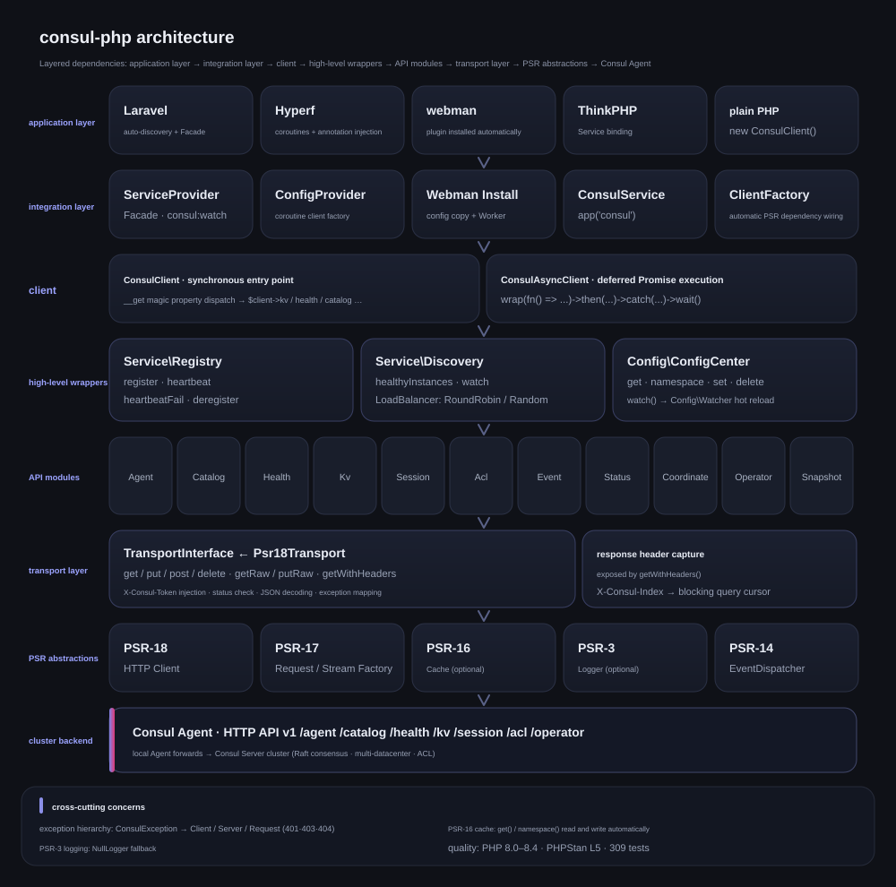
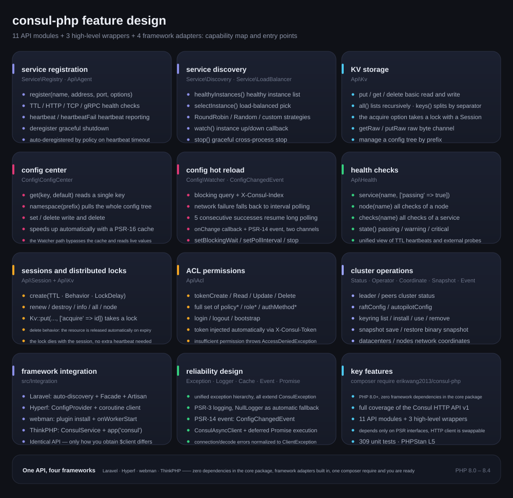
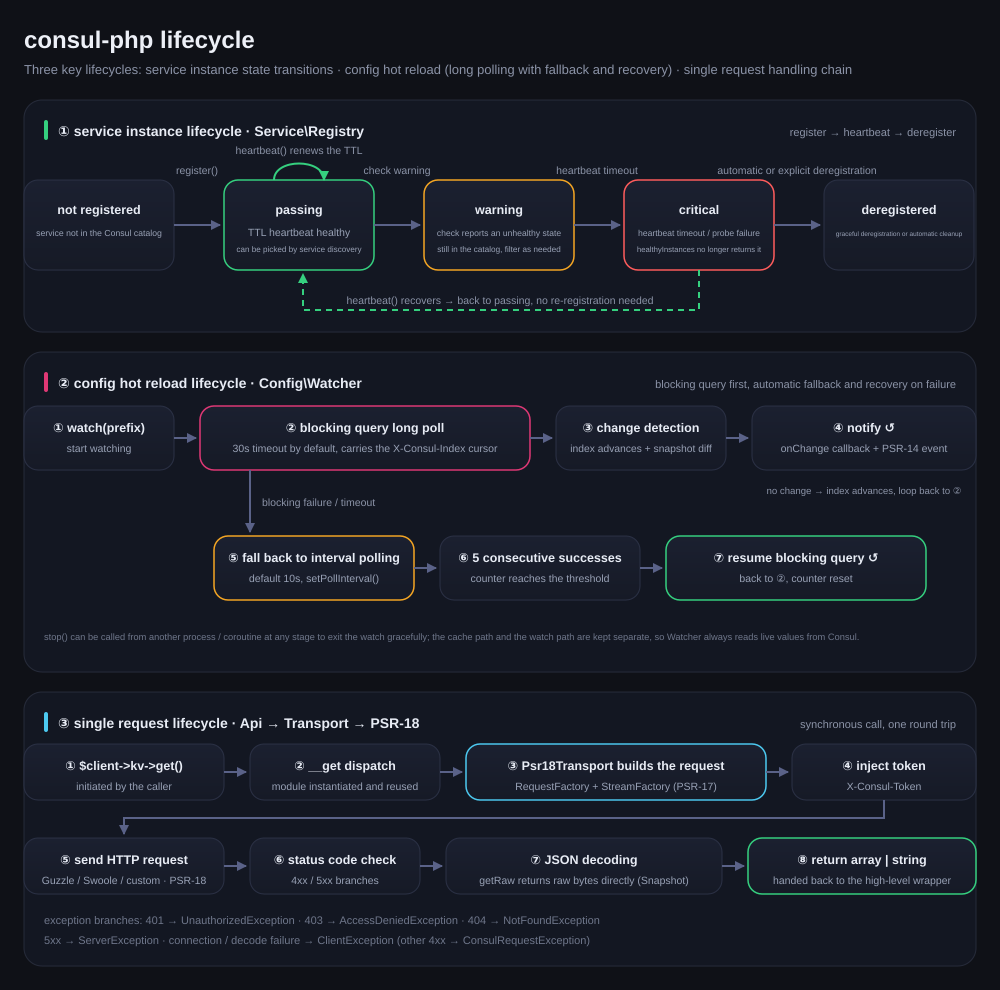

# erikwang2013/consul-php

[中文](../../../README.md) · **English** · [日本語](../ja/README.md) · [한국어](../ko/README.md) · [Deutsch](../de/README.md) · [Français](../fr/README.md) · [Español](../es/README.md) · [Português](../pt/README.md) · [Русский](../ru/README.md) · [العربية](../ar/README.md) · [हिन्दी](../hi/README.md) · [বাংলা](../bn/README.md) · [Bahasa Indonesia](../id/README.md)



A PHP Consul client with full coverage of the Consul HTTP API v1, focused on service registration/discovery and the config center. The core package has zero framework dependencies and ships with built-in Laravel / Hyperf / webman / ThinkPHP adapters, so a single `composer require` works in any framework.

PHP 8.0+ · PSR-18/PSR-3/PSR-14/PSR-16 · zero framework dependencies

> **Project pet Consu** — a registry sidekick that only eats heartbeats and never goes offline: the antenna is the health check heartbeat, the pulse line on its chest is the service status, and the badge on its belt is the ACL Token. Summon it in the terminal with `composer pet`; see Project Pet Consu below.

---

## Overview

| | |
|---|---|
| **What it is** | A pure PHP client for the Consul HTTP API v1: synchronous + Promise entry points, 18 API modules, 3 high-level wrappers |
| **What it solves** | Lets PHP applications use Consul for service registration/discovery and hot config reload, without rewriting a client for every framework |
| **How to use** | `composer require erikwang2013/consul-php` — zero framework dependencies in the core package, framework adapters built in and auto-discovered |
| **Supported frameworks** | Laravel · Hyperf · webman · ThinkPHP —— identical API, only the way you obtain `$client` differs |
| **Dependencies** | Only PSR interfaces (PSR-18/17/16/14/3); the HTTP client, cache, logger and event dispatcher are all replaceable |
| **Quality** | PHP 8.0 – 8.4 · 594 unit tests · PHPStan level 5 · PHP CS Fixer (PSR-12) |

### Key features

- **Service registration and discovery** — TTL / HTTP / TCP / gRPC health checks; healthyInstances / selectInstance; RoundRobin, Random and custom load balancers; instance up/down watching
- **Config center** — KV read/write, namespace trees, PSR-16 cache acceleration; hot reload prefers blocking query long polling, falls back to interval polling on network errors, and recovers automatically after 5 consecutive successes
- **Cluster operations** — Session distributed locks, the full ACL set (Token / Policy / Role / AuthMethod), Status / Operator / Coordinate / Snapshot / Event
- **Reliability** — unified exception hierarchy, PSR-3 logging (NullLogger fallback), PSR-14 dual-channel event notification, transport-layer error normalization

---

## Documentation index

| Document | Link |
|------|------|
| **Project structure** | see below |
| **Architecture design** | see below · [architecture.svg](./images/architecture.svg) |
| **Feature design** | see below · [features.svg](./images/features.svg) |
| **Lifecycle** | see below · [lifecycle.svg](./images/lifecycle.svg) |
| **Project pet** | [Consu](./images/pet.svg) |
| **Multilingual README** | [docs/i18n/](../../i18n/) · [中文](../../../README.md) · **English** · [日本語](../ja/README.md) · [한국어](../ko/README.md) · [Deutsch](../de/README.md) · [Français](../fr/README.md) · [Español](../es/README.md) · [Português](../pt/README.md) · [Русский](../ru/README.md) · [العربية](../ar/README.md) · [हिन्दी](../hi/README.md) · [বাংলা](../bn/README.md) · [Bahasa Indonesia](../id/README.md) |
| **Docs index** | [docs/README.md](../../README.md) |
| **Laravel integration** | see Laravel below |
| **Hyperf integration** | see Hyperf below |
| **webman integration** | see webman below |
| **ThinkPHP integration** | see ThinkPHP below |
| **Design document** | [design document](../../superpowers/specs/2026-05-14-consul-php-design.md) |

---

## Project structure

```
consul-php/
├── src/
│   ├── Client/                      # Client entry points
│   │   ├── ConsulClient.php         # Synchronous entry: __get dispatches API modules and high-level wrappers
│   │   ├── ConsulAsyncClient.php    # Promise-based deferred client
│   │   └── Promise.php              # Lightweight Promise implementation
│   ├── Api/                         # Consul HTTP API v1 modules (18)
│   │   ├── Agent.php                # members, self, maintenance mode, join / leave
│   │   ├── Catalog.php              # Service and node catalog: register, deregister, query
│   │   ├── Health.php               # Health checks: service / node / filter by state
│   │   ├── Kv.php                   # KV read/write, recursive listing, raw bytes, session locking
│   │   ├── Session.php              # Sessions (the basis of distributed locks): create, renew, destroy
│   │   ├── Acl.php                  # Token / Policy / Role / AuthMethod
│   │   ├── Event.php                # User events: fire / list
│   │   ├── Status.php               # Cluster status: leader / peers
│   │   ├── Coordinate.php           # Network coordinates: datacenters / nodes
│   │   ├── Operator.php             # Raft / Autopilot / Keyring operations
│   │   ├── Snapshot.php             # Snapshot backup and restore (binary stream)
│   │   ├── Txn.php                  # Transactions: atomic multi-key / batch CAS
│   │   ├── ConfigEntry.php          # Config entries: mesh / gateway / service-intentions
│   │   ├── Connect.php              # Service mesh authorization chain (intentions)
│   │   ├── Query.php                # Prepared queries: failover / nearest discovery
│   │   ├── Peering.php              # Cluster peering
│   │   ├── DiscoveryChain.php       # mesh discovery chain: routing / splitting / failover resolution
│   │   └── ExportedService.php      # service export and import across partitions / peerings
│   ├── Service/                     # Service registration and discovery
│   │   ├── Registry.php             # register / heartbeat / heartbeatFail / deregister
│   │   ├── Discovery.php            # healthyInstances / selectInstance / watch / stop
│   │   └── LoadBalancer/            # RoundRobin, Random, LoadBalancerInterface
│   ├── Config/                      # Config center
│   │   ├── ConfigCenter.php         # get / namespace / set / delete / watch
│   │   ├── Watcher.php              # Hot reload: long polling + fallback polling + automatic recovery
│   │   └── ConfigChangedEvent.php   # PSR-14 config change event
│   ├── Transport/                   # Transport layer
│   │   ├── TransportInterface.php   # Transport contract (includes getRaw / putRaw / getWithHeaders)
│   │   └── Psr18Transport.php       # PSR-18 implementation: token injection, decoding, exception mapping
│   ├── Http/                        # Built-in PSR-7/17/18 (cURL client, fallback when Guzzle is absent)
│   ├── Support/                     # Terminal version of the project pet Consu (Pet::art / Pet::say)
│   ├── Exception/                   # Exception hierarchy (ConsulException and its subclasses, 7 in total)
│   └── Integration/                 # Framework adapters (built in, auto-discovered)
│       ├── ClientFactory.php        # Automatic PSR dependency wiring
│       ├── Laravel/                 # ServiceProvider + Facade + config/consul.php
│       ├── Hyperf/                  # ConfigProvider + coroutine client factory + config
│       ├── Webman/                  # Plugin installation (Install) + config/app.php
│       ├── Thinkphp/                # ConsulService + config/consul.php
│       └── Native/                  # Native PHP: register / heartbeat / auto-deregister in one call
├── tests/                           # PHPUnit cases (Api / Client / Config / Exception /
│                                    #   Integration / Service / Support / Transport)
├── docs/
│   ├── images/                      # Project pet and design diagrams (SVG)
│   │   ├── pet.svg                  # Project pet Consu
│   │   ├── architecture.svg         # Architecture design
│   │   ├── features.svg             # Feature design
│   │   └── lifecycle.svg            # Lifecycle
│   ├── i18n/                        # en · ja · ko · de · fr · es · pt · ru · ar · hi · bn · id
│   ├── superpowers/specs/           # Design documents
│   ├── superpowers/plans/           # Implementation plans
│   └── reports/                     # Coverage and test reports
├── scripts/i18n-svg.php             # i18n resource generator (extract / build / verify)
├── scripts/pet.php                  # composer pet entry: summon the project pet in the terminal
├── composer.json                    # Dependencies and framework auto-discovery declarations
├── phpunit.xml.dist                 # Test configuration
└── phpstan.neon                     # Static analysis configuration (level 5)
```

---

## Framework integration at a glance

| | Laravel | Hyperf | webman | ThinkPHP |
|---|---|---|---|---|
| **Package** | built in | built in | built in | built in |
| **Injection** | auto-discovery + `ServiceProvider` | auto-discovery + `ConfigProvider` | manual `new` / plugin | manual `bind` into the container |
| **Convenience** | `Consul` Facade | `#[Inject]` annotation | — | `app('consul')` helper |
| **Config location** | `config/consul.php` | `config/autoload/consul.php` | `config/plugin/erikwang2013/consul-php/app.php` | `config/consul.php` |
| **HTTP client** | Guzzle (PSR-18) | Swoole coroutine client | Guzzle (PSR-18) | Guzzle (PSR-18) |
| **Cache** | Laravel Cache (PSR-16) | Hyperf Cache (PSR-16) | inject your own | inject your own |
| **Hot reload runtime** | Artisan command | `AbstractProcess` coroutine | `Worker` process | Timer / Swoole process |
| **Event listening** | `EventServiceProvider` | Hyperf Event | — | ThinkPHP Listener |
| **Docs** | [source](../../../src/Integration/Laravel/) | [source](../../../src/Integration/Hyperf/) | [source](../../../src/Integration/Webman/) | [source](../../../src/Integration/Thinkphp/) |

### The same operation, written differently

**Obtaining a client:**

| Framework | Syntax |
|------|------|
| Generic | `$client = new ConsulClient(['base_uri' => '...']);` |
| Laravel | `$client = app(ConsulClient::class);` or `Consul::kv->get(...)` |
| Hyperf | `#[Inject] private ConsulClient $consul;` |
| webman | `$client = new ConsulClient(['base_uri' => '...']);` |
| ThinkPHP | `$client = app('consul');` |

**Service registration:**

```php
// All frameworks use the same API; only the way you obtain $client differs
$client->serviceRegistry()->register('my-app', '10.0.0.1', 8080, [
    'id'    => 'my-app-1',
    'tags'  => ['v1'],
    'check' => ['ttl' => '30s'],
]);
```

**Reading configuration:**

```php
// The same API; Laravel/Hyperf go through the cache automatically
$dbHost = $client->configCenter()->get('app/db_host', 'default');
```

**Running hot reload:**

| Framework | Start command / method | Runtime |
|------|----------------|---------|
| Laravel | `php artisan consul:watch` | standalone Artisan process |
| Hyperf | `ConsulWatchProcess` (starts automatically) | Swoole coroutine |
| webman | fork inside `onWorkerStart` | Worker process |
| ThinkPHP | Timer::setInterval / Swoole Process | standalone process |

---

## Installation

```bash
# core package
composer require erikwang2013/consul-php

# PSR-18 implementation (optional: the built-in cURL client is used if you skip this)
composer require guzzlehttp/guzzle php-http/guzzle7-adapter php-http/discovery
```

### Framework integration

The framework adapters are already built into the core package, so nothing extra needs to be installed. Once the core package is installed, the matching framework discovers and registers the Consul service automatically:

- **Laravel** — auto-discovers `ConsulServiceProvider`, providing the `Consul` Facade and dependency injection
- **Hyperf** — auto-discovers `ConfigProvider`, providing the coroutine client factory and `#[Inject]` injection
- **webman** — auto-discovers the plugin and copies the config file during `composer install`
- **ThinkPHP** — create `ConsulService` under `app/service` and register it with the application

---

## Getting started (generic)

```php
use Erikwang2013\Consul\Client\ConsulClient;

// basic usage
$client = new ConsulClient(['base_uri' => 'http://127.0.0.1:8500']);

// with an ACL Token
$client = new ConsulClient([
    'base_uri' => 'http://127.0.0.1:8500',
    'token'    => 'your-consul-acl-token',
]);
```

The token is attached to every request automatically through the `X-Consul-Token` header.

### Service registration

TTL, HTTP, TCP and gRPC health check modes are supported.

```php
$registry = $client->serviceRegistry();

// TTL mode — the application sends the heartbeats itself
$registry->register('user-service', '192.168.1.10', 8080, [
    'id'    => 'user-service-1',
    'tags'  => ['v1', 'primary'],
    'meta'  => ['region' => 'cn-east'],
    'check' => [
        'ttl' => '30s',
        'deregister_critical_service_after' => '120s', // auto-deregister after a missed heartbeat
    ],
]);

// HTTP mode — Consul probes the service periodically
$registry->register('web', '192.168.1.10', 80, [
    'id'    => 'web-1',
    'check' => [
        'http'     => 'http://192.168.1.10:80/health',
        'interval' => '10s',
        'timeout'  => '3s',
    ],
]);

// TCP mode
$registry->register('mysql', '192.168.1.10', 3306, [
    'check' => ['tcp' => '192.168.1.10:3306', 'interval' => '10s'],
]);

// gRPC mode
$registry->register('grpc-svc', '192.168.1.10', 50051, [
    'check' => ['grpc' => '192.168.1.10:50051', 'interval' => '10s'],
]);

// heartbeat (TTL mode)
$registry->heartbeat('user-service-1');

// take the service offline
$registry->deregister('user-service-1');
```

### Service discovery

RoundRobin (the default) and Random load balancing strategies are built in.

```php
$discovery = $client->serviceDiscovery();

// all healthy instances
$instances = $discovery->healthyInstances('user-service');
// [
//   ['address' => '10.0.0.1', 'port' => 8080, 'service' => 'user-service', 'id' => 'user-1', 'tags' => ['v1']],
//   ['address' => '10.0.0.2', 'port' => 8080, 'service' => 'user-service', 'id' => 'user-2', 'tags' => ['v1']],
// ]

// pick one with load balancing
$instance = $discovery->selectInstance('user-service');

// custom load balancing strategy
use Erikwang2013\Consul\Service\LoadBalancer\Random;
$discovery = new Discovery($health, loadBalancer: new Random());

// watch for service instance changes
$discovery->watch('user-service', function (array $instances) {
    // called when an instance comes up or goes down
});

// stopping the watch: only flips this instance's flag, so it has to run in the same process as watch() (Swoole coroutines share memory, so that works)
// across processes use a signal (pcntl_signal + posix_kill) or a process manager; in-flight requests take up to one wait period to exit
$discovery->stop();
```

### Config center

```php
$config = $client->configCenter();

// a single key
$dbHost = $config->get('app/db_host', 'localhost');

// a whole namespace
$all = $config->namespace('app/');
// ['app/db_host' => 'mysql.local', 'app/redis_host' => 'redis.local', ...]

// write / delete
$config->set('app/cache_ttl', '3600');
$config->delete('app/old_key');

// hot reload
$watcher = $config->watch('app/');
$watcher
    ->setBlockingWait(30)   // long polling timeout (seconds)
    ->setPollInterval(10)   // interval when falling back to polling (seconds)
    ->onChange(function (array $updated) {
        // config change callback
    });
$watcher->start(); // blocks; put it in a dedicated process/coroutine
// $watcher->stop();  // only takes effect when called inside the same process (coroutines included); across processes use a signal, see Lifecycle below
```

**How hot reload works:** Consul blocking query (`index` long polling) is preferred; on network errors it automatically falls back to interval polling, and switches back to long polling once the connection recovers. Notifications are delivered over two channels: the callback and the PSR-14 EventDispatcher.

**Caching:** once a PSR-16 cache is injected, `get()` and `namespace()` read and write it automatically. Watcher always reads live data from Consul and never goes through the cache.

### KV storage

```php
$kv = $client->kv;

$kv->put('key', 'value');
$entry = $kv->get('key');              // throws NotFoundException when the key does not exist (Consul returns 404); null only occurs when the response is an empty array
$all = $kv->all('prefix/');            // list recursively
$keys = $kv->keys('prefix/');          // key names only
$keys = $kv->keys('prefix/', '/');     // list by separator level
$kv->delete('key');
```

### Health check API

```php
$health = $client->health;

$health->service('user-service', ['passing' => true]);  // healthy instances only
$health->node('node-1');                                 // all checks of a node
$health->checks('user-service');                          // all checks of a service
$health->state('critical');                               // by state: passing/warning/critical
```

### Session / distributed locks

```php
$session = $client->session;

$sess = $session->create([
    'Name'     => 'lock-session',
    'TTL'      => '30s',
    'Behavior' => 'delete',    // delete the associated KV entry on expiry
]);
$sessionId = $sess['ID'];

// lock a resource
$locked = $client->kv->put('lock/resource', '1', ['acquire' => $sessionId]);

// renew / release
$session->renew($sessionId);
$session->destroy($sessionId);
```

### ACL

```php
$acl = $client->acl;

// Token
$token = $acl->tokenCreate(['Description' => 'read-only', 'Policies' => [['Name' => 'read-policy']]]);
$acl->tokenRead($token['AccessorID']);
$acl->tokenDelete($token['AccessorID']);

// Policy
$policy = $acl->policyCreate(['Name' => 'my-policy', 'Rules' => 'node "" { policy = "read" }']);

// Role
$role = $acl->roleCreate(['Name' => 'reader', 'Policies' => [['Name' => 'my-policy']]]);

// Login/Logout
$result = $acl->login(['AuthMethod' => 'my-auth', 'BearerToken' => '...']);
$acl->logout();
```

### Async client

```php
use Erikwang2013\Consul\Client\ConsulAsyncClient;

$client = new ConsulAsyncClient(['base_uri' => 'http://127.0.0.1:8500']);

$promise = $client->wrap(fn() => $client->kv->get('key'));

$promise
    ->then(fn($result) => print_r($result))
    ->catch(fn(\Throwable $e) => log_error($e));

$value = $promise->wait(); // block until the result is available
```

**Note:** the async client is based on the Promise pattern and suits scenarios that need concurrent requests. In a Hyperf coroutine environment the default HTTP client already gives you coroutine-level concurrency.

---

## Native PHP (no framework, zero extra dependencies)

With no framework and no wish to install an extra HTTP library, the built-in cURL client falls back automatically and works out of the box:

```php
use Erikwang2013\Consul\Client\ConsulClient;
use Erikwang2013\Consul\Integration\Native\NativeService;

$client = new ConsulClient(['base_uri' => 'http://127.0.0.1:8500']);

// long-running script: one line for "register → TTL heartbeat → auto-deregister on exit"
$service = NativeService::start($client->serviceRegistry(), 'my-app', '10.0.0.1', 8080, [
    'check' => ['ttl' => '30s', 'deregister_critical_service_after' => '120s'],
], heartbeatInterval: 10);

$service->serve();                       // blocks while sending heartbeats; with pcntl installed, Ctrl+C deregisters first
// or drive the loop yourself: $service->heartbeat();  …  $service->stop();
```

HTTP client resolution order: **manually injected** > implementation found by `php-http/discovery` (Guzzle, Swoole coroutine adapter, etc.) > **built-in cURL**.
The built-in implementation owns its own connect and total timeouts (3s / 30s by default) and can be injected to replace it:

```php
use Erikwang2013\Consul\Http\CurlClient;

$client = new ConsulClient([...], new CurlClient(connectTimeout: 1.0, timeout: 5.0));
```

---

## Framework integration guides

### Laravel

Laravel auto-discovers `ConsulServiceProvider`; no manual registration is needed.

```bash
php artisan vendor:publish --tag=consul-config
```

Set `CONSUL_BASE_URI` in `.env`, then use it through dependency injection or the Facade. The Laravel extension injects the PSR-18 client, PSR-16 cache, PSR-3 logger and PSR-14 event dispatcher automatically.

```php
// dependency injection
use Erikwang2013\Consul\Client\ConsulClient;
public function show(ConsulClient $consul) { ... }

// Facade
use Consul;
$services = Consul::catalog->services();

// config hot reload — Artisan command
// php artisan consul:watch
```

### Hyperf

Hyperf auto-discovers `ConfigProvider`; no manual registration is needed.

```bash
php bin/hyperf.php vendor:publish consul
```

The Hyperf extension registers `ConsulClient` in the DI container, and HTTP requests use the Swoole coroutine client by default. Registering services is best done in the `MainServerStart` event listener, and hot reload runs inside a coroutine via `AbstractProcess`.

```php
// annotation injection
#[Inject]
private ConsulClient $consul;

// service registration — MainServerStart event
$consul->serviceRegistry()->register(...);

// hot reload — ConsulWatchProcess starts automatically
```

### webman

webman auto-discovers the plugin and copies the config file into `config/plugin/erikwang2013/consul-php/` during `composer install`. Because webman keeps everything in memory, service registration goes in the `onWorkerStart` callback and only needs to happen once globally.

```php
// process/ConsulRegister.php
class ConsulRegister {
    public function onWorkerStart(Worker $worker): void {
        $consul = new ConsulClient(['base_uri' => getenv('CONSUL_BASE_URI')]);
        $consul->serviceRegistry()->register('webman-app', ...);
    }
}
```

### ThinkPHP

ThinkPHP has no auto-discovery mechanism, so the Service has to be registered manually. Copy the config file to `config/consul.php`, then register `ConsulService` under `app/service`:

```php
// app/service/ConsulService.php
namespace app\service;

use Erikwang2013\Consul\Integration\Thinkphp\ConsulService as BaseConsulService;

class ConsulService extends BaseConsulService
{
}
```

Or bind it directly in `app/AppService.php`:

```php
$this->app->bind('consul', fn() => new ConsulClient(config('consul')));

// usage
$services = app('consul')->catalog->services();

// helper function — app/common.php
function consul() { return app('consul'); }
```

---

## Custom HTTP client

```php
$client = new ConsulClient(
    config:          ['base_uri' => 'http://consul:8500', 'token' => 'acl-token'],
    httpClient:      $myPsr18Client,        // required, or auto-discovered
    requestFactory:  $myRequestFactory,      // same as above
    streamFactory:   $myStreamFactory,       // same as above
    logger:          $myLogger,              // PSR-3, optional
    cache:           $myCache,               // PSR-16, optional
    eventDispatcher: $myEventDispatcher,     // PSR-14, optional
);
```

Keys supported by `config`:

| Key | Default | Description |
|---|---|---|
| `base_uri` | `http://127.0.0.1:8500` | `http://` is prepended automatically when the scheme is missing (so a value copied out of an environment variable, such as `127.0.0.1:8500`, works as is) |
| `token` | — | ACL Token, injected as `X-Consul-Token` |
| `cache.enable` / `cache.ttl` | `false` / none | Works together with the injected PSR-16 cache and applies to `Discovery::healthyInstances()` and `ConfigCenter::get()` (`cache.enable` is only read by the framework adapters; with manual construction, injecting a cache is enough) |
| `timeout.connect` / `timeout.total` | `3.0` / `0` (unlimited) | Only used by the built-in cURL client. **Do not set `total` lower than `blockingWait`**, otherwise long polling is guaranteed to time out and fall back to polling |
| `retry.times` / `retry.delay_ms` | `0` / `50` | Number of retries on transport failure and the first backoff (growing exponentially); only applies to idempotent methods (GET/PUT/DELETE) |

---

## API modules at a glance

| Property | Class | Main methods |
|------|-----|---------|
| `$client->kv` | `Api\Kv` | `get` `put` `delete` `all` `keys` (`put`/`delete` support `cas` `flags` `acquire` `release`) |
| `$client->agent` | `Api\Agent` | `members` `self` `registerService` `deregisterService` `checks` `services` `service` `healthServiceByName` `healthServiceById` `checkRegister` `checkUpdate` `checkDeregister` `checkPass/Fail/Warn` `maintenance` `join` `forceLeave` `leave` `reload` `host` `version` `metrics` `connectAuthorize` `connectCaRoots` `connectCaLeaf` `updateToken` |
| `$client->catalog` | `Api\Catalog` | `register` `deregister` `nodes` `services` `service` `node` `nodeServices` `connect` `datacenters` `gatewayServices` |
| `$client->health` | `Api\Health` | `service` `node` `checks` `state` `connect` `ingress` (supports multi-value `node_meta`, `stale`/`consistent`/`max_stale`) |
| `$client->session` | `Api\Session` | `create` `destroy` `renew` `info` `all` `node` |
| `$client->acl` | `Api\Acl` | `token*` `policy*` `role*` `authMethod*` `bindingRule*` `login` `logout` `bootstrap` `replication` |
| `$client->event` | `Api\Event` | `fire` `list` (supports `index`/`wait` blocking queries) |
| `$client->status` | `Api\Status` | `leader` `peers` |
| `$client->coordinate` | `Api\Coordinate` | `datacenters` `nodes` `node` `update` |
| `$client->operator` | `Api\Operator` | `raftConfig` `raftPeer` `raftTransferLeader` `autopilotConfig` `autopilotHealth` `autopilotState` `features` `feature` `keyring` (constants: `KEYRING_LIST` `KEYRING_INSTALL` `KEYRING_USE` `KEYRING_REMOVE`) |
| `$client->snapshot` | `Api\Snapshot` | `save` (returns the raw snapshot bytes via `getRaw()`) `restore` (sends raw bytes via `putRaw()`) |
| `$client->txn` | `Api\Txn` | `apply` + `set` `cas` `lock` `unlock` `get` `getTree` `delete` `deleteTree` `deleteCas` `checkIndex` `checkSession` `checkNotExists` `raw` (atomic multi-key transactions) |
| `$client->configEntry` | `Api\ConfigEntry` | `set` `get` `list` `delete` (`service-defaults` / `proxy-defaults` / `mesh` / gateway / `service-intentions` / `exported-services`) |
| `$client->connect` | `Api\Connect` | `intentions` `intentionCreate` `intentionRead` `intentionUpdate` `intentionDelete` `intentionMatch` `intentionCheck` (service mesh authorization chain) |
| `$client->query` | `Api\Query` | `list` `create` `read` `update` `delete` `execute` `explain` (prepared queries: failover / nearest discovery) |
| `$client->peering` | `Api\Peering` | `generateToken` `establish` `list` `read` `delete` (cluster peering) |
| `$client->discoveryChain` | `Api\DiscoveryChain` | `read` (mesh discovery chain: the resolved result of routing / splitting / failover, supports `compile-dc` and blocking queries) |
| `$client->exportedService` | `Api\ExportedService` | `exported` `imported` (services exported to and imported from other partitions / peerings) |

**Two endpoints are not supported**: `/v1/agent/metrics/stream` and `/v1/agent/monitor` are long-lived streaming interfaces (the former pushes metrics, the latter real-time logs). This library's transport layer is a request-response model, so wiring them up could only produce a call that blocks forever; they are therefore **deliberately not provided** — if you need streaming, talk to the Agent directly. `Agent::metrics(['format' => 'prometheus'])` returns `['format' => 'prometheus', 'body' => <raw text>]`, because the Prometheus format is not JSON.

High-level wrappers:

| Method | Returns | Description |
|------|------|------|
| `$client->serviceRegistry()` | `Service\Registry` | service registration / heartbeat / deregistration |
| `$client->serviceDiscovery()` | `Service\Discovery` | instance list / load balancing / change watching |
| `$client->configCenter()` | `Config\ConfigCenter` | config read/write / caching / hot reload |

---

## Exception hierarchy

All exceptions extend `ConsulException` (which extends `RuntimeException`):

```
ConsulException
├── ClientException           HTTP transport errors (connection failure, DNS, timeout, ...)
├── ServerException           Consul returned 5xx
└── ConsulRequestException    Consul returned 4xx
    ├── NotFoundException     404
    └── AccessDeniedException 403
```

```php
try {
    $client->kv->get('key');
} catch (ClientException $e) {
    // network problem
} catch (NotFoundException $e) {
    // resource does not exist
} catch (ConsulException $e) {
    // any other Consul error
}
```

---

## Architecture design



Dependencies point downwards, and each layer only depends on the abstractions of the layer below:

- **Application layer / integration layer** — 4 framework adapters are built into the core package under `src/Integration/` and registered through composer auto-discovery; the application layer always faces the single `ConsulClient` entry point.
- **Client** — `ConsulClient` exposes 18 API modules (`$client->kv`, `$client->health`, …) and 3 high-level wrappers (`serviceRegistry()` / `serviceDiscovery()` / `configCenter()`) uniformly through `__get`; `ConsulAsyncClient` provides deferred Promise execution.
- **High-level wrappers** — `Registry` / `Discovery` / `ConfigCenter` compose the API modules; `Watcher` implements long polling using the `X-Consul-Index` returned by `getWithHeaders()`.
- **API modules** — one module maps to a group of Consul v1 endpoints, and all of them go in and out through the same `TransportInterface`.
- **Transport layer** — `Psr18Transport` handles token injection, status code checks, JSON decoding and exception mapping, and is the only place in the package that touches the network.
- **PSR abstractions** — only PSR interfaces (18/17/16/14/3) are required; the HTTP client, cache, logger and event dispatcher are all replaceable and degrade automatically when not injected.

---

## Feature design



Capability map: service registration and discovery, config center and hot reload, KV / health checks / session locks / ACL / cluster operations, plus 4 framework adapters and reliability design. Each capability card names its entry class; for concrete usage see Getting started (generic) and API modules at a glance above.

---

## Lifecycle



- **Service instance lifecycle** — `register()` → passing (`heartbeat()` renews on a schedule) → warning → critical → automatic or explicit deregistration; a recovered heartbeat moves the instance from critical back to passing without re-registering.
- **Config hot reload lifecycle** — `watch()` starts a blocking query (30s by default, carrying `X-Consul-Index`) → change detection → `onChange` callback + `ConfigChangedEvent`; when blocking fails it automatically falls back to interval polling (10s by default) and switches back to long polling **after 5 consecutive successes** (any single failed poll resets the counter to zero).
  Both setters have a 1-second lower bound (`setBlockingWait` / `setPollInterval`; an invalid value throws `InvalidArgumentException`) — an interval of 0 would busy-wait with no backoff, and a non-positive `wait` makes Consul fall back to its default 5-minute hold.
  `stop()` flips **this instance's** flag: it works within the same process (Swoole coroutines included), and across processes you need a signal (`pcntl_signal` + `posix_kill`) or a process manager; in-flight requests take up to one wait period to exit.
- **Single request lifecycle** — API module → `Psr18Transport` builds a PSR-17 request → injects `X-Consul-Token` → sends it over PSR-18 → checks the status code → decodes JSON (`getRaw()` returns raw bytes directly) → returns an array; 401/403/404/5xx and transport failures are mapped to their matching exceptions.

---

## Project pet Consu

The pet is more than an illustration — you can summon it from the terminal and from your code:

```bash
composer pet
```

```text
╭───────────────────────────────────────────────────────────────────────────╮
│ consul-php · PHP Consul client — one composer require, four frameworks    │
╰──────┬────────────────────────────────────────────────────────────────────╯
       │
       ●
       │
   ╭───┴───╮
   │ ◕   ◕ │
   │  ╰─╯  │
   ├───────┤
   │╱╲╱╲╱╲ │
   ╰┬─────┬╯
    ╰─┬─┬─╯
```

Call `Erikwang2013\Consul\Support\Pet` directly in your code:

```php
use Erikwang2013\Consul\Support\Pet;

echo Pet::art();                      // the pet alone
echo Pet::say('consul config is ready'); // speech bubble above the pet
echo Pet::art(false);                 // force plain text
```

Colours are decided from the terminal's capabilities: on a non-TTY or when `NO_COLOR` is set the output is plain text, so logs and CI output stay clean.

The design matches [pet.svg](./images/pet.svg): the antenna is the health check heartbeat (green when passing), the goggles are service discovery, the pulse line on its chest is the service status (Consul magenta), and the badge on its belt is the ACL Token.

---

## Requirements

- PHP 8.0+
- Composer
- PSR-18 HTTP Client implementation — falls back to the built-in cURL client when nothing is injected or installed (requires the curl extension)
- [optional] PSR-16 cache — `Discovery::healthyInstances()` / `ConfigCenter::get()` are cached automatically
- [optional] PSR-3 Logger — request logging
- [optional] PSR-14 EventDispatcher — `ConfigChangedEvent` events

## Open source is hard — your support is welcome

| WeChat | Alipay |
|:---:|:---:|
|  |  |

---

## License

MIT

---

This translation was generated by AI. If anything is inaccurate, Issues and PRs are welcome.
