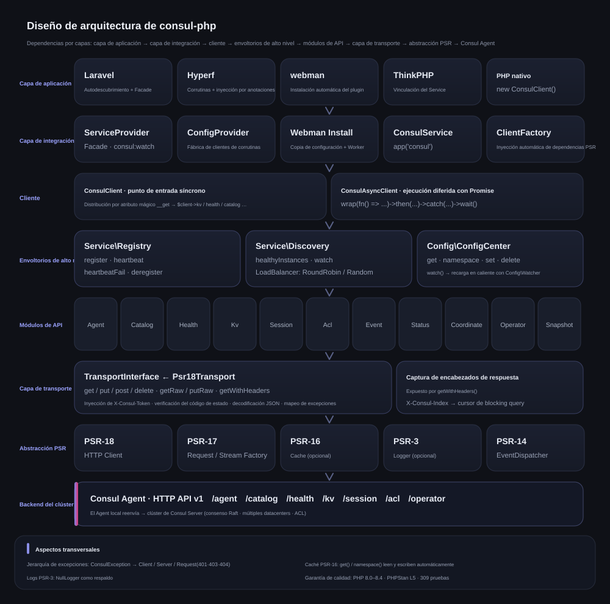
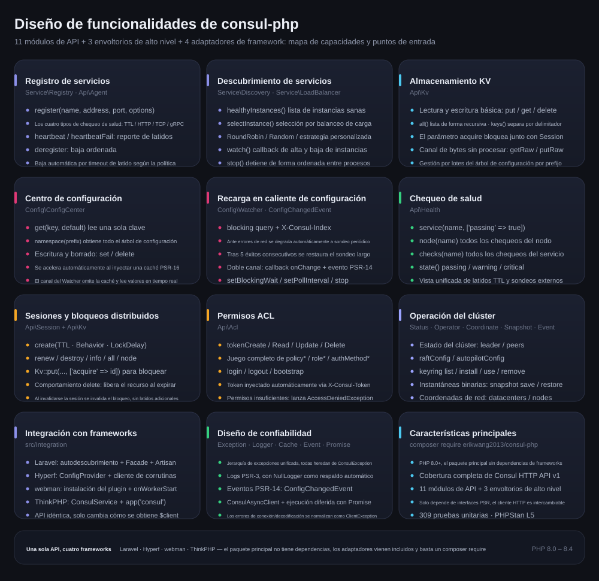
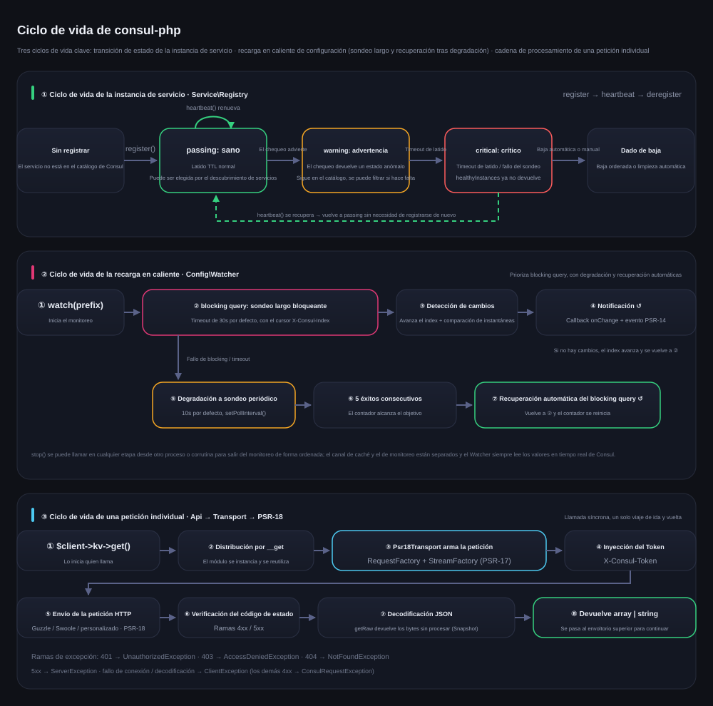

# erikwang2013/consul-php

[中文](../../../README.md) · [English](../en/README.md) · [日本語](../ja/README.md) · [한국어](../ko/README.md) · [Deutsch](../de/README.md) · [Français](../fr/README.md) · **Español** · [Português](../pt/README.md) · [Русский](../ru/README.md) · [العربية](../ar/README.md) · [हिन्दी](../hi/README.md) · [বাংলা](../bn/README.md) · [Bahasa Indonesia](../id/README.md)



Cliente de Consul para PHP que cubre por completo la Consul HTTP API v1, con especial foco en el registro y descubrimiento de servicios y en el centro de configuración. El paquete principal no tiene dependencias de frameworks e incluye adaptadores para Laravel / Hyperf / webman / ThinkPHP, así que un solo composer require basta para usarlo en cualquier framework.

PHP 8.0+ · PSR-18/PSR-3/PSR-14/PSR-16 · Sin dependencias de frameworks

> **Consu, la mascota del proyecto** — un pequeño asistente de registro que solo se alimenta de latidos y nunca se cae: la antena es el latido del chequeo de salud, la línea de pulso del pecho es el estado del servicio y en la cintura lleva un ACL Token. Puede invocarla en la terminal con `composer pet`; consulte [Mascota del proyecto](../../../README.md).

---

## Descripción del proyecto

| | |
|---|---|
| **Qué es** | Cliente de Consul HTTP API v1 implementado en PHP puro: doble punto de entrada síncrono + Promise, 18 módulos de API y 3 envoltorios de alto nivel |
| **Qué resuelve** | Permite que una aplicación PHP se integre con Consul para el registro y descubrimiento de servicios y la recarga en caliente de configuración, sin reescribir un cliente para cada framework |
| **Cómo se usa** | `composer require erikwang2013/consul-php`; el paquete principal no tiene dependencias de frameworks y los adaptadores vienen incluidos y se autodescubren |
| **Frameworks compatibles** | Laravel · Hyperf · webman · ThinkPHP — la API es idéntica, solo cambia cómo se obtiene `$client` |
| **Contrato de dependencias** | Solo depende de interfaces PSR (PSR-18/17/16/14/3); el cliente HTTP, la caché, los logs y el despachador de eventos son reemplazables |
| **Garantía de calidad** | PHP 8.0 – 8.4 · 594 pruebas unitarias · PHPStan level 5 · PHP CS Fixer (PSR-12) |

### Capacidades principales

- **Registro y descubrimiento de servicios** — los cuatro tipos de chequeo de salud (TTL / HTTP / TCP / gRPC); healthyInstances / selectInstance; balanceo de carga RoundRobin, Random y personalizado; monitoreo de altas y bajas de instancias
- **Centro de configuración** — lectura y escritura de KV, árbol de espacios de nombres, aceleración con caché PSR-16; la recarga en caliente prioriza el sondeo largo con blocking query, ante errores de red se degrada automáticamente a sondeo periódico y se restaura tras 5 éxitos consecutivos
- **Operación del clúster** — bloqueos distribuidos con Session, juego completo de ACL (Token / Policy / Role / AuthMethod), Status / Operator / Coordinate / Snapshot / Event
- **Confiabilidad** — jerarquía de excepciones unificada, logs PSR-3 (con NullLogger como respaldo), notificación por doble canal con eventos PSR-14 y normalización de errores en la capa de transporte

---

## Índice de documentación

| Documento | Enlace |
|------|------|
| **Estructura del proyecto** | [Estructura del proyecto](../../../README.md) |
| **Diseño de arquitectura** | [Diseño de arquitectura](../../../README.md) · [architecture.svg](./images/architecture.svg) |
| **Diseño de funcionalidades** | [Diseño de funcionalidades](../../../README.md) · [features.svg](./images/features.svg) |
| **Ciclo de vida** | [Ciclo de vida](../../../README.md) · [lifecycle.svg](./images/lifecycle.svg) |
| **Mascota del proyecto** | [Consu](./images/pet.svg) |
| **README multilingüe** | [docs/i18n/](../../i18n/) · [中文](../../../README.md) · [English](../en/README.md) · [日本語](../ja/README.md) · [한국어](../ko/README.md) · [Deutsch](../de/README.md) · [Français](../fr/README.md) · **Español** · [Português](../pt/README.md) · [Русский](../ru/README.md) · [العربية](../ar/README.md) · [हिन्दी](../hi/README.md) · [বাংলা](../bn/README.md) · [Bahasa Indonesia](../id/README.md) |
| **Índice de documentación** | [docs/README.md](../../README.md) |
| **Integración con Laravel** | Ver más abajo [Laravel](../../../README.md) |
| **Integración con Hyperf** | Ver más abajo [Hyperf](../../../README.md) |
| **Integración con webman** | Ver más abajo [webman](../../../README.md) |
| **Integración con ThinkPHP** | Ver más abajo [ThinkPHP](../../../README.md) |
| **Documento de diseño** | [docs/superpowers/specs/2026-05-14-consul-php-design.md](../../superpowers/specs/2026-05-14-consul-php-design.md) |

---

## Estructura del proyecto

```
consul-php/
├── src/
│   ├── Client/                      # Punto de entrada del cliente
│   │   ├── ConsulClient.php         # Entrada síncrona: __get distribuye los módulos de API y los envoltorios de alto nivel
│   │   ├── ConsulAsyncClient.php    # Cliente de ejecución diferida con Promise
│   │   └── Promise.php              # Implementación ligera de Promise
│   ├── Api/                         # Módulos de Consul HTTP API v1 (18)
│   │   ├── Agent.php                # Miembros, información propia, modo mantenimiento, join / leave
│   │   ├── Catalog.php              # Catálogo de servicios y nodos: registro, baja, consulta
│   │   ├── Health.php               # Chequeo de salud: servicio / nodo / filtrado por estado
│   │   ├── Kv.php                   # Lectura y escritura de KV, listado jerárquico, bytes sin procesar, bloqueo por sesión
│   │   ├── Session.php              # Sesión (base de los bloqueos distribuidos): crear, renovar, destruir
│   │   ├── Acl.php                  # Token / Policy / Role / AuthMethod
│   │   ├── Event.php                # Eventos de usuario: fire / list
│   │   ├── Status.php               # Estado del clúster: leader / peers
│   │   ├── Coordinate.php           # Coordenadas de red: datacenters / nodes
│   │   ├── Operator.php             # Operación de Raft / Autopilot / Keyring
│   │   ├── Snapshot.php             # Copia de seguridad y restauración de instantáneas (flujo binario)
│   │   ├── Txn.php                  # Transacciones: multikey atómico / CAS por lotes
│   │   ├── ConfigEntry.php          # Entradas de configuración: mesh / gateway / service-intentions
│   │   ├── Connect.php              # Cadena de autorización de service mesh (intentions)
│   │   ├── Query.php                # Consultas preparadas: failover / descubrimiento por proximidad
│   │   ├── Peering.php              # Peering de clústeres
│   │   ├── DiscoveryChain.php       # Discovery chain de mesh: resolución de enrutado / división / conmutación
│   │   ├── ExportedService.php      # Exportación e importación de servicios entre particiones / peerings
│   ├── Service/                     # Registro y descubrimiento de servicios
│   │   ├── Registry.php             # register / heartbeat / heartbeatFail / deregister
│   │   ├── Discovery.php            # healthyInstances / selectInstance / watch / stop
│   │   └── LoadBalancer/            # RoundRobin, Random, LoadBalancerInterface
│   ├── Config/                      # Centro de configuración
│   │   ├── ConfigCenter.php         # get / namespace / set / delete / watch
│   │   ├── Watcher.php              # Recarga en caliente: sondeo largo + sondeo degradado + recuperación automática
│   │   └── ConfigChangedEvent.php   # Evento PSR-14 de cambio de configuración
│   ├── Transport/                   # Capa de transporte
│   │   ├── TransportInterface.php   # Contrato de transporte (incluye getRaw / putRaw / getWithHeaders)
│   │   └── Psr18Transport.php       # Implementación PSR-18: inyección de Token, decodificación, mapeo de excepciones
│   ├── Http/                        # PSR-7/17/18 integrado (cliente cURL, respaldo sin Guzzle)
│   ├── Support/                     # Versión de terminal de la mascota del proyecto Consu (Pet::art / Pet::say)
│   ├── Exception/                   # Jerarquía de excepciones (ConsulException y sus subclases, 7)
│   └── Integration/                 # Adaptadores de framework (incluidos, autodescubiertos)
│       ├── ClientFactory.php        # Inyección automática de dependencias PSR
│       ├── Laravel/                 # ServiceProvider + Facade + config/consul.php
│       ├── Hyperf/                  # ConfigProvider + fábrica de clientes de corrutinas + config
│       ├── Webman/                  # Instalación del plugin (Install) + config/app.php
│       ├── Thinkphp/                # ConsulService + config/consul.php
│       └── Native/                  # PHP nativo: registro / heartbeat / baja automática en una línea
├── tests/                           # Casos de PHPUnit (Api / Client / Config / Exception /
│                                    #   Integration / Service / Support / Transport)
├── docs/
│   ├── images/                      # Mascota del proyecto y diagramas de diseño (SVG)
│   │   ├── pet.svg                  # Mascota del proyecto Consu
│   │   ├── architecture.svg         # Diseño de arquitectura
│   │   ├── features.svg             # Diseño de funcionalidades
│   │   └── lifecycle.svg            # Ciclo de vida
│   ├── i18n/                        # en · ja · ko · de · fr · es · pt · ru · ar · hi · bn · id
│   ├── superpowers/specs/           # Documentos de diseño
│   ├── superpowers/plans/           # Planes de implementación
│   └── reports/                     # Reportes de cobertura y de pruebas
├── scripts/i18n-svg.php             # i18n build / verify
├── scripts/pet.php                  # Entrada de composer pet: invoca la mascota del proyecto en la terminal
├── composer.json                    # Dependencias y declaración de autodescubrimiento de frameworks
├── phpunit.xml.dist                 # Configuración de pruebas
└── phpstan.neon                     # Configuración de análisis estático (level 5)
```

---

## Resumen de integración con frameworks

| | Laravel | Hyperf | webman | ThinkPHP |
|---|---|---|---|---|
| **Paquete** | Incluido | Incluido | Incluido | Incluido |
| **Forma de inyección** | Autodescubrimiento + `ServiceProvider` | Autodescubrimiento + `ConfigProvider` | `new` manual / plugin | `bind` manual al contenedor |
| **Acceso rápido** | Facade `Consul` | Anotación `#[Inject]` | — | Helper `app('consul')` |
| **Ubicación de la configuración** | `config/consul.php` | `config/autoload/consul.php` | `config/plugin/erikwang2013/consul-php/app.php` | `config/consul.php` |
| **Cliente HTTP** | Guzzle (PSR-18) | Cliente de corrutinas Swoole | Guzzle (PSR-18) | Guzzle (PSR-18) |
| **Caché** | Laravel Cache (PSR-16) | Hyperf Cache (PSR-16) | Inyección propia | Inyección propia |
| **Ejecución de la recarga en caliente** | Comando de Artisan | Corrutina `AbstractProcess` | Proceso `Worker` | Proceso Timer / Swoole |
| **Escucha de eventos** | `EventServiceProvider` | Hyperf Event | — | ThinkPHP Listener |
| **Documentación** | [Código fuente](../../../src/Integration/Laravel/) | [Código fuente](../../../src/Integration/Hyperf/) | [Código fuente](../../../src/Integration/Webman/) | [Código fuente](../../../src/Integration/Thinkphp/) |

### La misma operación, distintas formas

**Obtener el cliente:**

| Framework | Forma |
|------|------|
| Genérico | `$client = new ConsulClient(['base_uri' => '...']);` |
| Laravel | `$client = app(ConsulClient::class);` o `Consul::kv->get(...)` |
| Hyperf | `#[Inject] private ConsulClient $consul;` |
| webman | `$client = new ConsulClient(['base_uri' => '...']);` |
| ThinkPHP | `$client = app('consul');` |

**Registro de servicios:**

```php
// Todos los frameworks usan la misma API; la única diferencia es cómo se obtiene $client
$client->serviceRegistry()->register('my-app', '10.0.0.1', 8080, [
    'id'    => 'my-app-1',
    'tags'  => ['v1'],
    'check' => ['ttl' => '30s'],
]);
```

**Lectura de configuración:**

```php
// La misma API; en Laravel/Hyperf pasa automáticamente por la caché
$dbHost = $client->configCenter()->get('app/db_host', 'default');
```

**Forma de ejecución de la recarga en caliente:**

| Framework | Comando / forma de inicio | Entorno de ejecución |
|------|----------------|---------|
| Laravel | `php artisan consul:watch` | Proceso Artisan independiente |
| Hyperf | `ConsulWatchProcess` (inicio automático) | Corrutina Swoole |
| webman | fork dentro de `onWorkerStart` | Proceso Worker |
| ThinkPHP | Timer::setInterval / Swoole Process | Proceso independiente |

---

## Instalación

```bash
# Paquete principal
composer require erikwang2013/consul-php

# Opcional: si no la instala, se utiliza el cliente cURL integrado
composer require guzzlehttp/guzzle php-http/guzzle7-adapter php-http/discovery
```

### Integración con frameworks

Los adaptadores de framework ya vienen incluidos en el paquete principal, no hace falta instalar nada más. Después de instalar el paquete principal, el framework correspondiente descubre y registra automáticamente el servicio de Consul:

- **Laravel** — descubre automáticamente `ConsulServiceProvider` y ofrece el Facade `Consul` y la inyección de dependencias
- **Hyperf** — descubre automáticamente `ConfigProvider` y ofrece la fábrica de clientes de corrutinas y la inyección con `#[Inject]`
- **webman** — descubre automáticamente el plugin y copia el archivo de configuración durante `composer install`
- **ThinkPHP** — cree `ConsulService` en el directorio `app/service` y regístrelo en la aplicación

---

## Inicio rápido (genérico)

```php
use Erikwang2013\Consul\Client\ConsulClient;

// Uso básico
$client = new ConsulClient(['base_uri' => 'http://127.0.0.1:8500']);

// Con ACL Token
$client = new ConsulClient([
    'base_uri' => 'http://127.0.0.1:8500',
    'token'    => 'your-consul-acl-token',
]);
```

El Token se adjunta automáticamente a todas las peticiones mediante el encabezado `X-Consul-Token`.

### Registro de servicios

Admite cuatro modos de chequeo de salud: TTL, HTTP, TCP y gRPC.

```php
$registry = $client->serviceRegistry();

// Modo TTL — la aplicación envía el latido de forma activa
$registry->register('user-service', '192.168.1.10', 8080, [
    'id'    => 'user-service-1',
    'tags'  => ['v1', 'primary'],
    'meta'  => ['region' => 'cn-east'],
    'check' => [
        'ttl' => '30s',
        'deregister_critical_service_after' => '120s', // Baja automática al agotarse el timeout del latido
    ],
]);

// Modo HTTP — Consul sondea periódicamente
$registry->register('web', '192.168.1.10', 80, [
    'id'    => 'web-1',
    'check' => [
        'http'     => 'http://192.168.1.10:80/health',
        'interval' => '10s',
        'timeout'  => '3s',
    ],
]);

// Modo TCP
$registry->register('mysql', '192.168.1.10', 3306, [
    'check' => ['tcp' => '192.168.1.10:3306', 'interval' => '10s'],
]);

// Modo gRPC
$registry->register('grpc-svc', '192.168.1.10', 50051, [
    'check' => ['grpc' => '192.168.1.10:50051', 'interval' => '10s'],
]);

// Latido (modo TTL)
$registry->heartbeat('user-service-1');

// Baja
$registry->deregister('user-service-1');
```

### Descubrimiento de servicios

Incluye dos estrategias de balanceo de carga: RoundRobin (predeterminada) y Random.

```php
$discovery = $client->serviceDiscovery();

// Todas las instancias sanas
$instances = $discovery->healthyInstances('user-service');
// [
//   ['address' => '10.0.0.1', 'port' => 8080, 'service' => 'user-service', 'id' => 'user-1', 'tags' => ['v1']],
//   ['address' => '10.0.0.2', 'port' => 8080, 'service' => 'user-service', 'id' => 'user-2', 'tags' => ['v1']],
// ]

// Elige una por balanceo de carga
$instance = $discovery->selectInstance('user-service');

// Estrategia de balanceo de carga personalizada
use Erikwang2013\Consul\Service\LoadBalancer\Random;
$discovery = new Discovery($health, loadBalancer: new Random());

// Monitorea los cambios de las instancias del servicio
$discovery->watch('user-service', function (array $instances) {
    // Callback cuando una instancia entra o sale
});

// Detiene el monitoreo: solo cambia el flag de esta instancia, así que debe llamarse en el mismo proceso que watch() (las corrutinas de Swoole comparten memoria, por lo que sí funciona)
// Para otro proceso use señales (pcntl_signal + posix_kill) o un gestor de procesos; las peticiones en curso pueden tardar hasta un ciclo de wait en salir
$discovery->stop();
```

### Centro de configuración

```php
$config = $client->configCenter();

// Una sola clave
$dbHost = $config->get('app/db_host', 'localhost');

// Todo el espacio de nombres
$all = $config->namespace('app/');
// ['app/db_host' => 'mysql.local', 'app/redis_host' => 'redis.local', ...]

// Escritura / borrado
$config->set('app/cache_ttl', '3600');
$config->delete('app/old_key');

// Recarga en caliente
$watcher = $config->watch('app/');
$watcher
    ->setBlockingWait(30)   // Timeout del sondeo largo (segundos)
    ->setPollInterval(10)   // Intervalo al degradar a sondeo periódico (segundos)
    ->onChange(function (array $updated) {
        // Callback de cambio de configuración
    });
$watcher->start(); // Bloqueante; colóquelo en un proceso o corrutina aparte
// $watcher->stop();  // Solo surte efecto si se llama dentro del mismo proceso (incluidas las corrutinas); para otro proceso use señales; consulte «Ciclo de vida» más abajo
```

**Cómo funciona la recarga en caliente:** prioriza el Consul blocking query (sondeo largo con `index`), ante errores de red se degrada automáticamente a sondeo periódico y, cuando se recupera la conexión, vuelve al sondeo largo. Notificación por doble canal: callback + EventDispatcher PSR-14.

**Estrategia de caché:** después de inyectar una caché PSR-16, `get()` y `namespace()` leen y escriben la caché automáticamente. El Watcher siempre lee datos en tiempo real de Consul y no pasa por la caché.

### Almacenamiento KV

```php
$kv = $client->kv;

$kv->put('key', 'value');
$entry = $kv->get('key');              // Si la clave no existe, lanza NotFoundException (Consul devuelve 404); null solo aparece cuando la respuesta es un array vacío
$all = $kv->all('prefix/');            // Listado recursivo
$keys = $kv->keys('prefix/');          // Solo los nombres de las claves
$keys = $kv->keys('prefix/', '/');     // Listado jerárquico por delimitador
$kv->delete('key');
```

### API de chequeo de salud

```php
$health = $client->health;

$health->service('user-service', ['passing' => true]);  // Solo instancias sanas
$health->node('node-1');                                 // Todos los chequeos del nodo
$health->checks('user-service');                          // Todos los chequeos del servicio
$health->state('critical');                               // Por estado: passing/warning/critical
```

### Session / bloqueos distribuidos

```php
$session = $client->session;

$sess = $session->create([
    'Name'     => 'lock-session',
    'TTL'      => '30s',
    'Behavior' => 'delete',    // Al expirar, borra el KV asociado
]);
$sessionId = $sess['ID'];

// Bloquea el recurso
$locked = $client->kv->put('lock/resource', '1', ['acquire' => $sessionId]);

// Renovación / liberación
$session->renew($sessionId);
$session->destroy($sessionId);
```

### ACL

```php
$acl = $client->acl;

// Token
$token = $acl->tokenCreate(['Description' => 'read-only', 'Policies' => [['Name' => 'read-policy']]]);
$acl->tokenRead($token['AccessorID']);
$acl->tokenDelete($token['AccessorID']);

// Policy
$policy = $acl->policyCreate(['Name' => 'my-policy', 'Rules' => 'node "" { policy = "read" }']);

// Role
$role = $acl->roleCreate(['Name' => 'reader', 'Policies' => [['Name' => 'my-policy']]]);

// Login/Logout
$result = $acl->login(['AuthMethod' => 'my-auth', 'BearerToken' => '...']);
$acl->logout();
```

### Cliente asíncrono

```php
use Erikwang2013\Consul\Client\ConsulAsyncClient;

$client = new ConsulAsyncClient(['base_uri' => 'http://127.0.0.1:8500']);

$promise = $client->wrap(fn() => $client->kv->get('key'));

$promise
    ->then(fn($result) => print_r($result))
    ->catch(fn(\Throwable $e) => log_error($e));

$value = $promise->wait(); // Obtiene el resultado de forma bloqueante
```

**Nota:** el cliente asíncrono se basa en el patrón Promise y está pensado para escenarios que requieren peticiones concurrentes. En un entorno de corrutinas de Hyperf, el cliente HTTP predeterminado ya ofrece concurrencia a nivel de corrutina.

---

## PHP nativo (sin framework, sin dependencias adicionales)

Cuando no utiliza un framework y tampoco quiere instalar una biblioteca HTTP adicional, el cliente cURL integrado actúa como respaldo automático y funciona de inmediato:

```php
use Erikwang2013\Consul\Client\ConsulClient;
use Erikwang2013\Consul\Integration\Native\NativeService;

$client = new ConsulClient(['base_uri' => 'http://127.0.0.1:8500']);

// Script residente: en una sola línea, «registro → latido TTL → baja automática al salir»
$service = NativeService::start($client->serviceRegistry(), 'my-app', '10.0.0.1', 8080, [
    'check' => ['ttl' => '30s', 'deregister_critical_service_after' => '120s'],
], heartbeatInterval: 10);

$service->serve();                       // Bloquea enviando latidos; con pcntl instalado, Ctrl+C primero da de baja
// También puede controlar el bucle usted mismo: $service->heartbeat();  …  $service->stop();
```

Orden de selección del cliente HTTP: **inyección manual** > implementación encontrada por `php-http/discovery` (Guzzle, adaptador de corrutinas Swoole, etc.) > **cURL integrado**.
La implementación integrada maneja sus propios tiempos de espera de conexión y totales (3s / 30s por defecto) y se puede reemplazar mediante inyección:

```php
use Erikwang2013\Consul\Http\CurlClient;

$client = new ConsulClient([...], new CurlClient(connectTimeout: 1.0, timeout: 5.0));
```

---

## Guía de integración por framework

### Laravel

Laravel descubre `ConsulServiceProvider` automáticamente, sin registro manual.

```bash
php artisan vendor:publish --tag=consul-config
```

Configure `CONSUL_BASE_URI` en `.env` y luego úselo mediante inyección de dependencias o el Facade. La extensión de Laravel inyecta automáticamente el cliente PSR-18, la caché PSR-16, los logs PSR-3 y el despachador de eventos PSR-14.

```php
// Inyección de dependencias
use Erikwang2013\Consul\Client\ConsulClient;
public function show(ConsulClient $consul) { ... }

// Facade
use Consul;
$services = Consul::catalog->services();

// Recarga en caliente de configuración — comando de Artisan
// php artisan consul:watch
```

### Hyperf

Hyperf descubre `ConfigProvider` automáticamente, sin registro manual.

```bash
php bin/hyperf.php vendor:publish consul
```

La extensión de Hyperf registra automáticamente `ConsulClient` en el contenedor de DI y, de forma predeterminada, las peticiones HTTP usan el cliente de corrutinas Swoole. Se recomienda hacer el registro del servicio dentro del listener del evento `MainServerStart`, y la recarga en caliente se ejecuta en una corrutina con `AbstractProcess`.

```php
// Inyección por anotación
#[Inject]
private ConsulClient $consul;

// Registro del servicio — evento MainServerStart
$consul->serviceRegistry()->register(...);

// Recarga en caliente — ConsulWatchProcess se inicia automáticamente
```

### webman

webman descubre el plugin automáticamente y, durante `composer install`, copia el archivo de configuración en `config/plugin/erikwang2013/consul-php/`. Como webman es una arquitectura residente en memoria, el registro del servicio se hace dentro del callback `onWorkerStart` y solo hace falta una vez de forma global.

```php
// process/ConsulRegister.php
class ConsulRegister {
    public function onWorkerStart(Worker $worker): void {
        $consul = new ConsulClient(['base_uri' => getenv('CONSUL_BASE_URI')]);
        $consul->serviceRegistry()->register('webman-app', ...);
    }
}
```

### ThinkPHP

ThinkPHP no tiene mecanismo de autodescubrimiento, así que hay que registrar el Service manualmente. Copie el archivo de configuración en `config/consul.php` y luego registre `ConsulService` en el directorio `app/service`:

```php
// app/service/ConsulService.php
namespace app\service;

use Erikwang2013\Consul\Integration\Thinkphp\ConsulService as BaseConsulService;

class ConsulService extends BaseConsulService
{
}
```

O bien enlace directamente en `app/AppService.php`:

```php
$this->app->bind('consul', fn() => new ConsulClient(config('consul')));

// Uso
$services = app('consul')->catalog->services();

// Función helper — app/common.php
function consul() { return app('consul'); }
```

---

## Cliente HTTP personalizado

```php
$client = new ConsulClient(
    config:          ['base_uri' => 'http://consul:8500', 'token' => 'acl-token'],
    httpClient:      $myPsr18Client,        // Obligatorio o autodescubierto
    requestFactory:  $myRequestFactory,      // Igual que arriba
    streamFactory:   $myStreamFactory,       // Igual que arriba
    logger:          $myLogger,              // PSR-3, opcional
    cache:           $myCache,               // PSR-16, opcional
    eventDispatcher: $myEventDispatcher,     // PSR-14, opcional
);
```

Claves admitidas en `config`:

| Clave | Valor predeterminado | Descripción |
|---|---|---|
| `base_uri` | `http://127.0.0.1:8500` | Si falta el esquema, se añade `http://` automáticamente (una forma como `127.0.0.1:8500` copiada de una variable de entorno funciona tal cual)|
| `token` | — | ACL Token; se inyecta como `X-Consul-Token` |
| `cache.enable` / `cache.ttl` | `false` / ninguno | Junto con la caché PSR-16 inyectada, actúa sobre `Discovery::healthyInstances()` y `ConfigCenter::get()` (`cache.enable` solo lo leen los adaptadores de framework; en construcción manual basta con inyectar una caché) |
| `timeout.connect` / `timeout.total` | `3.0` / `0` (sin límite)| Solo los usa el cliente cURL integrado. **No configure `total` por debajo de `blockingWait`**, o el sondeo largo se dará siempre por agotado y se degradará |
| `retry.times` / `retry.delay_ms` | `0` / `50` | Número de reintentos y backoff inicial ante fallos de transporte (con crecimiento exponencial); solo se aplica a métodos idempotentes (GET/PUT/DELETE) |

---

## Referencia rápida de los módulos de API

| Propiedad | Clase | Métodos principales |
|------|-----|---------|
| `$client->kv` | `Api\Kv` | `get` `put` `delete` `all` `keys` (`put`/`delete` admiten `cas` `flags` `acquire` `release`) |
| `$client->agent` | `Api\Agent` | `members` `self` `registerService` `deregisterService` `checks` `services` `service` `healthServiceByName` `healthServiceById` `checkRegister` `checkUpdate` `checkDeregister` `checkPass/Fail/Warn` `maintenance` `join` `forceLeave` `leave` `reload` `host` `version` `metrics` `connectAuthorize` `connectCaRoots` `connectCaLeaf` `updateToken` |
| `$client->catalog` | `Api\Catalog` | `register` `deregister` `nodes` `services` `service` `node` `nodeServices` `connect` `datacenters` `gatewayServices` |
| `$client->health` | `Api\Health` | `service` `node` `checks` `state` `connect` `ingress` (admite `node_meta` con varios valores y `stale`/`consistent`/`max_stale`) |
| `$client->session` | `Api\Session` | `create` `destroy` `renew` `info` `all` `node` |
| `$client->acl` | `Api\Acl` | `token*` `policy*` `role*` `authMethod*` `bindingRule*` `login` `logout` `bootstrap` `replication` |
| `$client->event` | `Api\Event` | `fire` `list` (admite consultas bloqueantes con `index`/`wait`) |
| `$client->status` | `Api\Status` | `leader` `peers` |
| `$client->coordinate` | `Api\Coordinate` | `datacenters` `nodes` `node` `update` |
| `$client->operator` | `Api\Operator` | `raftConfig` `raftPeer` `raftTransferLeader` `autopilotConfig` `autopilotHealth` `autopilotState` `features` `feature` `keyring` (constantes: `KEYRING_LIST` `KEYRING_INSTALL` `KEYRING_USE` `KEYRING_REMOVE`) |
| `$client->snapshot` | `Api\Snapshot` | `save` (devuelve los bytes sin procesar de la instantánea mediante `getRaw()`) `restore` (envía los bytes sin procesar mediante `putRaw()`) |
| `$client->txn` | `Api\Txn` | `apply` + `set` `cas` `lock` `unlock` `get` `getTree` `delete` `deleteTree` `deleteCas` `checkIndex` `checkSession` `checkNotExists` `raw` (transacciones multikey atómicas) |
| `$client->configEntry` | `Api\ConfigEntry` | `set` `get` `list` `delete` (`service-defaults` / `proxy-defaults` / `mesh` / gateway / `service-intentions` / `exported-services`) |
| `$client->connect` | `Api\Connect` | `intentions` `intentionCreate` `intentionRead` `intentionUpdate` `intentionDelete` `intentionMatch` `intentionCheck` (cadena de autorización de service mesh) |
| `$client->query` | `Api\Query` | `list` `create` `read` `update` `delete` `execute` `explain` (consultas preparadas: failover / descubrimiento por proximidad) |
| `$client->peering` | `Api\Peering` | `generateToken` `establish` `list` `read` `delete` (peering de clústeres) |
| `$client->discoveryChain` | `Api\DiscoveryChain` | `read` (mesh discovery chain: resultado resuelto de enrutamiento / división de tráfico / failover; admite `compile-dc` y consultas bloqueantes) |
| `$client->exportedService` | `Api\ExportedService` | `exported` `imported` (servicios exportados e importados entre particiones / peerings) |

**Los dos endpoints no soportados**: `/v1/agent/metrics/stream` y `/v1/agent/monitor` son interfaces de streaming de conexión larga (el primero emite métricas y el segundo logs en tiempo real); la capa de transporte de esta biblioteca sigue el modelo petición-respuesta, así que integrarlas solo daría llamadas bloqueadas para siempre; por eso **no se ofrecen a propósito**: si necesita capacidades de streaming, haga las peticiones directamente al Agent. `Agent::metrics(['format' => 'prometheus'])` devuelve `['format' => 'prometheus', 'body' => <texto sin procesar>]`, porque el formato Prometheus no es JSON.

Envoltorios de alto nivel:

| Método | Devuelve | Descripción |
|------|------|------|
| `$client->serviceRegistry()` | `Service\Registry` | Registro de servicios / latidos / bajas |
| `$client->serviceDiscovery()` | `Service\Discovery` | Lista de instancias / balanceo de carga / monitoreo de cambios |
| `$client->configCenter()` | `Config\ConfigCenter` | Lectura y escritura de configuración / caché / recarga en caliente |

---

## Jerarquía de excepciones

Todas las excepciones heredan de `ConsulException` (que a su vez hereda de `RuntimeException`):

```
ConsulException
├── ClientException           Error de transporte HTTP (fallo de conexión, DNS, timeout, etc.)
├── ServerException           Consul devuelve 5xx
└── ConsulRequestException    Consul devuelve 4xx
    ├── NotFoundException     404
    └── AccessDeniedException 403
```

```php
try {
    $client->kv->get('key');
} catch (ClientException $e) {
    // Problema de red
} catch (NotFoundException $e) {
    // El recurso no existe
} catch (ConsulException $e) {
    // Otros errores de Consul
}
```

---

## Diseño de arquitectura



La dirección de dependencia va de arriba hacia abajo: cada capa solo depende de la abstracción de la capa inferior.

- **Capa de aplicación / capa de integración** — los 4 adaptadores de framework vienen incluidos en el paquete principal `src/Integration/` y composer los registra por autodescubrimiento; la capa de aplicación siempre se enfrenta a un único punto de entrada, `ConsulClient`.
- **Cliente** — `ConsulClient` expone de forma uniforme 18 módulos de API mediante `__get` (`$client->kv`, `$client->health` …) y 3 envoltorios de alto nivel (`serviceRegistry()` / `serviceDiscovery()` / `configCenter()`); `ConsulAsyncClient` ofrece ejecución diferida con Promise.
- **Envoltorios de alto nivel** — `Registry` / `Discovery` / `ConfigCenter` combinan los módulos de API; `Watcher` usa el `X-Consul-Index` que devuelve `getWithHeaders()` para implementar el sondeo largo.
- **Módulos de API** — cada módulo corresponde a un conjunto de endpoints de Consul v1 y todos entran y salen por el mismo `TransportInterface`.
- **Capa de transporte** — `Psr18Transport` se encarga de la inyección del Token, la verificación del código de estado, la decodificación JSON y el mapeo de excepciones; es el único punto de salida de red de todo el paquete.
- **Abstracción PSR** — solo depende de interfaces PSR (18/17/16/14/3); el cliente HTTP, la caché, los logs y el despachador de eventos son reemplazables y, si no se inyectan, se degradan automáticamente.

---

## Diseño de funcionalidades



Mapa de capacidades: registro y descubrimiento de servicios, centro de configuración y recarga en caliente, KV / chequeo de salud / bloqueos de sesión / ACL / operación del clúster, adaptadores para 4 frameworks y diseño de confiabilidad. Cada tarjeta de capacidad indica su clase de entrada; para ver el uso concreto, consulte más arriba [Inicio rápido](../../../README.md) y [Referencia rápida de los módulos de API](../../../README.md).

---

## Ciclo de vida



- **Ciclo de vida de la instancia de servicio** — `register()` → passing (renovación periódica con `heartbeat()`) → warning → critical → baja automática o manual; si el latido se recupera, la instancia puede volver de critical a passing sin necesidad de registrarse de nuevo.
- **Ciclo de vida de la recarga en caliente de configuración** — `watch()` inicia el blocking query (30s por defecto, con `X-Consul-Index`) → detección de cambios → callback `onChange` + `ConfigChangedEvent`; si el bloqueo falla, se degrada automáticamente a sondeo periódico (10s por defecto) y, **tras 5 éxitos consecutivos**, vuelve al sondeo largo (si falla un solo sondeo, el contador se pone a cero).
  Los dos setters tienen un límite inferior de 1 segundo (`setBlockingWait` / `setPollInterval`; un valor no válido lanza `InvalidArgumentException`): con un intervalo de 0 se hace espera activa sin backoff, y un `wait` no positivo hace que Consul vuelva a su retención predeterminada de 5 minutos.
  `stop()` lo que cambia es el flag de **esta instancia**: funciona dentro del mismo proceso (incluidas las corrutinas de Swoole) y, para cruzar procesos, hacen falta señales (`pcntl_signal` + `posix_kill`) o un gestor de procesos; las peticiones en curso tardan como máximo un ciclo de wait en salir.
- **Ciclo de vida de una petición individual** — módulo de API → `Psr18Transport` arma la petición PSR-17 → inyecta `X-Consul-Token` → envía por PSR-18 → verifica el código de estado → decodifica el JSON (`getRaw()` devuelve los bytes sin procesar) → devuelve un array; los 401/403/404/5xx y los fallos de transporte se mapean a la excepción correspondiente.

---

## Mascota del proyecto Consu

La mascota no es solo una ilustración: también se puede invocar desde la terminal y desde el código:

```bash
composer pet
```

```text
╭───────────────────────────────────────────────────────────────────────────╮
│ consul-php · Cliente PHP de Consul — un composer require, 4 frameworks    │
╰──────┬────────────────────────────────────────────────────────────────────╯
       │
       ●
       │
   ╭───┴───╮
   │ ◕   ◕ │
   │  ╰─╯  │
   ├───────┤
   │╱╲╱╲╱╲ │
   ╰┬─────┬╯
    ╰─┬─┬─╯
```

Puede llamarlo directamente desde el código con `Erikwang2013\Consul\Support\Pet`:

```php
use Erikwang2013\Consul\Support\Pet;

echo Pet::art();                      // Solo la mascota
echo Pet::say('consul configuración lista');    // Globo sobre la cabeza + mascota
echo Pet::art(false);                 // Fuerza texto plano
```

Los colores se determinan automáticamente según las capacidades de la terminal: si no es una TTY o si `NO_COLOR` está definido, la salida es texto plano para no contaminar los logs ni la salida de CI.

El diseño es consistente con [pet.svg](./images/pet.svg): la antena = el latido del chequeo de salud (verde en passing), las gafas = el descubrimiento de servicios, la línea de pulso del pecho = el estado del servicio (magenta de Consul) y la placa de la cintura = el ACL Token.

---

## Requisitos mínimos

- PHP 8.0+
- Composer
- Implementación de PSR-18 HTTP Client; si no se inyecta ni se instala, se recurre automáticamente al cliente cURL integrado (requiere la extensión curl)
- [opcional] Caché PSR-16 — `Discovery::healthyInstances()` / `ConfigCenter::get()` la aprovechan automáticamente
- [opcional] PSR-3 Logger — logs de las peticiones
- [opcional] PSR-14 EventDispatcher — evento `ConfigChangedEvent`

## Mantener un proyecto open source no es fácil: se agradece el apoyo

| WeChat | Alipay |
|:---:|:---:|
|  |  |

---

## License

MIT

---

*Esta traducción fue generada por IA; si encuentra alguna imprecisión, con gusto recibimos Issues/PR.*
