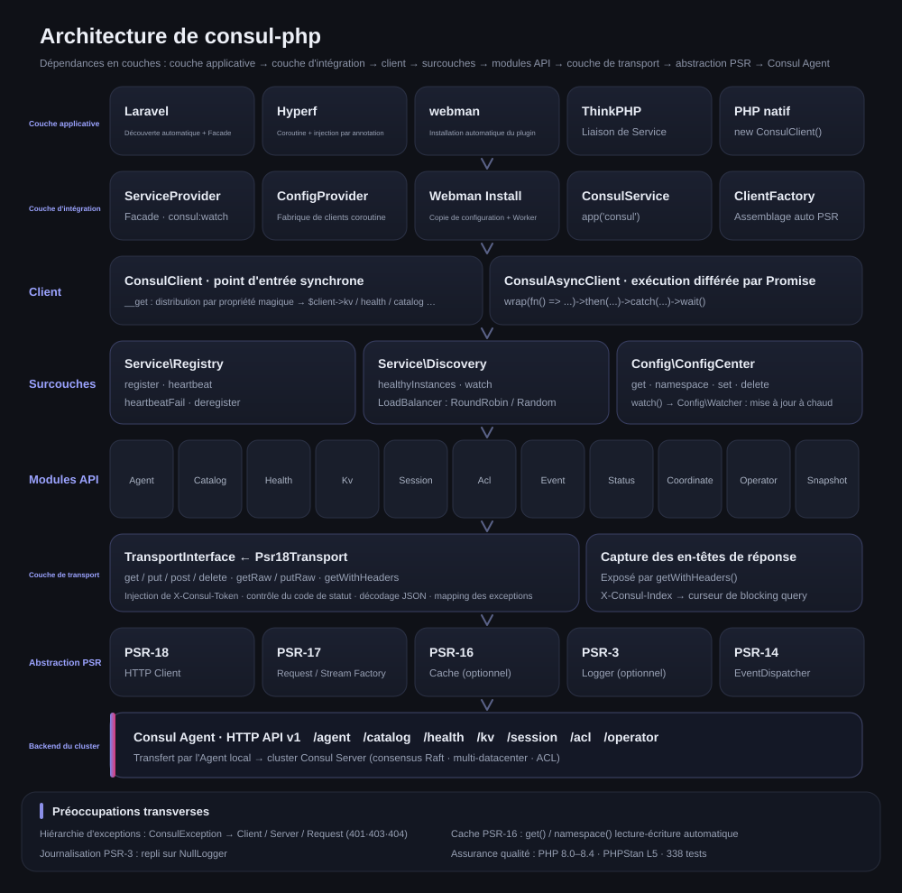
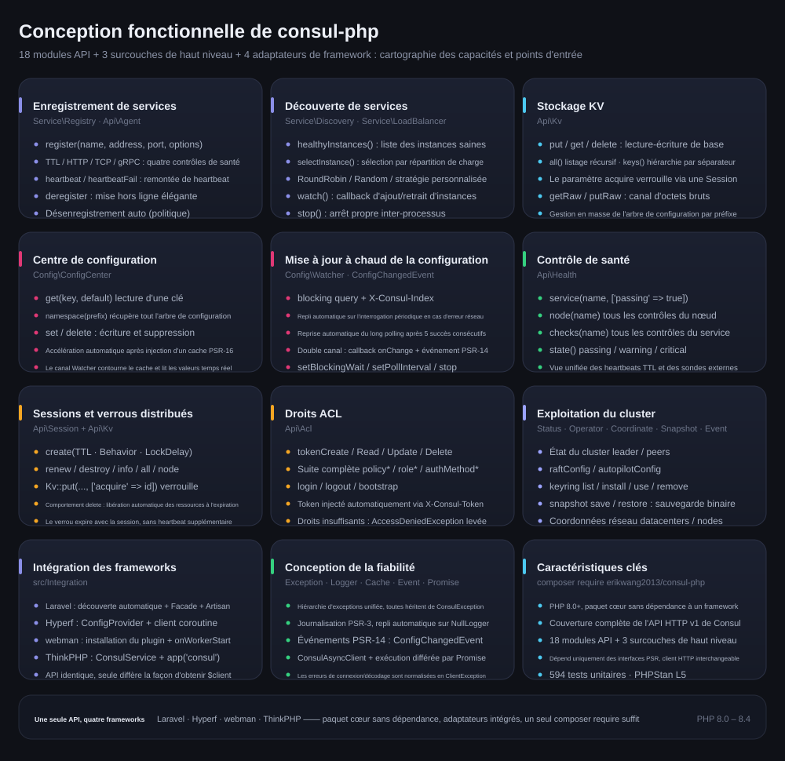
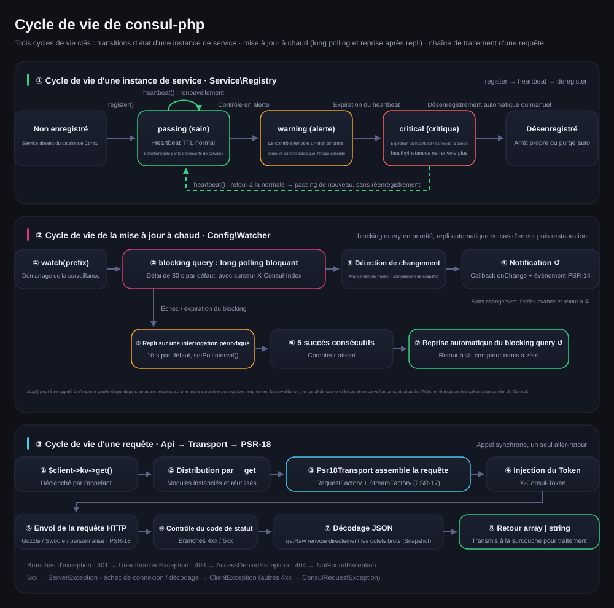

# erikwang2013/consul-php

[中文](../../../README.md) · [English](../en/README.md) · [日本語](../ja/README.md) · [한국어](../ko/README.md) · [Deutsch](../de/README.md) · **Français** · [Español](../es/README.md) · [Português](../pt/README.md) · [Русский](../ru/README.md) · [العربية](../ar/README.md) · [हिन्दी](../hi/README.md) · [বাংলা](../bn/README.md) · [Bahasa Indonesia](../id/README.md)



Client Consul pour PHP, couvrant intégralement l'API HTTP v1 de Consul, avec un accent sur l'enregistrement et la découverte de services ainsi que sur le centre de configuration. Le paquet cœur ne dépend d'aucun framework et embarque les adaptateurs Laravel / Hyperf / webman / ThinkPHP : un seul `composer require` suffit pour l'utiliser avec n'importe quel framework.

PHP 8.0+ · PSR-18/PSR-3/PSR-14/PSR-16 · aucune dépendance à un framework

> **Consu, la mascotte du projet** —— un petit assistant de registre qui ne se nourrit que de heartbeats et ne tombe jamais : ses antennes sont les heartbeats du contrôle de santé, la ligne de pouls sur sa poitrine est l'état des services, et un Token ACL est accroché à sa ceinture. Lancez `composer pet` dans le terminal pour l'invoquer ; voir la section « Consu, la mascotte du projet ».

---

## Présentation du projet

| | |
|---|---|
| **Quoi** | Un client de l'API HTTP v1 de Consul écrit en pur PHP : double point d'entrée synchrone + Promise, 11 modules API, 3 surcouches de haut niveau |
| **Quel problème** | Permettre à une application PHP d'utiliser Consul pour l'enregistrement et la découverte de services ainsi que la mise à jour à chaud de la configuration, sans réécrire un client pour chaque framework |
| **Comment l'utiliser** | `composer require erikwang2013/consul-php` : le paquet cœur ne dépend d'aucun framework, les adaptateurs sont intégrés et découverts automatiquement |
| **Frameworks pris en charge** | Laravel · Hyperf · webman · ThinkPHP —— API strictement identique, seule change la façon d'obtenir `$client` |
| **Contrat de dépendances** | Uniquement des interfaces PSR (PSR-18/17/16/14/3) : client HTTP, cache, journalisation et distributeur d'événements sont interchangeables |
| **Assurance qualité** | PHP 8.0 – 8.4 · 338 tests unitaires · PHPStan niveau 5 · PHP CS Fixer (PSR-12) |

### Capacités clés

- **Enregistrement et découverte de services** —— quatre modes de contrôle de santé : TTL / HTTP / TCP / gRPC ; healthyInstances / selectInstance ; répartition de charge RoundRobin, Random ou personnalisée ; surveillance des entrées et sorties d'instances
- **Centre de configuration** —— lecture-écriture KV, arbre d'espaces de noms, accélération par cache PSR-16 ; la mise à jour à chaud privilégie le blocking query (long polling) et bascule automatiquement sur une interrogation périodique en cas d'erreur réseau, puis revient au long polling après 5 succès consécutifs
- **Exploitation du cluster** —— verrous distribués Session, suite ACL complète (Token / Policy / Role / AuthMethod), Status / Operator / Coordinate / Snapshot / Event
- **Fiabilité** —— hiérarchie d'exceptions unifiée, journalisation PSR-3 (repli sur NullLogger), notification à double canal par événements PSR-14, normalisation des erreurs de la couche de transport

---

## Navigation dans la documentation

| Documentation | Lien |
|------|------|
| **Structure du projet** | voir ci-dessous |
| **Architecture** | voir ci-dessous · [architecture.svg](./images/architecture.svg) |
| **Conception fonctionnelle** | voir ci-dessous · [features.svg](./images/features.svg) |
| **Cycle de vie** | voir ci-dessous · [lifecycle.svg](./images/lifecycle.svg) |
| **Mascotte du projet** | [Consu](./images/pet.svg) |
| **README multilingue** | [docs/i18n/](../../i18n/) · [中文](../../../README.md) · [English](../en/README.md) · [日本語](../ja/README.md) · [한국어](../ko/README.md) · [Deutsch](../de/README.md) · **Français** · [Español](../es/README.md) · [Português](../pt/README.md) · [Русский](../ru/README.md) · [العربية](../ar/README.md) · [हिन्दी](../hi/README.md) · [বাংলা](../bn/README.md) · [Bahasa Indonesia](../id/README.md) |
| **Sommaire de la documentation** | [docs/README.md](../../README.md) |
| **Intégration Laravel** | voir ci-dessous « Laravel » |
| **Intégration Hyperf** | voir ci-dessous « Hyperf » |
| **Intégration webman** | voir ci-dessous « webman » |
| **Intégration ThinkPHP** | voir ci-dessous « ThinkPHP » |
| **Document de conception** | [docs/superpowers/specs/2026-05-14-consul-php-design.md](../../superpowers/specs/2026-05-14-consul-php-design.md) |

---

## Structure du projet

```
consul-php/
├── src/
│   ├── Client/                      # Point d'entrée du client
│   │   ├── ConsulClient.php         # Entrée synchrone : __get distribue les modules API et les surcouches
│   │   ├── ConsulAsyncClient.php    # Client à exécution différée par Promise
│   │   └── Promise.php              # Implémentation Promise légère
│   ├── Api/                         # Modules de l'API HTTP v1 de Consul (11)
│   │   ├── Agent.php                # Membres, informations locales, mode maintenance, join / leave
│   │   ├── Catalog.php              # Catalogue services et nœuds : enregistrement, désenregistrement, requêtes
│   │   ├── Health.php               # Contrôle de santé : service / nœud / filtrage par état
│   │   ├── Kv.php                   # Lecture-écriture KV, listage hiérarchique, octets bruts, verrou par session
│   │   ├── Session.php              # Sessions (base des verrous distribués) : création, renouvellement, destruction
│   │   ├── Acl.php                  # Token / Policy / Role / AuthMethod
│   │   ├── Event.php                # Événements utilisateur : fire / list
│   │   ├── Status.php               # État du cluster : leader / peers
│   │   ├── Coordinate.php           # Coordonnées réseau : datacenters / nodes
│   │   ├── Operator.php             # Exploitation Raft / Autopilot / Keyring
│   │   └── Snapshot.php             # Sauvegarde et restauration par snapshot (flux binaire)
│   ├── Service/                     # Enregistrement et découverte de services
│   │   ├── Registry.php             # register / heartbeat / heartbeatFail / deregister
│   │   ├── Discovery.php            # healthyInstances / selectInstance / watch / stop
│   │   └── LoadBalancer/            # RoundRobin, Random, LoadBalancerInterface
│   ├── Config/                      # Centre de configuration
│   │   ├── ConfigCenter.php         # get / namespace / set / delete / watch
│   │   ├── Watcher.php              # Mise à jour à chaud : long polling + repli périodique + reprise
│   │   └── ConfigChangedEvent.php   # Événement PSR-14 de changement de configuration
│   ├── Transport/                   # Couche de transport
│   │   ├── TransportInterface.php   # Contrat de transport (avec getRaw / putRaw / getWithHeaders)
│   │   └── Psr18Transport.php       # Implémentation PSR-18 : Token, décodage, mapping des exceptions
│   ├── Http/                        # PSR-7/17/18 intégré (client cURL, repli sans Guzzle)
│   ├── Support/                     # Consu en version terminal (Pet::art / Pet::say)
│   ├── Exception/                   # Hiérarchie d'exceptions (ConsulException et ses sous-classes, 7)
│   └── Integration/                 # Adaptateurs de framework (intégrés, découverts automatiquement)
│       ├── ClientFactory.php        # Assemblage automatique des dépendances PSR
│       ├── Laravel/                 # ServiceProvider + Facade + config/consul.php
│       ├── Hyperf/                  # ConfigProvider + fabrique de clients coroutine + config
│       ├── Webman/                  # Installation du plugin (Install) + config/app.php
│       ├── Thinkphp/                # ConsulService + config/consul.php
│       └── Native/                  # PHP natif : enregistrement / heartbeat / désenregistrement en une ligne
├── tests/                           # Cas PHPUnit (Api / Client / Config / Exception /
│                                    #   Integration / Service / Support / Transport)
├── docs/
│   ├── images/                      # Mascotte et schémas de conception (SVG)
│   │   ├── pet.svg                  # Consu, la mascotte du projet
│   │   ├── architecture.svg         # Architecture
│   │   ├── features.svg             # Conception fonctionnelle
│   │   └── lifecycle.svg            # Cycle de vie
│   ├── i18n/                        # en · ja · ko · de · fr · es · pt · ru · ar · hi · bn · id
│   ├── superpowers/specs/           # Documents de conception
│   ├── superpowers/plans/           # Plans d'implémentation
│   └── reports/                     # Rapports de couverture et de tests
├── scripts/i18n-svg.php             # i18n build / verify
├── scripts/pet.php                  # Entrée composer pet : invoquer la mascotte dans le terminal
├── composer.json                    # Dépendances et déclaration de découverte des frameworks
├── phpunit.xml.dist                 # Configuration des tests
└── phpstan.neon                     # Configuration de l'analyse statique (niveau 5)
```

---

## Aperçu des intégrations par framework

| | Laravel | Hyperf | webman | ThinkPHP |
|---|---|---|---|---|
| **Paquet d'extension** | intégré | intégré | intégré | intégré |
| **Mode d'injection** | découverte automatique + `ServiceProvider` | découverte automatique + `ConfigProvider` | `new` manuel / plugin | `bind` manuel sur le conteneur |
| **Accès rapide** | Facade `Consul` | annotation `#[Inject]` | — | helper `app('consul')` |
| **Emplacement de la configuration** | `config/consul.php` | `config/autoload/consul.php` | `config/plugin/erikwang2013/consul-php/app.php` | `config/consul.php` |
| **Client HTTP** | Guzzle (PSR-18) | client coroutine Swoole | Guzzle (PSR-18) | Guzzle (PSR-18) |
| **Cache** | Laravel Cache (PSR-16) | Hyperf Cache (PSR-16) | à injecter soi-même | à injecter soi-même |
| **Exécution de la mise à jour à chaud** | commande Artisan | coroutine `AbstractProcess` | processus `Worker` | Timer / processus Swoole |
| **Écoute d'événements** | `EventServiceProvider` | Hyperf Event | — | ThinkPHP Listener |
| **Documentation** | [Code source](../../../src/Integration/Laravel/) | [Code source](../../../src/Integration/Hyperf/) | [Code source](../../../src/Integration/Webman/) | [Code source](../../../src/Integration/Thinkphp/) |

### Une même opération, plusieurs écritures

**Obtenir le client :**

| Framework | Écriture |
|------|------|
| Générique | `$client = new ConsulClient(['base_uri' => '...']);` |
| Laravel | `$client = app(ConsulClient::class);` ou `Consul::kv->get(...)` |
| Hyperf | `#[Inject] private ConsulClient $consul;` |
| webman | `$client = new ConsulClient(['base_uri' => '...']);` |
| ThinkPHP | `$client = app('consul');` |

**Enregistrement de service :**

```php
// Tous les frameworks utilisent la même API ; seule change la façon d'obtenir $client
$client->serviceRegistry()->register('my-app', '10.0.0.1', 8080, [
    'id'    => 'my-app-1',
    'tags'  => ['v1'],
    'check' => ['ttl' => '30s'],
]);
```

**Lecture de la configuration :**

```php
// API identique ; Laravel et Hyperf passent automatiquement par le cache
$dbHost = $client->configCenter()->get('app/db_host', 'default');
```

**Mode d'exécution de la mise à jour à chaud :**

| Framework | Commande / mode de démarrage | Environnement d'exécution |
|------|----------------|---------|
| Laravel | `php artisan consul:watch` | processus Artisan autonome |
| Hyperf | `ConsulWatchProcess` (démarrage automatique) | coroutine Swoole |
| webman | fork dans `onWorkerStart` | processus `Worker` |
| ThinkPHP | Timer::setInterval / Swoole Process | processus autonome |

---

## Installation

```bash
# Paquet cœur
composer require erikwang2013/consul-php

# Implémentation PSR-18 (optionnelle : sans installation, le client cURL intégré est utilisé)
composer require guzzlehttp/guzzle php-http/guzzle7-adapter php-http/discovery
```

### Intégration des frameworks

Les adaptateurs de framework sont déjà intégrés au paquet cœur, aucune installation supplémentaire n'est nécessaire. Après l'installation du paquet cœur, le framework correspondant découvre et enregistre automatiquement le service Consul :

- **Laravel** — découverte automatique de `ConsulServiceProvider`, fournit la Facade `Consul` et l'injection de dépendances
- **Hyperf** — découverte automatique de `ConfigProvider`, fournit la fabrique de clients coroutine et l'injection `#[Inject]`
- **webman** — découverte automatique du plugin, copie automatique du fichier de configuration lors de `composer install`
- **ThinkPHP** — création de `ConsulService` dans le répertoire `app/service` et enregistrement auprès de l'application

---

## Démarrage rapide (générique)

```php
use Erikwang2013\Consul\Client\ConsulClient;

// Utilisation de base
$client = new ConsulClient(['base_uri' => 'http://127.0.0.1:8500']);

// Avec un Token ACL
$client = new ConsulClient([
    'base_uri' => 'http://127.0.0.1:8500',
    'token'    => 'your-consul-acl-token',
]);
```

Le Token est automatiquement ajouté à toutes les requêtes via l'en-tête `X-Consul-Token`.

### Enregistrement de service

Quatre modes de contrôle de santé sont pris en charge : TTL, HTTP, TCP et gRPC.

```php
$registry = $client->serviceRegistry();

// Mode TTL — l'application envoie elle-même les heartbeats
$registry->register('user-service', '192.168.1.10', 8080, [
    'id'    => 'user-service-1',
    'tags'  => ['v1', 'primary'],
    'meta'  => ['region' => 'cn-east'],
    'check' => [
        'ttl' => '30s',
        'deregister_critical_service_after' => '120s', // désenregistrement automatique à l'expiration du heartbeat
    ],
]);

// Mode HTTP — Consul sonde régulièrement le service
$registry->register('web', '192.168.1.10', 80, [
    'id'    => 'web-1',
    'check' => [
        'http'     => 'http://192.168.1.10:80/health',
        'interval' => '10s',
        'timeout'  => '3s',
    ],
]);

// Mode TCP
$registry->register('mysql', '192.168.1.10', 3306, [
    'check' => ['tcp' => '192.168.1.10:3306', 'interval' => '10s'],
]);

// Mode gRPC
$registry->register('grpc-svc', '192.168.1.10', 50051, [
    'check' => ['grpc' => '192.168.1.10:50051', 'interval' => '10s'],
]);

// Heartbeat (mode TTL)
$registry->heartbeat('user-service-1');

// Mise hors ligne
$registry->deregister('user-service-1');
```

### Découverte de services

Deux stratégies de répartition de charge sont intégrées : RoundRobin (par défaut) et Random.

```php
$discovery = $client->serviceDiscovery();

// Toutes les instances saines
$instances = $discovery->healthyInstances('user-service');
// [
//   ['address' => '10.0.0.1', 'port' => 8080, 'service' => 'user-service', 'id' => 'user-1', 'tags' => ['v1']],
//   ['address' => '10.0.0.2', 'port' => 8080, 'service' => 'user-service', 'id' => 'user-2', 'tags' => ['v1']],
// ]

// Sélection d'une instance par répartition de charge
$instance = $discovery->selectInstance('user-service');

// Stratégie de répartition de charge personnalisée
use Erikwang2013\Consul\Service\LoadBalancer\Random;
$discovery = new Discovery($health, loadBalancer: new Random());

// Surveillance des changements d'instances
$discovery->watch('user-service', function (array $instances) {
    // Appelé lors de l'ajout ou du retrait d'une instance
});

// Arrêter la surveillance (à appeler depuis un autre processus / une autre coroutine)
$discovery->stop();
```

### Centre de configuration

```php
$config = $client->configCenter();

// Une seule clé
$dbHost = $config->get('app/db_host', 'localhost');

// Tout un espace de noms
$all = $config->namespace('app/');
// ['app/db_host' => 'mysql.local', 'app/redis_host' => 'redis.local', ...]

// Écriture / suppression
$config->set('app/cache_ttl', '3600');
$config->delete('app/old_key');

// Mise à jour à chaud
$watcher = $config->watch('app/');
$watcher
    ->setBlockingWait(30)   // délai d'expiration du long polling (secondes)
    ->setPollInterval(10)   // intervalle du repli périodique (secondes)
    ->onChange(function (array $updated) {
        // Callback de changement de configuration
    });
$watcher->start(); // bloquant, à placer dans un processus / une coroutine dédié
// $watcher->stop();  // à appeler depuis un autre processus / une autre coroutine pour arrêter la surveillance
```

**Principe de la mise à jour à chaud :** le blocking query de Consul (long polling sur `index`) est privilégié ; en cas d'erreur réseau, le client bascule automatiquement sur une interrogation périodique, puis revient au long polling une fois la connexion rétablie. Notification à double canal : callback + EventDispatcher PSR-14.

**Stratégie de cache :** après injection d'un cache PSR-16, `get()` et `namespace()` lisent et écrivent automatiquement dans le cache. Le Watcher lit toujours les données temps réel de Consul, sans passer par le cache.

### Stockage KV

```php
$kv = $client->kv;

$kv->put('key', 'value');
$entry = $kv->get('key');              // null signifie que la clé n'existe pas
$all = $kv->all('prefix/');            // listage récursif
$keys = $kv->keys('prefix/');          // noms de clés uniquement
$keys = $kv->keys('prefix/', '/');     // listage hiérarchique par séparateur
$kv->delete('key');
```

### API de contrôle de santé

```php
$health = $client->health;

$health->service('user-service', ['passing' => true]);  // instances saines uniquement
$health->node('node-1');                                 // tous les contrôles du nœud
$health->checks('user-service');                          // tous les contrôles du service
$health->state('critical');                               // par état : passing/warning/critical
```

### Session / verrous distribués

```php
$session = $client->session;

$sess = $session->create([
    'Name'     => 'lock-session',
    'TTL'      => '30s',
    'Behavior' => 'delete',    // supprime automatiquement le KV associé à l'expiration
]);
$sessionId = $sess['ID'];

// Verrouiller une ressource
$locked = $client->kv->put('lock/resource', '1', ['acquire' => $sessionId]);

// Renouvellement / libération
$session->renew($sessionId);
$session->destroy($sessionId);
```

### ACL

```php
$acl = $client->acl;

// Token
$token = $acl->tokenCreate(['Description' => 'read-only', 'Policies' => [['Name' => 'read-policy']]]);
$acl->tokenRead($token['AccessorID']);
$acl->tokenDelete($token['AccessorID']);

// Policy
$policy = $acl->policyCreate(['Name' => 'my-policy', 'Rules' => 'node "" { policy = "read" }']);

// Role
$role = $acl->roleCreate(['Name' => 'reader', 'Policies' => [['Name' => 'my-policy']]]);

// Login/Logout
$result = $acl->login(['AuthMethod' => 'my-auth', 'BearerToken' => '...']);
$acl->logout();
```

### Client asynchrone

```php
use Erikwang2013\Consul\Client\ConsulAsyncClient;

$client = new ConsulAsyncClient(['base_uri' => 'http://127.0.0.1:8500']);

$promise = $client->wrap(fn() => $client->kv->get('key'));

$promise
    ->then(fn($result) => print_r($result))
    ->catch(fn(\Throwable $e) => log_error($e));

$value = $promise->wait(); // récupération bloquante du résultat
```

**Remarque :** le client asynchrone repose sur le modèle Promise et convient aux scénarios qui nécessitent des requêtes concurrentes. Dans un environnement coroutine Hyperf, le client HTTP par défaut suffit à obtenir une concurrence au niveau des coroutines.

---

## PHP natif (sans framework, zéro dépendance supplémentaire)

Si vous n'utilisez aucun framework et que vous ne souhaitez pas installer de bibliothèque HTTP supplémentaire, le client cURL intégré prend automatiquement le relais — prêt à l'emploi :

```php
use Erikwang2013\Consul\Client\ConsulClient;
use Erikwang2013\Consul\Integration\Native\NativeService;

$client = new ConsulClient(['base_uri' => 'http://127.0.0.1:8500']);

// Script résident : une seule ligne pour « enregistrement → heartbeat TTL → désenregistrement automatique à la sortie »
$service = NativeService::start($client->serviceRegistry(), 'my-app', '10.0.0.1', 8080, [
    'check' => ['ttl' => '30s', 'deregister_critical_service_after' => '120s'],
], heartbeatInterval: 10);

$service->serve();                       // envoie les heartbeats de façon bloquante ; avec pcntl, Ctrl+C désenregistre d'abord le service
// Vous pouvez aussi piloter la boucle vous-même : $service->heartbeat();  …  $service->stop();
```

Ordre de sélection du client HTTP : **injection manuelle** > implémentation trouvée par `php-http/discovery` (Guzzle, adaptateur coroutine Swoole, etc.) > **cURL intégré**.
L'implémentation intégrée gère elle-même le délai de connexion et le délai global (3 s / 30 s par défaut) ; elle peut être remplacée par injection :

```php
use Erikwang2013\Consul\Http\CurlClient;

$client = new ConsulClient([...], new CurlClient(connectTimeout: 1.0, timeout: 5.0));
```

---

## Guide d'intégration par framework

### Laravel

Laravel découvre automatiquement `ConsulServiceProvider`, aucun enregistrement manuel n'est nécessaire.

```bash
php artisan vendor:publish --tag=consul-config
```

Définissez `CONSUL_BASE_URI` dans `.env`, puis utilisez le client par injection de dépendances ou par Facade. L'extension Laravel injecte automatiquement le client PSR-18, le cache PSR-16, la journalisation PSR-3 et le distributeur d'événements PSR-14.

```php
// Injection de dépendances
use Erikwang2013\Consul\Client\ConsulClient;
public function show(ConsulClient $consul) { ... }

// Facade
use Consul;
$services = Consul::catalog->services();

// Mise à jour à chaud — commande Artisan
// php artisan consul:watch
```

### Hyperf

Hyperf découvre automatiquement `ConfigProvider`, aucun enregistrement manuel n'est nécessaire.

```bash
php bin/hyperf.php vendor:publish consul
```

L'extension Hyperf enregistre automatiquement `ConsulClient` dans le conteneur DI ; les requêtes HTTP utilisent par défaut le client coroutine Swoole. Il est recommandé de placer l'enregistrement du service dans un écouteur de l'événement `MainServerStart`, et d'exécuter la mise à jour à chaud dans une coroutine via `AbstractProcess`.

```php
// Injection par annotation
#[Inject]
private ConsulClient $consul;

// Enregistrement du service — événement MainServerStart
$consul->serviceRegistry()->register(...);

// Mise à jour à chaud — démarrage automatique de ConsulWatchProcess
```

### webman

webman découvre automatiquement le plugin et copie le fichier de configuration dans `config/plugin/erikwang2013/consul-php/` lors de `composer install`. webman fonctionnant en mémoire résidente, placez l'enregistrement du service dans le callback `onWorkerStart` : un seul enregistrement global suffit.

```php
// process/ConsulRegister.php
class ConsulRegister {
    public function onWorkerStart(Worker $worker): void {
        $consul = new ConsulClient(['base_uri' => getenv('CONSUL_BASE_URI')]);
        $consul->serviceRegistry()->register('webman-app', ...);
    }
}
```

### ThinkPHP

ThinkPHP ne dispose d'aucun mécanisme de découverte automatique : l'enregistrement du Service est manuel. Copiez le fichier de configuration vers `config/consul.php`, puis enregistrez `ConsulService` dans le répertoire `app/service` :

```php
// app/service/ConsulService.php
namespace app\service;

use Erikwang2013\Consul\Integration\Thinkphp\ConsulService as BaseConsulService;

class ConsulService extends BaseConsulService
{
}
```

Ou liez-le directement dans `app/AppService.php` :

```php
$this->app->bind('consul', fn() => new ConsulClient(config('consul')));

// Utilisation
$services = app('consul')->catalog->services();

// Fonction helper — app/common.php
function consul() { return app('consul'); }
```

---

## Client HTTP personnalisé

```php
$client = new ConsulClient(
    config:          ['base_uri' => 'http://consul:8500', 'token' => 'acl-token'],
    httpClient:      $myPsr18Client,        // obligatoire ou découvert automatiquement
    requestFactory:  $myRequestFactory,      // idem
    streamFactory:   $myStreamFactory,       // idem
    logger:          $myLogger,              // PSR-3, optionnel
    cache:           $myCache,               // PSR-16, optionnel
    eventDispatcher: $myEventDispatcher,     // PSR-14, optionnel
);
```

---

## Aide-mémoire des modules API

| Propriété | Classe | Méthodes principales |
|------|-----|---------|
| `$client->kv` | `Api\Kv` | `get` `put` `delete` `all` `keys` |
| `$client->agent` | `Api\Agent` | `members` `self` `registerService` `deregisterService` `checks` `services` |
| `$client->catalog` | `Api\Catalog` | `register` `deregister` `nodes` `services` `service` `node` |
| `$client->health` | `Api\Health` | `service` `node` `checks` `state` |
| `$client->session` | `Api\Session` | `create` `destroy` `renew` `info` `all` `node` |
| `$client->acl` | `Api\Acl` | `token*` `policy*` `role*` `authMethod*` `login` `logout` `bootstrap` |
| `$client->event` | `Api\Event` | `fire` `list` |
| `$client->status` | `Api\Status` | `leader` `peers` |
| `$client->coordinate` | `Api\Coordinate` | `datacenters` `nodes` `node` |
| `$client->operator` | `Api\Operator` | `raftConfig` `autopilotConfig` `keyring` (constantes : `KEYRING_LIST` `KEYRING_INSTALL` `KEYRING_USE` `KEYRING_REMOVE`) |
| `$client->snapshot` | `Api\Snapshot` | `save` (renvoie les octets bruts du snapshot via `getRaw()`) `restore` (envoie les octets bruts via `putRaw()`) |

Surcouches de haut niveau :

| Méthode | Retour | Description |
|------|------|------|
| `$client->serviceRegistry()` | `Service\Registry` | enregistrement du service / heartbeat / mise hors ligne |
| `$client->serviceDiscovery()` | `Service\Discovery` | liste d'instances / répartition de charge / surveillance des changements |
| `$client->configCenter()` | `Config\ConfigCenter` | lecture-écriture de configuration / cache / mise à jour à chaud |

---

## Hiérarchie d'exceptions

Toutes les exceptions héritent de `ConsulException` (qui hérite elle-même de `RuntimeException`) :

```
ConsulException
├── ClientException           erreur de transport HTTP (échec de connexion, DNS, timeout, etc.)
├── ServerException           Consul renvoie un 5xx
└── ConsulRequestException    Consul renvoie un 4xx
    ├── NotFoundException     404
    └── AccessDeniedException 403
```

```php
try {
    $client->kv->get('key');
} catch (ClientException $e) {
    // Problème réseau
} catch (NotFoundException $e) {
    // Ressource inexistante
} catch (ConsulException $e) {
    // Autre erreur Consul
}
```

---

## Architecture



Les dépendances vont du haut vers le bas : chaque couche ne dépend que de l'abstraction de la couche inférieure.

- **Couche applicative / couche d'intégration** —— les adaptateurs des 4 frameworks sont intégrés au paquet cœur `src/Integration/` et découverts automatiquement par composer ; la couche applicative ne s'adresse jamais qu'à un seul point d'entrée, `ConsulClient`.
- **Client** —— `ConsulClient` expose uniformément, via `__get`, 11 modules API (`$client->kv`, `$client->health`…) et 3 surcouches de haut niveau (`serviceRegistry()` / `serviceDiscovery()` / `configCenter()`) ; `ConsulAsyncClient` fournit l'exécution différée par Promise.
- **Surcouches de haut niveau** —— `Registry` / `Discovery` / `ConfigCenter` combinent les modules API ; `Watcher` s'appuie sur le `X-Consul-Index` renvoyé par `getWithHeaders()` pour implémenter le long polling.
- **Modules API** —— un module correspond à un ensemble de points d'API Consul v1, et tout passe par le même `TransportInterface`.
- **Couche de transport** —— `Psr18Transport` se charge de l'injection du Token, du contrôle du code de statut, du décodage JSON et du mapping des exceptions ; c'est l'unique point de sortie réseau du paquet.
- **Abstraction PSR** —— le paquet ne dépend que des interfaces PSR (18/17/16/14/3) : client HTTP, cache, journalisation et distributeur d'événements sont interchangeables, avec repli automatique lorsqu'ils ne sont pas injectés.

---

## Conception fonctionnelle



Cartographie des capacités : enregistrement et découverte de services, centre de configuration et mise à jour à chaud, KV / contrôle de santé / verrous de session / ACL / exploitation du cluster, adaptateurs pour 4 frameworks et conception de la fiabilité. Chaque carte de capacité indique la classe d'entrée correspondante ; pour le détail des appels, voir plus haut « Démarrage rapide (générique) » et « Aide-mémoire des modules API ».

---

## Cycle de vie



- **Cycle de vie d'une instance de service** —— `register()` → passing (renouvellement périodique par `heartbeat()`) → warning → critical → désenregistrement automatique ou manuel ; si le heartbeat repart, l'instance repasse de critical à passing sans réenregistrement.
- **Cycle de vie de la mise à jour à chaud** —— `watch()` lance un blocking query (30 s par défaut, avec `X-Consul-Index`) → détection de changement → callback `onChange` + `ConfigChangedEvent` ; en cas d'échec du blocage, repli automatique sur une interrogation périodique (10 s par défaut), puis retour au long polling après 5 succès consécutifs ; `stop()` permet de quitter proprement la surveillance depuis un autre processus / une autre coroutine.
- **Cycle de vie d'une requête** —— module API → `Psr18Transport` assemble la requête PSR-17 → injection de `X-Consul-Token` → envoi via PSR-18 → contrôle du code de statut → décodage JSON (`getRaw()` renvoie directement les octets bruts) → retour d'un tableau ; les 401/403/404/5xx et les échecs de transport sont mappés vers les exceptions correspondantes.

---

## Consu, la mascotte du projet

La mascotte n'est pas qu'une illustration : vous pouvez l'invoquer depuis le terminal comme depuis le code.

```bash
composer pet
```

```text
╭───────────────────────────────────────────────────────────────────────────╮
│ consul-php · un seul composer require, quatre frameworks avec heartbeat    │
╰──────┬────────────────────────────────────────────────────────────────────╯
       │
       ●
       │
   ╭───┴───╮
   │ ◕   ◕ │
   │  ╰─╯  │
   ├───────┤
   │╱╲╱╲╱╲ │
   ╰┬─────┬╯
    ╰─┬─┬─╯
```

Appelez directement `Erikwang2013\Consul\Support\Pet` depuis votre code :

```php
use Erikwang2013\Consul\Support\Pet;

echo Pet::art();                      // la mascotte seule
echo Pet::say('consul est prêt');      // bulle au-dessus de la tête + mascotte
echo Pet::art(false);                 // force le texte brut
```

Les couleurs sont déterminées automatiquement selon les capacités du terminal : en l'absence de TTY ou si `NO_COLOR` est défini, la sortie est en texte brut, pour ne pas polluer les journaux ni la sortie de CI.

Le design est cohérent avec [pet.svg](./images/pet.svg) : les antennes = le heartbeat du contrôle de santé (vert passing), les lunettes = la découverte de services, la ligne de pouls sur la poitrine = l'état des services (magenta Consul), la plaque à la ceinture = le Token ACL.

---

## Prérequis minimaux

- PHP 8.0+
- Composer
- une implémentation de client HTTP PSR-18 —— en l'absence d'injection et d'installation, repli automatique sur le client cURL intégré (extension curl requise)
- [optionnel] cache PSR-16 — mise en cache automatique par `Discovery::healthyInstances()` / `ConfigCenter::get()`
- [optionnel] Logger PSR-3 — journalisation des requêtes
- [optionnel] EventDispatcher PSR-14 — événement `ConfigChangedEvent`

## Le logiciel libre, c'est exigeant — votre soutien est bienvenu

| WeChat | Alipay |
|:---:|:---:|
|  |  |

---

## Licence

MIT

---

Cette traduction a été générée par IA ; si vous y relevez des inexactitudes, n'hésitez pas à ouvrir une Issue ou une PR.
