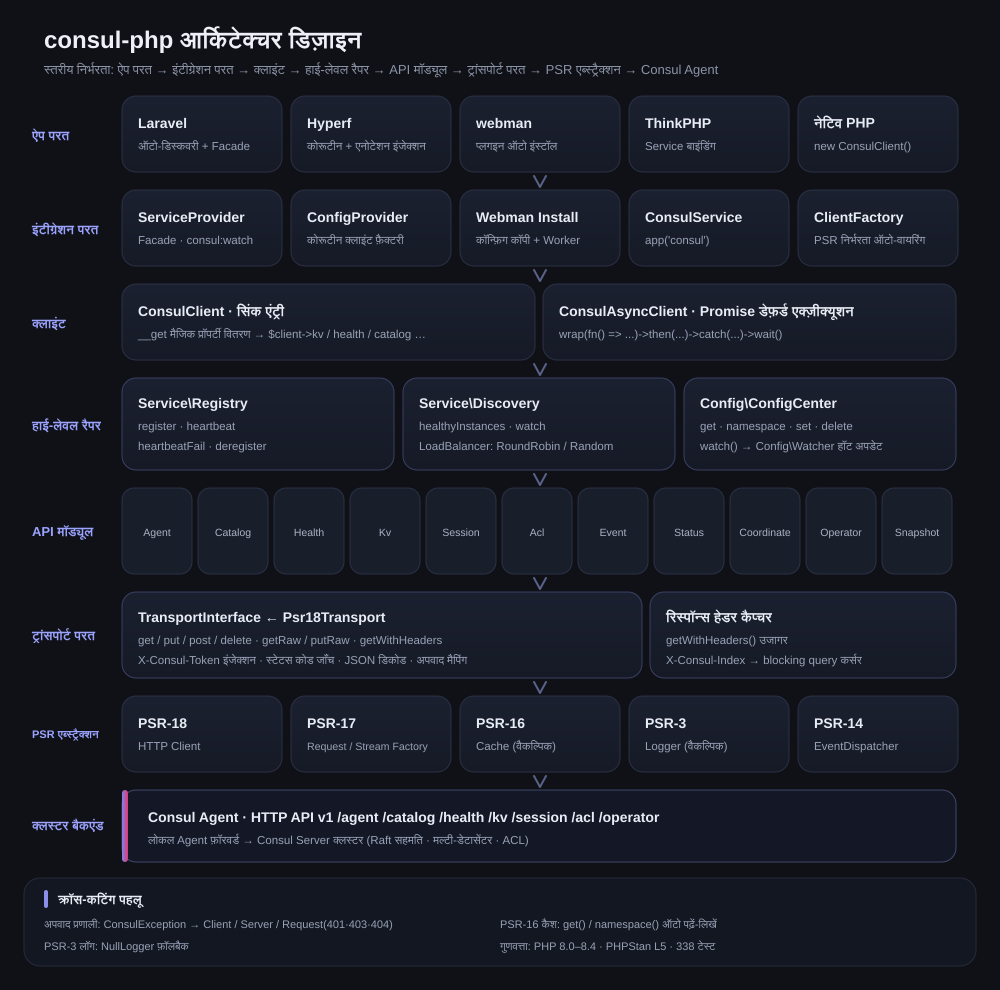
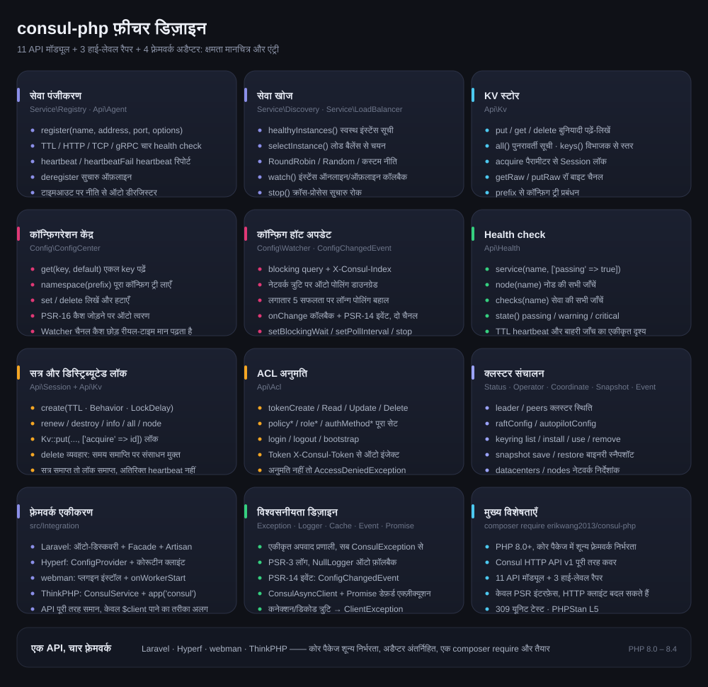
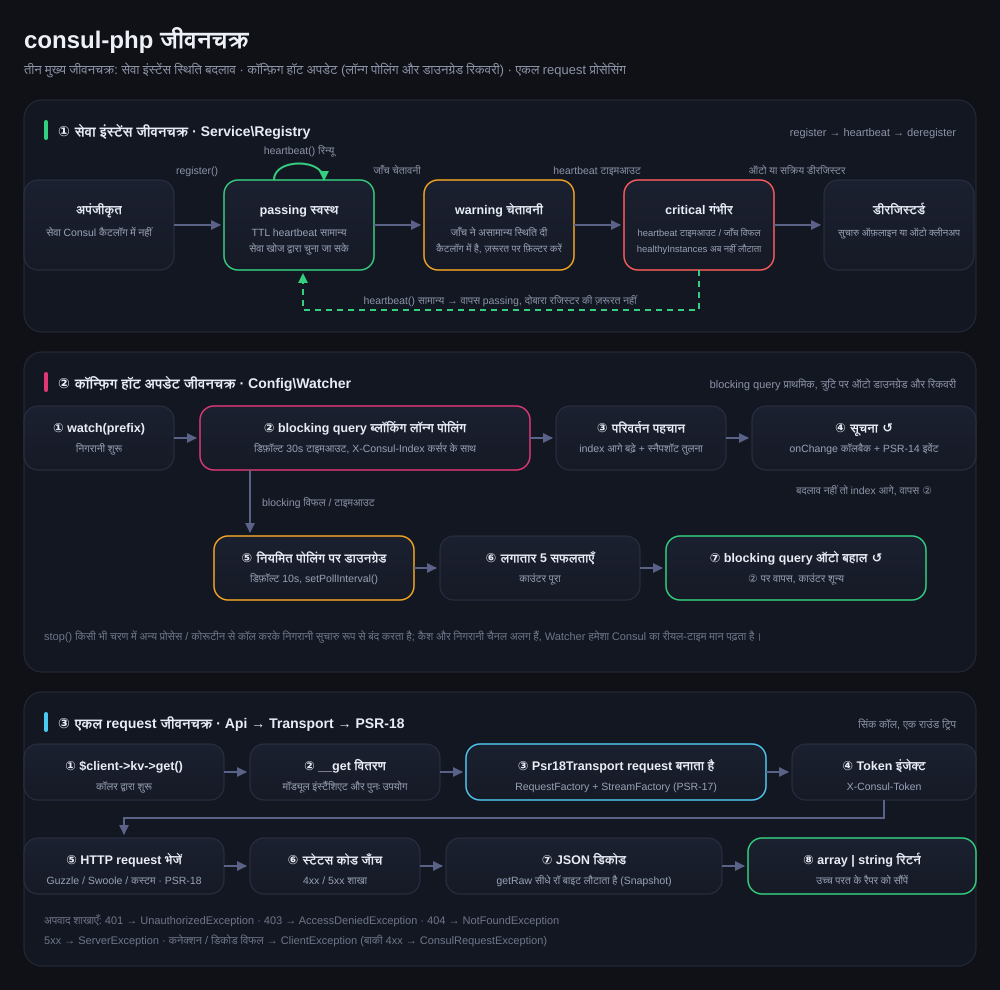

# erikwang2013/consul-php

[中文](../../../README.md) · [English](../en/README.md) · [日本語](../ja/README.md) · [한국어](../ko/README.md) · [Deutsch](../de/README.md) · [Français](../fr/README.md) · [Español](../es/README.md) · [Português](../pt/README.md) · [Русский](../ru/README.md) · [العربية](../ar/README.md) · **हिन्दी** · [বাংলা](../bn/README.md) · [Bahasa Indonesia](../id/README.md)



PHP Consul क्लाइंट, जो Consul HTTP API v1 को पूरी तरह कवर करता है और मुख्य रूप से सेवा पंजीकरण-खोज तथा कॉन्फ़िगरेशन केंद्र पर केंद्रित है। मुख्य पैकेज पर किसी फ़्रेमवर्क की निर्भरता नहीं है, Laravel / Hyperf / webman / ThinkPHP के अडैप्टर अंतर्निहित हैं — एक `composer require` और किसी भी फ़्रेमवर्क में उपयोग करें।

PHP 8.0+ · PSR-18/PSR-3/PSR-14/PSR-16 · शून्य फ़्रेमवर्क निर्भरता

> **परियोजना का पालतू Consu** —— एक ऐसा रजिस्ट्री सहायक जो केवल heartbeat खाता है और कभी डिस्कनेक्ट नहीं होता: एंटेना health check का heartbeat है, छाती की स्पंदन-रेखा सेवा की स्थिति है, और कमर पर ACL Token लटका है। टर्मिनल में `composer pet` से उसे बुला सकते हैं, विवरण नीचे "परियोजना का पालतू Consu" अनुभाग में देखें।

---

## परियोजना परिचय

| | |
|---|---|
| **यह क्या है** | शुद्ध PHP में लिखा Consul HTTP API v1 क्लाइंट: सिंक + Promise, दो एंट्री; 11 API मॉड्यूल; 3 उच्च-स्तरीय रैपर |
| **क्या समस्या हल करता है** | PHP अनुप्रयोगों को Consul से जोड़कर सेवा पंजीकरण-खोज और कॉन्फ़िगरेशन का हॉट अपडेट देना — हर फ़्रेमवर्क के लिए अलग क्लाइंट लिखने की ज़रूरत नहीं |
| **कैसे उपयोग करें** | `composer require erikwang2013/consul-php` — मुख्य पैकेज में शून्य फ़्रेमवर्क निर्भरता, फ़्रेमवर्क अडैप्टर अंतर्निहित और स्वतः खोजे जाते हैं |
| **समर्थित फ़्रेमवर्क** | Laravel · Hyperf · webman · ThinkPHP —— API पूरी तरह एक जैसा, अंतर केवल `$client` पाने के तरीके का |
| **निर्भरता नीति** | केवल PSR इंटरफ़ेस पर निर्भर (PSR-18/17/16/14/3); HTTP क्लाइंट, कैश, लॉग और इवेंट डिस्पैचर सभी बदले जा सकते हैं |
| **गुणवत्ता आश्वासन** | PHP 8.0 – 8.4 · 309 यूनिट टेस्ट · PHPStan level 5 · PHP CS Fixer (PSR-12) |

### मुख्य क्षमताएँ

- **सेवा पंजीकरण और खोज** —— TTL / HTTP / TCP / gRPC चार प्रकार के health check; healthyInstances / selectInstance; RoundRobin, Random और कस्टम लोड बैलेंसिंग; इंस्टेंस के ऑनलाइन/ऑफ़लाइन होने की निगरानी
- **कॉन्फ़िगरेशन केंद्र** —— KV पढ़ना/लिखना, namespace ट्री, PSR-16 कैश से त्वरण; हॉट अपडेट के लिए पहले blocking query लॉन्ग पोलिंग, नेटवर्क त्रुटि पर स्वतः पोलिंग पर डाउनग्रेड, लगातार 5 सफलताओं के बाद स्वतः बहाली
- **क्लस्टर संचालन** —— Session डिस्ट्रिब्यूटेड लॉक, पूरा ACL सेट (Token / Policy / Role / AuthMethod), Status / Operator / Coordinate / Snapshot / Event
- **विश्वसनीयता** —— एकीकृत अपवाद प्रणाली, PSR-3 लॉग (NullLogger फ़ॉलबैक), PSR-14 इवेंट की द्वि-चैनल सूचना, ट्रांसपोर्ट परत की त्रुटियों का सामान्यीकरण

---

## दस्तावेज़ नेविगेशन

| दस्तावेज़ | लिंक |
|------|------|
| **परियोजना संरचना** | परियोजना संरचना (नीचे देखें) |
| **आर्किटेक्चर डिज़ाइन** | आर्किटेक्चर डिज़ाइन (नीचे देखें) · [architecture.svg](./images/architecture.svg) |
| **फ़ीचर डिज़ाइन** | फ़ीचर डिज़ाइन (नीचे देखें) · [features.svg](./images/features.svg) |
| **जीवनचक्र** | जीवनचक्र (नीचे देखें) · [lifecycle.svg](./images/lifecycle.svg) |
| **परियोजना का पालतू** | [Consu](./images/pet.svg) |
| **बहुभाषी README** | [docs/i18n/](../../../docs/i18n/) · [中文](../../../README.md) · [English](../en/README.md) · [日本語](../ja/README.md) · [한국어](../ko/README.md) · [Deutsch](../de/README.md) · [Français](../fr/README.md) · [Español](../es/README.md) · [Português](../pt/README.md) · [Русский](../ru/README.md) · [العربية](../ar/README.md) · [हिन्दी](../hi/README.md) · [বাংলা](../bn/README.md) · [Bahasa Indonesia](../id/README.md) |
| **दस्तावेज़ सूची** | [docs/README.md](../../README.md) |
| **Laravel एकीकरण** | नीचे देखें Laravel |
| **Hyperf एकीकरण** | नीचे देखें Hyperf |
| **webman एकीकरण** | नीचे देखें webman |
| **ThinkPHP एकीकरण** | नीचे देखें ThinkPHP |
| **डिज़ाइन दस्तावेज़** | [docs/superpowers/specs/2026-05-14-consul-php-design.md](../../superpowers/specs/2026-05-14-consul-php-design.md) |

---

## परियोजना संरचना

```
consul-php/
├── src/
│   ├── Client/                      # क्लाइंट एंट्री
│   │   ├── ConsulClient.php         # सिंक एंट्री: __get से API मॉड्यूल और उच्च-स्तरीय रैपर का वितरण
│   │   ├── ConsulAsyncClient.php    # Promise आधारित डेफ़र्ड-एक्ज़ीक्यूशन क्लाइंट
│   │   └── Promise.php              # हल्का Promise कार्यान्वयन
│   ├── Api/                         # Consul HTTP API v1 मॉड्यूल (11)
│   │   ├── Agent.php                # सदस्य, स्वयं की जानकारी, मेंटेनेंस मोड, join / leave
│   │   ├── Catalog.php              # सेवा और नोड कैटलॉग: रजिस्टर, डीरजिस्टर, क्वेरी
│   │   ├── Health.php               # health check: सेवा / नोड / स्थिति के अनुसार फ़िल्टर
│   │   ├── Kv.php                   # KV पढ़ना/लिखना, स्तर-वार सूची, रॉ बाइट्स, सत्र लॉक
│   │   ├── Session.php              # सत्र (डिस्ट्रिब्यूटेड लॉक का आधार): बनाना, रिन्यू, नष्ट करना
│   │   ├── Acl.php                  # Token / Policy / Role / AuthMethod
│   │   ├── Event.php                # उपयोगकर्ता इवेंट: fire / list
│   │   ├── Status.php               # क्लस्टर स्थिति: leader / peers
│   │   ├── Coordinate.php           # नेटवर्क निर्देशांक: datacenters / nodes
│   │   ├── Operator.php             # Raft / Autopilot / Keyring संचालन
│   │   └── Snapshot.php             # स्नैपशॉट बैकअप और रिस्टोर (बाइनरी स्ट्रीम)
│   ├── Service/                     # सेवा पंजीकरण और खोज
│   │   ├── Registry.php             # register / heartbeat / heartbeatFail / deregister
│   │   ├── Discovery.php            # healthyInstances / selectInstance / watch / stop
│   │   └── LoadBalancer/            # RoundRobin, Random, LoadBalancerInterface
│   ├── Config/                      # कॉन्फ़िगरेशन केंद्र
│   │   ├── ConfigCenter.php         # get / namespace / set / delete / watch
│   │   ├── Watcher.php              # हॉट अपडेट: लॉन्ग पोलिंग + डाउनग्रेड पोलिंग + स्वतः बहाली
│   │   └── ConfigChangedEvent.php   # PSR-14 कॉन्फ़िगरेशन परिवर्तन इवेंट
│   ├── Transport/                   # ट्रांसपोर्ट परत
│   │   ├── TransportInterface.php   # ट्रांसपोर्ट अनुबंध (getRaw / putRaw / getWithHeaders सहित)
│   │   └── Psr18Transport.php       # PSR-18 कार्यान्वयन: Token इंजेक्शन, डिकोडिंग, अपवाद मैपिंग
│   ├── Support/                     # परियोजना के पालतू Consu का टर्मिनल संस्करण (Pet::art / Pet::say)
│   ├── Exception/                   # अपवाद प्रणाली (ConsulException और उसके उपवर्ग, 7)
│   └── Integration/                 # फ़्रेमवर्क अडैप्टर (अंतर्निहित, स्वतः खोज)
│       ├── ClientFactory.php        # PSR निर्भरताओं की स्वतः असेंबली
│       ├── Laravel/                 # ServiceProvider + Facade + config/consul.php
│       ├── Hyperf/                  # ConfigProvider + कोरूटीन क्लाइंट फ़ैक्टरी + config
│       ├── Webman/                  # प्लगइन इंस्टॉलेशन (Install) + config/app.php
│       └── Thinkphp/                # ConsulService + config/consul.php
├── tests/                           # PHPUnit केस (Api / Client / Config / Exception /
│                                    #   Integration / Service / Support / Transport)
├── docs/
│   ├── images/                      # पालतू और डिज़ाइन चित्र (SVG)
│   │   ├── pet.svg                  # परियोजना का पालतू Consu
│   │   ├── architecture.svg         # आर्किटेक्चर डिज़ाइन
│   │   ├── features.svg             # फ़ीचर डिज़ाइन
│   │   └── lifecycle.svg            # जीवनचक्र
│   ├── i18n/                        # en · ja · ko · de · fr · es · pt · ru · ar · hi · bn · id
│   ├── superpowers/specs/           # डिज़ाइन दस्तावेज़
│   ├── superpowers/plans/           # कार्यान्वयन योजना
│   └── reports/                     # कवरेज रिपोर्ट और टेस्ट रिपोर्ट
├── scripts/i18n-svg.php             # i18n build / verify
├── scripts/pet.php                  # composer pet एंट्री: टर्मिनल में पालतू को बुलाएँ
├── composer.json                    # निर्भरताएँ और फ़्रेमवर्क ऑटो-डिस्कवरी की घोषणाएँ
├── phpunit.xml.dist                 # टेस्ट कॉन्फ़िगरेशन
└── phpstan.neon                     # स्टैटिक विश्लेषण कॉन्फ़िगरेशन (level 5)
```

---

## फ़्रेमवर्क एकीकरण एक नज़र में

| | Laravel | Hyperf | webman | ThinkPHP |
|---|---|---|---|---|
| **एक्सटेंशन पैकेज** | अंतर्निहित | अंतर्निहित | अंतर्निहित | अंतर्निहित |
| **इंजेक्शन विधि** | स्वतः खोज + `ServiceProvider` | स्वतः खोज + `ConfigProvider` | मैन्युअल `new` / प्लगइन | कंटेनर में मैन्युअल `bind` |
| **सुविधाजनक पहुँच** | `Consul` Facade | `#[Inject]` एनोटेशन | — | `app('consul')` हेल्पर |
| **कॉन्फ़िगरेशन स्थान** | `config/consul.php` | `config/autoload/consul.php` | `config/plugin/erikwang2013/consul-php/app.php` | `config/consul.php` |
| **HTTP क्लाइंट** | Guzzle (PSR-18) | Swoole कोरूटीन क्लाइंट | Guzzle (PSR-18) | Guzzle (PSR-18) |
| **कैश** | Laravel Cache (PSR-16) | Hyperf Cache (PSR-16) | स्वयं इंजेक्ट करें | स्वयं इंजेक्ट करें |
| **हॉट अपडेट चलाना** | Artisan कमांड | `AbstractProcess` कोरूटीन | `Worker` प्रोसेस | Timer / Swoole प्रोसेस |
| **इवेंट श्रोता** | `EventServiceProvider` | Hyperf Event | — | ThinkPHP Listener |
| **दस्तावेज़** | [सोर्स कोड](../../../src/Integration/Laravel/) | [सोर्स कोड](../../../src/Integration/Hyperf/) | [सोर्स कोड](../../../src/Integration/Webman/) | [सोर्स कोड](../../../src/Integration/Thinkphp/) |

### एक ही कार्य, अलग-अलग लिखने का तरीका

**क्लाइंट प्राप्त करना:**

| फ़्रेमवर्क | तरीका |
|------|------|
| सामान्य | `$client = new ConsulClient(['base_uri' => '...']);` |
| Laravel | `$client = app(ConsulClient::class);` या `Consul::kv->get(...)` |
| Hyperf | `#[Inject] private ConsulClient $consul;` |
| webman | `$client = new ConsulClient(['base_uri' => '...']);` |
| ThinkPHP | `$client = app('consul');` |

**सेवा पंजीकरण:**

```php
// सभी फ़्रेमवर्क में एक ही API रहता है, अंतर केवल $client पाने के तरीके का है
$client->serviceRegistry()->register('my-app', '10.0.0.1', 8080, [
    'id'    => 'my-app-1',
    'tags'  => ['v1'],
    'check' => ['ttl' => '30s'],
]);
```

**कॉन्फ़िगरेशन पढ़ना:**

```php
// वही API; Laravel/Hyperf में कैश स्वतः उपयोग होता है
$dbHost = $client->configCenter()->get('app/db_host', 'default');
```

**हॉट अपडेट चलाने का तरीका:**

| फ़्रेमवर्क | प्रारंभ कमांड / तरीका | रनटाइम वातावरण |
|------|----------------|---------|
| Laravel | `php artisan consul:watch` | स्वतंत्र Artisan प्रोसेस |
| Hyperf | `ConsulWatchProcess` (स्वतः शुरू) | Swoole कोरूटीन |
| webman | `onWorkerStart` में fork करें | Worker प्रोसेस |
| ThinkPHP | Timer::setInterval / Swoole Process | स्वतंत्र प्रोसेस |

---

## इंस्टॉलेशन

```bash
# मुख्य पैकेज
composer require erikwang2013/consul-php

# PSR-18 कार्यान्वयन (इनमें से कोई एक)
composer require guzzlehttp/guzzle php-http/guzzle7-adapter php-http/discovery
```

### फ़्रेमवर्क एकीकरण

फ़्रेमवर्क अडैप्टर मुख्य पैकेज में ही अंतर्निहित हैं, अलग से इंस्टॉल करने की ज़रूरत नहीं। मुख्य पैकेज इंस्टॉल करने के बाद संबंधित फ़्रेमवर्क उन्हें स्वतः खोजकर Consul सेवा रजिस्टर कर लेता है:

- **Laravel** — `ConsulServiceProvider` स्वतः खोजा जाता है, `Consul` Facade और डिपेंडेंसी इंजेक्शन उपलब्ध कराता है
- **Hyperf** — `ConfigProvider` स्वतः खोजा जाता है, कोरूटीन क्लाइंट फ़ैक्टरी और `#[Inject]` इंजेक्शन देता है
- **webman** — प्लगइन स्वतः खोजा जाता है, `composer install` के समय कॉन्फ़िगरेशन फ़ाइल स्वतः कॉपी हो जाती है
- **ThinkPHP** — `app/service` डायरेक्टरी में `ConsulService` बनाकर ऐप में रजिस्टर करें

---

## त्वरित शुरुआत (सामान्य)

```php
use Erikwang2013\Consul\Client\ConsulClient;

// बुनियादी उपयोग
$client = new ConsulClient(['base_uri' => 'http://127.0.0.1:8500']);

// ACL Token के साथ
$client = new ConsulClient([
    'base_uri' => 'http://127.0.0.1:8500',
    'token'    => 'your-consul-acl-token',
]);
```

Token `X-Consul-Token` request header के ज़रिए हर request में स्वतः जुड़ जाता है।

### सेवा पंजीकरण

TTL, HTTP, TCP, gRPC — चारों प्रकार के health check मोड समर्थित हैं।

```php
$registry = $client->serviceRegistry();

// TTL मोड — ऐप स्वयं heartbeat भेजता है
$registry->register('user-service', '192.168.1.10', 8080, [
    'id'    => 'user-service-1',
    'tags'  => ['v1', 'primary'],
    'meta'  => ['region' => 'cn-east'],
    'check' => [
        'ttl' => '30s',
        'deregister_critical_service_after' => '120s', // heartbeat टाइमआउट पर स्वतः डीरजिस्टर
    ],
]);

// HTTP मोड — Consul नियमित रूप से जाँच करता है
$registry->register('web', '192.168.1.10', 80, [
    'id'    => 'web-1',
    'check' => [
        'http'     => 'http://192.168.1.10:80/health',
        'interval' => '10s',
        'timeout'  => '3s',
    ],
]);

// TCP मोड
$registry->register('mysql', '192.168.1.10', 3306, [
    'check' => ['tcp' => '192.168.1.10:3306', 'interval' => '10s'],
]);

// gRPC मोड
$registry->register('grpc-svc', '192.168.1.10', 50051, [
    'check' => ['grpc' => '192.168.1.10:50051', 'interval' => '10s'],
]);

// heartbeat (TTL मोड)
$registry->heartbeat('user-service-1');

// डीरजिस्टर
$registry->deregister('user-service-1');
```

### सेवा खोज

RoundRobin (डिफ़ॉल्ट) और Random — दो लोड बैलेंसिंग नीतियाँ अंतर्निहित हैं।

```php
$discovery = $client->serviceDiscovery();

// सभी स्वस्थ इंस्टेंस
$instances = $discovery->healthyInstances('user-service');
// [
//   ['address' => '10.0.0.1', 'port' => 8080, 'service' => 'user-service', 'id' => 'user-1', 'tags' => ['v1']],
//   ['address' => '10.0.0.2', 'port' => 8080, 'service' => 'user-service', 'id' => 'user-2', 'tags' => ['v1']],
// ]

// लोड बैलेंसिंग से एक चुनें
$instance = $discovery->selectInstance('user-service');

// कस्टम लोड बैलेंसिंग नीति
use Erikwang2013\Consul\Service\LoadBalancer\Random;
$discovery = new Discovery($health, loadBalancer: new Random());

// सेवा इंस्टेंस में बदलाव की निगरानी
$discovery->watch('user-service', function (array $instances) {
    // इंस्टेंस के ऑनलाइन/ऑफ़लाइन होने पर कॉलबैक
});

// निगरानी बंद करें (किसी अन्य प्रोसेस/कोरूटीन से कॉल करें)
$discovery->stop();
```

### कॉन्फ़िगरेशन केंद्र

```php
$config = $client->configCenter();

// एकल key
$dbHost = $config->get('app/db_host', 'localhost');

// पूरा namespace
$all = $config->namespace('app/');
// ['app/db_host' => 'mysql.local', 'app/redis_host' => 'redis.local', ...]

// लिखें / हटाएँ
$config->set('app/cache_ttl', '3600');
$config->delete('app/old_key');

// हॉट अपडेट
$watcher = $config->watch('app/');
$watcher
    ->setBlockingWait(30)   // लॉन्ग पोलिंग टाइमआउट (सेकंड)
    ->setPollInterval(10)   // पोलिंग पर डाउनग्रेड का अंतराल (सेकंड)
    ->onChange(function (array $updated) {
        // कॉन्फ़िगरेशन बदलने पर कॉलबैक
    });
$watcher->start(); // ब्लॉकिंग, इसे अलग प्रोसेस/कोरूटीन में रखें
// $watcher->stop();  // निगरानी रोकने के लिए अन्य प्रोसेस/कोरूटीन से कॉल करें
```

**हॉट अपडेट का सिद्धांत:** पहले Consul blocking query (`index` लॉन्ग पोलिंग) का उपयोग होता है; नेटवर्क त्रुटि पर स्वतः नियमित पोलिंग पर डाउनग्रेड हो जाता है, और कनेक्शन बहाल होने पर स्वतः लॉन्ग पोलिंग पर लौट आता है। कॉलबैक + PSR-14 EventDispatcher की द्वि-चैनल सूचना।

**कैश नीति:** PSR-16 कैश इंजेक्ट करने के बाद `get()` और `namespace()` स्वतः कैश पढ़ते/लिखते हैं। Watcher हमेशा Consul से रीयल-टाइम डेटा पढ़ता है, कैश का उपयोग नहीं करता।

### KV स्टोर

```php
$kv = $client->kv;

$kv->put('key', 'value');
$entry = $kv->get('key');              // null का अर्थ है मौजूद नहीं
$all = $kv->all('prefix/');            // पुनरावर्ती सूची
$keys = $kv->keys('prefix/');          // केवल key के नाम
$keys = $kv->keys('prefix/', '/');     // विभाजक के अनुसार स्तर-वार सूची
$kv->delete('key');
```

### Health Check API

```php
$health = $client->health;

$health->service('user-service', ['passing' => true]);  // केवल स्वस्थ इंस्टेंस
$health->node('node-1');                                 // नोड की सभी जाँचें
$health->checks('user-service');                          // सेवा की सभी जाँचें
$health->state('critical');                               // स्थिति के अनुसार: passing/warning/critical
```

### Session / डिस्ट्रिब्यूटेड लॉक

```php
$session = $client->session;

$sess = $session->create([
    'Name'     => 'lock-session',
    'TTL'      => '30s',
    'Behavior' => 'delete',    // समय समाप्त होने पर संबंधित KV स्वतः हटाएँ
]);
$sessionId = $sess['ID'];

// संसाधन लॉक करें
$locked = $client->kv->put('lock/resource', '1', ['acquire' => $sessionId]);

// रिन्यू / रिलीज़
$session->renew($sessionId);
$session->destroy($sessionId);
```

### ACL

```php
$acl = $client->acl;

// Token
$token = $acl->tokenCreate(['Description' => 'read-only', 'Policies' => [['Name' => 'read-policy']]]);
$acl->tokenRead($token['AccessorID']);
$acl->tokenDelete($token['AccessorID']);

// Policy
$policy = $acl->policyCreate(['Name' => 'my-policy', 'Rules' => 'node "" { policy = "read" }']);

// Role
$role = $acl->roleCreate(['Name' => 'reader', 'Policies' => [['Name' => 'my-policy']]]);

// Login/Logout
$result = $acl->login(['AuthMethod' => 'my-auth', 'BearerToken' => '...']);
$acl->logout();
```

### असिंक क्लाइंट

```php
use Erikwang2013\Consul\Client\ConsulAsyncClient;

$client = new ConsulAsyncClient(['base_uri' => 'http://127.0.0.1:8500']);

$promise = $client->wrap(fn() => $client->kv->get('key'));

$promise
    ->then(fn($result) => print_r($result))
    ->catch(fn(\Throwable $e) => log_error($e));

$value = $promise->wait(); // ब्लॉक करके परिणाम प्राप्त करें
```

**ध्यान दें:** असिंक क्लाइंट Promise पैटर्न पर आधारित है और उन परिदृश्यों के लिए उपयुक्त है जहाँ समवर्ती request चाहिए। Hyperf के कोरूटीन वातावरण में डिफ़ॉल्ट HTTP क्लाइंट से ही कोरूटीन-स्तरीय समवर्तीता मिल जाती है।

---

## विभिन्न फ़्रेमवर्क के लिए एकीकरण गाइड

### Laravel

Laravel `ConsulServiceProvider` को स्वतः खोज लेता है, मैन्युअल रजिस्ट्रेशन की ज़रूरत नहीं।

```bash
php artisan vendor:publish --tag=consul-config
```

`.env` में `CONSUL_BASE_URI` सेट करें, इसके बाद डिपेंडेंसी इंजेक्शन या Facade से उपयोग कर सकते हैं। Laravel एक्सटेंशन PSR-18 क्लाइंट, PSR-16 कैश, PSR-3 लॉग और PSR-14 इवेंट डिस्पैचर स्वतः इंजेक्ट कर देता है।

```php
// डिपेंडेंसी इंजेक्शन
use Erikwang2013\Consul\Client\ConsulClient;
public function show(ConsulClient $consul) { ... }

// Facade
use Consul;
$services = Consul::catalog->services();

// कॉन्फ़िगरेशन हॉट अपडेट — Artisan कमांड
// php artisan consul:watch
```

### Hyperf

Hyperf `ConfigProvider` को स्वतः खोज लेता है, मैन्युअल रजिस्ट्रेशन की ज़रूरत नहीं।

```bash
php bin/hyperf.php vendor:publish consul
```

Hyperf एक्सटेंशन `ConsulClient` को DI कंटेनर में स्वतः रजिस्टर कर देता है, और HTTP request डिफ़ॉल्ट रूप से Swoole कोरूटीन क्लाइंट का उपयोग करते हैं। सेवा पंजीकरण को `MainServerStart` इवेंट श्रोता में रखने की सलाह दी जाती है, और हॉट अपडेट के लिए `AbstractProcess` को कोरूटीन में चलाएँ।

```php
// एनोटेशन इंजेक्शन
#[Inject]
private ConsulClient $consul;

// सेवा पंजीकरण — MainServerStart इवेंट
$consul->serviceRegistry()->register(...);

// हॉट अपडेट — ConsulWatchProcess स्वतः शुरू होता है
```

### webman

webman प्लगइन को स्वतः खोज लेता है, और `composer install` के समय कॉन्फ़िगरेशन फ़ाइल स्वतः `config/plugin/erikwang2013/consul-php/` में कॉपी हो जाती है। चूँकि webman का आर्किटेक्चर मेमोरी में स्थायी रहने वाला है, सेवा पंजीकरण `onWorkerStart` कॉलबैक में रखें — पूरे सिस्टम में एक ही बार रजिस्टर करना काफ़ी है।

```php
// process/ConsulRegister.php
class ConsulRegister {
    public function onWorkerStart(Worker $worker): void {
        $consul = new ConsulClient(['base_uri' => getenv('CONSUL_BASE_URI')]);
        $consul->serviceRegistry()->register('webman-app', ...);
    }
}
```

### ThinkPHP

ThinkPHP में ऑटो-डिस्कवरी तंत्र नहीं है, Service को मैन्युअल रूप से रजिस्टर करना पड़ता है। कॉन्फ़िगरेशन फ़ाइल को `config/consul.php` में कॉपी करें, फिर `app/service` डायरेक्टरी में `ConsulService` रजिस्टर करें:

```php
// app/service/ConsulService.php
namespace app\service;

use Erikwang2013\Consul\Integration\Thinkphp\ConsulService as BaseConsulService;

class ConsulService extends BaseConsulService
{
}
```

या `app/AppService.php` में सीधे bind करें:

```php
$this->app->bind('consul', fn() => new ConsulClient(config('consul')));

// उपयोग
$services = app('consul')->catalog->services();

// हेल्पर फ़ंक्शन — app/common.php
function consul() { return app('consul'); }
```

---

## कस्टम HTTP क्लाइंट

```php
$client = new ConsulClient(
    config:          ['base_uri' => 'http://consul:8500', 'token' => 'acl-token'],
    httpClient:      $myPsr18Client,        // अनिवार्य या स्वतः खोजा जाए
    requestFactory:  $myRequestFactory,      // ऊपर जैसा ही
    streamFactory:   $myStreamFactory,       // ऊपर जैसा ही
    logger:          $myLogger,              // PSR-3, वैकल्पिक
    cache:           $myCache,               // PSR-16, वैकल्पिक
    eventDispatcher: $myEventDispatcher,     // PSR-14, वैकल्पिक
);
```

---

## API मॉड्यूल त्वरित संदर्भ

| प्रॉपर्टी | क्लास | मुख्य मेथड |
|------|-----|---------|
| `$client->kv` | `Api\Kv` | `get` `put` `delete` `all` `keys` |
| `$client->agent` | `Api\Agent` | `members` `self` `registerService` `deregisterService` `checks` `services` |
| `$client->catalog` | `Api\Catalog` | `register` `deregister` `nodes` `services` `service` `node` |
| `$client->health` | `Api\Health` | `service` `node` `checks` `state` |
| `$client->session` | `Api\Session` | `create` `destroy` `renew` `info` `all` `node` |
| `$client->acl` | `Api\Acl` | `token*` `policy*` `role*` `authMethod*` `login` `logout` `bootstrap` |
| `$client->event` | `Api\Event` | `fire` `list` |
| `$client->status` | `Api\Status` | `leader` `peers` |
| `$client->coordinate` | `Api\Coordinate` | `datacenters` `nodes` `node` |
| `$client->operator` | `Api\Operator` | `raftConfig` `autopilotConfig` `keyring` (कॉन्स्टेंट: `KEYRING_LIST` `KEYRING_INSTALL` `KEYRING_USE` `KEYRING_REMOVE`) |
| `$client->snapshot` | `Api\Snapshot` | `save` (`getRaw()` से रॉ स्नैपशॉट बाइट्स लौटाता है) `restore` (`putRaw()` से रॉ बाइट्स भेजता है) |

उच्च-स्तरीय रैपर:

| मेथड | रिटर्न | विवरण |
|------|------|------|
| `$client->serviceRegistry()` | `Service\Registry` | सेवा पंजीकरण/heartbeat/डीरजिस्टर |
| `$client->serviceDiscovery()` | `Service\Discovery` | इंस्टेंस सूची/लोड बैलेंसिंग/परिवर्तन निगरानी |
| `$client->configCenter()` | `Config\ConfigCenter` | कॉन्फ़िगरेशन पढ़ना-लिखना/कैश/हॉट अपडेट |

---

## अपवाद प्रणाली

सभी अपवाद `ConsulException` से विरासत में आते हैं (जो `RuntimeException` से विरासत में आता है):

```
ConsulException
├── ClientException           HTTP ट्रांसपोर्ट त्रुटि (कनेक्शन विफल, DNS, टाइमआउट आदि)
├── ServerException           Consul ने 5xx लौटाया
└── ConsulRequestException    Consul ने 4xx लौटाया
    ├── NotFoundException     404
    └── AccessDeniedException 403
```

```php
try {
    $client->kv->get('key');
} catch (ClientException $e) {
    // नेटवर्क समस्या
} catch (NotFoundException $e) {
    // संसाधन मौजूद नहीं है
} catch (ConsulException $e) {
    // अन्य Consul त्रुटि
}
```

---

## आर्किटेक्चर डिज़ाइन



निर्भरता की दिशा ऊपर से नीचे है, हर परत केवल नीचे की परत के एब्स्ट्रैक्शन पर निर्भर करती है:

- **अनुप्रयोग परत / एकीकरण परत** —— 4 फ़्रेमवर्क अडैप्टर मुख्य पैकेज की `src/Integration/` में अंतर्निहित हैं और composer द्वारा स्वतः खोजे-रजिस्टर होते हैं; अनुप्रयोग परत को हमेशा केवल एक ही एंट्री `ConsulClient` दिखती है।
- **क्लाइंट** —— `ConsulClient` `__get` के ज़रिए 11 API मॉड्यूल (`$client->kv`, `$client->health` …) और 3 उच्च-स्तरीय रैपर (`serviceRegistry()` / `serviceDiscovery()` / `configCenter()`) एक समान रूप से उजागर करता है; `ConsulAsyncClient` Promise आधारित डेफ़र्ड-एक्ज़ीक्यूशन देता है।
- **उच्च-स्तरीय रैपर** —— `Registry` / `Discovery` / `ConfigCenter` API मॉड्यूल को संयोजित करते हैं; `Watcher` लॉन्ग पोलिंग के लिए `getWithHeaders()` से मिले `X-Consul-Index` पर निर्भर करता है।
- **API मॉड्यूल** —— एक मॉड्यूल Consul v1 के एक एंडपॉइंट समूह से मेल खाता है, और सब एक ही `TransportInterface` से होकर आते-जाते हैं।
- **ट्रांसपोर्ट परत** —— `Psr18Transport` Token इंजेक्शन, स्टेटस कोड जाँच, JSON डिकोडिंग और अपवाद मैपिंग संभालता है, और पूरे पैकेज का एकमात्र नेटवर्क निकास बिंदु है।
- **PSR एब्स्ट्रैक्शन** —— केवल PSR इंटरफ़ेस (18/17/16/14/3) पर निर्भर; HTTP क्लाइंट, कैश, लॉग और इवेंट डिस्पैचर सभी बदले जा सकते हैं, और इंजेक्ट न होने पर स्वतः फ़ॉलबैक हो जाता है।

---

## फ़ीचर डिज़ाइन



क्षमता मानचित्र: सेवा पंजीकरण-खोज, कॉन्फ़िगरेशन केंद्र और हॉट अपडेट, KV / health check / सत्र लॉक / ACL / क्लस्टर संचालन, 4 फ़्रेमवर्क अडैप्टर और विश्वसनीयता डिज़ाइन। हर क्षमता कार्ड पर संबंधित एंट्री क्लास अंकित है; कॉल करने का विस्तृत तरीका ऊपर "त्वरित शुरुआत (सामान्य)" और "API मॉड्यूल त्वरित संदर्भ" में देखें।

---

## जीवनचक्र



- **सेवा इंस्टेंस का जीवनचक्र** —— `register()` → passing (`heartbeat()` समय-समय पर रिन्यू करता है) → warning → critical → स्वतः या सक्रिय रूप से डीरजिस्टर; heartbeat बहाल होने पर critical से वापस passing में आ सकते हैं, दोबारा रजिस्टर करने की ज़रूरत नहीं।
- **कॉन्फ़िगरेशन हॉट अपडेट का जीवनचक्र** —— `watch()` blocking query शुरू करता है (डिफ़ॉल्ट 30s, `X-Consul-Index` के साथ) → परिवर्तन का पता लगाना → `onChange` कॉलबैक + `ConfigChangedEvent`; ब्लॉकिंग विफल होने पर स्वतः नियमित पोलिंग पर डाउनग्रेड (डिफ़ॉल्ट 10s), लगातार 5 सफलताओं के बाद फिर लॉन्ग पोलिंग पर वापस; `stop()` से किसी अन्य प्रोसेस / कोरूटीन से सुचारु रूप से बाहर निकल सकते हैं।
- **एकल request का जीवनचक्र** —— API मॉड्यूल → `Psr18Transport` PSR-17 request बनाता है → `X-Consul-Token` इंजेक्ट → PSR-18 से भेजना → स्टेटस कोड जाँच → JSON डिकोडिंग (`getRaw()` सीधे रॉ बाइट्स लौटाता है) → array रिटर्न; 401/403/404/5xx और ट्रांसपोर्ट विफलता क्रमशः संबंधित अपवाद में मैप होते हैं।

---

## परियोजना का पालतू Consu

पालतू केवल एक चित्र नहीं है, टर्मिनल और कोड दोनों से बुलाया जा सकता है:

```bash
composer pet
```

```text
╭───────────────────────────────────────────────────────────────────────────╮
│ consul-php · PHP Consul क्लाइंट — एक composer require, चारों फ़्रेमवर्क में heartbeat │
╰──────┬────────────────────────────────────────────────────────────────────╯
       │
       ●
       │
   ╭───┴───╮
   │ ◕   ◕ │
   │  ╰─╯  │
   ├───────┤
   │╱╲╱╲╱╲ │
   ╰┬─────┬╯
    ╰─┬─┬─╯
```

कोड में सीधे `Erikwang2013\Consul\Support\Pet` कॉल करें:

```php
use Erikwang2013\Consul\Support\Pet;

echo Pet::art();                      // केवल पालतू
echo Pet::say('consul कॉन्फ़िगरेशन तैयार है');    // सिर के ऊपर बबल + पालतू
echo Pet::art(false);                 // ज़बरदस्ती सादा टेक्स्ट
```

रंग टर्मिनल की क्षमता के अनुसार स्वतः तय होते हैं: non-TTY या `NO_COLOR` सेट होने पर सादा टेक्स्ट आउटपुट होता है, जिससे लॉग और CI आउटपुट दूषित नहीं होते।

सेटिंग [pet.svg](./images/pet.svg) के अनुरूप है: एंटेना = health check का heartbeat (passing हरा), चश्मा = सेवा खोज, छाती की स्पंदन-रेखा = सेवा की स्थिति (Consul मैजेंटा), कमर का बैज = ACL Token।

---

## न्यूनतम आवश्यकताएँ

- PHP 8.0+
- Composer
- PSR-18 HTTP Client का कार्यान्वयन
- [वैकल्पिक] PSR-16 कैश — `Discovery::healthyInstances()` / `ConfigCenter::get()` स्वतः कैश करते हैं
- [वैकल्पिक] PSR-3 Logger — request लॉग
- [वैकल्पिक] PSR-14 EventDispatcher — `ConfigChangedEvent` इवेंट

## ओपन सोर्स आसान नहीं है, आपका समर्थन स्वागत है

| WeChat | Alipay |
|:---:|:---:|
|  |  |

---

## License

MIT

यह अनुवाद AI द्वारा तैयार किया गया है; यदि कहीं अशुद्धि मिले तो Issue/PR का स्वागत है।
