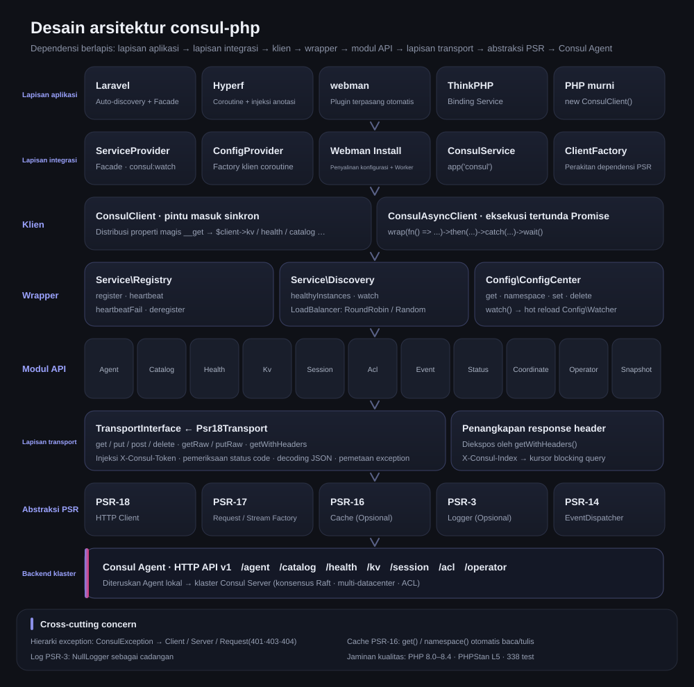
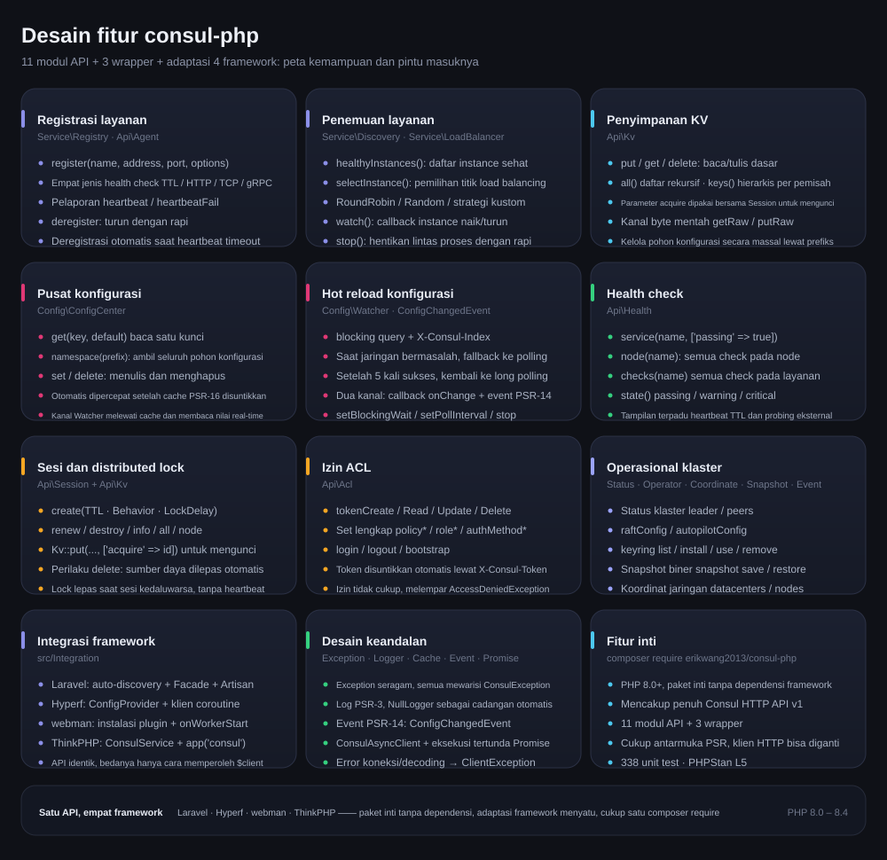
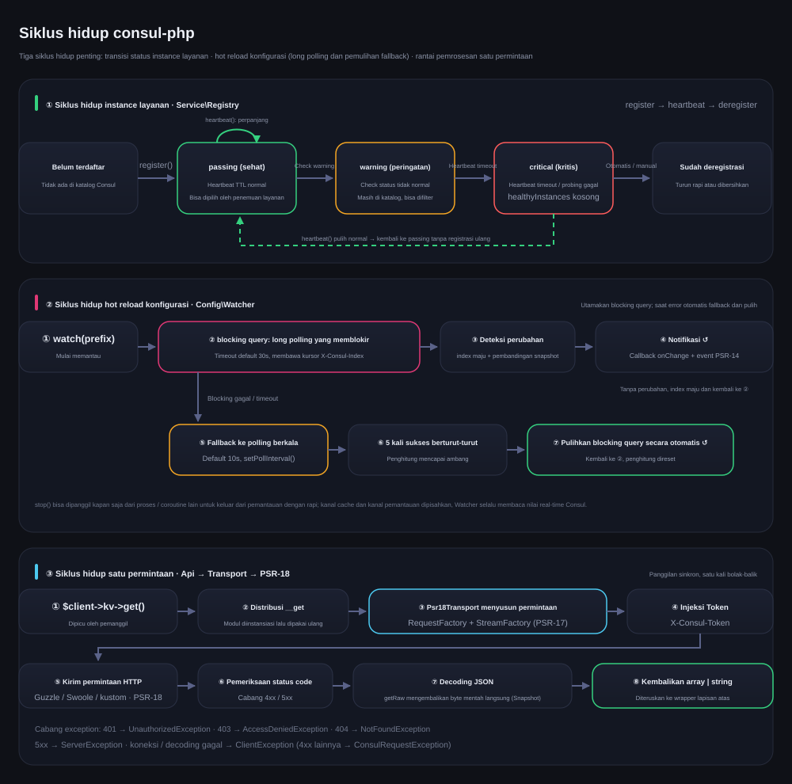

# erikwang2013/consul-php

[中文](../../../README.md) · [English](../en/README.md) · [日本語](../ja/README.md) · [한국어](../ko/README.md) · [Deutsch](../de/README.md) · [Français](../fr/README.md) · [Español](../es/README.md) · [Português](../pt/README.md) · [Русский](../ru/README.md) · [العربية](../ar/README.md) · [हिन्दी](../hi/README.md) · [বাংলা](../bn/README.md) · **Bahasa Indonesia**



Klien Consul untuk PHP, mencakup penuh Consul HTTP API v1, dengan fokus pada registrasi/penemuan layanan dan pusat konfigurasi. Paket inti tanpa dependensi framework, sudah menyertakan adaptasi Laravel / Hyperf / webman / ThinkPHP — cukup satu `composer require` untuk memakainya di framework apa pun.

PHP 8.0+ · PSR-18/PSR-3/PSR-14/PSR-16 · Tanpa dependensi framework

> **Consu, maskot proyek** —— asisten registry kecil yang hanya memakan heartbeat dan tidak pernah offline: antenanya adalah heartbeat health check, garis nadi di dadanya adalah status layanan, dan ACL Token tergantung di pinggangnya. Panggil di terminal dengan `composer pet`; lihat **Maskot Proyek Consu**.

---

## Ikhtisar Proyek

| | |
|---|---|
| **Apa ini** | Klien Consul HTTP API v1 yang ditulis murni dengan PHP: pintu masuk sinkron + Promise, 11 modul API, 3 wrapper |
| **Masalah yang dipecahkan** | Membuat aplikasi PHP bisa memakai Consul untuk registrasi/penemuan layanan dan hot reload konfigurasi, tanpa perlu menulis ulang klien untuk setiap framework |
| **Cara pakai** | `composer require erikwang2013/consul-php`; paket inti tanpa dependensi framework, adaptasi framework sudah menyatu dan ditemukan otomatis |
| **Framework yang didukung** | Laravel · Hyperf · webman · ThinkPHP —— API-nya identik, bedanya hanya cara memperoleh `$client` |
| **Konvensi dependensi** | Hanya bergantung pada antarmuka PSR (PSR-18/17/16/14/3); klien HTTP, cache, log, dan event dispatcher semuanya bisa diganti |
| **Jaminan kualitas** | PHP 8.0 – 8.4 · 309 unit test · PHPStan level 5 · PHP CS Fixer (PSR-12) |

### Kemampuan Inti

- **Registrasi & penemuan layanan** —— empat jenis health check: TTL / HTTP / TCP / gRPC; healthyInstances / selectInstance; load balancing RoundRobin, Random, dan kustom; pemantauan instance naik/turun
- **Pusat konfigurasi** —— baca/tulis KV, pohon namespace, percepatan cache PSR-16; hot reload mengutamakan long polling blocking query, otomatis fallback ke polling saat jaringan bermasalah, dan otomatis pulih setelah 5 kali sukses berturut-turut
- **Operasional klaster** —— distributed lock Session, ACL lengkap (Token / Policy / Role / AuthMethod), Status / Operator / Coordinate / Snapshot / Event
- **Keandalan** —— hierarki exception yang seragam, log PSR-3 (NullLogger sebagai cadangan), notifikasi dua kanal event PSR-14, normalisasi error di lapisan transport

---

## Navigasi Dokumentasi

| Dokumen | Tautan |
|------|------|
| **Struktur Proyek** | [Struktur Proyek](../../../README.md) |
| **Desain Arsitektur** | [Desain Arsitektur](../../../README.md) · [architecture.svg](./images/architecture.svg) |
| **Desain Fitur** | [Desain Fitur](../../../README.md) · [features.svg](./images/features.svg) |
| **Siklus Hidup** | [Siklus Hidup](../../../README.md) · [lifecycle.svg](./images/lifecycle.svg) |
| **Maskot Proyek** | [Consu](./images/pet.svg) |
| **README Multibahasa** | [docs/i18n/](../) · [中文](../../../README.md) · [English](../en/README.md) · [日本語](../ja/README.md) · [한국어](../ko/README.md) · [Deutsch](../de/README.md) · [Français](../fr/README.md) · [Español](../es/README.md) · [Português](../pt/README.md) · [Русский](../ru/README.md) · [العربية](../ar/README.md) · [हिन्दी](../hi/README.md) · [বাংলা](../bn/README.md) · **Bahasa Indonesia** |
| **Indeks Dokumentasi** | [docs/README.md](../../README.md) |
| **Integrasi Laravel** | lihat **Laravel** di bawah |
| **Integrasi Hyperf** | lihat **Hyperf** di bawah |
| **Integrasi webman** | lihat **webman** di bawah |
| **Integrasi ThinkPHP** | lihat **ThinkPHP** di bawah |
| **Dokumen Desain** | [docs/superpowers/specs/2026-05-14-consul-php-design.md](../../superpowers/specs/2026-05-14-consul-php-design.md) |

---

## Struktur Proyek

```
consul-php/
├── src/
│   ├── Client/                      # Pintu masuk klien
│   │   ├── ConsulClient.php         # Pintu masuk sinkron: __get mendistribusikan modul API dan wrapper
│   │   ├── ConsulAsyncClient.php    # Klien eksekusi tertunda berbasis Promise
│   │   └── Promise.php              # Implementasi Promise yang ringan
│   ├── Api/                         # Modul Consul HTTP API v1 (11 buah)
│   │   ├── Agent.php                # Anggota, info diri, mode maintenance, join / leave
│   │   ├── Catalog.php              # Katalog layanan dan node: registrasi, deregistrasi, kueri
│   │   ├── Health.php               # Health check: layanan / node / filter berdasarkan status
│   │   ├── Kv.php                   # Baca/tulis KV, daftar hierarkis, byte mentah, penguncian sesi
│   │   ├── Session.php              # Sesi (dasar distributed lock): buat, perpanjang, musnahkan
│   │   ├── Acl.php                  # Token / Policy / Role / AuthMethod
│   │   ├── Event.php                # Event pengguna: fire / list
│   │   ├── Status.php               # Status klaster: leader / peers
│   │   ├── Coordinate.php           # Koordinat jaringan: datacenters / nodes
│   │   ├── Operator.php             # Operasional Raft / Autopilot / Keyring
│   │   └── Snapshot.php             # Backup dan restore snapshot (aliran biner)
│   ├── Service/                     # Registrasi dan penemuan layanan
│   │   ├── Registry.php             # register / heartbeat / heartbeatFail / deregister
│   │   ├── Discovery.php            # healthyInstances / selectInstance / watch / stop
│   │   └── LoadBalancer/            # RoundRobin, Random, LoadBalancerInterface
│   ├── Config/                      # Pusat konfigurasi
│   │   ├── ConfigCenter.php         # get / namespace / set / delete / watch
│   │   ├── Watcher.php              # Hot reload: long polling + polling fallback + pemulihan otomatis
│   │   └── ConfigChangedEvent.php   # Event perubahan konfigurasi PSR-14
│   ├── Transport/                   # Lapisan transport
│   │   ├── TransportInterface.php   # Kontrak transport (termasuk getRaw / putRaw / getWithHeaders)
│   │   └── Psr18Transport.php       # Implementasi PSR-18: injeksi Token, decoding, pemetaan exception
│   ├── Support/                     # Versi terminal maskot proyek Consu (Pet::art / Pet::say)
│   ├── Exception/                   # Hierarki exception (ConsulException dan 7 subkelasnya)
│   └── Integration/                 # Adaptasi framework (menyatu, ditemukan otomatis)
│       ├── ClientFactory.php        # Perakitan dependensi PSR
│       ├── Laravel/                 # ServiceProvider + Facade + config/consul.php
│       ├── Hyperf/                  # ConfigProvider + factory klien coroutine + config
│       ├── Webman/                  # Instalasi plugin (Install) + config/app.php
│       └── Thinkphp/                # ConsulService + config/consul.php
├── tests/                           # Kasus uji PHPUnit (Api / Client / Config / Exception /
│                                    #   Integration / Service / Support / Transport)
├── docs/
│   ├── images/                      # Maskot proyek dan diagram desain (SVG)
│   │   ├── pet.svg                  # Maskot proyek Consu
│   │   ├── architecture.svg         # Desain arsitektur
│   │   ├── features.svg             # Desain fitur
│   │   └── lifecycle.svg            # Siklus hidup
│   ├── i18n/                        # en · ja · ko · de · fr · es · pt · ru · ar · hi · bn · id
│   ├── superpowers/specs/           # Dokumen desain
│   ├── superpowers/plans/           # Rencana implementasi
│   └── reports/                     # Laporan cakupan dan laporan pengujian
├── scripts/i18n-svg.php             # i18n build / verify
├── scripts/pet.php                  # Pintu masuk composer pet: panggil maskot proyek di terminal
├── composer.json                    # Dependensi dan deklarasi auto-discovery framework
├── phpunit.xml.dist                 # Konfigurasi pengujian
└── phpstan.neon                     # Konfigurasi analisis statis (level 5)
```

---

## Ringkasan Integrasi Framework

| | Laravel | Hyperf | webman | ThinkPHP |
|---|---|---|---|---|
| **Paket ekstensi** | Menyatu | Menyatu | Menyatu | Menyatu |
| **Cara injeksi** | Auto-discovery + `ServiceProvider` | Auto-discovery + `ConfigProvider` | `new` manual / plugin | `bind` manual ke container |
| **Akses praktis** | Facade `Consul` | Anotasi `#[Inject]` | — | Helper `app('consul')` |
| **Lokasi konfigurasi** | `config/consul.php` | `config/autoload/consul.php` | `config/plugin/erikwang2013/consul-php/app.php` | `config/consul.php` |
| **Klien HTTP** | Guzzle (PSR-18) | Klien coroutine Swoole | Guzzle (PSR-18) | Guzzle (PSR-18) |
| **Cache** | Laravel Cache (PSR-16) | Hyperf Cache (PSR-16) | Disuntikkan sendiri | Disuntikkan sendiri |
| **Menjalankan hot reload** | Perintah Artisan | Coroutine `AbstractProcess` | Proses `Worker` | Timer / proses Swoole |
| **Listener event** | `EventServiceProvider` | Hyperf Event | — | ThinkPHP Listener |
| **Dokumentasi** | [Kode sumber](../../../src/Integration/Laravel/) | [Kode sumber](../../../src/Integration/Hyperf/) | [Kode sumber](../../../src/Integration/Webman/) | [Kode sumber](../../../src/Integration/Thinkphp/) |

### Operasi Sama, Cara Berbeda

**Mendapatkan klien:**

| Framework | Cara |
|------|------|
| Umum | `$client = new ConsulClient(['base_uri' => '...']);` |
| Laravel | `$client = app(ConsulClient::class);` atau `Consul::kv->get(...)` |
| Hyperf | `#[Inject] private ConsulClient $consul;` |
| webman | `$client = new ConsulClient(['base_uri' => '...']);` |
| ThinkPHP | `$client = app('consul');` |

**Registrasi layanan:**

```php
// Semua framework memakai API yang sama; bedanya hanya cara memperoleh $client
$client->serviceRegistry()->register('my-app', '10.0.0.1', 8080, [
    'id'    => 'my-app-1',
    'tags'  => ['v1'],
    'check' => ['ttl' => '30s'],
]);
```

**Membaca konfigurasi:**

```php
// API yang sama; Laravel/Hyperf otomatis membaca lewat cache
$dbHost = $client->configCenter()->get('app/db_host', 'default');
```

**Cara menjalankan hot reload:**

| Framework | Perintah / cara memulai | Lingkungan |
|------|----------------|---------|
| Laravel | `php artisan consul:watch` | Proses Artisan terpisah |
| Hyperf | `ConsulWatchProcess` (mulai otomatis) | Coroutine Swoole |
| webman | fork di dalam `onWorkerStart` | Proses Worker |
| ThinkPHP | Timer::setInterval / Swoole Process | Proses terpisah |

---

## Instalasi

```bash
# Paket inti
composer require erikwang2013/consul-php

# Implementasi PSR-18 (pilih salah satu)
composer require guzzlehttp/guzzle php-http/guzzle7-adapter php-http/discovery
```

### Integrasi Framework

Adaptasi framework sudah menyatu di paket inti, tidak perlu instalasi tambahan. Setelah paket inti terpasang, framework terkait akan otomatis menemukan dan mendaftarkan layanan Consul:

- **Laravel** — otomatis menemukan `ConsulServiceProvider`, menyediakan Facade `Consul` dan dependency injection
- **Hyperf** — otomatis menemukan `ConfigProvider`, menyediakan factory klien coroutine dan injeksi `#[Inject]`
- **webman** — otomatis menemukan plugin, menyalin file konfigurasi saat `composer install`
- **ThinkPHP** — membuat `ConsulService` di direktori `app/service` lalu mendaftarkannya ke aplikasi

---

## Mulai Cepat (Umum)

```php
use Erikwang2013\Consul\Client\ConsulClient;

// Penggunaan dasar
$client = new ConsulClient(['base_uri' => 'http://127.0.0.1:8500']);

// Dengan ACL Token
$client = new ConsulClient([
    'base_uri' => 'http://127.0.0.1:8500',
    'token'    => 'your-consul-acl-token',
]);
```

Token otomatis dilampirkan ke semua permintaan melalui header `X-Consul-Token`.

### Registrasi Layanan

Mendukung empat mode health check: TTL, HTTP, TCP, dan gRPC.

```php
$registry = $client->serviceRegistry();

// Mode TTL — aplikasi yang mengirim heartbeat sendiri
$registry->register('user-service', '192.168.1.10', 8080, [
    'id'    => 'user-service-1',
    'tags'  => ['v1', 'primary'],
    'meta'  => ['region' => 'cn-east'],
    'check' => [
        'ttl' => '30s',
        'deregister_critical_service_after' => '120s', // deregistrasi otomatis saat heartbeat timeout
    ],
]);

// Mode HTTP — Consul melakukan probing berkala
$registry->register('web', '192.168.1.10', 80, [
    'id'    => 'web-1',
    'check' => [
        'http'     => 'http://192.168.1.10:80/health',
        'interval' => '10s',
        'timeout'  => '3s',
    ],
]);

// Mode TCP
$registry->register('mysql', '192.168.1.10', 3306, [
    'check' => ['tcp' => '192.168.1.10:3306', 'interval' => '10s'],
]);

// Mode gRPC
$registry->register('grpc-svc', '192.168.1.10', 50051, [
    'check' => ['grpc' => '192.168.1.10:50051', 'interval' => '10s'],
]);

// Heartbeat (mode TTL)
$registry->heartbeat('user-service-1');

// Deregistrasi
$registry->deregister('user-service-1');
```

### Penemuan Layanan

Menyertakan dua strategi load balancing bawaan: RoundRobin (default) dan Random.

```php
$discovery = $client->serviceDiscovery();

// Semua instance yang sehat
$instances = $discovery->healthyInstances('user-service');
// [
//   ['address' => '10.0.0.1', 'port' => 8080, 'service' => 'user-service', 'id' => 'user-1', 'tags' => ['v1']],
//   ['address' => '10.0.0.2', 'port' => 8080, 'service' => 'user-service', 'id' => 'user-2', 'tags' => ['v1']],
// ]

// Pilih satu lewat load balancing
$instance = $discovery->selectInstance('user-service');

// Strategi load balancing kustom
use Erikwang2013\Consul\Service\LoadBalancer\Random;
$discovery = new Discovery($health, loadBalancer: new Random());

// Pantau perubahan instance layanan
$discovery->watch('user-service', function (array $instances) {
    // Callback dipanggil saat instance naik/turun
});

// Hentikan pemantauan (dipanggil dari proses/coroutine lain)
$discovery->stop();
```

### Pusat Konfigurasi

```php
$config = $client->configCenter();

// Satu kunci
$dbHost = $config->get('app/db_host', 'localhost');

// Seluruh namespace
$all = $config->namespace('app/');
// ['app/db_host' => 'mysql.local', 'app/redis_host' => 'redis.local', ...]

// Tulis / hapus
$config->set('app/cache_ttl', '3600');
$config->delete('app/old_key');

// Hot reload
$watcher = $config->watch('app/');
$watcher
    ->setBlockingWait(30)   // timeout long polling (detik)
    ->setPollInterval(10)   // interval saat fallback ke polling (detik)
    ->onChange(function (array $updated) {
        // Callback saat konfigurasi berubah
    });
$watcher->start(); // memblokir; jalankan di proses/coroutine terpisah
// $watcher->stop();  // panggil dari proses/coroutine lain untuk menghentikan pemantauan
```

**Cara kerja hot reload:** mengutamakan Consul blocking query (long polling `index`); saat jaringan bermasalah otomatis fallback ke polling berkala, dan setelah koneksi pulih otomatis kembali ke long polling. Notifikasi lewat dua kanal: callback + EventDispatcher PSR-14.

**Strategi cache:** setelah cache PSR-16 disuntikkan, `get()` dan `namespace()` otomatis membaca dan menulis cache. Watcher selalu membaca data real-time dari Consul, tidak lewat cache.

### Penyimpanan KV

```php
$kv = $client->kv;

$kv->put('key', 'value');
$entry = $kv->get('key');              // null berarti tidak ada
$all = $kv->all('prefix/');            // daftar rekursif
$keys = $kv->keys('prefix/');          // hanya nama kunci
$keys = $kv->keys('prefix/', '/');     // daftar hierarkis berdasarkan pemisah
$kv->delete('key');
```

### API Health Check

```php
$health = $client->health;

$health->service('user-service', ['passing' => true]);  // hanya instance sehat
$health->node('node-1');                                 // semua check pada node
$health->checks('user-service');                          // semua check pada layanan
$health->state('critical');                               // berdasarkan status: passing/warning/critical
```

### Session / Distributed Lock

```php
$session = $client->session;

$sess = $session->create([
    'Name'     => 'lock-session',
    'TTL'      => '30s',
    'Behavior' => 'delete',    // KV terkait dihapus otomatis saat kedaluwarsa
]);
$sessionId = $sess['ID'];

// Kunci sumber daya
$locked = $client->kv->put('lock/resource', '1', ['acquire' => $sessionId]);

// Perpanjang / lepas
$session->renew($sessionId);
$session->destroy($sessionId);
```

### ACL

```php
$acl = $client->acl;

// Token
$token = $acl->tokenCreate(['Description' => 'read-only', 'Policies' => [['Name' => 'read-policy']]]);
$acl->tokenRead($token['AccessorID']);
$acl->tokenDelete($token['AccessorID']);

// Policy
$policy = $acl->policyCreate(['Name' => 'my-policy', 'Rules' => 'node "" { policy = "read" }']);

// Role
$role = $acl->roleCreate(['Name' => 'reader', 'Policies' => [['Name' => 'my-policy']]]);

// Login/Logout
$result = $acl->login(['AuthMethod' => 'my-auth', 'BearerToken' => '...']);
$acl->logout();
```

### Klien Asinkron

```php
use Erikwang2013\Consul\Client\ConsulAsyncClient;

$client = new ConsulAsyncClient(['base_uri' => 'http://127.0.0.1:8500']);

$promise = $client->wrap(fn() => $client->kv->get('key'));

$promise
    ->then(fn($result) => print_r($result))
    ->catch(fn(\Throwable $e) => log_error($e));

$value = $promise->wait(); // blokir sampai hasilnya didapat
```

**Catatan:** klien asinkron berbasis pola Promise, cocok untuk skenario yang butuh permintaan konkuren. Di lingkungan coroutine Hyperf, klien HTTP bawaan sudah bisa mencapai konkurensi tingkat coroutine.

---

## Panduan Integrasi Setiap Framework

### Laravel

Laravel otomatis menemukan `ConsulServiceProvider`, tidak perlu registrasi manual.

```bash
php artisan vendor:publish --tag=consul-config
```

Setel `CONSUL_BASE_URI` di `.env`, lalu pakai lewat dependency injection atau Facade. Ekstensi Laravel otomatis menyuntikkan klien PSR-18, cache PSR-16, log PSR-3, dan event dispatcher PSR-14.

```php
// Dependency injection
use Erikwang2013\Consul\Client\ConsulClient;
public function show(ConsulClient $consul) { ... }

// Facade
use Consul;
$services = Consul::catalog->services();

// Hot reload konfigurasi — perintah Artisan
// php artisan consul:watch
```

### Hyperf

Hyperf otomatis menemukan `ConfigProvider`, tidak perlu registrasi manual.

```bash
php bin/hyperf.php vendor:publish consul
```

Ekstensi Hyperf otomatis mendaftarkan `ConsulClient` ke container DI; permintaan HTTP secara default memakai klien coroutine Swoole. Registrasi layanan sebaiknya diletakkan di listener event `MainServerStart`, sedangkan hot reload dijalankan di dalam coroutine memakai `AbstractProcess`.

```php
// Injeksi lewat anotasi
#[Inject]
private ConsulClient $consul;

// Registrasi layanan — event MainServerStart
$consul->serviceRegistry()->register(...);

// Hot reload — ConsulWatchProcess mulai otomatis
```

### webman

webman otomatis menemukan plugin; saat `composer install` file konfigurasi disalin ke `config/plugin/erikwang2013/consul-php/`. Karena webman berarsitektur memori persisten, registrasi layanan diletakkan di callback `onWorkerStart` dan cukup dilakukan sekali secara global.

```php
// process/ConsulRegister.php
class ConsulRegister {
    public function onWorkerStart(Worker $worker): void {
        $consul = new ConsulClient(['base_uri' => getenv('CONSUL_BASE_URI')]);
        $consul->serviceRegistry()->register('webman-app', ...);
    }
}
```

### ThinkPHP

ThinkPHP tidak punya mekanisme auto-discovery, jadi Service harus didaftarkan manual. Salin file konfigurasi ke `config/consul.php`, lalu daftarkan `ConsulService` di direktori `app/service`:

```php
// app/service/ConsulService.php
namespace app\service;

use Erikwang2013\Consul\Integration\Thinkphp\ConsulService as BaseConsulService;

class ConsulService extends BaseConsulService
{
}
```

Atau lakukan binding langsung di `app/AppService.php`:

```php
$this->app->bind('consul', fn() => new ConsulClient(config('consul')));

// Pemakaian
$services = app('consul')->catalog->services();

// Fungsi helper — app/common.php
function consul() { return app('consul'); }
```

---

## Klien HTTP Kustom

```php
$client = new ConsulClient(
    config:          ['base_uri' => 'http://consul:8500', 'token' => 'acl-token'],
    httpClient:      $myPsr18Client,        // wajib, atau ditemukan otomatis
    requestFactory:  $myRequestFactory,      // sama seperti di atas
    streamFactory:   $myStreamFactory,       // sama seperti di atas
    logger:          $myLogger,              // PSR-3, opsional
    cache:           $myCache,               // PSR-16, opsional
    eventDispatcher: $myEventDispatcher,     // PSR-14, opsional
);
```

---

## Referensi Cepat Modul API

| Properti | Kelas | Metode utama |
|------|-----|---------|
| `$client->kv` | `Api\Kv` | `get` `put` `delete` `all` `keys` |
| `$client->agent` | `Api\Agent` | `members` `self` `registerService` `deregisterService` `checks` `services` |
| `$client->catalog` | `Api\Catalog` | `register` `deregister` `nodes` `services` `service` `node` |
| `$client->health` | `Api\Health` | `service` `node` `checks` `state` |
| `$client->session` | `Api\Session` | `create` `destroy` `renew` `info` `all` `node` |
| `$client->acl` | `Api\Acl` | `token*` `policy*` `role*` `authMethod*` `login` `logout` `bootstrap` |
| `$client->event` | `Api\Event` | `fire` `list` |
| `$client->status` | `Api\Status` | `leader` `peers` |
| `$client->coordinate` | `Api\Coordinate` | `datacenters` `nodes` `node` |
| `$client->operator` | `Api\Operator` | `raftConfig` `autopilotConfig` `keyring` (konstanta: `KEYRING_LIST` `KEYRING_INSTALL` `KEYRING_USE` `KEYRING_REMOVE`) |
| `$client->snapshot` | `Api\Snapshot` | `save` (mengembalikan byte snapshot mentah lewat `getRaw()`) `restore` (mengirim byte mentah lewat `putRaw()`) |

Wrapper:

| Metode | Kembalian | Keterangan |
|------|------|------|
| `$client->serviceRegistry()` | `Service\Registry` | Registrasi layanan/heartbeat/deregistrasi |
| `$client->serviceDiscovery()` | `Service\Discovery` | Daftar instance/load balancing/pemantauan perubahan |
| `$client->configCenter()` | `Config\ConfigCenter` | Baca/tulis konfigurasi/cache/hot reload |

---

## Hierarki Exception

Semua exception mewarisi `ConsulException` (turunan `RuntimeException`):

```
ConsulException
├── ClientException           Error transport HTTP (koneksi gagal, DNS, timeout, dll.)
├── ServerException           Consul mengembalikan 5xx
└── ConsulRequestException    Consul mengembalikan 4xx
    ├── NotFoundException     404
    └── AccessDeniedException 403
```

```php
try {
    $client->kv->get('key');
} catch (ClientException $e) {
    // Masalah jaringan
} catch (NotFoundException $e) {
    // Sumber daya tidak ada
} catch (ConsulException $e) {
    // Error Consul lainnya
}
```

---

## Desain Arsitektur



Arah dependensi dari atas ke bawah; setiap lapisan hanya bergantung pada abstraksi lapisan di bawahnya:

- **Lapisan aplikasi / integrasi** —— 4 adaptasi framework menyatu di paket inti `src/Integration/` dan didaftarkan lewat auto-discovery composer; lapisan aplikasi selalu hanya berhadapan dengan satu pintu masuk, `ConsulClient`.
- **Klien** —— `ConsulClient` mengekspos 11 modul API (`$client->kv`, `$client->health` …) dan 3 wrapper (`serviceRegistry()` / `serviceDiscovery()` / `configCenter()`) secara seragam melalui `__get`; `ConsulAsyncClient` menyediakan eksekusi tertunda berbasis Promise.
- **Wrapper** —— `Registry` / `Discovery` / `ConfigCenter` menggabungkan modul API; `Watcher` bergantung pada `X-Consul-Index` yang dikembalikan `getWithHeaders()` untuk menjalankan long polling.
- **Modul API** —— satu modul mewakili satu kelompok endpoint Consul v1, semuanya keluar-masuk lewat `TransportInterface` yang sama.
- **Lapisan transport** —— `Psr18Transport` menangani injeksi Token, pemeriksaan status code, decoding JSON, dan pemetaan exception; inilah satu-satunya titik keluar jaringan di seluruh paket.
- **Abstraksi PSR** —— hanya bergantung pada antarmuka PSR (18/17/16/14/3); klien HTTP, cache, log, dan event dispatcher semuanya bisa diganti, dan otomatis fallback bila tidak disuntikkan.

---

## Desain Fitur



Peta kemampuan: registrasi dan penemuan layanan, pusat konfigurasi dan hot reload, KV / health check / session lock / ACL / operasional klaster, adaptasi 4 framework, serta desain keandalan. Setiap kartu kemampuan mencantumkan kelas pintu masuknya; cara pemanggilan detailnya lihat **Mulai Cepat (Umum)** dan **Referensi Cepat Modul API** di atas.

---

## Siklus Hidup



- **Siklus hidup instance layanan** —— `register()` → passing (perpanjangan berkala lewat `heartbeat()`) → warning → critical → deregistrasi otomatis atau manual; setelah heartbeat pulih, instance bisa kembali dari critical ke passing tanpa perlu registrasi ulang.
- **Siklus hidup hot reload konfigurasi** —— `watch()` memulai blocking query (default 30s, membawa `X-Consul-Index`) → deteksi perubahan → callback `onChange` + `ConfigChangedEvent`; saat blocking gagal otomatis fallback ke polling berkala (default 10s), dan setelah 5 kali sukses berturut-turut kembali ke long polling; `stop()` bisa keluar dengan rapi dari proses / coroutine lain.
- **Siklus hidup satu permintaan** —— modul API → `Psr18Transport` menyusun permintaan PSR-17 → menyuntikkan `X-Consul-Token` → dikirim lewat PSR-18 → pemeriksaan status code → decoding JSON (`getRaw()` mengembalikan byte mentah langsung) → mengembalikan array; 401/403/404/5xx dan kegagalan transport dipetakan ke exception masing-masing.

---

## Maskot Proyek Consu

Maskot ini bukan sekadar ilustrasi; ia bisa dipanggil dari terminal maupun dari kode:

```bash
composer pet
```

```text
╭───────────────────────────────────────────────────────────────────────────╮
│ consul-php · Klien Consul PHP — sekali composer require, empat framework  │
╰──────┬────────────────────────────────────────────────────────────────────╯
       │
       ●
       │
   ╭───┴───╮
   │ ◕   ◕ │
   │  ╰─╯  │
   ├───────┤
   │╱╲╱╲╱╲ │
   ╰┬─────┬╯
    ╰─┬─┬─╯
```

Panggil langsung `Erikwang2013\Consul\Support\Pet` di dalam kode:

```php
use Erikwang2013\Consul\Support\Pet;

echo Pet::art();                      // hanya maskot
echo Pet::say('konfigurasi consul sudah siap');    // gelembung di atas kepala + maskot
echo Pet::art(false);                 // paksa teks biasa
```

Warna ditentukan otomatis sesuai kemampuan terminal: saat bukan TTY atau variabel `NO_COLOR` disetel, output berupa teks biasa sehingga tidak mengotori log dan output CI.

Desainnya konsisten dengan [pet.svg](./images/pet.svg): antena = heartbeat health check (hijau passing), kacamata = penemuan layanan, garis nadi di dada = status layanan (magenta Consul), lencana di pinggang = ACL Token.

---

## Persyaratan Minimum

- PHP 8.0+
- Composer
- Implementasi PSR-18 HTTP Client
- [Opsional] Cache PSR-16 — `Discovery::healthyInstances()` / `ConfigCenter::get()` otomatis memakai cache
- [Opsional] Logger PSR-3 — log permintaan
- [Opsional] EventDispatcher PSR-14 — event `ConfigChangedEvent`

## Dukung Proyek Open Source Ini

| WeChat | Alipay |
|:---:|:---:|
|  |  |

---

## License

MIT

Terjemahan ini dihasilkan oleh AI; jika ada ketidakakuratan, silakan ajukan Issue/PR.
