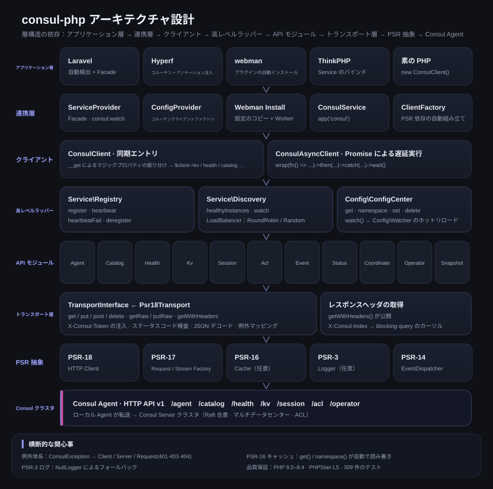
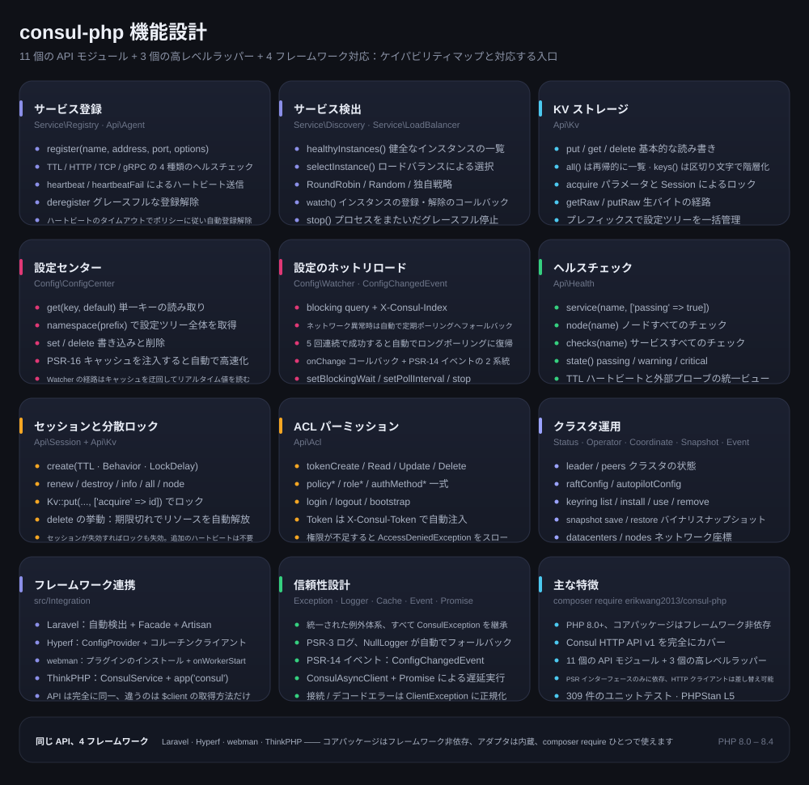
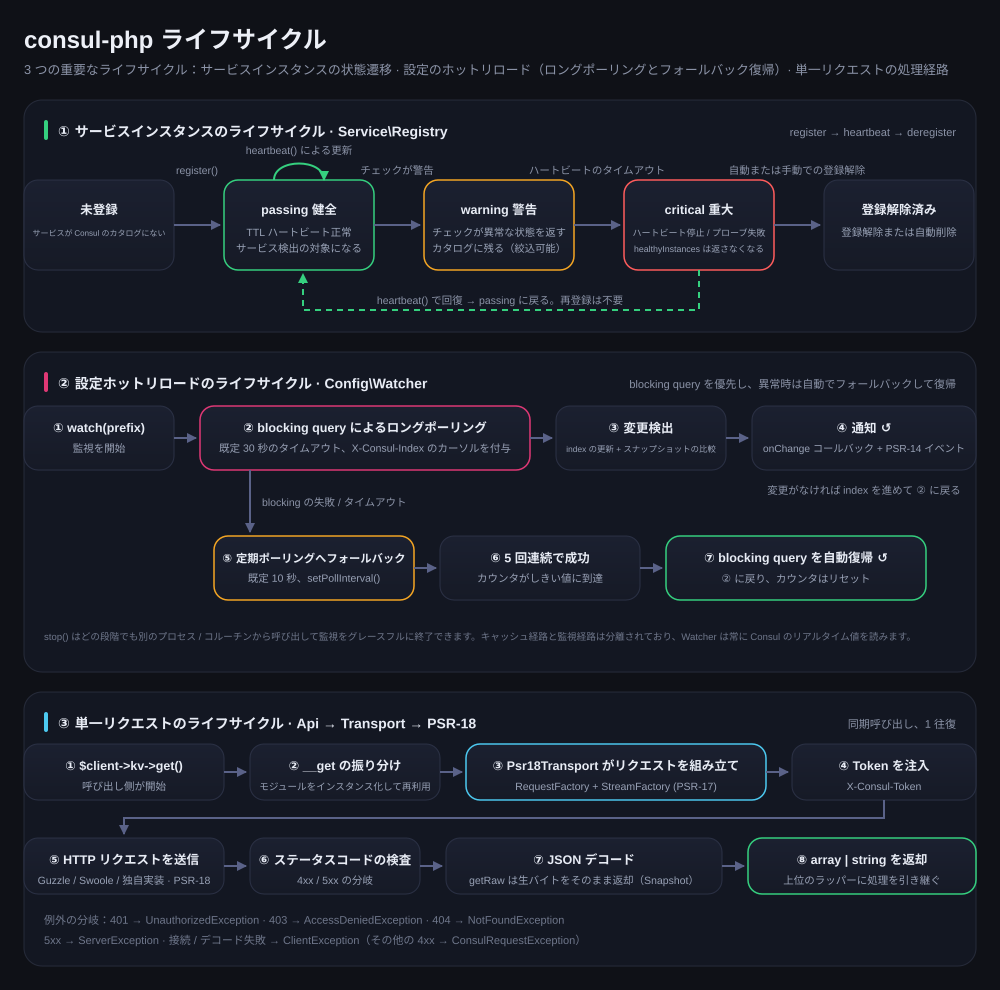

# erikwang2013/consul-php

[中文](../../../README.md) · [English](../en/README.md) · **日本語** · [한국어](../ko/README.md) · [Deutsch](../de/README.md) · [Français](../fr/README.md) · [Español](../es/README.md) · [Português](../pt/README.md) · [Русский](../ru/README.md) · [العربية](../ar/README.md) · [हिन्दी](../hi/README.md) · [বাংলা](../bn/README.md) · [Bahasa Indonesia](../id/README.md)



PHP 製の Consul クライアントです。Consul HTTP API v1 を完全にカバーし、サービスの登録・検出と設定センターを重点的にサポートします。コアパッケージはフレームワークに依存せず、Laravel / Hyperf / webman / ThinkPHP のアダプタを内蔵。composer require ひとつでどのフレームワークでも使えます。

PHP 8.0+ · PSR-18/PSR-3/PSR-14/PSR-16 · フレームワーク非依存

> **プロジェクトのペット Consu** —— ハートビートだけを食べて一度も落ちないレジストリの小さな相棒です。アンテナはヘルスチェックのハートビート、胸の脈線はサービスの状態、腰には ACL Token を下げています。ターミナルでは `composer pet` で呼び出せます。詳しくは「プロジェクトのペット Consu」を参照してください。

---

## プロジェクト概要

| | |
|---|---|
| **何か** | 純粋な PHP で実装した Consul HTTP API v1 クライアント：同期 + Promise の 2 つの入口、18 個の API モジュール、3 個の高レベルラッパー |
| **解決する課題** | PHP アプリケーションを Consul に接続し、サービスの登録・検出と設定のホットリロードを実現します。フレームワークごとにクライアントを書き直す必要はありません |
| **使い方** | `composer require erikwang2013/consul-php`。コアパッケージはフレームワーク非依存で、フレームワークアダプタは内蔵かつ自動検出されます |
| **対応フレームワーク** | Laravel · Hyperf · webman · ThinkPHP —— API は完全に同一で、違うのは `$client` の取得方法だけです |
| **依存の方針** | PSR インターフェース（PSR-18/17/16/14/3）のみに依存。HTTP クライアント、キャッシュ、ログ、イベントディスパッチャはすべて差し替え可能です |
| **品質保証** | PHP 8.0 – 8.4 · 594 件のユニットテスト · PHPStan level 5 · PHP CS Fixer (PSR-12) |

### 主な機能

- **サービスの登録と検出** —— TTL / HTTP / TCP / gRPC の 4 種類のヘルスチェック、healthyInstances / selectInstance、RoundRobin・Random・独自のロードバランス、インスタンスの登録・解除の監視
- **設定センター** —— KV の読み書き、名前空間ツリー、PSR-16 キャッシュによる高速化。ホットリロードは blocking query のロングポーリングを優先し、ネットワーク異常時はポーリングへ自動的にフォールバック、5 回連続で成功すると自動復帰します
- **クラスタ運用** —— Session による分散ロック、ACL 一式（Token / Policy / Role / AuthMethod）、Status / Operator / Coordinate / Snapshot / Event
- **信頼性** —— 統一された例外体系、PSR-3 ログ（NullLogger によるフォールバック）、PSR-14 イベントによる 2 系統の通知、トランスポート層でのエラー正規化

---

## ドキュメントナビ

| ドキュメント | リンク |
|------|------|
| **プロジェクト構成** | プロジェクト構成 |
| **アーキテクチャ設計** | アーキテクチャ設計 · [architecture.svg](./images/architecture.svg) |
| **機能設計** | 機能設計 · [features.svg](./images/features.svg) |
| **ライフサイクル** | ライフサイクル · [lifecycle.svg](./images/lifecycle.svg) |
| **プロジェクトのペット** | [Consu](./images/pet.svg) |
| **多言語 README** | [docs/i18n/](../../i18n/) · [English](../en/README.md) · [日本語](../ja/README.md) · [한국어](../ko/README.md) · [Deutsch](../de/README.md) · [Français](../fr/README.md) · [Español](../es/README.md) · [Português](../pt/README.md) · [Русский](../ru/README.md) · [العربية](../ar/README.md) · [हिन्दी](../hi/README.md) · [বাংলা](../bn/README.md) · [Bahasa Indonesia](../id/README.md) |
| **ドキュメント総目次** | [docs/README.md](../../README.md) |
| **Laravel 連携** | 下の [Laravel](#laravel) を参照 |
| **Hyperf 連携** | 下の [Hyperf](#hyperf) を参照 |
| **webman 連携** | 下の [webman](#webman) を参照 |
| **ThinkPHP 連携** | 下の [ThinkPHP](#thinkphp) を参照 |
| **設計ドキュメント** | [docs/superpowers/specs/2026-05-14-consul-php-design.md](../../superpowers/specs/2026-05-14-consul-php-design.md) |

---

## プロジェクト構成

```
consul-php/
├── src/
│   ├── Client/                      # クライアントの入口
│   │   ├── ConsulClient.php         # 同期エントリ：__get で API モジュールと高レベルラッパーを振り分け
│   │   ├── ConsulAsyncClient.php    # Promise による遅延実行クライアント
│   │   └── Promise.php              # 軽量な Promise 実装
│   ├── Api/                         # Consul HTTP API v1 モジュール（18 個）
│   │   ├── Agent.php                # メンバー、自身の情報、メンテナンスモード、join / leave
│   │   ├── Catalog.php              # サービスとノードのカタログ：登録、登録解除、照会
│   │   ├── Health.php               # ヘルスチェック：サービス / ノード / 状態による絞り込み
│   │   ├── Kv.php                   # KV の読み書き、階層的な一覧、生バイト、セッションによるロック
│   │   ├── Session.php              # セッション（分散ロックの基盤）：作成、更新、破棄
│   │   ├── Acl.php                  # Token / Policy / Role / AuthMethod
│   │   ├── Event.php                # ユーザーイベント：fire / list
│   │   ├── Status.php               # クラスタの状態：leader / peers
│   │   ├── Coordinate.php           # ネットワーク座標：datacenters / nodes
│   │   ├── Operator.php             # Raft / Autopilot / Keyring の運用
│   │   ├── Snapshot.php             # スナップショットのバックアップと復元（バイナリストリーム）
│   │   ├── Txn.php                  # トランザクション：アトミックなマルチキー / 一括 CAS
│   │   ├── ConfigEntry.php          # 設定項目：mesh / gateway / service-intentions
│   │   ├── Connect.php              # service mesh の認可チェーン（intentions）
│   │   ├── Query.php                # プリペアドクエリ：フェイルオーバー / 近接検出
│   │   ├── Peering.php              # クラスタの peering
│   │   ├── DiscoveryChain.php       # メッシュ discovery chain：ルート / 分割 / フェイルオーバーの解決
│   │   ├── ExportedService.php      # パーティション / peering をまたぐサービスのエクスポートとインポート
│   ├── Service/                     # サービスの登録と検出
│   │   ├── Registry.php             # register / heartbeat / heartbeatFail / deregister
│   │   ├── Discovery.php            # healthyInstances / selectInstance / watch / stop
│   │   └── LoadBalancer/            # RoundRobin、Random、LoadBalancerInterface
│   ├── Config/                      # 設定センター
│   │   ├── ConfigCenter.php         # get / namespace / set / delete / watch
│   │   ├── Watcher.php              # ホットリロード：ロングポーリング + フォールバックポーリング + 自動復帰
│   │   └── ConfigChangedEvent.php   # PSR-14 の設定変更イベント
│   ├── Transport/                   # トランスポート層
│   │   ├── TransportInterface.php   # トランスポートの契約（getRaw / putRaw / getWithHeaders を含む）
│   │   └── Psr18Transport.php       # PSR-18 実装：Token 注入、デコード、例外マッピング
│   ├── Http/                        # 内蔵 PSR-7/17/18（cURL クライアント、Guzzle が無いときのフォールバック）
│   ├── Support/                     # プロジェクトのペット Consu のターミナル版（Pet::art / Pet::say）
│   ├── Exception/                   # 例外体系（ConsulException とそのサブクラス、7 個）
│   └── Integration/                 # フレームワークアダプタ（内蔵、自動検出）
│       ├── ClientFactory.php        # PSR 依存の自動組み立て
│       ├── Laravel/                 # ServiceProvider + Facade + config/consul.php
│       ├── Hyperf/                  # ConfigProvider + コルーチンクライアントファクトリ + config
│       ├── Webman/                  # プラグインのインストール（Install）+ config/app.php
│       ├── Thinkphp/                # ConsulService + config/consul.php
│       └── Native/                  # ネイティブ PHP：登録 / ハートビート / 自動登録解除を一行で
├── tests/                           # PHPUnit のテスト（Api / Client / Config / Exception /
│                                    #   Integration / Service / Support / Transport）
├── docs/
│   ├── images/                      # プロジェクトのペットと設計図（SVG）
│   │   ├── pet.svg                  # プロジェクトのペット Consu
│   │   ├── architecture.svg         # アーキテクチャ設計
│   │   ├── features.svg             # 機能設計
│   │   └── lifecycle.svg            # ライフサイクル
│   ├── i18n/                        # 12 言語の README とローカライズ済み画像（en · ja · ko · de · fr · es · pt · ru · ar · hi · bn · id）
│   ├── superpowers/specs/           # 設計ドキュメント
│   ├── superpowers/plans/           # 実装計画
│   └── reports/                     # カバレッジレポートとテストレポート
├── scripts/i18n-svg.php             # 多言語リソースの生成ツール（extract / build / verify）
├── scripts/pet.php                  # composer pet の入口：ターミナルでプロジェクトのペットを呼び出す
├── composer.json                    # 依存とフレームワーク自動検出の宣言
├── phpunit.xml.dist                 # テスト設定
└── phpstan.neon                     # 静的解析の設定（level 5）
```

---

## フレームワーク連携一覧

| | Laravel | Hyperf | webman | ThinkPHP |
|---|---|---|---|---|
| **拡張パッケージ** | 内蔵 | 内蔵 | 内蔵 | 内蔵 |
| **注入方法** | 自動検出 + `ServiceProvider` | 自動検出 + `ConfigProvider` | 手動 `new` / プラグイン | 手動でコンテナに `bind` |
| **手軽なアクセス** | `Consul` Facade | `#[Inject]` アノテーション | — | `app('consul')` ヘルパー |
| **設定ファイルの場所** | `config/consul.php` | `config/autoload/consul.php` | `config/plugin/erikwang2013/consul-php/app.php` | `config/consul.php` |
| **HTTP クライアント** | Guzzle (PSR-18) | Swoole コルーチンクライアント | Guzzle (PSR-18) | Guzzle (PSR-18) |
| **キャッシュ** | Laravel Cache (PSR-16) | Hyperf Cache (PSR-16) | 自身で注入 | 自身で注入 |
| **ホットリロードの実行** | Artisan コマンド | `AbstractProcess` コルーチン | `Worker` プロセス | Timer / Swoole プロセス |
| **イベント監視** | `EventServiceProvider` | Hyperf Event | — | ThinkPHP Listener |
| **ドキュメント** | [ソース](../../../src/Integration/Laravel/) | [ソース](../../../src/Integration/Hyperf/) | [ソース](../../../src/Integration/Webman/) | [ソース](../../../src/Integration/Thinkphp/) |

### 同じ操作、違う書き方

**クライアントの取得：**

| フレームワーク | 書き方 |
|------|------|
| 共通 | `$client = new ConsulClient(['base_uri' => '...']);` |
| Laravel | `$client = app(ConsulClient::class);` または `Consul::kv->get(...)` |
| Hyperf | `#[Inject] private ConsulClient $consul;` |
| webman | `$client = new ConsulClient(['base_uri' => '...']);` |
| ThinkPHP | `$client = app('consul');` |

**サービスの登録：**

```php
// どのフレームワークでも API は同じです。違いは $client の取得方法だけ
$client->serviceRegistry()->register('my-app', '10.0.0.1', 8080, [
    'id'    => 'my-app-1',
    'tags'  => ['v1'],
    'check' => ['ttl' => '30s'],
]);
```

**設定の読み取り：**

```php
// 同じ API です。Laravel/Hyperf では自動的にキャッシュを使います
$dbHost = $client->configCenter()->get('app/db_host', 'default');
```

**ホットリロードの実行方法：**

| フレームワーク | 起動コマンド / 方法 | 実行環境 |
|------|----------------|---------|
| Laravel | `php artisan consul:watch` | 独立した Artisan プロセス |
| Hyperf | `ConsulWatchProcess`（自動起動） | Swoole コルーチン |
| webman | `onWorkerStart` で fork | Worker プロセス |
| ThinkPHP | Timer::setInterval / Swoole Process | 独立したプロセス |

---

## インストール

```bash
# コアパッケージ
composer require erikwang2013/consul-php

# PSR-18 実装（任意：インストールしなければ内蔵 cURL クライアントを自動的に使用）
composer require guzzlehttp/guzzle php-http/guzzle7-adapter php-http/discovery
```

### フレームワーク連携

フレームワークアダプタはコアパッケージに内蔵されているため、追加インストールは不要です。コアパッケージをインストールすると、対応するフレームワークが Consul サービスを自動検出して登録します：

- **Laravel** — `ConsulServiceProvider` を自動検出し、`Consul` Facade と依存性注入を提供
- **Hyperf** — `ConfigProvider` を自動検出し、コルーチンクライアントファクトリと `#[Inject]` による注入を提供
- **webman** — プラグインを自動検出し、`composer install` 時に設定ファイルを自動コピー
- **ThinkPHP** — `app/service` ディレクトリに `ConsulService` を作成してアプリケーションに登録

---

## クイックスタート（共通）

```php
use Erikwang2013\Consul\Client\ConsulClient;

// 基本的な使い方
$client = new ConsulClient(['base_uri' => 'http://127.0.0.1:8500']);

// ACL Token を付ける場合
$client = new ConsulClient([
    'base_uri' => 'http://127.0.0.1:8500',
    'token'    => 'your-consul-acl-token',
]);
```

Token は `X-Consul-Token` リクエストヘッダーとして、すべてのリクエストに自動的に付与されます。

### サービスの登録

TTL、HTTP、TCP、gRPC の 4 種類のヘルスチェックモードに対応しています。

```php
$registry = $client->serviceRegistry();

// TTL モード — アプリケーション側から能動的にハートビートを送信
$registry->register('user-service', '192.168.1.10', 8080, [
    'id'    => 'user-service-1',
    'tags'  => ['v1', 'primary'],
    'meta'  => ['region' => 'cn-east'],
    'check' => [
        'ttl' => '30s',
        'deregister_critical_service_after' => '120s', // ハートビートのタイムアウトで自動的に登録解除
    ],
]);

// HTTP モード — Consul が定期的にプローブ
$registry->register('web', '192.168.1.10', 80, [
    'id'    => 'web-1',
    'check' => [
        'http'     => 'http://192.168.1.10:80/health',
        'interval' => '10s',
        'timeout'  => '3s',
    ],
]);

// TCP モード
$registry->register('mysql', '192.168.1.10', 3306, [
    'check' => ['tcp' => '192.168.1.10:3306', 'interval' => '10s'],
]);

// gRPC モード
$registry->register('grpc-svc', '192.168.1.10', 50051, [
    'check' => ['grpc' => '192.168.1.10:50051', 'interval' => '10s'],
]);

// ハートビート（TTL モード）
$registry->heartbeat('user-service-1');

// 登録解除
$registry->deregister('user-service-1');
```

### サービスの検出

RoundRobin（既定）と Random の 2 種類のロードバランス戦略を内蔵しています。

```php
$discovery = $client->serviceDiscovery();

// 健全なインスタンスをすべて取得
$instances = $discovery->healthyInstances('user-service');
// [
//   ['address' => '10.0.0.1', 'port' => 8080, 'service' => 'user-service', 'id' => 'user-1', 'tags' => ['v1']],
//   ['address' => '10.0.0.2', 'port' => 8080, 'service' => 'user-service', 'id' => 'user-2', 'tags' => ['v1']],
// ]

// ロードバランスで 1 つ選ぶ
$instance = $discovery->selectInstance('user-service');

// 独自のロードバランス戦略
use Erikwang2013\Consul\Service\LoadBalancer\Random;
$discovery = new Discovery($health, loadBalancer: new Random());

// サービスインスタンスの変更を監視
$discovery->watch('user-service', function (array $instances) {
    // インスタンスの登録・解除時に呼び出されます
});

// 監視の停止：本インスタンスのフラグを反転させるだけなので、watch() と同じプロセスに置く必要があります（Swoole のコルーチンはメモリを共有するため可能）
// プロセスをまたぐ場合はシグナル（pcntl_signal + posix_kill）かプロセスマネージャを使ってください。処理中のリクエストは最大で wait 1 周期分待ってから終了します
$discovery->stop();
```

### 設定センター

```php
$config = $client->configCenter();

// 単一のキー
$dbHost = $config->get('app/db_host', 'localhost');

// 名前空間全体
$all = $config->namespace('app/');
// ['app/db_host' => 'mysql.local', 'app/redis_host' => 'redis.local', ...]

// 書き込み / 削除
$config->set('app/cache_ttl', '3600');
$config->delete('app/old_key');

// ホットリロード
$watcher = $config->watch('app/');
$watcher
    ->setBlockingWait(30)   // ロングポーリングのタイムアウト（秒）
    ->setPollInterval(10)   // ポーリングへフォールバックしたときの間隔（秒）
    ->onChange(function (array $updated) {
        // 設定変更時のコールバック
    });
$watcher->start(); // ブロッキング。独立したプロセス / コルーチンに置いてください
// $watcher->stop();  // 同一プロセス内（コルーチンを含む）で呼び出したときだけ有効。プロセスをまたぐ場合はシグナルを使います（詳しくは下の「ライフサイクル」）
```

**ホットリロードの仕組み：** Consul の blocking query（`index` によるロングポーリング）を優先し、ネットワーク異常時は自動的に定期ポーリングへフォールバック、接続が回復すると自動的にロングポーリングへ戻ります。通知はコールバックと PSR-14 EventDispatcher の 2 系統です。

**キャッシュ戦略：** PSR-16 キャッシュを注入すると、`get()` と `namespace()` が自動的にキャッシュを読み書きします。Watcher は常に Consul のリアルタイムデータを読み、キャッシュは使いません。

### KV ストレージ

```php
$kv = $client->kv;

$kv->put('key', 'value');
$entry = $kv->get('key');              // キーが存在しないときは NotFoundException を投げます（Consul が 404 を返す）。null になるのはレスポンスが空配列のときだけです
$all = $kv->all('prefix/');            // 再帰的に一覧
$keys = $kv->keys('prefix/');          // キー名のみ
$keys = $kv->keys('prefix/', '/');     // 区切り文字で階層的に一覧
$kv->delete('key');
```

### ヘルスチェック API

```php
$health = $client->health;

$health->service('user-service', ['passing' => true]);  // 健全なインスタンスのみ
$health->node('node-1');                                 // ノードのすべてのチェック
$health->checks('user-service');                          // サービスのすべてのチェック
$health->state('critical');                               // 状態で絞り込み：passing/warning/critical
```

### Session / 分散ロック

```php
$session = $client->session;

$sess = $session->create([
    'Name'     => 'lock-session',
    'TTL'      => '30s',
    'Behavior' => 'delete',    // 期限切れで関連する KV を自動削除
]);
$sessionId = $sess['ID'];

// リソースをロック
$locked = $client->kv->put('lock/resource', '1', ['acquire' => $sessionId]);

// 更新 / 解放
$session->renew($sessionId);
$session->destroy($sessionId);
```

### ACL

```php
$acl = $client->acl;

// Token
$token = $acl->tokenCreate(['Description' => 'read-only', 'Policies' => [['Name' => 'read-policy']]]);
$acl->tokenRead($token['AccessorID']);
$acl->tokenDelete($token['AccessorID']);

// Policy
$policy = $acl->policyCreate(['Name' => 'my-policy', 'Rules' => 'node "" { policy = "read" }']);

// Role
$role = $acl->roleCreate(['Name' => 'reader', 'Policies' => [['Name' => 'my-policy']]]);

// Login/Logout
$result = $acl->login(['AuthMethod' => 'my-auth', 'BearerToken' => '...']);
$acl->logout();
```

### 非同期クライアント

```php
use Erikwang2013\Consul\Client\ConsulAsyncClient;

$client = new ConsulAsyncClient(['base_uri' => 'http://127.0.0.1:8500']);

$promise = $client->wrap(fn() => $client->kv->get('key'));

$promise
    ->then(fn($result) => print_r($result))
    ->catch(fn(\Throwable $e) => log_error($e));

$value = $promise->wait(); // ブロッキングで結果を取得
```

**注意：** 非同期クライアントは Promise パターンに基づくもので、並行リクエストが必要な場面に向いています。Hyperf のコルーチン環境では、既定の HTTP クライアントだけでコルーチンレベルの並行処理を実現できます。

---

## ネイティブ PHP（フレームワークなし・追加依存ゼロ）

フレームワークを使わず、HTTP ライブラリも追加で入れたくない場合、内蔵の cURL クライアントが自動的にフォールバックするため、すぐに使えます：

```php
use Erikwang2013\Consul\Client\ConsulClient;
use Erikwang2013\Consul\Integration\Native\NativeService;

$client = new ConsulClient(['base_uri' => 'http://127.0.0.1:8500']);

// 常駐スクリプト：「登録 → TTL ハートビート → 終了時の自動登録解除」を 1 行で
$service = NativeService::start($client->serviceRegistry(), 'my-app', '10.0.0.1', 8080, [
    'check' => ['ttl' => '30s', 'deregister_critical_service_after' => '120s'],
], heartbeatInterval: 10);

$service->serve();                       // ブロッキングでハートビートを送信。pcntl があれば Ctrl+C で先に登録解除
// 自分でループを回す場合： $service->heartbeat();  …  $service->stop();
```

HTTP クライアントの選択順序：**手動注入** > `php-http/discovery` が見つけた実装（Guzzle、Swoole コルーチンアダプタなど）> **内蔵 cURL**。
内蔵実装は接続タイムアウトと総タイムアウト（既定 3s / 30s）を自前で持ち、注入して差し替えられます：

```php
use Erikwang2013\Consul\Http\CurlClient;

$client = new ConsulClient([...], new CurlClient(connectTimeout: 1.0, timeout: 5.0));
```

---

## 各フレームワークの連携ガイド

### Laravel

Laravel は `ConsulServiceProvider` を自動検出するため、手動での登録は不要です。

```bash
php artisan vendor:publish --tag=consul-config
```

`.env` に `CONSUL_BASE_URI` を設定すれば、あとは依存性注入か Facade で使えます。Laravel 拡張は PSR-18 クライアント、PSR-16 キャッシュ、PSR-3 ログ、PSR-14 イベントディスパッチャを自動的に注入します。

```php
// 依存性注入
use Erikwang2013\Consul\Client\ConsulClient;
public function show(ConsulClient $consul) { ... }

// Facade
use Consul;
$services = Consul::catalog->services();

// 設定のホットリロード — Artisan コマンド
// php artisan consul:watch
```

### Hyperf

Hyperf は `ConfigProvider` を自動検出するため、手動での登録は不要です。

```bash
php bin/hyperf.php vendor:publish consul
```

Hyperf 拡張は `ConsulClient` を DI コンテナに自動登録し、HTTP リクエストは既定で Swoole コルーチンクライアントを使います。サービスの登録は `MainServerStart` イベントのリスナーに置くことをおすすめします。ホットリロードは `AbstractProcess` を使ってコルーチン内で実行します。

```php
// アノテーションによる注入
#[Inject]
private ConsulClient $consul;

// サービスの登録 — MainServerStart イベント
$consul->serviceRegistry()->register(...);

// ホットリロード — ConsulWatchProcess が自動起動
```

### webman

webman はプラグインを自動検出し、`composer install` 時に設定ファイルを `config/plugin/erikwang2013/consul-php/` へ自動コピーします。webman は常駐メモリのアーキテクチャなので、サービスの登録は `onWorkerStart` コールバックに置き、全体で 1 回だけ登録すれば済みます。

```php
// process/ConsulRegister.php
class ConsulRegister {
    public function onWorkerStart(Worker $worker): void {
        $consul = new ConsulClient(['base_uri' => getenv('CONSUL_BASE_URI')]);
        $consul->serviceRegistry()->register('webman-app', ...);
    }
}
```

### ThinkPHP

ThinkPHP には自動検出の仕組みがないため、Service を手動で登録します。設定ファイルを `config/consul.php` にコピーし、`app/service` ディレクトリに `ConsulService` を登録します：

```php
// app/service/ConsulService.php
namespace app\service;

use Erikwang2013\Consul\Integration\Thinkphp\ConsulService as BaseConsulService;

class ConsulService extends BaseConsulService
{
}
```

または `app/AppService.php` で直接バインドします：

```php
$this->app->bind('consul', fn() => new ConsulClient(config('consul')));

// 使い方
$services = app('consul')->catalog->services();

// ヘルパー関数 — app/common.php
function consul() { return app('consul'); }
```

---

## HTTP クライアントの差し替え

```php
$client = new ConsulClient(
    config:          ['base_uri' => 'http://consul:8500', 'token' => 'acl-token'],
    httpClient:      $myPsr18Client,        // 必須、または自動検出
    requestFactory:  $myRequestFactory,      // 同上
    streamFactory:   $myStreamFactory,       // 同上
    logger:          $myLogger,              // PSR-3、任意
    cache:           $myCache,               // PSR-16、任意
    eventDispatcher: $myEventDispatcher,     // PSR-14、任意
);
```

`config` が対応するキー：

| キー | 既定値 | 説明 |
|---|---|---|
| `base_uri` | `http://127.0.0.1:8500` | scheme が無い場合は自動的に `http://` を補います（`127.0.0.1:8500` のように環境変数からそのまま持ってきた書き方でも使えます）|
| `token` | — | ACL Token。`X-Consul-Token` として注入されます |
| `cache.enable` / `cache.ttl` | `false` / なし | 注入した PSR-16 キャッシュと組み合わせて、`Discovery::healthyInstances()` と `ConfigCenter::get()` に作用します |
| `timeout.connect` / `timeout.total` | `3.0` / `0`（無制限）| 内蔵 cURL クライアントだけが使用します。**`total` を `blockingWait` より小さくしないでください**。ロングポーリングが必ずタイムアウトと判定され、フォールバックしてしまいます |
| `retry.times` / `retry.delay_ms` | `0` / `50` | 転送失敗時のリトライ回数と初回バックオフ（指数的に増加）。冪等なメソッド（GET/PUT/DELETE）にのみ作用します |

---

## API モジュール早見表

| プロパティ | クラス | 主なメソッド |
|------|-----|---------|
| `$client->kv` | `Api\Kv` | `get` `put` `delete` `all` `keys`（`put`/`delete` は `cas` `flags` `acquire` `release` に対応）|
| `$client->agent` | `Api\Agent` | `members` `self` `registerService` `deregisterService` `checks` `services` `service` `healthServiceByName` `healthServiceById` `checkRegister` `checkUpdate` `checkDeregister` `checkPass/Fail/Warn` `maintenance` `join` `forceLeave` `leave` `reload` `host` `version` `metrics` `connectAuthorize` `connectCaRoots` `connectCaLeaf` `updateToken` |
| `$client->catalog` | `Api\Catalog` | `register` `deregister` `nodes` `services` `service` `node` `nodeServices` `connect` `datacenters` `gatewayServices` |
| `$client->health` | `Api\Health` | `service` `node` `checks` `state` `connect` `ingress`（`node_meta` の複数値、`stale`/`consistent`/`max_stale` に対応）|
| `$client->session` | `Api\Session` | `create` `destroy` `renew` `info` `all` `node` |
| `$client->acl` | `Api\Acl` | `token*` `policy*` `role*` `authMethod*` `bindingRule*` `login` `logout` `bootstrap` `replication` `translate` |
| `$client->event` | `Api\Event` | `fire` `list`（`index`/`wait` によるブロッキングクエリに対応）|
| `$client->status` | `Api\Status` | `leader` `peers` |
| `$client->coordinate` | `Api\Coordinate` | `datacenters` `nodes` `node` `update` |
| `$client->operator` | `Api\Operator` | `raftConfig` `raftPeer` `raftTransferLeader` `autopilotConfig` `autopilotHealth` `autopilotState` `features` `feature` `keyring`（定数：`KEYRING_LIST` `KEYRING_INSTALL` `KEYRING_USE` `KEYRING_REMOVE`） |
| `$client->snapshot` | `Api\Snapshot` | `save`（生のスナップショットバイトを返す。`getRaw()` 経由） `restore`（生のバイトを送信。`putRaw()` 経由） |
| `$client->txn` | `Api\Txn` | `apply` + `set` `cas` `lock` `unlock` `get` `getTree` `delete` `deleteTree` `deleteCas` `checkIndex` `checkSession` `checkNotExists` `raw`（アトミックなマルチキートランザクション）|
| `$client->configEntry` | `Api\ConfigEntry` | `set` `get` `list` `delete`（`service-defaults` / `proxy-defaults` / `mesh` / gateway / `service-intentions` / `exported-services`）|
| `$client->connect` | `Api\Connect` | `intentions` `intentionCreate` `intentionRead` `intentionUpdate` `intentionDelete` `intentionMatch` `intentionCheck`（service mesh の認可チェーン）|
| `$client->query` | `Api\Query` | `list` `create` `read` `update` `delete` `execute` `explain`（プリペアドクエリ：フェイルオーバー / 近接検出）|
| `$client->peering` | `Api\Peering` | `generateToken` `establish` `list` `read` `delete`（クラスタの peering）|
| `$client->discoveryChain` | `Api\DiscoveryChain` | `read`（mesh discovery chain：ルーティング / トラフィック分割 / フェイルオーバーの解析結果。`compile-dc` とブロッキングクエリに対応）|
| `$client->exportedService` | `Api\ExportedService` | `exported` `imported`（パーティション / peering をまたいでエクスポート・インポートされたサービス）|

**対応しない 2 つのエンドポイント**：`/v1/agent/metrics/stream` と `/v1/agent/monitor` は長接続のストリーミングインターフェースです（前者はメトリクス、後者はリアルタイムログを配信します）。本ライブラリのトランスポート層はリクエスト・レスポンスモデルなので、接続しても永久にブロックされる呼び出しになるだけです。そのため**意図的に提供していません** —— ストリーミングが必要な場合は Agent に直接リクエストを送ってください。`Agent::metrics(['format' => 'prometheus'])` は `['format' => 'prometheus', 'body' => <生のテキスト>]` を返します。Prometheus 形式は JSON ではないためです。

高レベルラッパー：

| メソッド | 戻り値 | 説明 |
|------|------|------|
| `$client->serviceRegistry()` | `Service\Registry` | サービスの登録 / ハートビート / 登録解除 |
| `$client->serviceDiscovery()` | `Service\Discovery` | インスタンス一覧 / ロードバランス / 変更監視 |
| `$client->configCenter()` | `Config\ConfigCenter` | 設定の読み書き / キャッシュ / ホットリロード |

---

## 例外体系

すべての例外は `ConsulException`（`RuntimeException` を継承）を継承します：

```
ConsulException
├── ClientException           HTTP 転送エラー（接続失敗、DNS、タイムアウトなど）
├── ServerException           Consul が 5xx を返した
└── ConsulRequestException    Consul が 4xx を返した
    ├── NotFoundException     404
    └── AccessDeniedException 403
```

```php
try {
    $client->kv->get('key');
} catch (ClientException $e) {
    // ネットワークの問題
} catch (NotFoundException $e) {
    // リソースが存在しない
} catch (ConsulException $e) {
    // その他の Consul エラー
}
```

---

## アーキテクチャ設計



依存の向きは上から下へ、各層は 1 つ下の層の抽象だけに依存します：

- **アプリケーション層 / 連携層** —— 4 つのフレームワークアダプタはコアパッケージの `src/Integration/` に内蔵され、composer が自動検出して登録します。アプリケーション層が向き合う入口は常に `ConsulClient` ひとつだけです。
- **クライアント** —— `ConsulClient` は `__get` を通じて 18 個の API モジュール（`$client->kv`、`$client->health` …）と 3 個の高レベルラッパー（`serviceRegistry()` / `serviceDiscovery()` / `configCenter()`）を統一的に公開します。`ConsulAsyncClient` は Promise による遅延実行を提供します。
- **高レベルラッパー** —— `Registry` / `Discovery` / `ConfigCenter` が API モジュールを組み合わせます。`Watcher` は `getWithHeaders()` が返す `X-Consul-Index` を使ってロングポーリングを実現します。
- **API モジュール** —— 1 つのモジュールが Consul v1 のエンドポイント群に対応し、すべて同一の `TransportInterface` を通って出入りします。
- **トランスポート層** —— `Psr18Transport` が Token の注入、ステータスコードの検査、JSON のデコード、例外へのマッピングを担当します。パッケージ全体で唯一の外部通信ポイントです。
- **PSR 抽象** —— PSR インターフェース（18/17/16/14/3）のみに依存し、HTTP クライアント、キャッシュ、ログ、イベントディスパッチャはすべて差し替え可能です。注入されない場合は自動的にフォールバックします。

---

## 機能設計



ケイパビリティマップ：サービスの登録と検出、設定センターとホットリロード、KV / ヘルスチェック / セッションロック / ACL / クラスタ運用、4 フレームワーク対応と信頼性設計。各ケイパビリティカードには対応する入口クラスを記載しています。具体的な呼び出し方は、上の「クイックスタート（共通）」と「API モジュール早見表」を参照してください。

---

## ライフサイクル



- **サービスインスタンスのライフサイクル** —— `register()` → passing（`heartbeat()` による定期的な更新）→ warning → critical → 自動または手動での登録解除。ハートビートが回復すれば critical から passing に戻れます。再登録は不要です。
- **設定ホットリロードのライフサイクル** —— `watch()` が blocking query を開始（既定 30 秒、`X-Consul-Index` を付与）→ 変更検出 → `onChange` コールバック + `ConfigChangedEvent`。ブロッキングが失敗すると自動的に定期ポーリングへフォールバック（既定 10 秒）、**5 回連続で成功すると**ロングポーリングへ戻ります（ポーリングが 1 回でも失敗すればカウントは 0 に戻ります）。
  2 つのセッターには 1 秒の下限があります（`setBlockingWait` / `setPollInterval`、不正な値は `InvalidArgumentException` を投げます）—— 間隔が 0 だとバックオフなしのビジーループになり、`wait` が正でないと Consul が既定の 5 分保持に戻ってしまうためです。
  `stop()` が反転させるのは**本インスタンス**のフラグです：同一プロセス（Swoole コルーチンを含む）では有効ですが、プロセスをまたぐ場合はシグナル（`pcntl_signal` + `posix_kill`）かプロセスマネージャが必要です。処理中のリクエストは最大で wait 1 周期分待ってから終了します。
- **単一リクエストのライフサイクル** —— API モジュール → `Psr18Transport` が PSR-17 リクエストを組み立て → `X-Consul-Token` を注入 → PSR-18 で送信 → ステータスコードの検査 → JSON のデコード（`getRaw()` は生バイトをそのまま返却）→ 配列を返却。401/403/404/5xx と転送の失敗は、それぞれ対応する例外にマッピングされます。

---

## プロジェクトのペット Consu

ペットは単なるイラストではありません。ターミナルからもコードからも呼び出せます：

```bash
composer pet
```

```text
╭───────────────────────────────────────────────────────────────────────────╮
│  consul-php · PHP Consul クライアント —— require 1 回で 4 フレームワーク  │
╰──────┬────────────────────────────────────────────────────────────────────╯
       │
       ●
       │
   ╭───┴───╮
   │ ◕   ◕ │
   │  ╰─╯  │
   ├───────┤
   │╱╲╱╲╱╲ │
   ╰┬─────┬╯
    ╰─┬─┬─╯
```

コードからは `Erikwang2013\Consul\Support\Pet` を直接呼び出せます：

```php
use Erikwang2013\Consul\Support\Pet;

echo Pet::art();                      // ペットのみ
echo Pet::say('consul 設定の準備ができました');    // 頭上に吹き出し + ペット
echo Pet::art(false);                 // 強制的にプレーンテキスト
```

色はターミナルの能力に応じて自動的に判断します。非 TTY、または `NO_COLOR` が設定されている場合はプレーンテキストを出力し、ログや CI の出力を汚しません。

設定は [pet.svg](./images/pet.svg) と一致しています：アンテナ = ヘルスチェックのハートビート（passing は緑）、ゴーグル = サービスの検出、胸の脈線 = サービスの状態（Consul のマゼンタ）、腰のプレート = ACL Token。

---

## 動作要件

- PHP 8.0+
- Composer
- PSR-18 HTTP Client の実装 —— 未注入かつ未インストールの場合は、内蔵 cURL クライアントを自動的に使用（curl 拡張が必要）
- [任意] PSR-16 キャッシュ — `Discovery::healthyInstances()` / `ConfigCenter::get()` を自動でキャッシュ
- [任意] PSR-3 Logger — リクエストログ
- [任意] PSR-14 EventDispatcher — `ConfigChangedEvent` イベント

## オープンソースの維持にご支援を

| WeChat | Alipay |
|:---:|:---:|
|  |  |

---

## License

MIT

---

本翻訳は AI によって生成されました。不正確な箇所があれば、Issue / PR でお知らせいただけると幸いです。
