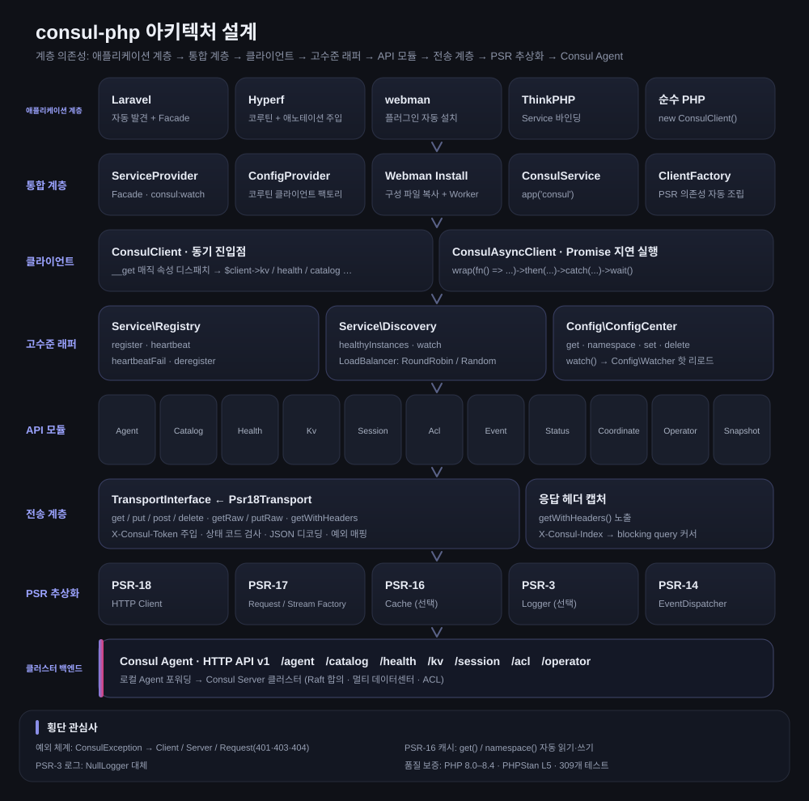
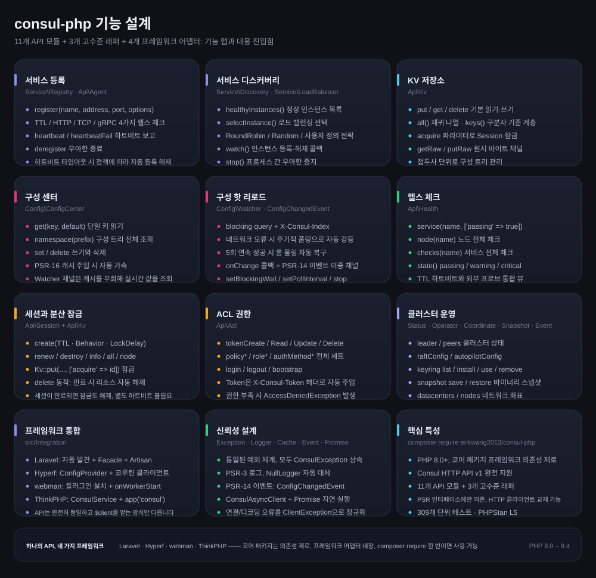
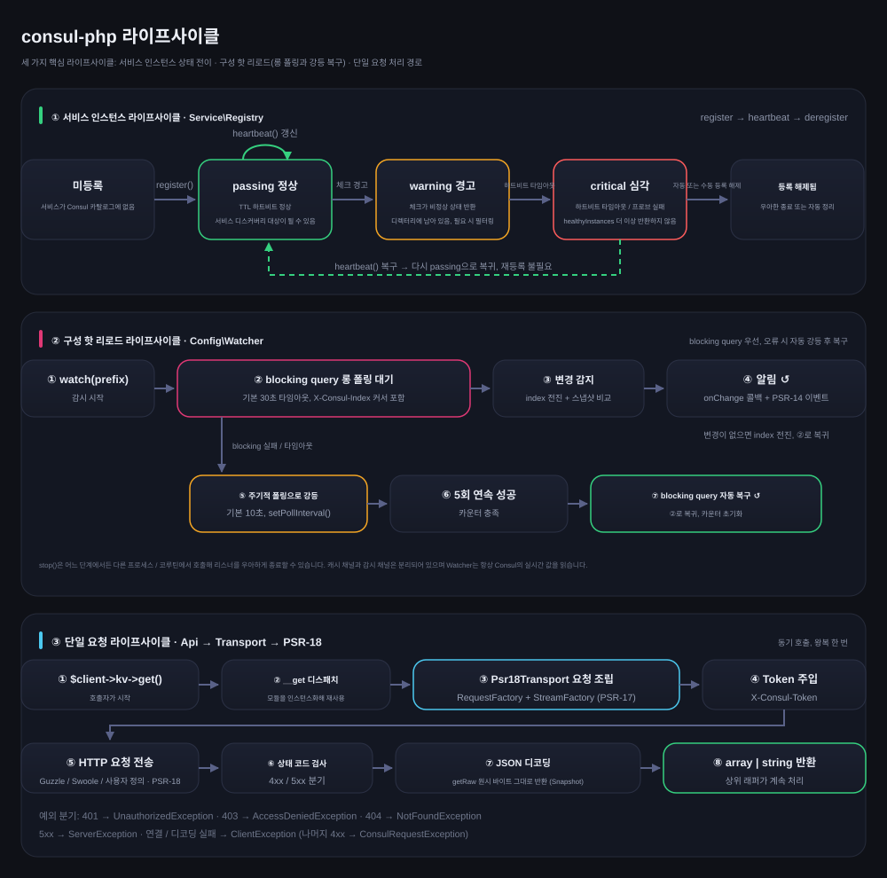

# erikwang2013/consul-php

[中文](../../../README.md) · [English](../en/README.md) · [日本語](../ja/README.md) · **한국어** · [Deutsch](../de/README.md) · [Français](../fr/README.md) · [Español](../es/README.md) · [Português](../pt/README.md) · [Русский](../ru/README.md) · [العربية](../ar/README.md) · [हिन्दी](../hi/README.md) · [বাংলা](../bn/README.md) · [Bahasa Indonesia](../id/README.md)



PHP Consul 클라이언트로, Consul HTTP API v1을 완전히 지원하며 서비스 등록·디스커버리와 구성 센터를 중점적으로 다룹니다. 코어 패키지는 프레임워크 의존성이 없고 Laravel / Hyperf / webman / ThinkPHP 어댑터가 내장되어 있어, composer require 한 번이면 어떤 프레임워크에서든 사용할 수 있습니다.

PHP 8.0+ · PSR-18/PSR-3/PSR-14/PSR-16 · 프레임워크 의존성 제로

> **프로젝트 펫 Consu** —— 하트비트만 먹고 절대 끊기지 않는 레지스트리 도우미: 안테나는 헬스 체크 하트비트, 가슴의 맥박선은 서비스 상태, 허리에는 ACL Token을 착용하고 있습니다. 터미널에서 `composer pet` 으로 소환할 수 있으며, 자세한 내용은 프로젝트 펫 섹션을 참고하세요.

---

## 프로젝트 소개

| | |
|---|---|
| **무엇인가** | 순수 PHP로 구현한 Consul HTTP API v1 클라이언트: 동기 + Promise 이중 진입점, 11개 API 모듈, 3개 고수준 래퍼 |
| **무엇을 해결하나** | PHP 애플리케이션이 Consul에 연결해 서비스 등록·디스커버리와 구성 핫 리로드를 구현할 수 있게 해 주며, 프레임워크마다 클라이언트를 새로 작성할 필요가 없습니다 |
| **사용 방법** | `composer require erikwang2013/consul-php`, 코어 패키지는 프레임워크 의존성이 없고 프레임워크 어댑터는 내장되어 자동으로 발견됩니다 |
| **지원 프레임워크** | Laravel · Hyperf · webman · ThinkPHP —— API는 완전히 동일하고 `$client`를 얻는 방식만 다릅니다 |
| **의존성 규약** | PSR 인터페이스(PSR-18/17/16/14/3)에만 의존하며, HTTP 클라이언트·캐시·로그·이벤트 디스패처를 모두 교체할 수 있습니다 |
| **품질 보증** | PHP 8.0 – 8.4 · 309개 단위 테스트 · PHPStan level 5 · PHP CS Fixer (PSR-12) |

### 핵심 기능

- **서비스 등록·디스커버리** —— TTL / HTTP / TCP / gRPC 네 가지 헬스 체크, healthyInstances / selectInstance, RoundRobin·Random·사용자 정의 로드 밸런싱, 인스턴스 등록·해제 감시
- **구성 센터** —— KV 읽기·쓰기, 네임스페이스 트리, PSR-16 캐시 가속, 핫 리로드는 blocking query 롱 폴링을 우선하고 네트워크 오류 시 자동으로 폴링으로 강등되며 5회 연속 성공하면 자동 복구
- **클러스터 운영** —— Session 분산 잠금, ACL 전체 세트(Token / Policy / Role / AuthMethod), Status / Operator / Coordinate / Snapshot / Event
- **신뢰성** —— 통일된 예외 체계, PSR-3 로그(NullLogger 대체), PSR-14 이벤트 이중 채널 알림, 전송 계층 오류 정규화

---

## 문서 안내

| 문서 | 링크 |
|------|------|
| **프로젝트 구조** | 프로젝트 구조 |
| **아키텍처 설계** | 아키텍처 설계 · [architecture.svg](./images/architecture.svg) |
| **기능 설계** | 기능 설계 · [features.svg](./images/features.svg) |
| **라이프사이클** | 라이프사이클 · [lifecycle.svg](./images/lifecycle.svg) |
| **프로젝트 펫** | [Consu](./images/pet.svg) |
| **다국어 README** | [docs/i18n/](../../i18n/) · [中文](../../../README.md) · [English](../en/README.md) · [日本語](../ja/README.md) · **한국어** · [Deutsch](../de/README.md) · [Français](../fr/README.md) · [Español](../es/README.md) · [Português](../pt/README.md) · [Русский](../ru/README.md) · [العربية](../ar/README.md) · [हिन्दी](../hi/README.md) · [বাংলা](../bn/README.md) · [Bahasa Indonesia](../id/README.md) |
| **문서 총목차** | [docs/README.md](../../README.md) |
| **Laravel 통합** | 아래 Laravel 섹션 참고 |
| **Hyperf 통합** | 아래 Hyperf 섹션 참고 |
| **webman 통합** | 아래 webman 섹션 참고 |
| **ThinkPHP 통합** | 아래 ThinkPHP 섹션 참고 |
| **설계 문서** | [docs/superpowers/specs/2026-05-14-consul-php-design.md](../../superpowers/specs/2026-05-14-consul-php-design.md) |

---

## 프로젝트 구조

```
consul-php/
├── src/
│   ├── Client/                      # 클라이언트 진입점
│   │   ├── ConsulClient.php         # 동기 진입점: __get으로 API 모듈과 고수준 래퍼 분배
│   │   ├── ConsulAsyncClient.php    # Promise 지연 실행 클라이언트
│   │   └── Promise.php              # 경량 Promise 구현
│   ├── Api/                         # Consul HTTP API v1 모듈 (11개)
│   │   ├── Agent.php                # 멤버, 자체 정보, 유지보수 모드, join / leave
│   │   ├── Catalog.php              # 서비스와 노드 카탈로그: 등록, 등록 해제, 조회
│   │   ├── Health.php               # 헬스 체크: 서비스 / 노드 / 상태별 필터
│   │   ├── Kv.php                   # KV 읽기·쓰기, 계층 나열, 원시 바이트, 세션 잠금
│   │   ├── Session.php              # 세션(분산 잠금 기반): 생성, 갱신, 파기
│   │   ├── Acl.php                  # Token / Policy / Role / AuthMethod
│   │   ├── Event.php                # 사용자 이벤트: fire / list
│   │   ├── Status.php               # 클러스터 상태: leader / peers
│   │   ├── Coordinate.php           # 네트워크 좌표: datacenters / nodes
│   │   ├── Operator.php             # Raft / Autopilot / Keyring 운영
│   │   └── Snapshot.php             # 스냅샷 백업과 복구 (바이너리 스트림)
│   ├── Service/                     # 서비스 등록과 디스커버리
│   │   ├── Registry.php             # register / heartbeat / heartbeatFail / deregister
│   │   ├── Discovery.php            # healthyInstances / selectInstance / watch / stop
│   │   └── LoadBalancer/            # RoundRobin, Random, LoadBalancerInterface
│   ├── Config/                      # 구성 센터
│   │   ├── ConfigCenter.php         # get / namespace / set / delete / watch
│   │   ├── Watcher.php              # 핫 리로드: 롱 폴링 + 강등 폴링 + 자동 복구
│   │   └── ConfigChangedEvent.php   # PSR-14 구성 변경 이벤트
│   ├── Transport/                   # 전송 계층
│   │   ├── TransportInterface.php   # 전송 계약 (getRaw / putRaw / getWithHeaders 포함)
│   │   └── Psr18Transport.php       # PSR-18 구현: Token 주입, 디코딩, 예외 매핑
│   ├── Support/                     # 프로젝트 펫 Consu의 터미널 버전 (Pet::art / Pet::say)
│   ├── Exception/                   # 예외 체계 (ConsulException과 하위 클래스 7개)
│   └── Integration/                 # 프레임워크 어댑터 (내장, 자동 발견)
│       ├── ClientFactory.php        # PSR 의존성 자동 조립
│       ├── Laravel/                 # ServiceProvider + Facade + config/consul.php
│       ├── Hyperf/                  # ConfigProvider + 코루틴 클라이언트 팩토리 + config
│       ├── Webman/                  # 플러그인 설치 (Install) + config/app.php
│       └── Thinkphp/                # ConsulService + config/consul.php
├── tests/                           # PHPUnit 케이스 (Api / Client / Config / Exception /
│                                    #   Integration / Service / Support / Transport)
├── docs/
│   ├── images/                      # 프로젝트 펫과 설계도 (SVG)
│   │   ├── pet.svg                  # 프로젝트 펫 Consu
│   │   ├── architecture.svg         # 아키텍처 설계
│   │   ├── features.svg             # 기능 설계
│   │   └── lifecycle.svg            # 라이프사이클
│   ├── i18n/                        # en · ja · ko · de · fr · es · pt · ru · ar · hi · bn · id
│   ├── superpowers/specs/           # 설계 문서
│   ├── superpowers/plans/           # 구현 계획
│   └── reports/                     # 커버리지 리포트와 테스트 리포트
├── scripts/i18n-svg.php             # i18n build / verify
├── scripts/pet.php                  # composer pet 진입점: 터미널에서 프로젝트 펫 소환
├── composer.json                    # 의존성과 프레임워크 자동 발견 선언
├── phpunit.xml.dist                 # 테스트 설정
└── phpstan.neon                     # 정적 분석 설정 (level 5)
```

---

## 프레임워크 통합 개요

| | Laravel | Hyperf | webman | ThinkPHP |
|---|---|---|---|---|
| **확장 패키지** | 내장 | 내장 | 내장 | 내장 |
| **주입 방식** | 자동 발견 + `ServiceProvider` | 자동 발견 + `ConfigProvider` | 수동 `new` / 플러그인 | 컨테이너에 수동 `bind` |
| **편의 접근** | `Consul` Facade | `#[Inject]` 애노테이션 | — | `app('consul')` 헬퍼 |
| **설정 위치** | `config/consul.php` | `config/autoload/consul.php` | `config/plugin/erikwang2013/consul-php/app.php` | `config/consul.php` |
| **HTTP 클라이언트** | Guzzle (PSR-18) | Swoole 코루틴 클라이언트 | Guzzle (PSR-18) | Guzzle (PSR-18) |
| **캐시** | Laravel Cache (PSR-16) | Hyperf Cache (PSR-16) | 직접 주입 | 직접 주입 |
| **핫 리로드 실행** | Artisan 명령 | `AbstractProcess` 코루틴 | `Worker` 프로세스 | Timer / Swoole 프로세스 |
| **이벤트 리스닝** | `EventServiceProvider` | Hyperf Event | — | ThinkPHP Listener |
| **문서** | [소스](../../../src/Integration/Laravel/) | [소스](../../../src/Integration/Hyperf/) | [소스](../../../src/Integration/Webman/) | [소스](../../../src/Integration/Thinkphp/) |

### 같은 작업, 다른 작성법

**클라이언트 얻기:**

| 프레임워크 | 작성법 |
|------|------|
| 공통 | `$client = new ConsulClient(['base_uri' => '...']);` |
| Laravel | `$client = app(ConsulClient::class);` 또는 `Consul::kv->get(...)` |
| Hyperf | `#[Inject] private ConsulClient $consul;` |
| webman | `$client = new ConsulClient(['base_uri' => '...']);` |
| ThinkPHP | `$client = app('consul');` |

**서비스 등록:**

```php
// 모든 프레임워크가 동일한 API를 사용하며, $client를 얻는 방식만 다릅니다
$client->serviceRegistry()->register('my-app', '10.0.0.1', 8080, [
    'id'    => 'my-app-1',
    'tags'  => ['v1'],
    'check' => ['ttl' => '30s'],
]);
```

**구성 읽기:**

```php
// 동일한 API이며, Laravel/Hyperf에서는 캐시를 자동으로 사용합니다
$dbHost = $client->configCenter()->get('app/db_host', 'default');
```

**핫 리로드 실행 방식:**

| 프레임워크 | 시작 명령 / 방식 | 실행 환경 |
|------|----------------|---------|
| Laravel | `php artisan consul:watch` | 독립 Artisan 프로세스 |
| Hyperf | `ConsulWatchProcess` (자동 시작) | Swoole 코루틴 |
| webman | `onWorkerStart` 에서 fork | Worker 프로세스 |
| ThinkPHP | Timer::setInterval / Swoole Process | 독립 프로세스 |

---

## 설치

```bash
# 코어 패키지
composer require erikwang2013/consul-php

# PSR-18 구현 (하나 선택)
composer require guzzlehttp/guzzle php-http/guzzle7-adapter php-http/discovery
```

### 프레임워크 통합

프레임워크 어댑터는 코어 패키지에 이미 내장되어 있어 별도로 설치할 필요가 없습니다. 코어 패키지를 설치하면 해당 프레임워크가 Consul 서비스를 자동으로 발견해 등록합니다:

- **Laravel** — `ConsulServiceProvider` 를 자동 발견하고 `Consul` Facade와 의존성 주입을 제공합니다
- **Hyperf** — `ConfigProvider` 를 자동 발견하고 코루틴 클라이언트 팩토리와 `#[Inject]` 주입을 제공합니다
- **webman** — 플러그인을 자동 발견하고 `composer install` 시 설정 파일을 자동으로 복사합니다
- **ThinkPHP** — `app/service` 디렉터리에 `ConsulService` 를 생성해 애플리케이션에 등록합니다

---

## 빠른 시작 (공통)

```php
use Erikwang2013\Consul\Client\ConsulClient;

// 기본 사용법
$client = new ConsulClient(['base_uri' => 'http://127.0.0.1:8500']);

// ACL Token 사용
$client = new ConsulClient([
    'base_uri' => 'http://127.0.0.1:8500',
    'token'    => 'your-consul-acl-token',
]);
```

Token은 `X-Consul-Token` 요청 헤더를 통해 모든 요청에 자동으로 첨부됩니다.

### 서비스 등록

TTL, HTTP, TCP, gRPC 네 가지 헬스 체크 모드를 지원합니다.

```php
$registry = $client->serviceRegistry();

// TTL 모드 — 애플리케이션이 직접 하트비트 전송
$registry->register('user-service', '192.168.1.10', 8080, [
    'id'    => 'user-service-1',
    'tags'  => ['v1', 'primary'],
    'meta'  => ['region' => 'cn-east'],
    'check' => [
        'ttl' => '30s',
        'deregister_critical_service_after' => '120s', // 하트비트 타임아웃 시 자동 등록 해제
    ],
]);

// HTTP 모드 — Consul이 주기적으로 프로브
$registry->register('web', '192.168.1.10', 80, [
    'id'    => 'web-1',
    'check' => [
        'http'     => 'http://192.168.1.10:80/health',
        'interval' => '10s',
        'timeout'  => '3s',
    ],
]);

// TCP 모드
$registry->register('mysql', '192.168.1.10', 3306, [
    'check' => ['tcp' => '192.168.1.10:3306', 'interval' => '10s'],
]);

// gRPC 모드
$registry->register('grpc-svc', '192.168.1.10', 50051, [
    'check' => ['grpc' => '192.168.1.10:50051', 'interval' => '10s'],
]);

// 하트비트 (TTL 모드)
$registry->heartbeat('user-service-1');

// 등록 해제
$registry->deregister('user-service-1');
```

### 서비스 디스커버리

RoundRobin(기본)과 Random 두 가지 로드 밸런싱 전략이 내장되어 있습니다.

```php
$discovery = $client->serviceDiscovery();

// 모든 정상 인스턴스
$instances = $discovery->healthyInstances('user-service');
// [
//   ['address' => '10.0.0.1', 'port' => 8080, 'service' => 'user-service', 'id' => 'user-1', 'tags' => ['v1']],
//   ['address' => '10.0.0.2', 'port' => 8080, 'service' => 'user-service', 'id' => 'user-2', 'tags' => ['v1']],
// ]

// 로드 밸런싱으로 하나 선택
$instance = $discovery->selectInstance('user-service');

// 사용자 정의 로드 밸런싱 전략
use Erikwang2013\Consul\Service\LoadBalancer\Random;
$discovery = new Discovery($health, loadBalancer: new Random());

// 서비스 인스턴스 변경 감시
$discovery->watch('user-service', function (array $instances) {
    // 인스턴스가 등록·해제될 때 콜백
});

// 감시 중지 (다른 프로세스/코루틴에서 호출)
$discovery->stop();
```

### 구성 센터

```php
$config = $client->configCenter();

// 단일 키
$dbHost = $config->get('app/db_host', 'localhost');

// 네임스페이스 전체
$all = $config->namespace('app/');
// ['app/db_host' => 'mysql.local', 'app/redis_host' => 'redis.local', ...]

// 쓰기 / 삭제
$config->set('app/cache_ttl', '3600');
$config->delete('app/old_key');

// 핫 리로드
$watcher = $config->watch('app/');
$watcher
    ->setBlockingWait(30)   // 롱 폴링 타임아웃 (초)
    ->setPollInterval(10)   // 폴링으로 강등되었을 때의 간격 (초)
    ->onChange(function (array $updated) {
        // 구성 변경 콜백
    });
$watcher->start(); // 블로킹, 독립 프로세스/코루틴에 배치하세요
// $watcher->stop();  // 다른 프로세스/코루틴에서 호출해 감시를 중지합니다
```

**핫 리로드 원리:** Consul blocking query(`index` 롱 폴링)를 우선 사용하고, 네트워크 오류 시 자동으로 주기적 폴링으로 강등되며, 연결이 복구되면 자동으로 롱 폴링으로 되돌아갑니다. 콜백 + PSR-14 EventDispatcher 이중 채널로 알립니다.

**캐시 전략:** PSR-16 캐시를 주입하면 `get()` 과 `namespace()` 가 자동으로 캐시를 읽고 씁니다. Watcher는 항상 Consul의 실시간 데이터를 읽으며 캐시를 사용하지 않습니다.

### KV 저장소

```php
$kv = $client->kv;

$kv->put('key', 'value');
$entry = $kv->get('key');              // null이면 존재하지 않음
$all = $kv->all('prefix/');            // 재귀 나열
$keys = $kv->keys('prefix/');          // 키 이름만
$keys = $kv->keys('prefix/', '/');     // 구분자 기준 계층 나열
$kv->delete('key');
```

### 헬스 체크 API

```php
$health = $client->health;

$health->service('user-service', ['passing' => true]);  // 정상 인스턴스만
$health->node('node-1');                                 // 노드의 모든 체크
$health->checks('user-service');                          // 서비스의 모든 체크
$health->state('critical');                               // 상태별: passing/warning/critical
```

### Session / 분산 잠금

```php
$session = $client->session;

$sess = $session->create([
    'Name'     => 'lock-session',
    'TTL'      => '30s',
    'Behavior' => 'delete',    // 만료 시 연결된 KV 자동 삭제
]);
$sessionId = $sess['ID'];

// 리소스 잠금
$locked = $client->kv->put('lock/resource', '1', ['acquire' => $sessionId]);

// 갱신 / 해제
$session->renew($sessionId);
$session->destroy($sessionId);
```

### ACL

```php
$acl = $client->acl;

// Token
$token = $acl->tokenCreate(['Description' => 'read-only', 'Policies' => [['Name' => 'read-policy']]]);
$acl->tokenRead($token['AccessorID']);
$acl->tokenDelete($token['AccessorID']);

// Policy
$policy = $acl->policyCreate(['Name' => 'my-policy', 'Rules' => 'node "" { policy = "read" }']);

// Role
$role = $acl->roleCreate(['Name' => 'reader', 'Policies' => [['Name' => 'my-policy']]]);

// Login/Logout
$result = $acl->login(['AuthMethod' => 'my-auth', 'BearerToken' => '...']);
$acl->logout();
```

### 비동기 클라이언트

```php
use Erikwang2013\Consul\Client\ConsulAsyncClient;

$client = new ConsulAsyncClient(['base_uri' => 'http://127.0.0.1:8500']);

$promise = $client->wrap(fn() => $client->kv->get('key'));

$promise
    ->then(fn($result) => print_r($result))
    ->catch(fn(\Throwable $e) => log_error($e));

$value = $promise->wait(); // 블로킹으로 결과 얻기
```

**주의:** 비동기 클라이언트는 Promise 패턴을 기반으로 하며, 동시 요청이 필요한 상황에 적합합니다. Hyperf 코루틴 환경에서는 기본 HTTP 클라이언트만으로도 코루틴 수준의 동시성을 얻을 수 있습니다.

---

## 프레임워크별 통합 가이드

### Laravel

Laravel은 `ConsulServiceProvider` 를 자동으로 발견하므로 수동으로 등록할 필요가 없습니다.

```bash
php artisan vendor:publish --tag=consul-config
```

`.env` 에 `CONSUL_BASE_URI` 를 설정하면 이후 의존성 주입이나 Facade로 사용할 수 있습니다. Laravel 확장은 PSR-18 클라이언트, PSR-16 캐시, PSR-3 로그, PSR-14 이벤트 디스패처를 자동으로 주입합니다.

```php
// 의존성 주입
use Erikwang2013\Consul\Client\ConsulClient;
public function show(ConsulClient $consul) { ... }

// Facade
use Consul;
$services = Consul::catalog->services();

// 구성 핫 리로드 — Artisan 명령
// php artisan consul:watch
```

### Hyperf

Hyperf는 `ConfigProvider` 를 자동으로 발견하므로 수동으로 등록할 필요가 없습니다.

```bash
php bin/hyperf.php vendor:publish consul
```

Hyperf 확장은 `ConsulClient` 를 DI 컨테이너에 자동 등록하며, HTTP 요청은 기본적으로 Swoole 코루틴 클라이언트를 사용합니다. 서비스 등록은 `MainServerStart` 이벤트 리스너에 두는 것을 권장하고, 핫 리로드는 `AbstractProcess` 로 코루틴에서 실행합니다.

```php
// 애노테이션 주입
#[Inject]
private ConsulClient $consul;

// 서비스 등록 — MainServerStart 이벤트
$consul->serviceRegistry()->register(...);

// 핫 리로드 — ConsulWatchProcess 자동 시작
```

### webman

webman은 플러그인을 자동으로 발견하며, `composer install` 시 설정 파일을 `config/plugin/erikwang2013/consul-php/` 로 자동 복사합니다. webman은 상주 메모리 아키텍처라서 서비스 등록은 `onWorkerStart` 콜백에 두고 전역에서 한 번만 등록하면 됩니다.

```php
// process/ConsulRegister.php
class ConsulRegister {
    public function onWorkerStart(Worker $worker): void {
        $consul = new ConsulClient(['base_uri' => getenv('CONSUL_BASE_URI')]);
        $consul->serviceRegistry()->register('webman-app', ...);
    }
}
```

### ThinkPHP

ThinkPHP에는 자동 발견 메커니즘이 없으므로 Service를 수동으로 등록해야 합니다. 설정 파일을 `config/consul.php` 로 복사한 다음, `app/service` 디렉터리에 `ConsulService` 를 등록하세요:

```php
// app/service/ConsulService.php
namespace app\service;

use Erikwang2013\Consul\Integration\Thinkphp\ConsulService as BaseConsulService;

class ConsulService extends BaseConsulService
{
}
```

또는 `app/AppService.php` 에서 직접 바인딩합니다:

```php
$this->app->bind('consul', fn() => new ConsulClient(config('consul')));

// 사용
$services = app('consul')->catalog->services();

// 헬퍼 함수 — app/common.php
function consul() { return app('consul'); }
```

---

## 사용자 정의 HTTP 클라이언트

```php
$client = new ConsulClient(
    config:          ['base_uri' => 'http://consul:8500', 'token' => 'acl-token'],
    httpClient:      $myPsr18Client,        // 필수 또는 자동 발견
    requestFactory:  $myRequestFactory,      // 위와 동일
    streamFactory:   $myStreamFactory,       // 위와 동일
    logger:          $myLogger,              // PSR-3, 선택
    cache:           $myCache,               // PSR-16, 선택
    eventDispatcher: $myEventDispatcher,     // PSR-14, 선택
);
```

---

## API 모듈 빠른 참조

| 속성 | 클래스 | 주요 메서드 |
|------|-----|---------|
| `$client->kv` | `Api\Kv` | `get` `put` `delete` `all` `keys` |
| `$client->agent` | `Api\Agent` | `members` `self` `registerService` `deregisterService` `checks` `services` |
| `$client->catalog` | `Api\Catalog` | `register` `deregister` `nodes` `services` `service` `node` |
| `$client->health` | `Api\Health` | `service` `node` `checks` `state` |
| `$client->session` | `Api\Session` | `create` `destroy` `renew` `info` `all` `node` |
| `$client->acl` | `Api\Acl` | `token*` `policy*` `role*` `authMethod*` `login` `logout` `bootstrap` |
| `$client->event` | `Api\Event` | `fire` `list` |
| `$client->status` | `Api\Status` | `leader` `peers` |
| `$client->coordinate` | `Api\Coordinate` | `datacenters` `nodes` `node` |
| `$client->operator` | `Api\Operator` | `raftConfig` `autopilotConfig` `keyring`(상수: `KEYRING_LIST` `KEYRING_INSTALL` `KEYRING_USE` `KEYRING_REMOVE`) |
| `$client->snapshot` | `Api\Snapshot` | `save`(`getRaw()` 로 원시 스냅샷 바이트 반환) `restore`(`putRaw()` 로 원시 바이트 전송) |

고수준 래퍼:

| 메서드 | 반환 | 설명 |
|------|------|------|
| `$client->serviceRegistry()` | `Service\Registry` | 서비스 등록/하트비트/등록 해제 |
| `$client->serviceDiscovery()` | `Service\Discovery` | 인스턴스 목록/로드 밸런싱/변경 감시 |
| `$client->configCenter()` | `Config\ConfigCenter` | 구성 읽기·쓰기/캐시/핫 리로드 |

---

## 예외 체계

모든 예외는 `ConsulException`(`RuntimeException` 상속)을 상속합니다:

```
ConsulException
├── ClientException           HTTP 전송 오류 (연결 실패, DNS, 타임아웃 등)
├── ServerException           Consul이 5xx 반환
└── ConsulRequestException    Consul이 4xx 반환
    ├── NotFoundException     404
    └── AccessDeniedException 403
```

```php
try {
    $client->kv->get('key');
} catch (ClientException $e) {
    // 네트워크 문제
} catch (NotFoundException $e) {
    // 리소스 없음
} catch (ConsulException $e) {
    // 기타 Consul 오류
}
```

---

## 아키텍처 설계



의존성 방향은 위에서 아래이며, 각 계층은 바로 아래 계층의 추상화에만 의존합니다:

- **애플리케이션 계층 / 통합 계층** —— 4개 프레임워크 어댑터가 코어 패키지 `src/Integration/` 에 내장되어 composer가 자동으로 발견해 등록합니다. 애플리케이션 계층은 항상 `ConsulClient` 하나만 마주합니다.
- **클라이언트** —— `ConsulClient` 는 `__get` 으로 11개 API 모듈(`$client->kv`, `$client->health` …)과 3개 고수준 래퍼(`serviceRegistry()` / `serviceDiscovery()` / `configCenter()`)를 일관되게 노출합니다. `ConsulAsyncClient` 는 Promise 지연 실행을 제공합니다.
- **고수준 래퍼** —— `Registry` / `Discovery` / `ConfigCenter` 가 API 모듈을 조합합니다. `Watcher` 는 `getWithHeaders()` 가 반환하는 `X-Consul-Index` 에 의존해 롱 폴링을 구현합니다.
- **API 모듈** —— 모듈 하나가 Consul v1 엔드포인트 한 묶음에 대응하며, 모두 동일한 `TransportInterface` 를 거쳐 드나듭니다.
- **전송 계층** —— `Psr18Transport` 가 Token 주입, 상태 코드 검사, JSON 디코딩, 예외 매핑을 담당하며, 패키지 전체에서 유일한 외부 통신 지점입니다.
- **PSR 추상화** —— PSR 인터페이스(18/17/16/14/3)에만 의존하므로 HTTP 클라이언트·캐시·로그·이벤트 디스패처를 모두 교체할 수 있고, 주입하지 않으면 자동으로 대체 구현으로 강등됩니다.

---

## 기능 설계



기능 맵: 서비스 등록·디스커버리, 구성 센터와 핫 리로드, KV / 헬스 체크 / 세션 잠금 / ACL / 클러스터 운영, 4개 프레임워크 어댑터와 신뢰성 설계. 각 기능 카드에는 대응하는 진입 클래스가 표시되어 있으며, 구체적인 호출 방법은 위의 빠른 시작과 API 모듈 빠른 참조를 확인하세요.

---

## 라이프사이클



- **서비스 인스턴스 라이프사이클** —— `register()` → passing(`heartbeat()` 주기적 갱신) → warning → critical → 자동 또는 수동 등록 해제. 하트비트가 복구되면 재등록 없이 critical에서 passing으로 돌아갈 수 있습니다.
- **구성 핫 리로드 라이프사이클** —— `watch()` 가 blocking query를 시작하고(기본 30초, `X-Consul-Index` 포함) → 변경 감지 → `onChange` 콜백 + `ConfigChangedEvent`. 블로킹이 실패하면 자동으로 주기적 폴링(기본 10초)으로 강등되고, 5회 연속 성공하면 롱 폴링으로 되돌아갑니다. `stop()` 은 다른 프로세스 / 코루틴에서 우아하게 종료할 수 있습니다.
- **단일 요청 라이프사이클** —— API 모듈 → `Psr18Transport` 가 PSR-17 요청 조립 → `X-Consul-Token` 주입 → PSR-18 전송 → 상태 코드 검사 → JSON 디코딩(`getRaw()` 는 원시 바이트를 그대로 반환) → 배열 반환. 401/403/404/5xx와 전송 실패는 각각 대응하는 예외로 매핑됩니다.

---

## 프로젝트 펫 Consu

펫은 단순한 일러스트가 아니라 터미널과 코드에서도 불러낼 수 있습니다:

```bash
composer pet
```

```text
╭───────────────────────────────────────────────────────────────────────────╮
│ consul-php · PHP Consul 클라이언트: composer require 하나로 네 프레임워크 │
╰──────┬────────────────────────────────────────────────────────────────────╯
       │
       ●
       │
   ╭───┴───╮
   │ ◕   ◕ │
   │  ╰─╯  │
   ├───────┤
   │╱╲╱╲╱╲ │
   ╰┬─────┬╯
    ╰─┬─┬─╯
```

코드에서 `Erikwang2013\Consul\Support\Pet` 를 직접 호출할 수 있습니다:

```php
use Erikwang2013\Consul\Support\Pet;

echo Pet::art();                      // 펫만
echo Pet::say('consul 구성이 준비되었습니다');    // 머리 위 말풍선 + 펫
echo Pet::art(false);                 // 강제로 순수 텍스트
```

색상은 터미널 능력에 따라 자동으로 판단합니다. TTY가 아니거나 `NO_COLOR` 가 설정된 경우 순수 텍스트를 출력해 로그와 CI 출력을 오염시키지 않습니다.

설정은 [pet.svg](./images/pet.svg) 와 동일합니다: 안테나 = 헬스 체크 하트비트(passing 초록), 고글 = 서비스 디스커버리, 가슴의 맥박선 = 서비스 상태(Consul 마젠타), 허리 패찰 = ACL Token.

---

## 최소 요구 사항

- PHP 8.0+
- Composer
- PSR-18 HTTP Client 구현
- [선택] PSR-16 캐시 — `Discovery::healthyInstances()` / `ConfigCenter::get()` 자동 캐시
- [선택] PSR-3 Logger — 요청 로그
- [선택] PSR-14 EventDispatcher — `ConfigChangedEvent` 이벤트

## 오픈소스는 쉽지 않습니다, 후원을 환영합니다

| WeChat | Alipay |
|:---:|:---:|
|  |  |

---

## License

MIT

---

본 번역은 AI가 생성했습니다. 부정확한 부분이 있으면 Issue/PR을 남겨 주세요.
