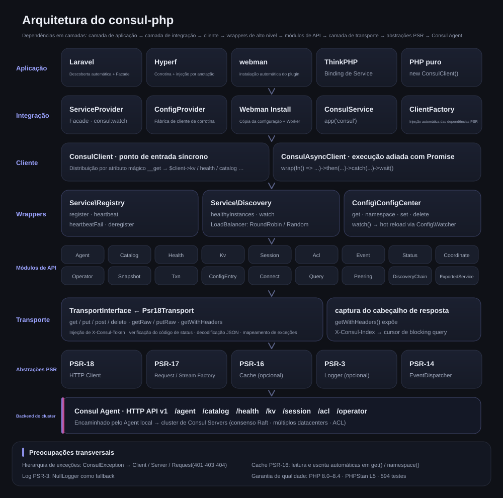
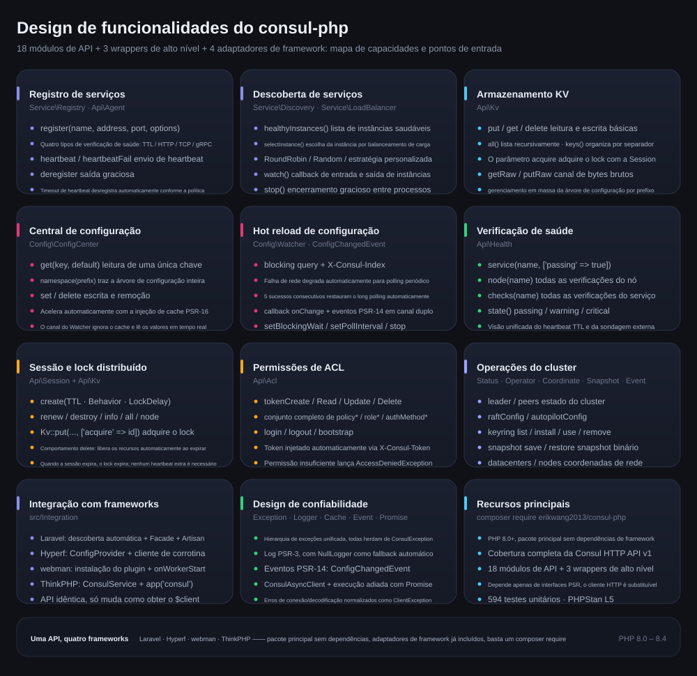
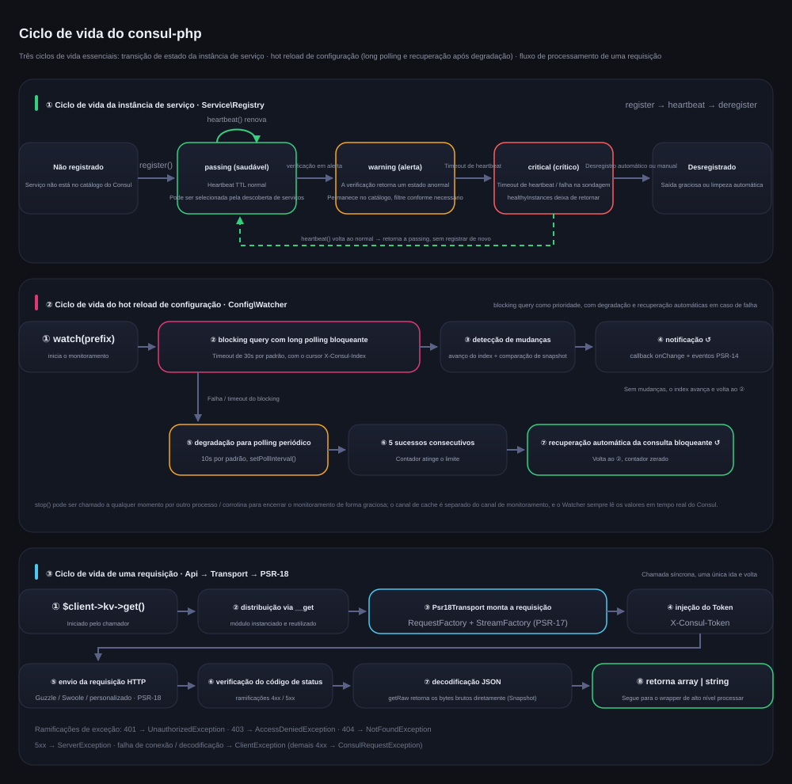

# erikwang2013/consul-php

[中文](../../../README.md) · [English](../en/README.md) · [日本語](../ja/README.md) · [한국어](../ko/README.md) · [Deutsch](../de/README.md) · [Français](../fr/README.md) · [Español](../es/README.md) · **Português** · [Русский](../ru/README.md) · [العربية](../ar/README.md) · [हिन्दी](../hi/README.md) · [বাংলা](../bn/README.md) · [Bahasa Indonesia](../id/README.md)



Cliente Consul em PHP, com cobertura completa da Consul HTTP API v1 e foco em registro/descoberta de serviços e central de configuração. O pacote principal não depende de nenhum framework e traz adaptadores para Laravel / Hyperf / webman / ThinkPHP já incluídos: basta um composer require para usar em qualquer framework.

PHP 8.0+ · PSR-18/PSR-3/PSR-14/PSR-16 · sem dependências de framework

> **Consu, o mascote do projeto** —— um pequeno assistente de registro que só se alimenta de heartbeat e nunca cai: a antena é o heartbeat da verificação de saúde, a linha de pulso no peito é o estado do serviço e na cintura ele carrega um ACL Token. Dá para invocá-lo no terminal com `composer pet`; veja [Mascote do projeto](../../../README.md).

---

## Introdução ao projeto

| | |
|---|---|
| **O que é** | Cliente da Consul HTTP API v1 em PHP puro: entradas síncrona + Promise, 18 módulos de API, 3 wrappers de alto nível |
| **O que resolve** | Permite que aplicações PHP usem o Consul para registro/descoberta de serviços e hot reload de configuração, sem reescrever um cliente para cada framework |
| **Como usar** | `composer require erikwang2013/consul-php`: o pacote principal não depende de framework e os adaptadores vêm incluídos e são descobertos automaticamente |
| **Frameworks suportados** | Laravel · Hyperf · webman · ThinkPHP —— API idêntica, só muda como obter o `$client` |
| **Convenção de dependências** | Depende apenas de interfaces PSR (PSR-18/17/16/14/3); cliente HTTP, cache, log e event dispatcher são substituíveis |
| **Garantia de qualidade** | PHP 8.0 – 8.4 · 594 testes unitários · PHPStan level 5 · PHP CS Fixer (PSR-12) |

### Recursos principais

- **Registro e descoberta de serviços** —— quatro tipos de verificação de saúde: TTL / HTTP / TCP / gRPC; healthyInstances / selectInstance; balanceamento de carga RoundRobin, Random e personalizado; monitoramento de entrada e saída de instâncias
- **Central de configuração** —— leitura e escrita de KV, árvore de namespaces, aceleração com cache PSR-16; hot reload priorizando blocking query com long polling, degradação automática para polling em caso de falha de rede e recuperação automática após 5 sucessos consecutivos
- **Operações do cluster** —— lock distribuído com Session, conjunto completo de ACL (Token / Policy / Role / AuthMethod), Status / Operator / Coordinate / Snapshot / Event
- **Confiabilidade** —— hierarquia unificada de exceções, log PSR-3 (NullLogger como fallback), notificação em canal duplo com eventos PSR-14, normalização de erros na camada de transporte

---

## Navegação da documentação

| Documento | Link |
|------|------|
| **Estrutura do projeto** | [Estrutura do projeto](../../../README.md) |
| **Arquitetura** | [Arquitetura](../../../README.md) · [architecture.svg](./images/architecture.svg) |
| **Design de funcionalidades** | [Design de funcionalidades](../../../README.md) · [features.svg](./images/features.svg) |
| **Ciclo de vida** | [Ciclo de vida](../../../README.md) · [lifecycle.svg](./images/lifecycle.svg) |
| **Mascote do projeto** | [Consu](./images/pet.svg) |
| **README em vários idiomas** | [docs/i18n/](../) · [English](../en/README.md) · [日本語](../ja/README.md) · [한국어](../ko/README.md) · [Deutsch](../de/README.md) · [Français](../fr/README.md) · [Español](../es/README.md) · [Português](../pt/README.md) · [Русский](../ru/README.md) · [العربية](../ar/README.md) · [हिन्दी](../hi/README.md) · [বাংলা](../bn/README.md) · [Bahasa Indonesia](../id/README.md) |
| **Índice da documentação** | [docs/README.md](../../README.md) |
| **Integração com Laravel** | veja abaixo [Laravel](../../../README.md) |
| **Integração com Hyperf** | veja abaixo [Hyperf](../../../README.md) |
| **Integração com webman** | veja abaixo [webman](../../../README.md) |
| **Integração com ThinkPHP** | veja abaixo [ThinkPHP](../../../README.md) |
| **Documento de design** | [docs/superpowers/specs/2026-05-14-consul-php-design.md](../../superpowers/specs/2026-05-14-consul-php-design.md) |

---

## Estrutura do projeto

```
consul-php/
├── src/
│   ├── Client/                      # ponto de entrada do cliente
│   │   ├── ConsulClient.php         # entrada síncrona: __get distribui módulos de API e wrappers de alto nível
│   │   ├── ConsulAsyncClient.php    # cliente com execução adiada via Promise
│   │   └── Promise.php              # implementação leve de Promise
│   ├── Api/                         # módulos da Consul HTTP API v1 (18)
│   │   ├── Agent.php                # membros, informações próprias, modo de manutenção, join / leave
│   │   ├── Catalog.php              # catálogo de serviços e nós: registro, desregistro, consulta
│   │   ├── Health.php               # verificação de saúde: serviço / nó / filtro por estado
│   │   ├── Kv.php                   # leitura e escrita de KV, listagem hierárquica, bytes brutos, lock com sessão
│   │   ├── Session.php              # sessão (base do lock distribuído): criação, renovação, destruição
│   │   ├── Acl.php                  # Token / Policy / Role / AuthMethod
│   │   ├── Event.php                # eventos do usuário: fire / list
│   │   ├── Status.php               # estado do cluster: leader / peers
│   │   ├── Coordinate.php           # coordenadas de rede: datacenters / nodes
│   │   ├── Operator.php             # operações de Raft / Autopilot / Keyring
│   │   ├── Snapshot.php             # backup e restauração de snapshot (fluxo binário)
│   │   ├── Txn.php                  # transação: múltiplas chaves atômicas / CAS em lote
│   │   ├── ConfigEntry.php          # entrada de configuração: mesh / gateway / service-intentions
│   │   ├── Connect.php              # cadeia de autorização do service mesh (intentions)
│   │   ├── Query.php                # prepared query: failover / descoberta por proximidade
│   │   ├── Peering.php              # peering entre clusters
│   │   ├── DiscoveryChain.php       # Discovery chain do mesh: resolução de rota / divisão / failover
│   │   ├── ExportedService.php      # Exportação e importação de serviços entre partições / peerings
│   ├── Service/                     # registro e descoberta de serviços
│   │   ├── Registry.php             # register / heartbeat / heartbeatFail / deregister
│   │   ├── Discovery.php            # healthyInstances / selectInstance / watch / stop
│   │   └── LoadBalancer/            # RoundRobin, Random, LoadBalancerInterface
│   ├── Config/                      # central de configuração
│   │   ├── ConfigCenter.php         # get / namespace / set / delete / watch
│   │   ├── Watcher.php              # hot reload: long polling + polling degradado + recuperação automática
│   │   └── ConfigChangedEvent.php   # evento PSR-14 de mudança de configuração
│   ├── Transport/                   # camada de transporte
│   │   ├── TransportInterface.php   # contrato de transporte (com getRaw / putRaw / getWithHeaders)
│   │   └── Psr18Transport.php       # implementação PSR-18: injeção de Token, decodificação, mapeamento de exceções
│   ├── Http/                        # PSR-7/17/18 embutido (cliente cURL, fallback sem Guzzle)
│   ├── Support/                     # versão de terminal do mascote Consu (Pet::art / Pet::say)
│   ├── Exception/                   # hierarquia de exceções (ConsulException e subclasses, 7)
│   └── Integration/                 # adaptadores de framework (incluídos, descoberta automática)
│       ├── ClientFactory.php        # injeção automática das dependências PSR
│       ├── Laravel/                 # ServiceProvider + Facade + config/consul.php
│       ├── Hyperf/                  # ConfigProvider + fábrica de cliente de corrotina + config
│       ├── Webman/                  # instalação do plugin (Install) + config/app.php
│       ├── Thinkphp/                # ConsulService + config/consul.php
│       └── Native/                  # PHP nativo: registro / heartbeat / desregistro automático em uma linha
├── tests/                           # casos PHPUnit (Api / Client / Config / Exception /
│                                    #   Integration / Service / Support / Transport)
├── docs/
│   ├── images/                      # mascote do projeto e diagramas de design (SVG)
│   │   ├── pet.svg                  # mascote do projeto Consu
│   │   ├── architecture.svg         # arquitetura
│   │   ├── features.svg             # design de funcionalidades
│   │   └── lifecycle.svg            # ciclo de vida
│   ├── i18n/                        # en · ja · ko · de · fr · es · pt · ru · ar · hi · bn · id
│   ├── superpowers/specs/           # documentos de design
│   ├── superpowers/plans/           # planos de implementação
│   └── reports/                     # relatórios de cobertura e de testes
├── scripts/i18n-svg.php             # i18n build / verify
├── scripts/pet.php                  # entrada do composer pet: invoca o mascote no terminal
├── composer.json                    # dependências e declaração de descoberta automática de frameworks
├── phpunit.xml.dist                 # configuração dos testes
└── phpstan.neon                     # configuração de análise estática (level 5)
```

---

## Visão geral da integração com frameworks

| | Laravel | Hyperf | webman | ThinkPHP |
|---|---|---|---|---|
| **Pacote** | incluído | incluído | incluído | incluído |
| **Forma de injeção** | descoberta automática + `ServiceProvider` | descoberta automática + `ConfigProvider` | `new` manual / plugin | `bind` manual no container |
| **Acesso facilitado** | Facade `Consul` | anotação `#[Inject]` | — | helper `app('consul')` |
| **Local da configuração** | `config/consul.php` | `config/autoload/consul.php` | `config/plugin/erikwang2013/consul-php/app.php` | `config/consul.php` |
| **Cliente HTTP** | Guzzle (PSR-18) | cliente de corrotina do Swoole | Guzzle (PSR-18) | Guzzle (PSR-18) |
| **Cache** | Laravel Cache (PSR-16) | Hyperf Cache (PSR-16) | injeção própria | injeção própria |
| **Execução do hot reload** | comando Artisan | corrotina `AbstractProcess` | processo `Worker` | Timer / processo Swoole |
| **Escuta de eventos** | `EventServiceProvider` | Hyperf Event | — | ThinkPHP Listener |
| **Documentação** | [código-fonte](../../../src/Integration/Laravel/) | [código-fonte](../../../src/Integration/Hyperf/) | [código-fonte](../../../src/Integration/Webman/) | [código-fonte](../../../src/Integration/Thinkphp/) |

### A mesma operação, escritas diferentes

**Obter o cliente:**

| Framework | Forma |
|------|------|
| Geral | `$client = new ConsulClient(['base_uri' => '...']);` |
| Laravel | `$client = app(ConsulClient::class);` ou `Consul::kv->get(...)` |
| Hyperf | `#[Inject] private ConsulClient $consul;` |
| webman | `$client = new ConsulClient(['base_uri' => '...']);` |
| ThinkPHP | `$client = app('consul');` |

**Registro de serviço:**

```php
// Todos os frameworks usam a mesma API; a única diferença é como obter o $client
$client->serviceRegistry()->register('my-app', '10.0.0.1', 8080, [
    'id'    => 'my-app-1',
    'tags'  => ['v1'],
    'check' => ['ttl' => '30s'],
]);
```

**Leitura de configuração:**

```php
// A mesma API; Laravel/Hyperf usam o cache automaticamente
$dbHost = $client->configCenter()->get('app/db_host', 'default');
```

**Formas de executar o hot reload:**

| Framework | Comando / forma de iniciar | Ambiente de execução |
|------|----------------|---------|
| Laravel | `php artisan consul:watch` | processo Artisan independente |
| Hyperf | `ConsulWatchProcess` (inicia automaticamente) | corrotina Swoole |
| webman | fork dentro de `onWorkerStart` | processo Worker |
| ThinkPHP | Timer::setInterval / Swoole Process | processo independente |

---

## Instalação

```bash
# pacote principal
composer require erikwang2013/consul-php

# implementação PSR-18 (opcional: sem instalar, o cliente cURL embutido é usado automaticamente)
composer require guzzlehttp/guzzle php-http/guzzle7-adapter php-http/discovery
```

### Integração com frameworks

Os adaptadores de framework já vêm incluídos no pacote principal, sem instalação extra. Depois de instalar o pacote principal, o framework correspondente descobre e registra o serviço Consul automaticamente:

- **Laravel** — descobre `ConsulServiceProvider` automaticamente e oferece o Facade `Consul` e injeção de dependências
- **Hyperf** — descobre `ConfigProvider` automaticamente e oferece a fábrica de cliente de corrotina e a injeção com `#[Inject]`
- **webman** — descobre o plugin automaticamente e copia o arquivo de configuração durante o `composer install`
- **ThinkPHP** — crie `ConsulService` no diretório `app/service` e registre-o na aplicação

---

## Início rápido (geral)

```php
use Erikwang2013\Consul\Client\ConsulClient;

// uso básico
$client = new ConsulClient(['base_uri' => 'http://127.0.0.1:8500']);

// com ACL Token
$client = new ConsulClient([
    'base_uri' => 'http://127.0.0.1:8500',
    'token'    => 'your-consul-acl-token',
]);
```

O Token é anexado automaticamente a todas as requisições pelo cabeçalho `X-Consul-Token`.

### Registro de serviço

Suporta quatro modos de verificação de saúde: TTL, HTTP, TCP e gRPC.

```php
$registry = $client->serviceRegistry();

// modo TTL — a aplicação envia o heartbeat ativamente
$registry->register('user-service', '192.168.1.10', 8080, [
    'id'    => 'user-service-1',
    'tags'  => ['v1', 'primary'],
    'meta'  => ['region' => 'cn-east'],
    'check' => [
        'ttl' => '30s',
        'deregister_critical_service_after' => '120s', // desregistra automaticamente quando o heartbeat expira
    ],
]);

// modo HTTP — o Consul sonda periodicamente
$registry->register('web', '192.168.1.10', 80, [
    'id'    => 'web-1',
    'check' => [
        'http'     => 'http://192.168.1.10:80/health',
        'interval' => '10s',
        'timeout'  => '3s',
    ],
]);

// modo TCP
$registry->register('mysql', '192.168.1.10', 3306, [
    'check' => ['tcp' => '192.168.1.10:3306', 'interval' => '10s'],
]);

// modo gRPC
$registry->register('grpc-svc', '192.168.1.10', 50051, [
    'check' => ['grpc' => '192.168.1.10:50051', 'interval' => '10s'],
]);

// heartbeat (modo TTL)
$registry->heartbeat('user-service-1');

// saída
$registry->deregister('user-service-1');
```

### Descoberta de serviços

Duas estratégias de balanceamento de carga já incluídas: RoundRobin (padrão) e Random.

```php
$discovery = $client->serviceDiscovery();

// todas as instâncias saudáveis
$instances = $discovery->healthyInstances('user-service');
// [
//   ['address' => '10.0.0.1', 'port' => 8080, 'service' => 'user-service', 'id' => 'user-1', 'tags' => ['v1']],
//   ['address' => '10.0.0.2', 'port' => 8080, 'service' => 'user-service', 'id' => 'user-2', 'tags' => ['v1']],
// ]

// escolhe uma instância com balanceamento de carga
$instance = $discovery->selectInstance('user-service');

// estratégia de balanceamento de carga personalizada
use Erikwang2013\Consul\Service\LoadBalancer\Random;
$discovery = new Discovery($health, loadBalancer: new Random());

// monitora mudanças nas instâncias do serviço
$discovery->watch('user-service', function (array $instances) {
    // callback na entrada e saída de instâncias
});

// encerra o monitoramento: só inverte a flag desta instância, então precisa estar no mesmo processo do watch() (corrotinas Swoole compartilham memória, funciona)
// entre processos, use sinais (pcntl_signal + posix_kill) ou um gerenciador de processos; uma requisição em andamento pode levar até um ciclo de wait para sair
$discovery->stop();
```

### Central de configuração

```php
$config = $client->configCenter();

// chave única
$dbHost = $config->get('app/db_host', 'localhost');

// namespace inteiro
$all = $config->namespace('app/');
// ['app/db_host' => 'mysql.local', 'app/redis_host' => 'redis.local', ...]

// escrita / remoção
$config->set('app/cache_ttl', '3600');
$config->delete('app/old_key');

// hot reload
$watcher = $config->watch('app/');
$watcher
    ->setBlockingWait(30)   // timeout do long polling (segundos)
    ->setPollInterval(10)   // intervalo do polling degradado (segundos)
    ->onChange(function (array $updated) {
        // callback de mudança de configuração
    });
$watcher->start(); // bloqueante; coloque em um processo/corrotina separado
// $watcher->stop();  // só tem efeito se chamado no mesmo processo (incluindo corrotinas); entre processos, use sinais, veja Ciclo de vida abaixo
```

**Como funciona o hot reload:** prioriza a blocking query do Consul (long polling com `index`); em caso de falha de rede, degrada automaticamente para polling periódico e volta ao long polling quando a conexão se recupera. A notificação acontece em canal duplo: callback + EventDispatcher PSR-14.

**Estratégia de cache:** depois de injetar o cache PSR-16, `get()` e `namespace()` passam a ler e escrever no cache automaticamente. O Watcher sempre lê os dados em tempo real do Consul e não passa pelo cache.

### Armazenamento KV

```php
$kv = $client->kv;

$kv->put('key', 'value');
$entry = $kv->get('key');              // chave inexistente lança NotFoundException (o Consul retorna 404); null só aparece quando a resposta é um array vazio
$all = $kv->all('prefix/');            // listagem recursiva
$keys = $kv->keys('prefix/');          // somente os nomes das chaves
$keys = $kv->keys('prefix/', '/');     // listagem hierárquica por separador
$kv->delete('key');
```

### API de verificação de saúde

```php
$health = $client->health;

$health->service('user-service', ['passing' => true]);  // somente instâncias saudáveis
$health->node('node-1');                                 // todas as verificações do nó
$health->checks('user-service');                          // todas as verificações do serviço
$health->state('critical');                               // por estado: passing/warning/critical
```

### Session / lock distribuído

```php
$session = $client->session;

$sess = $session->create([
    'Name'     => 'lock-session',
    'TTL'      => '30s',
    'Behavior' => 'delete',    // remove automaticamente o KV associado ao expirar
]);
$sessionId = $sess['ID'];

// trava o recurso
$locked = $client->kv->put('lock/resource', '1', ['acquire' => $sessionId]);

// renovação / liberação
$session->renew($sessionId);
$session->destroy($sessionId);
```

### ACL

```php
$acl = $client->acl;

// Token
$token = $acl->tokenCreate(['Description' => 'read-only', 'Policies' => [['Name' => 'read-policy']]]);
$acl->tokenRead($token['AccessorID']);
$acl->tokenDelete($token['AccessorID']);

// Policy
$policy = $acl->policyCreate(['Name' => 'my-policy', 'Rules' => 'node "" { policy = "read" }']);

// Role
$role = $acl->roleCreate(['Name' => 'reader', 'Policies' => [['Name' => 'my-policy']]]);

// Login/Logout
$result = $acl->login(['AuthMethod' => 'my-auth', 'BearerToken' => '...']);
$acl->logout();
```

### Cliente assíncrono

```php
use Erikwang2013\Consul\Client\ConsulAsyncClient;

$client = new ConsulAsyncClient(['base_uri' => 'http://127.0.0.1:8500']);

$promise = $client->wrap(fn() => $client->kv->get('key'));

$promise
    ->then(fn($result) => print_r($result))
    ->catch(fn(\Throwable $e) => log_error($e));

$value = $promise->wait(); // bloqueia até obter o resultado
```

**Atenção:** o cliente assíncrono usa o modelo Promise e é indicado para cenários que precisam de requisições concorrentes. Em ambientes de corrotina do Hyperf, o cliente HTTP padrão já entrega concorrência em nível de corrotina.

---

## PHP nativo (sem framework, zero dependências extras)

Sem framework e sem querer instalar uma biblioteca HTTP extra, o cliente cURL embutido entra em ação automaticamente — pronto para usar:

```php
use Erikwang2013\Consul\Client\ConsulClient;
use Erikwang2013\Consul\Integration\Native\NativeService;

$client = new ConsulClient(['base_uri' => 'http://127.0.0.1:8500']);

// script de longa duração: registro → heartbeat TTL → desregistro automático na saída, em uma linha
$service = NativeService::start($client->serviceRegistry(), 'my-app', '10.0.0.1', 8080, [
    'check' => ['ttl' => '30s', 'deregister_critical_service_after' => '120s'],
], heartbeatInterval: 10);

$service->serve();                       // envia heartbeat em loop bloqueante; com pcntl instalado, Ctrl+C desregistra antes de sair
// também dá para controlar o loop você mesmo: $service->heartbeat(); … $service->stop();
```

Ordem de escolha do cliente HTTP: **injeção manual** > implementação encontrada pelo `php-http/discovery` (Guzzle, adaptador de corrotina do Swoole etc.) > **cURL embutido**.
A implementação embutida cuida ela mesma do timeout de conexão e do timeout total (3s / 30s por padrão) e pode ser substituída via injeção:

```php
use Erikwang2013\Consul\Http\CurlClient;

$client = new ConsulClient([...], new CurlClient(connectTimeout: 1.0, timeout: 5.0));
```

---

## Guia de integração com cada framework

### Laravel

O Laravel descobre `ConsulServiceProvider` automaticamente, sem registro manual.

```bash
php artisan vendor:publish --tag=consul-config
```

Defina `CONSUL_BASE_URI` no `.env` e use via injeção de dependências ou Facade. A extensão do Laravel injeta automaticamente o cliente PSR-18, o cache PSR-16, o log PSR-3 e o event dispatcher PSR-14.

```php
// injeção de dependências
use Erikwang2013\Consul\Client\ConsulClient;
public function show(ConsulClient $consul) { ... }

// Facade
use Consul;
$services = Consul::catalog->services();

// hot reload de configuração — comando Artisan
// php artisan consul:watch
```

### Hyperf

O Hyperf descobre `ConfigProvider` automaticamente, sem registro manual.

```bash
php bin/hyperf.php vendor:publish consul
```

A extensão do Hyperf registra `ConsulClient` no container de DI e, por padrão, as requisições HTTP usam o cliente de corrotina do Swoole. Recomenda-se registrar o serviço no listener do evento `MainServerStart` e rodar o hot reload com `AbstractProcess` dentro de uma corrotina.

```php
// injeção por anotação
#[Inject]
private ConsulClient $consul;

// registro de serviço — evento MainServerStart
$consul->serviceRegistry()->register(...);

// hot reload — ConsulWatchProcess inicia automaticamente
```

### webman

O webman descobre o plugin automaticamente e copia o arquivo de configuração para `config/plugin/erikwang2013/consul-php/` durante o `composer install`. Como o webman mantém tudo em memória, coloque o registro do serviço no callback `onWorkerStart`; basta registrar uma vez para toda a aplicação.

```php
// process/ConsulRegister.php
class ConsulRegister {
    public function onWorkerStart(Worker $worker): void {
        $consul = new ConsulClient(['base_uri' => getenv('CONSUL_BASE_URI')]);
        $consul->serviceRegistry()->register('webman-app', ...);
    }
}
```

### ThinkPHP

O ThinkPHP não tem descoberta automática, então é preciso registrar o Service manualmente. Copie o arquivo de configuração para `config/consul.php` e registre `ConsulService` no diretório `app/service`:

```php
// app/service/ConsulService.php
namespace app\service;

use Erikwang2013\Consul\Integration\Thinkphp\ConsulService as BaseConsulService;

class ConsulService extends BaseConsulService
{
}
```

Ou faça o bind diretamente em `app/AppService.php`:

```php
$this->app->bind('consul', fn() => new ConsulClient(config('consul')));

// uso
$services = app('consul')->catalog->services();

// função helper — app/common.php
function consul() { return app('consul'); }
```

---

## Cliente HTTP personalizado

```php
$client = new ConsulClient(
    config:          ['base_uri' => 'http://consul:8500', 'token' => 'acl-token'],
    httpClient:      $myPsr18Client,        // obrigatório ou descoberto automaticamente
    requestFactory:  $myRequestFactory,      // idem
    streamFactory:   $myStreamFactory,       // idem
    logger:          $myLogger,              // PSR-3, opcional
    cache:           $myCache,               // PSR-16, opcional
    eventDispatcher: $myEventDispatcher,     // PSR-14, opcional
);
```

Chaves aceitas em `config`:

| Chave | Padrão | Descrição |
|---|---|---|
| `base_uri` | `http://127.0.0.1:8500` | completa o `http://` quando falta o scheme (algo como `127.0.0.1:8500`, copiado de uma variável de ambiente, funciona direto) |
| `token` | — | ACL Token, injetado como `X-Consul-Token` |
| `cache.enable` / `cache.ttl` | `false` / nenhum | em conjunto com o cache PSR-16 injetado; vale para `Discovery::healthyInstances()` e `ConfigCenter::get()` (`cache.enable` só é lido pelos adaptadores de framework; na construção manual basta injetar um cache) |
| `timeout.connect` / `timeout.total` | `3.0` / `0` (sem limite) | usados apenas pelo cliente cURL embutido. **Não defina `total` menor que o `blockingWait`**, senão o long polling será sempre considerado timeout e vai degradar |
| `retry.times` / `retry.delay_ms` | `0` / `50` | número de tentativas e primeiro backoff (crescimento exponencial) em caso de falha de transporte; valem apenas para métodos idempotentes (GET/PUT/DELETE) |

---

## Referência rápida dos módulos de API

| Propriedade | Classe | Métodos principais |
|------|-----|---------|
| `$client->kv` | `Api\Kv` | `get` `put` `delete` `all` `keys` (`put`/`delete` aceitam `cas` `flags` `acquire` `release`) |
| `$client->agent` | `Api\Agent` | `members` `self` `registerService` `deregisterService` `checks` `services` `service` `healthServiceByName` `healthServiceById` `checkRegister` `checkUpdate` `checkDeregister` `checkPass/Fail/Warn` `maintenance` `join` `forceLeave` `leave` `reload` `host` `version` `metrics` `connectAuthorize` `connectCaRoots` `connectCaLeaf` `updateToken` |
| `$client->catalog` | `Api\Catalog` | `register` `deregister` `nodes` `services` `service` `node` `nodeServices` `connect` `datacenters` `gatewayServices` |
| `$client->health` | `Api\Health` | `service` `node` `checks` `state` `connect` `ingress` (aceitam `node_meta` com vários valores, `stale`/`consistent`/`max_stale`) |
| `$client->session` | `Api\Session` | `create` `destroy` `renew` `info` `all` `node` |
| `$client->acl` | `Api\Acl` | `token*` `policy*` `role*` `authMethod*` `bindingRule*` `login` `logout` `bootstrap` `replication` |
| `$client->event` | `Api\Event` | `fire` `list` (aceitam `index`/`wait` para blocking query) |
| `$client->status` | `Api\Status` | `leader` `peers` |
| `$client->coordinate` | `Api\Coordinate` | `datacenters` `nodes` `node` `update` |
| `$client->operator` | `Api\Operator` | `raftConfig` `raftPeer` `raftTransferLeader` `autopilotConfig` `autopilotHealth` `autopilotState` `features` `feature` `keyring` (constantes: `KEYRING_LIST` `KEYRING_INSTALL` `KEYRING_USE` `KEYRING_REMOVE`) |
| `$client->snapshot` | `Api\Snapshot` | `save` (retorna os bytes brutos do snapshot via `getRaw()`) `restore` (envia bytes brutos via `putRaw()`) |
| `$client->txn` | `Api\Txn` | `apply` + `set` `cas` `lock` `unlock` `get` `getTree` `delete` `deleteTree` `deleteCas` `checkIndex` `checkSession` `checkNotExists` `raw` (transação atômica de múltiplas chaves) |
| `$client->configEntry` | `Api\ConfigEntry` | `set` `get` `list` `delete` (`service-defaults` / `proxy-defaults` / `mesh` / gateway / `service-intentions` / `exported-services`) |
| `$client->connect` | `Api\Connect` | `intentions` `intentionCreate` `intentionRead` `intentionUpdate` `intentionDelete` `intentionMatch` `intentionCheck` (cadeia de autorização do service mesh) |
| `$client->query` | `Api\Query` | `list` `create` `read` `update` `delete` `execute` `explain` (prepared query: failover / descoberta por proximidade) |
| `$client->peering` | `Api\Peering` | `generateToken` `establish` `list` `read` `delete` (peering entre clusters) |
| `$client->discoveryChain` | `Api\DiscoveryChain` | `read` (mesh discovery chain: resultado da resolução de rotas / divisão de tráfego / failover; aceita `compile-dc` e blocking query) |
| `$client->exportedService` | `Api\ExportedService` | `exported` `imported` (serviços exportados e importados entre partições / peerings) |

**Os dois endpoints não suportados**: `/v1/agent/metrics/stream` e `/v1/agent/monitor` são interfaces de streaming com conexão longa (a primeira envia métricas, a segunda envia logs em tempo real); a camada de transporte desta biblioteca segue o modelo requisição-resposta, então integrá-las só produziria chamadas bloqueadas para sempre — por isso elas **não são oferecidas de propósito**; se você precisa de streaming, faça a requisição diretamente ao Agent. `Agent::metrics(['format' => 'prometheus'])` retorna `['format' => 'prometheus', 'body' => <texto bruto>]`, porque o formato Prometheus não é JSON.

Wrappers de alto nível:

| Método | Retorno | Descrição |
|------|------|------|
| `$client->serviceRegistry()` | `Service\Registry` | registro de serviço/heartbeat/saída |
| `$client->serviceDiscovery()` | `Service\Discovery` | lista de instâncias/balanceamento de carga/monitoramento de mudanças |
| `$client->configCenter()` | `Config\ConfigCenter` | leitura e escrita de configuração/cache/hot reload |

---

## Hierarquia de exceções

Todas as exceções herdam de `ConsulException` (que herda de `RuntimeException`):

```
ConsulException
├── ClientException           erro de transporte HTTP (falha de conexão, DNS, timeout etc.)
├── ServerException           o Consul retorna 5xx
└── ConsulRequestException    o Consul retorna 4xx
    ├── NotFoundException     404
    └── AccessDeniedException 403
```

```php
try {
    $client->kv->get('key');
} catch (ClientException $e) {
    // problema de rede
} catch (NotFoundException $e) {
    // recurso não existe
} catch (ConsulException $e) {
    // outros erros do Consul
}
```

---

## Arquitetura



As dependências fluem de cima para baixo e cada camada depende apenas da abstração da camada seguinte:

- **Camada de aplicação / camada de integração** —— os 4 adaptadores de framework vêm incluídos no pacote principal em `src/Integration/` e são descobertos e registrados pelo composer; a aplicação sempre interage apenas com a entrada `ConsulClient`.
- **Cliente** —— `ConsulClient` expõe de forma unificada, via `__get`, 11 módulos de API (`$client->kv`, `$client->health` …) e 3 wrappers de alto nível (`serviceRegistry()` / `serviceDiscovery()` / `configCenter()`); `ConsulAsyncClient` oferece execução adiada com Promise.
- **Wrappers de alto nível** —— `Registry` / `Discovery` / `ConfigCenter` combinam os módulos de API; o `Watcher` usa o `X-Consul-Index` retornado por `getWithHeaders()` para implementar o long polling.
- **Módulos de API** —— cada módulo corresponde a um conjunto de endpoints do Consul v1 e todo o tráfego entra e sai pelo mesmo `TransportInterface`.
- **Camada de transporte** —— `Psr18Transport` cuida da injeção de Token, da verificação do código de status, da decodificação JSON e do mapeamento de exceções; é o único ponto de saída de rede do pacote.
- **Abstrações PSR** —— depende apenas de interfaces PSR (18/17/16/14/3); cliente HTTP, cache, log e event dispatcher são substituíveis e, quando não injetados, há fallback automático.

---

## Design de funcionalidades



Mapa de capacidades: registro e descoberta de serviços, central de configuração e hot reload, KV / verificação de saúde / lock de sessão / ACL / operações do cluster, adaptadores dos 4 frameworks e design de confiabilidade. Cada cartão de capacidade indica a classe de entrada correspondente; para o uso detalhado, veja acima [Início rápido](../../../README.md) e [Referência rápida dos módulos de API](../../../README.md).

---

## Ciclo de vida



- **Ciclo de vida da instância de serviço** —— `register()` → passing (renovação periódica com `heartbeat()`) → warning → critical → desregistro automático ou manual; quando o heartbeat volta ao normal, o estado pode ir de critical para passing sem precisar registrar de novo.
- **Ciclo de vida do hot reload de configuração** —— `watch()` inicia a blocking query (30s por padrão, carregando o `X-Consul-Index`) → detecção de mudanças → callback `onChange` + `ConfigChangedEvent`; quando o bloqueio falha, degrada automaticamente para polling periódico (10s por padrão) e **após 5 sucessos consecutivos** volta ao long polling (qualquer falha no polling zera o contador).
  Os dois setters têm um piso de 1 segundo (`setBlockingWait` / `setPollInterval`; valores inválidos lançam `InvalidArgumentException`) —— intervalo 0 gera busy wait sem backoff, e um `wait` não positivo faz o Consul voltar ao padrão de 5 minutos de retenção.
  `stop()` inverte a flag **desta instância**: vale no mesmo processo (incluindo corrotinas Swoole); entre processos é preciso usar sinais (`pcntl_signal` + `posix_kill`) ou um gerenciador de processos; uma requisição em andamento pode levar até um ciclo de wait para sair.
- **Ciclo de vida de uma requisição** —— módulo de API → `Psr18Transport` monta a requisição PSR-17 → injeta o `X-Consul-Token` → envio via PSR-18 → verificação do código de status → decodificação JSON (`getRaw()` retorna os bytes brutos diretamente) → retorna array; 401/403/404/5xx e falhas de transporte são mapeados para as exceções correspondentes.

---

## Mascote do projeto: Consu

O mascote não é só uma ilustração: dá para invocá-lo no terminal e no código:

```bash
composer pet
```

```text
╭───────────────────────────────────────────────────────────────────────────╮
│ consul-php · cliente Consul em PHP, quatro frameworks com heartbeat      │
╰──────┬────────────────────────────────────────────────────────────────────╯
       │
       ●
       │
   ╭───┴───╮
   │ ◕   ◕ │
   │  ╰─╯  │
   ├───────┤
   │╱╲╱╲╱╲ │
   ╰┬─────┬╯
    ╰─┬─┬─╯
```

No código, chame `Erikwang2013\Consul\Support\Pet` diretamente:

```php
use Erikwang2013\Consul\Support\Pet;

echo Pet::art();                      // somente o mascote
echo Pet::say('configuração do consul pronta');    // balão de fala acima da cabeça + mascote
echo Pet::art(false);                 // força texto puro
```

As cores são decididas automaticamente conforme a capacidade do terminal: em terminais que não são TTY ou com `NO_COLOR` definido, a saída é texto puro, sem poluir logs e a saída de CI.

A caracterização segue o [pet.svg](./images/pet.svg): antena = heartbeat da verificação de saúde (verde de passing), óculos de proteção = descoberta de serviços, linha de pulso no peito = estado do serviço (magenta do Consul), placa na cintura = ACL Token.

---

## Requisitos mínimos

- PHP 8.0+
- Composer
- Implementação de PSR-18 HTTP Client — quando não injetada e não instalada, há fallback automático para o cliente cURL embutido (requer a extensão curl)
- [Opcional] Cache PSR-16 — cache automático em `Discovery::healthyInstances()` / `ConfigCenter::get()`
- [Opcional] Logger PSR-3 — log de requisições
- [Opcional] EventDispatcher PSR-14 — evento `ConfigChangedEvent`

## Código aberto não é fácil, seu apoio é bem-vindo

| WeChat | Alipay |
|:---:|:---:|
|  |  |

---

## License

MIT

Esta tradução foi gerada por IA; se houver alguma imprecisão, fique à vontade para abrir uma Issue/PR.
