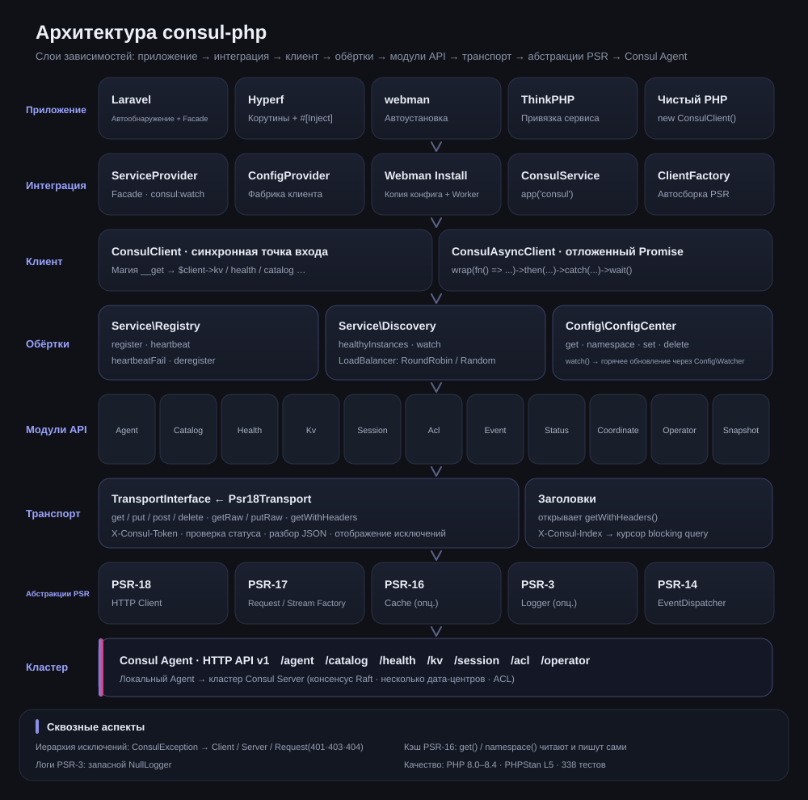
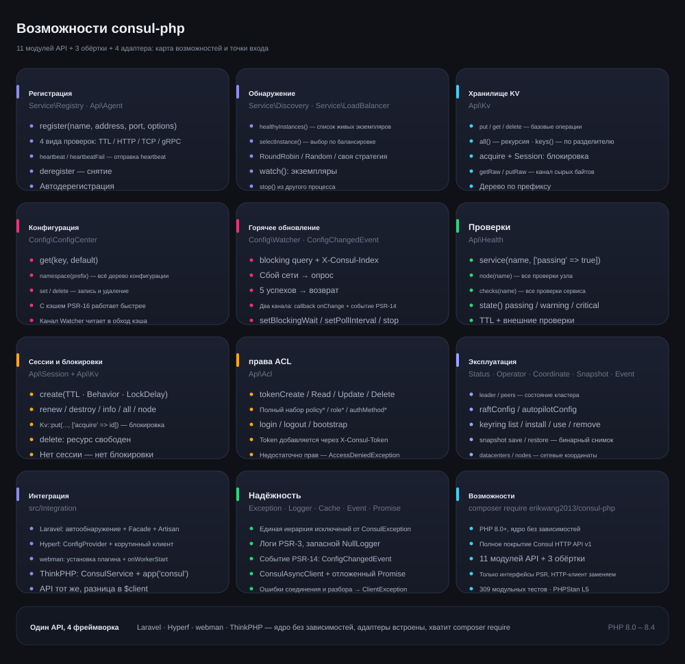
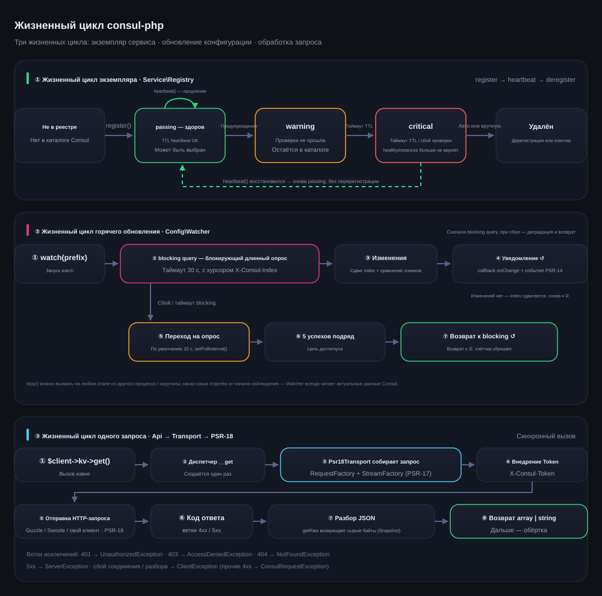

# erikwang2013/consul-php

[中文](../../../README.md) · [English](../en/README.md) · [日本語](../ja/README.md) · [한국어](../ko/README.md) · [Deutsch](../de/README.md) · [Français](../fr/README.md) · [Español](../es/README.md) · [Português](../pt/README.md) · **Русский** · [العربية](../ar/README.md) · [हिन्दी](../hi/README.md) · [বাংলা](../bn/README.md) · [Bahasa Indonesia](../id/README.md)



Клиент Consul для PHP, полностью покрывающий Consul HTTP API v1, с упором на регистрацию и обнаружение сервисов и на центр конфигурации. Ядро не зависит от фреймворков, адаптеры для Laravel / Hyperf / webman / ThinkPHP встроены — достаточно одного composer require, чтобы работать в любом фреймворке.

PHP 8.0+ · PSR-18/PSR-3/PSR-14/PSR-16 · ядро без зависимостей от фреймворков

> **Питомец проекта Consu** —— маленький помощник реестра, который питается только heartbeat и никогда не падает: антенна — это heartbeat проверки здоровья, линия пульса на груди — состояние сервиса, на поясе висит ACL Token. В терминале вызывается командой `composer pet`, подробнее — [питомец проекта Consu](../../../README.md).

---

## Кратко о проекте

| | |
|---|---|
| **Что это** | Клиент Consul HTTP API v1 на чистом PHP: синхронный вход + Promise, 11 модулей API, 3 высокоуровневые обёртки |
| **Какую задачу решает** | Позволяет PHP-приложению подключиться к Consul для регистрации и обнаружения сервисов и горячего обновления конфигурации, без переписывания клиента под каждый фреймворк |
| **Как использовать** | `composer require erikwang2013/consul-php`: ядро без зависимостей от фреймворков, адаптеры встроены и обнаруживаются автоматически |
| **Поддерживаемые фреймворки** | Laravel · Hyperf · webman · ThinkPHP —— API полностью идентичен, отличается только способ получения `$client` |
| **Соглашения о зависимостях** | Только интерфейсы PSR (PSR-18/17/16/14/3): HTTP-клиент, кэш, логи и диспетчер событий заменяемы |
| **Гарантия качества** | PHP 8.0 – 8.4 · 309 модульных тестов · PHPStan level 5 · PHP CS Fixer (PSR-12) |

### Ключевые возможности

- **Регистрация и обнаружение сервисов** —— четыре вида проверок здоровья: TTL / HTTP / TCP / gRPC; healthyInstances / selectInstance; балансировка RoundRobin, Random, своя стратегия; наблюдение за появлением и уходом экземпляров
- **Центр конфигурации** —— чтение и запись KV, дерево пространств имён, ускорение через кэш PSR-16; горячее обновление сначала через blocking query (длинный опрос), при сбое сети — автоматический переход на периодический опрос, после 5 успехов подряд — автоматический возврат
- **Эксплуатация кластера** —— распределённые блокировки Session, полный ACL (Token / Policy / Role / AuthMethod), Status / Operator / Coordinate / Snapshot / Event
- **Надёжность** —— единая иерархия исключений, логи PSR-3 (запасной NullLogger), двухканальные уведомления PSR-14, нормализация ошибок транспортного уровня

---

## Навигация по документации

| Документ | Ссылка |
|------|------|
| **Структура проекта** | [Структура проекта](../../../README.md) |
| **Архитектура** | [Архитектура](../../../README.md) · [architecture.svg](./images/architecture.svg) |
| **Дизайн возможностей** | [Дизайн возможностей](../../../README.md) · [features.svg](./images/features.svg) |
| **Жизненные циклы** | [Жизненные циклы](../../../README.md) · [lifecycle.svg](./images/lifecycle.svg) |
| **Питомец проекта** | [Consu](./images/pet.svg) |
| **Общий каталог документации** | [docs/README.md](../../README.md) |
| **Интеграция с Laravel** | см. раздел **Laravel** ниже |
| **Интеграция с Hyperf** | см. раздел **Hyperf** ниже |
| **Интеграция с webman** | см. раздел **webman** ниже |
| **Интеграция с ThinkPHP** | см. раздел **ThinkPHP** ниже |
| **Проектная документация** | [docs/superpowers/specs/2026-05-14-consul-php-design.md](../../superpowers/specs/2026-05-14-consul-php-design.md) |

---

## Структура проекта

```
consul-php/
├── src/
│   ├── Client/                      # точка входа клиента
│   │   ├── ConsulClient.php         # синхронный вход: __get раздаёт модули API и обёртки
│   │   ├── ConsulAsyncClient.php    # клиент с отложенным выполнением Promise
│   │   └── Promise.php              # лёгкая реализация Promise
│   ├── Api/                         # модули Consul HTTP API v1 (11 штук)
│   │   ├── Agent.php                # участники, данные о себе, режим обслуживания, join / leave
│   │   ├── Catalog.php              # каталог сервисов и узлов: регистрация, дерегистрация, запросы
│   │   ├── Health.php               # проверки здоровья: сервис / узел / фильтр по статусу
│   │   ├── Kv.php                   # чтение и запись KV, иерархический список, сырые байты, блокировка сессией
│   │   ├── Session.php              # сессии (основа распределённых блокировок): создание, продление, уничтожение
│   │   ├── Acl.php                  # Token / Policy / Role / AuthMethod
│   │   ├── Event.php                # пользовательские события: fire / list
│   │   ├── Status.php               # состояние кластера: leader / peers
│   │   ├── Coordinate.php           # сетевые координаты: datacenters / nodes
│   │   ├── Operator.php             # эксплуатация Raft / Autopilot / Keyring
│   │   └── Snapshot.php             # резервная копия и восстановление (бинарный поток)
│   ├── Service/                     # регистрация и обнаружение сервисов
│   │   ├── Registry.php             # register / heartbeat / heartbeatFail / deregister
│   │   ├── Discovery.php            # healthyInstances / selectInstance / watch / stop
│   │   └── LoadBalancer/            # RoundRobin, Random, LoadBalancerInterface
│   ├── Config/                      # центр конфигурации
│   │   ├── ConfigCenter.php         # get / namespace / set / delete / watch
│   │   ├── Watcher.php              # горячее обновление: длинный опрос + деградация + возврат
│   │   └── ConfigChangedEvent.php   # событие изменения конфигурации PSR-14
│   ├── Transport/                   # транспортный уровень
│   │   ├── TransportInterface.php   # контракт транспорта (getRaw / putRaw / getWithHeaders)
│   │   └── Psr18Transport.php       # реализация PSR-18: внедрение Token, разбор, отображение исключений
│   ├── Support/                     # терминальная версия питомца Consu (Pet::art / Pet::say)
│   ├── Exception/                   # иерархия исключений (ConsulException и наследники, 7 штук)
│   └── Integration/                 # адаптеры фреймворков (встроены, находятся автоматически)
│       ├── ClientFactory.php        # автосборка зависимостей PSR
│       ├── Laravel/                 # ServiceProvider + Facade + config/consul.php
│       ├── Hyperf/                  # ConfigProvider + фабрика корутинного клиента + config
│       ├── Webman/                  # установка плагина (Install) + config/app.php
│       └── Thinkphp/                # ConsulService + config/consul.php
├── tests/                           # тесты PHPUnit (Api / Client / Config / Exception /
│                                    #   Integration / Service / Support / Transport)
├── docs/
│   ├── images/                      # питомец проекта и схемы (SVG)
│   │   ├── pet.svg                  # питомец проекта Consu
│   │   ├── architecture.svg         # архитектура
│   │   ├── features.svg             # дизайн возможностей
│   │   └── lifecycle.svg            # жизненные циклы
│   ├── i18n/                        # en · ja · ko · de · fr · es · pt · ru · ar · hi · bn · id
│   ├── superpowers/specs/           # проектная документация
│   ├── superpowers/plans/           # план реализации
│   └── reports/                     # отчёты о покрытии и тестировании
├── scripts/i18n-svg.php             # i18n build / verify
├── scripts/pet.php                  # вход composer pet: вызывает питомца в терминале
├── composer.json                    # зависимости и объявление автообнаружения фреймворков
├── phpunit.xml.dist                 # конфигурация тестов
└── phpstan.neon                     # конфигурация статического анализа (level 5)
```

---

## Интеграция с фреймворками: общий обзор

| | Laravel | Hyperf | webman | ThinkPHP |
|---|---|---|---|---|
| **Пакет** | встроен | встроен | встроен | встроен |
| **Способ внедрения** | автообнаружение + `ServiceProvider` | автообнаружение + `ConfigProvider` | вручную `new` / плагин | вручную `bind` в контейнер |
| **Удобный доступ** | Facade `Consul` | аннотация `#[Inject]` | — | помощник `app('consul')` |
| **Расположение конфигурации** | `config/consul.php` | `config/autoload/consul.php` | `config/plugin/erikwang2013/consul-php/app.php` | `config/consul.php` |
| **HTTP-клиент** | Guzzle (PSR-18) | клиент корутин Swoole | Guzzle (PSR-18) | Guzzle (PSR-18) |
| **Кэш** | Laravel Cache (PSR-16) | Hyperf Cache (PSR-16) | подключаете сами | подключаете сами |
| **Горячее обновление** | команда Artisan | корутина `AbstractProcess` | процесс `Worker` | Timer / процесс Swoole |
| **Слушатели событий** | `EventServiceProvider` | Hyperf Event | — | ThinkPHP Listener |
| **Документация** | [исходники](../../../src/Integration/Laravel/) | [исходники](../../../src/Integration/Hyperf/) | [исходники](../../../src/Integration/Webman/) | [исходники](../../../src/Integration/Thinkphp/) |

### Одна операция — разный синтаксис

**Получение клиента:**

| Фреймворк | Как писать |
|------|------|
| Универсально | `$client = new ConsulClient(['base_uri' => '...']);` |
| Laravel | `$client = app(ConsulClient::class);` или `Consul::kv->get(...)` |
| Hyperf | `#[Inject] private ConsulClient $consul;` |
| webman | `$client = new ConsulClient(['base_uri' => '...']);` |
| ThinkPHP | `$client = app('consul');` |

**Регистрация сервиса:**

```php
// Во всех фреймворках API один и тот же, различается только способ получения $client
$client->serviceRegistry()->register('my-app', '10.0.0.1', 8080, [
    'id'    => 'my-app-1',
    'tags'  => ['v1'],
    'check' => ['ttl' => '30s'],
]);
```

**Чтение конфигурации:**

```php
// Тот же самый API, в Laravel/Hyperf кэш используется автоматически
$dbHost = $client->configCenter()->get('app/db_host', 'default');
```

**Способы запуска горячего обновления:**

| Фреймворк | Команда / способ запуска | Среда выполнения |
|------|----------------|---------|
| Laravel | `php artisan consul:watch` | отдельный процесс Artisan |
| Hyperf | `ConsulWatchProcess` (запускается сам) | корутина Swoole |
| webman | fork в `onWorkerStart` | процесс Worker |
| ThinkPHP | Timer::setInterval / Swoole Process | отдельный процесс |

---

## Установка

```bash
# Ядро
composer require erikwang2013/consul-php

# Реализация PSR-18 (любая одна)
composer require guzzlehttp/guzzle php-http/guzzle7-adapter php-http/discovery
```

### Интеграция с фреймворками

Адаптеры фреймворков уже встроены в ядро, отдельно устанавливать их не нужно. После установки ядра соответствующий фреймворк сам обнаружит и зарегистрирует сервис Consul:

- **Laravel** — сам находит `ConsulServiceProvider`, даёт Facade `Consul` и внедрение зависимостей
- **Hyperf** — сам находит `ConfigProvider`, даёт фабрику корутинного клиента и внедрение через `#[Inject]`
- **webman** — сам находит плагин, при `composer install` копирует файл конфигурации
- **ThinkPHP** — создайте `ConsulService` в каталоге `app/service` и зарегистрируйте его в приложении

---

## Быстрый старт (общий)

```php
use Erikwang2013\Consul\Client\ConsulClient;

// Базовое использование
$client = new ConsulClient(['base_uri' => 'http://127.0.0.1:8500']);

// С ACL Token
$client = new ConsulClient([
    'base_uri' => 'http://127.0.0.1:8500',
    'token'    => 'your-consul-acl-token',
]);
```

Token автоматически добавляется ко всем запросам через заголовок `X-Consul-Token`.

### Регистрация сервиса

Поддерживаются четыре режима проверок здоровья: TTL, HTTP, TCP, gRPC.

```php
$registry = $client->serviceRegistry();

// Режим TTL — приложение само отправляет heartbeat
$registry->register('user-service', '192.168.1.10', 8080, [
    'id'    => 'user-service-1',
    'tags'  => ['v1', 'primary'],
    'meta'  => ['region' => 'cn-east'],
    'check' => [
        'ttl' => '30s',
        'deregister_critical_service_after' => '120s', // автодерегистрация при таймауте heartbeat
    ],
]);

// Режим HTTP — Consul опрашивает сервис сам
$registry->register('web', '192.168.1.10', 80, [
    'id'    => 'web-1',
    'check' => [
        'http'     => 'http://192.168.1.10:80/health',
        'interval' => '10s',
        'timeout'  => '3s',
    ],
]);

// Режим TCP
$registry->register('mysql', '192.168.1.10', 3306, [
    'check' => ['tcp' => '192.168.1.10:3306', 'interval' => '10s'],
]);

// Режим gRPC
$registry->register('grpc-svc', '192.168.1.10', 50051, [
    'check' => ['grpc' => '192.168.1.10:50051', 'interval' => '10s'],
]);

// heartbeat (режим TTL)
$registry->heartbeat('user-service-1');

// Дерегистрация
$registry->deregister('user-service-1');
```

### Обнаружение сервисов

Встроены две стратегии балансировки: RoundRobin (по умолчанию) и Random.

```php
$discovery = $client->serviceDiscovery();

// Все живые экземпляры
$instances = $discovery->healthyInstances('user-service');
// [
//   ['address' => '10.0.0.1', 'port' => 8080, 'service' => 'user-service', 'id' => 'user-1', 'tags' => ['v1']],
//   ['address' => '10.0.0.2', 'port' => 8080, 'service' => 'user-service', 'id' => 'user-2', 'tags' => ['v1']],
// ]

// Выбор одного экземпляра по балансировке
$instance = $discovery->selectInstance('user-service');

// Своя стратегия балансировки
use Erikwang2013\Consul\Service\LoadBalancer\Random;
$discovery = new Discovery($health, loadBalancer: new Random());

// Наблюдение за изменениями экземпляров сервиса
$discovery->watch('user-service', function (array $instances) {
    // callback при появлении и уходе экземпляров
});

// Остановка наблюдения (вызывается из другого процесса / корутины)
$discovery->stop();
```

### Центр конфигурации

```php
$config = $client->configCenter();

// Один ключ
$dbHost = $config->get('app/db_host', 'localhost');

// Всё пространство имён
$all = $config->namespace('app/');
// ['app/db_host' => 'mysql.local', 'app/redis_host' => 'redis.local', ...]

// Запись / удаление
$config->set('app/cache_ttl', '3600');
$config->delete('app/old_key');

// Горячее обновление
$watcher = $config->watch('app/');
$watcher
    ->setBlockingWait(30)   // таймаут длинного опроса (секунды)
    ->setPollInterval(10)   // интервал перехода на периодический опрос (секунды)
    ->onChange(function (array $updated) {
        // callback при изменении конфигурации
    });
$watcher->start(); // блокирует, выносите в отдельный процесс / корутину
// $watcher->stop();  // вызывается из другого процесса / корутины, чтобы остановить наблюдение
```

**Как работает горячее обновление:** сначала идёт Consul blocking query (длинный опрос по `index`), при сбое сети происходит автоматический переход на периодический опрос, а после восстановления связи — возврат к длинному опросу. Уведомления идут по двум каналам: callback + PSR-14 EventDispatcher.

**Стратегия кэширования:** после подключения кэша PSR-16 методы `get()` и `namespace()` сами читают и пишут кэш. Watcher всегда читает данные Consul в реальном времени и кэш не использует.

### Хранилище KV

```php
$kv = $client->kv;

$kv->put('key', 'value');
$entry = $kv->get('key');              // null означает, что ключа нет
$all = $kv->all('prefix/');            // рекурсивный список
$keys = $kv->keys('prefix/');          // только имена ключей
$keys = $kv->keys('prefix/', '/');     // иерархия по разделителю
$kv->delete('key');
```

### API проверок здоровья

```php
$health = $client->health;

$health->service('user-service', ['passing' => true]);  // только живые экземпляры
$health->node('node-1');                                 // все проверки узла
$health->checks('user-service');                          // все проверки сервиса
$health->state('critical');                               // по статусу: passing/warning/critical
```

### Session / распределённые блокировки

```php
$session = $client->session;

$sess = $session->create([
    'Name'     => 'lock-session',
    'TTL'      => '30s',
    'Behavior' => 'delete',    // по истечении TTL связанный KV удаляется автоматически
]);
$sessionId = $sess['ID'];

// Заблокировать ресурс
$locked = $client->kv->put('lock/resource', '1', ['acquire' => $sessionId]);

// Продление / освобождение
$session->renew($sessionId);
$session->destroy($sessionId);
```

### ACL

```php
$acl = $client->acl;

// Token
$token = $acl->tokenCreate(['Description' => 'read-only', 'Policies' => [['Name' => 'read-policy']]]);
$acl->tokenRead($token['AccessorID']);
$acl->tokenDelete($token['AccessorID']);

// Policy
$policy = $acl->policyCreate(['Name' => 'my-policy', 'Rules' => 'node "" { policy = "read" }']);

// Role
$role = $acl->roleCreate(['Name' => 'reader', 'Policies' => [['Name' => 'my-policy']]]);

// Login/Logout
$result = $acl->login(['AuthMethod' => 'my-auth', 'BearerToken' => '...']);
$acl->logout();
```

### Асинхронный клиент

```php
use Erikwang2013\Consul\Client\ConsulAsyncClient;

$client = new ConsulAsyncClient(['base_uri' => 'http://127.0.0.1:8500']);

$promise = $client->wrap(fn() => $client->kv->get('key'));

$promise
    ->then(fn($result) => print_r($result))
    ->catch(fn(\Throwable $e) => log_error($e));

$value = $promise->wait(); // блокирующее получение результата
```

**Внимание:** асинхронный клиент построен на модели Promise и подходит для сценариев с параллельными запросами. В корутинной среде Hyperf обычного HTTP-клиента уже достаточно для конкурентности на уровне корутин.

---

## Руководства по интеграции с фреймворками

### Laravel

Laravel сам находит `ConsulServiceProvider`, регистрировать вручную ничего не нужно.

```bash
php artisan vendor:publish --tag=consul-config
```

Задайте `CONSUL_BASE_URI` в `.env`, после чего клиент доступен через внедрение зависимостей или Facade. Расширение Laravel автоматически подключает клиент PSR-18, кэш PSR-16, логи PSR-3 и диспетчер событий PSR-14.

```php
// Внедрение зависимостей
use Erikwang2013\Consul\Client\ConsulClient;
public function show(ConsulClient $consul) { ... }

// Facade
use Consul;
$services = Consul::catalog->services();

// Горячее обновление конфигурации — команда Artisan
// php artisan consul:watch
```

### Hyperf

Hyperf сам находит `ConfigProvider`, регистрировать вручную ничего не нужно.

```bash
php bin/hyperf.php vendor:publish consul
```

Расширение Hyperf само регистрирует `ConsulClient` в DI-контейнере, а HTTP-запросы по умолчанию идут через клиент корутин Swoole. Регистрацию сервиса лучше разместить в слушателе события `MainServerStart`, а для горячего обновления использовать `AbstractProcess` внутри корутины.

```php
// Внедрение аннотацией
#[Inject]
private ConsulClient $consul;

// Регистрация сервиса — событие MainServerStart
$consul->serviceRegistry()->register(...);

// Горячее обновление — ConsulWatchProcess запускается сам
```

### webman

webman сам находит плагин и при `composer install` копирует файл конфигурации в `config/plugin/erikwang2013/consul-php/`. Поскольку webman держит приложение в памяти постоянно, регистрацию сервиса размещают в callback `onWorkerStart` — глобально её нужно выполнить один раз.

```php
// process/ConsulRegister.php
class ConsulRegister {
    public function onWorkerStart(Worker $worker): void {
        $consul = new ConsulClient(['base_uri' => getenv('CONSUL_BASE_URI')]);
        $consul->serviceRegistry()->register('webman-app', ...);
    }
}
```

### ThinkPHP

В ThinkPHP нет механизма автообнаружения, сервис нужно регистрировать вручную. Скопируйте файл конфигурации в `config/consul.php`, затем зарегистрируйте `ConsulService` в каталоге `app/service`:

```php
// app/service/ConsulService.php
namespace app\service;

use Erikwang2013\Consul\Integration\Thinkphp\ConsulService as BaseConsulService;

class ConsulService extends BaseConsulService
{
}
```

Либо привяжите клиент напрямую в `app/AppService.php`:

```php
$this->app->bind('consul', fn() => new ConsulClient(config('consul')));

// Использование
$services = app('consul')->catalog->services();

// Функция-помощник — app/common.php
function consul() { return app('consul'); }
```

---

## Свой HTTP-клиент

```php
$client = new ConsulClient(
    config:          ['base_uri' => 'http://consul:8500', 'token' => 'acl-token'],
    httpClient:      $myPsr18Client,        // обязателен или находится автоматически
    requestFactory:  $myRequestFactory,      // то же самое
    streamFactory:   $myStreamFactory,       // то же самое
    logger:          $myLogger,              // PSR-3, опционально
    cache:           $myCache,               // PSR-16, опционально
    eventDispatcher: $myEventDispatcher,     // PSR-14, опционально
);
```

---

## Шпаргалка по модулям API

| Свойство | Класс | Основные методы |
|------|-----|---------|
| `$client->kv` | `Api\Kv` | `get` `put` `delete` `all` `keys` |
| `$client->agent` | `Api\Agent` | `members` `self` `registerService` `deregisterService` `checks` `services` |
| `$client->catalog` | `Api\Catalog` | `register` `deregister` `nodes` `services` `service` `node` |
| `$client->health` | `Api\Health` | `service` `node` `checks` `state` |
| `$client->session` | `Api\Session` | `create` `destroy` `renew` `info` `all` `node` |
| `$client->acl` | `Api\Acl` | `token*` `policy*` `role*` `authMethod*` `login` `logout` `bootstrap` |
| `$client->event` | `Api\Event` | `fire` `list` |
| `$client->status` | `Api\Status` | `leader` `peers` |
| `$client->coordinate` | `Api\Coordinate` | `datacenters` `nodes` `node` |
| `$client->operator` | `Api\Operator` | `raftConfig` `autopilotConfig` `keyring` (константы: `KEYRING_LIST` `KEYRING_INSTALL` `KEYRING_USE` `KEYRING_REMOVE`) |
| `$client->snapshot` | `Api\Snapshot` | `save` (возвращает сырые байты снимка через `getRaw()`) `restore` (отправляет сырые байты через `putRaw()`) |

Высокоуровневые обёртки:

| Метод | Возвращает | Описание |
|------|------|------|
| `$client->serviceRegistry()` | `Service\Registry` | регистрация / heartbeat / дерегистрация сервиса |
| `$client->serviceDiscovery()` | `Service\Discovery` | список экземпляров / балансировка / наблюдение за изменениями |
| `$client->configCenter()` | `Config\ConfigCenter` | чтение и запись конфигурации / кэш / горячее обновление |

---

## Иерархия исключений

Все исключения наследуют `ConsulException` (наследник `RuntimeException`):

```
ConsulException
├── ClientException           ошибка транспорта HTTP (сбой соединения, DNS, таймаут и т. п.)
├── ServerException           Consul вернул 5xx
└── ConsulRequestException    Consul вернул 4xx
    ├── NotFoundException     404
    └── AccessDeniedException 403
```

```php
try {
    $client->kv->get('key');
} catch (ClientException $e) {
    // проблема с сетью
} catch (NotFoundException $e) {
    // ресурс не существует
} catch (ConsulException $e) {
    // прочие ошибки Consul
}
```

---

## Архитектура



Зависимости идут сверху вниз, каждый слой зависит только от абстракций следующего слоя:

- **Уровень приложения / интеграции** —— 4 адаптера фреймворков встроены в ядро `src/Integration/` и регистрируются через автообнаружение composer; приложение всегда работает только с одной точкой входа — `ConsulClient`.
- **Клиент** —— `ConsulClient` через `__get` единообразно открывает 11 модулей API (`$client->kv`, `$client->health` …) и 3 высокоуровневые обёртки (`serviceRegistry()` / `serviceDiscovery()` / `configCenter()`); `ConsulAsyncClient` даёт отложенное выполнение Promise.
- **Высокоуровневые обёртки** —— `Registry` / `Discovery` / `ConfigCenter` комбинируют модули API; `Watcher` использует `X-Consul-Index` из `getWithHeaders()` для длинного опроса.
- **Модули API** —— один модуль соответствует одной группе эндпоинтов Consul v1, все они ходят через один и тот же `TransportInterface`.
- **Транспортный уровень** —— `Psr18Transport` отвечает за внедрение Token, проверку кода ответа, разбор JSON и отображение исключений; это единственная точка выхода в сеть во всём пакете.
- **Абстракции PSR** —— только интерфейсы PSR (18/17/16/14/3): HTTP-клиент, кэш, логи и диспетчер событий заменяемы, а без внедрения включается запасная реализация.

---

## Дизайн возможностей



Карта возможностей: регистрация и обнаружение сервисов, центр конфигурации и горячее обновление, KV / проверки здоровья / блокировки сессий / ACL / эксплуатация кластера, адаптеры 4 фреймворков и надёжность. На каждой карточке указан соответствующий класс-точка входа; конкретные способы вызова — в разделах **Быстрый старт** и **Шпаргалка по модулям API** выше.

---

## Жизненные циклы



- **Жизненный цикл экземпляра сервиса** —— `register()` → passing (`heartbeat()` продлевает периодически) → warning → critical → автоматическая или ручная дерегистрация; после восстановления heartbeat можно вернуться из critical в passing без повторной регистрации.
- **Жизненный цикл горячего обновления конфигурации** —— `watch()` запускает blocking query (по умолчанию 30 с, с `X-Consul-Index`) → обнаружение изменений → callback `onChange` + `ConfigChangedEvent`; при сбое блокировки происходит автоматический переход на периодический опрос (по умолчанию 10 с), а после 5 успехов подряд — возврат к длинному опросу; `stop()` позволяет корректно выйти из другого процесса / корутины.
- **Жизненный цикл одного запроса** —— модуль API → `Psr18Transport` собирает запрос PSR-17 → внедряет `X-Consul-Token` → отправляет через PSR-18 → проверяет код ответа → разбирает JSON (`getRaw()` возвращает сырые байты) → возвращает массив; 401/403/404/5xx и сбои транспорта отображаются в соответствующие исключения.

---

## Питомец проекта Consu

Питомец — это не просто картинка, его можно позвать и из терминала, и из кода:

```bash
composer pet
```

```text
╭───────────────────────────────────────────────────────────────────────────╮
│ consul-php · Consul-клиент для PHP — один composer require, 4 фреймворка  │
╰──────┬────────────────────────────────────────────────────────────────────╯
       │
       ●
       │
   ╭───┴───╮
   │ ◕   ◕ │
   │  ╰─╯  │
   ├───────┤
   │╱╲╱╲╱╲ │
   ╰┬─────┬╯
    ╰─┬─┬─╯
```

Из кода питомец вызывается напрямую через `Erikwang2013\Consul\Support\Pet`:

```php
use Erikwang2013\Consul\Support\Pet;

echo Pet::art();                      // только питомец
echo Pet::say('конфигурация consul готова');    // пузырь над головой + питомец
echo Pet::art(false);                 // принудительно чистый текст
```

Цвет определяется по возможностям терминала: если это не TTY или задана переменная `NO_COLOR`, выводится чистый текст, который не засоряет логи и вывод CI.

Образ совпадает с [pet.svg](./images/pet.svg): антенна = heartbeat проверки здоровья (зелёный passing), очки = обнаружение сервисов, линия пульса на груди = состояние сервиса (пурпурный Consul), бляха на поясе = ACL Token.

---

## Минимальные требования

- PHP 8.0+
- Composer
- Реализация PSR-18 HTTP Client
- [опционально] Кэш PSR-16 — `Discovery::healthyInstances()` / `ConfigCenter::get()` кэшируются автоматически
- [опционально] Logger PSR-3 — логи запросов
- [опционально] EventDispatcher PSR-14 — событие `ConfigChangedEvent`

## Поддержать проект

| WeChat | Alipay |
|:---:|:---:|
|  |  |

---

## License

MIT

_Перевод выполнен ИИ. Если заметите неточность — создайте Issue или PR._
